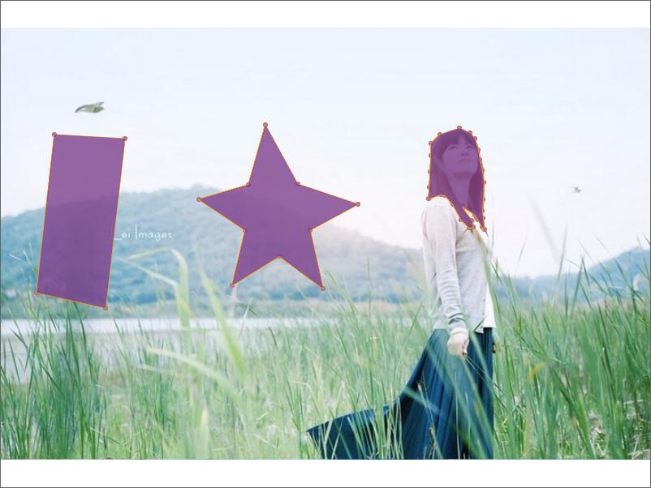

# 效果


* 右键完成闭合
* esc回退到上一点

# 代码
```html
<body>
    <div id="demo"></div>
    <script type="text/javascript" src="canvas-draw.js"></script>
    <script>
        var $div = document.getElementById('demo');
        var canvasDraw = new CanvasDraw({
          id: 'demo',
          bgImg: './test.jpg',
          width: $div.clientWidth,
          height: $div.clientHeight
        })
        canvasDraw.init();
    </script>
</body>
```
```javascript
function CanvasDraw(config) {
  this.config = {
    id: config.id,
    bgImg: config.bgImg,
    height: config.height,
    width: config.width,
    pointColor: config.pointColor || '#ab7784',
    pointSize: config.pointSize || 3,
    lineColor: config.lineColor || '#34ff68',
    lineSize: config.lineSize || 1,
    polygonFillColor: config.polygonFillColor || 'rgba(125,65,141,0.8)',
    polygonPointlColor: config.polygonPointlColor || 'rgb(45,65,156)',
    polygonPointlSize: config.polygonPointlSize || 2,
    polygonLineColor: config.polygonLineColor || 'rgb(241,156,41)',
    polygonLineSize: config.polygonLineSize || 1
  }
  this.cxt = null;
  this.canvas = null;

  // 图像在canvas中的边界
  this.bound = {
    w: 0,
    h: 0,
    lt: {
      x: 0,
      y: 0
    },
    rb: {
      x: 0,
      y: 0
    }
  }

  // 图像
  this.img = null;
  this.imgLoaded = false;

  // 未闭合的多边形的点
  this.points = [];

  // 多边形
  this.polygons = [];
}

CanvasDraw.prototype.init = function () {
  var canvasDiv = document.getElementById(this.config.id);

  this.canvas = document.createElement("canvas");
  this.cxt = this.canvas.getContext("2d");
  this.canvas.width = this.config.width;
  this.canvas.height = this.config.height;

  canvasDiv.appendChild(this.canvas);
  this.getDrawBgConf();
  this.initEventListener();

  // 禁止浏览器右键
  this.addHandler(document.body, 'contextmenu', function(e) {
    e.returnValue = false;
  })
}

CanvasDraw.prototype.getDrawBgConf = function () {
  var me = this;
  var image = new Image();
  image.src = this.config.bgImg;
  image.onload = function () {
    me.imgLoaded = true;
    me.img = image;

    var wScale = image.width / me.canvas.width;
    var hScale = image.height / me.canvas.height;
    var _scale = wScale < hScale ? hScale : wScale;

    var _width = image.width / _scale;
    var _height = image.height / _scale;

    var dx = 0, dy = 0;
    if (wScale < hScale) {
      dx = parseInt((me.canvas.width - _width) / 2);
    } else {
      dy = parseInt((me.canvas.height - _height) / 2);
    }

    me.bound.lt.x = dx;
    me.bound.lt.y = dy;
    me.bound.w = _width;
    me.bound.h = _height;
    me.bound.rb.x = dx + _width;
    me.bound.rb.y = dy + _height;

    me.cxt.drawImage(image, dx, dy, _width, _height);
  }
}

CanvasDraw.prototype.drawPoint = function (x, y, color, size) {
  var cxt = this.cxt;
  cxt.beginPath();
  cxt.fillStyle = color || this.config.pointColor;
  cxt.arc(x, y, size || this.config.pointSize, 0, 2*Math.PI);
  cxt.fill();
}

CanvasDraw.prototype.drawLine = function (x1, y1, x2, y2, color, size) {
  var cxt = this.cxt;
  cxt.beginPath();
  cxt.strokeStyle = color || this.config.lineColor;
  cxt.lineWidth = size || this.config.lineSize;
  cxt.moveTo(x1, y1);
  cxt.lineTo(x2, y2);
  cxt.stroke();
}

CanvasDraw.prototype.drawPolygon = function (points) {
  var len = points.length;
  if (len < 3) {
    console.log('点不够呀！');
    return;
  }

  var cxt = this.cxt;
  for (var i = 0; i < len; i++) {
    // 点
    this.drawPoint(points[i].x, points[i].y);
  }
  cxt.beginPath();
  cxt.strokeStyle = this.config.polygonLineColor;
  cxt.fillStyle = this.config.polygonFillColor;
  for (var i = 0; i < len; i++) {
    // 画线
    if (i === 0) {
      cxt.moveTo(points[i].x, points[i].y);
    } else {
      cxt.lineTo(points[i].x, points[i].y);
      cxt.stroke();
    }
  }
  cxt.lineTo(points[0].x, points[0].y);
  cxt.stroke();
  cxt.closePath();
  cxt.fill();
}

CanvasDraw.prototype.reDraw = function() {
  var me = this;
  // 清空画布
  me.cxt.clearRect(0, 0, me.canvas.width, me.canvas.height);
  // 画背景
  me.cxt.drawImage(me.img, me.bound.lt.x, me.bound.lt.y, me.bound.w, me.bound.h);
  // 画点及线
  var pLen = me.points.length;
  if (pLen > 0) {
    for (var i = 0; i < me.points.length - 1; i++) {
      // 点
      me.drawPoint(me.points[i].x, me.points[i].y);
      // 线
      me.drawLine(me.points[i].x, me.points[i].y, me.points[i+1].x, me.points[i+1].y);
    }
    // 最后那个点
    me.drawPoint(me.points[pLen-1].x, me.points[pLen-1].y);
  }
  // 画多边形
  for (var i = 0; i < me.polygons.length; i++) {
    me.drawPolygon(me.polygons[i]);
  }
}

CanvasDraw.prototype.isIn = function (x, y) {
  var me = this;
  if (me.bound.lt.x < x &&
      me.bound.rb.x > x &&
      me.bound.lt.y < y &&
      me.bound.rb.y > y) {
    return true;
  }
  return false;
}

CanvasDraw.prototype.initEventListener = function() {
  var me = this;
  me.addHandler(me.canvas, 'mousedown', function(e) {
    // 鼠标左键
    if (e.button === 0) {
      var x = e.offsetX;
      var y = e.offsetY;

      if (!me.isIn(x, y)) return;

      me.points.push({x: x, y: y});

      me.drawPoint(x, y);
    }

    // 鼠标右键
    if (e.button === 2) {
      if (me.points.length < 3) {
        return ;
      }
      me.polygons.push(me.points);
      me.points = [];
      me.reDraw();
    }

  });

  me.addHandler(me.canvas, 'mousemove', function(e) {
    if (me.points.length === 0) {
      return;
    }

    var x = e.offsetX;
    var y = e.offsetY;

    var lastX = me.points[me.points.length - 1].x;
    var lastY = me.points[me.points.length - 1].y;

    me.reDraw();

    me.drawLine(lastX, lastY, x, y);
  });

  me.addHandler(window, 'keyup', function(e) {
    if (e.keyCode === 27) {
      me.points.pop();
    }
  })
}

CanvasDraw.prototype.addHandler = function (ele, type, handler) {
  if(ele.addEventListener){
    ele.addEventListener(type,handler,false);
  } else if (ele.attachEvent) {
    ele.attachEvent('on'+type,handler);
  } else {
    ele['on'+type] = handler;
  }
}
```
