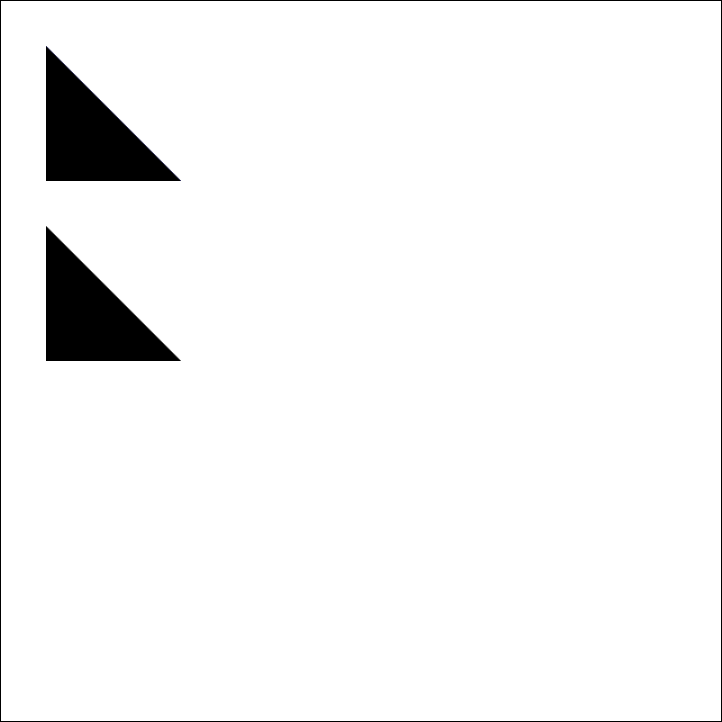
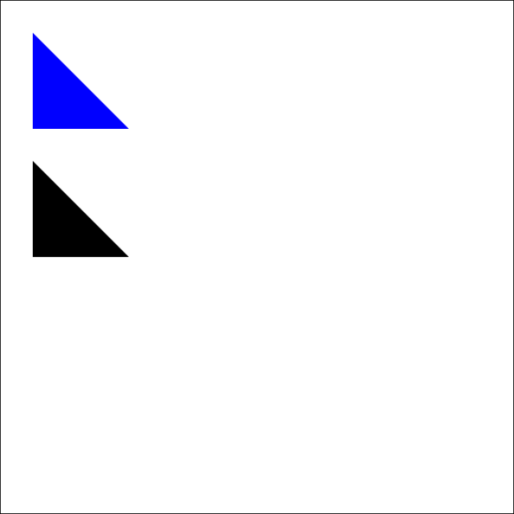
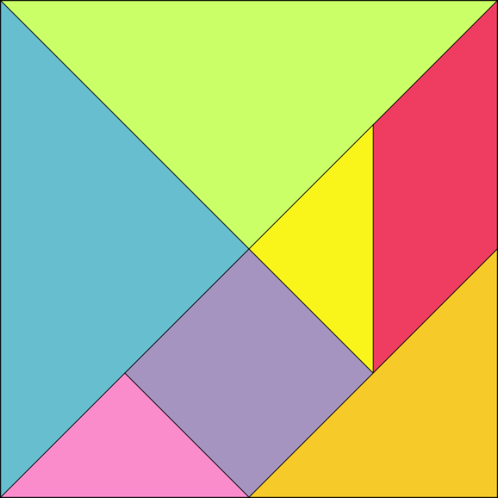
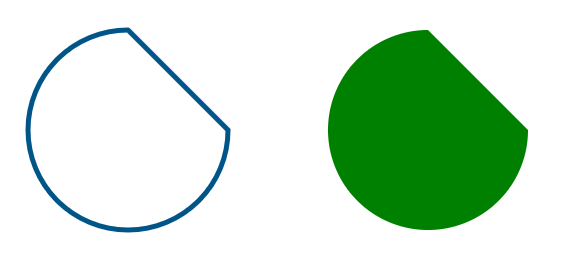

## 创建canvas
```html
<canvas id="canvas" width="800" height="600" style="border:1px solid black;margin:10px auto;display:block;"></canvas>
```
不要使用css给canvas设置宽高，会出现奇怪的效果([关于使用Css设置Canvas画布大小的问题](http://wangxiaalwy.blog.163.com/blog/static/1552508182013106112418455/)),可以在js中设置宽高：
```javascript
<script>
    var canvas = document.getElementById("canvas");
    canvas.height = 500;
    canvas.width = 500;
    var context = canvas.getContext("2d");
</script>
```
## 简单的绘制
* 直线、多边形

```javascript
    context.moveTo(50,50);
    context.lineTo(200,200);
    context.lineWidth = 5; // 线条宽度
    content.strokeStyle = "#005588" // 线条颜色
    context.stroke();
```

* 多变形着色

```javascript
    context.moveTo(50,50);
    context.lineTo(200,200);
    context.lineTo(50,200);
    context.lineTo(50,50);
    context.fillStyle = "rgb(2,100,24)";
    context.fill();
    // 给多边形加上外边框
    context.lineWidth = 5;
    context.strokeStyle = "red";
    context.stroke();
```

* 绘制两条不同颜色的直线

```javascript
    context.moveTo(50,50);
    context.lineTo(200,200);
    context.strokeStyle = "blue";
    context.stroke();

    context.moveTo(60,50);
    context.lineTo(300,200);
    context.strokeStyle = "black";
    context.stroke();
```

这里与教程不同，教程中两条直线都是黑色，需要用context.beginPath()和context.closePath()来区分不同的绘制路径（**closePath会自动封闭图形**）。但是，当绘制填充多边形时，会有如下问题：
```javascript
	// context.beginPath();
    context.moveTo(50,50);
    context.lineTo(200,200);
    context.lineTo(50,200);
    context.lineTo(50,50);
    // context.closePath();
    context.fillStyle = "blue";
    context.fill();

	// context.beginPath();
    context.moveTo(50,250);
    context.lineTo(200,400);
    context.lineTo(50,400);
    context.lineTo(50,250);
    // context.closePath();
    context.fillStyle = "black";
    context.fill();
```

去掉代码中的注释，可以达到我们的预期效果


* 绘制一个七巧板
```javascript
    var tangram = [
      {p:[{x:0,y:0},{x:800,y:0},{x:400,y:400}],color:"#caff67"},
      {p:[{x:0,y:0},{x:400,y:400},{x:0,y:800}],color:"#67becf"},
      {p:[{x:800,y:0},{x:800,y:400},{x:600,y:600},{x:600,y:200}],color:"#ef3d61"},
      {p:[{x:600,y:200},{x:600,y:600},{x:400,y:400}],color:"#f9f51a"},
      {p:[{x:400,y:400},{x:600,y:600},{x:400,y:800},{x:200,y:600}],color:"#a594c0"},
      {p:[{x:200,y:600},{x:400,y:800},{x:0,y:800}],color:"#fa8ccc"},
      {p:[{x:800,y:400},{x:800,y:800},{x:400,y:800}],color:"#f6ca29"},
    ]
    window.onload = function() {
      var canvas = document.getElementById("canvas");
      canvas.height = 800;
      canvas.width = 800;
      var context = canvas.getContext("2d");
      for (var i=0;i < tangram.length;i++) {
        draw(tangram[i], context);
      }

    }
    function draw(piece, cxt) {
      cxt.beginPath();
      cxt.moveTo(piece.p[0].x, piece.p[0].y);
      for(var i=1;i<piece.p.length;i++){
        cxt.lineTo(piece.p[i].x,piece.p[i].y);
      }
      cxt.closePath();
      cxt.fillStyle = piece.color;
      cxt.strokeStyle = "black";
      cxt.fill();
      cxt.stroke();
    }
```


* 画圆
```javascript
context.arc(
	centerx, // 圆心x
    centery, // 圆心y
    radius,  // 半径
    startingAngle,  // 起始的角度
    endingAngle,    // 结束的角度
    anticlockwise   // 是否逆时针
)
```
例：
```javascript
      context.lineWidth = 5;
      context.strokeStyle = "#005588";
      context.beginPath();
      context.arc(200,200,100,0,1.5*Math.PI);
      context.closePath(); // 去掉以后不会封闭图形 beginPath与closePath不需要成对出现
      context.stroke();

      context.lineWidth = 5;
      context.fillStyle = "green";
      context.beginPath();
      context.arc(500,200,100,0,1.5*Math.PI);
      context.closePath(); // 对fill没什么用 
      context.fill();
```
