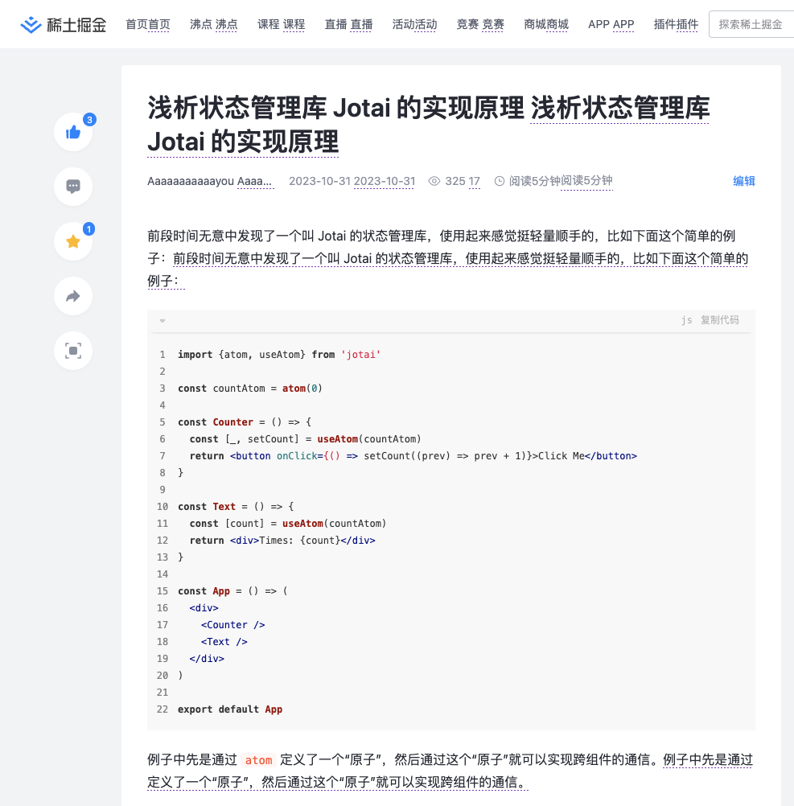

# 前言

Chrome 浏览器自带翻译功能，但是翻译后就看不到原文了，如果能够让原文和译文同时显示，是不是更加友好呢？就像这样：


好的，接下来就让我们来实现这个插件吧。很明显，实现整个插件大致包括两个部分：

第一部分就是前端部分，需要分析页面，提取出需要翻译的内容，并计算译文显示的位置。第二部分则是翻译功能。

本文先来实现第一部分。

_关于插件开发环境搭建本文略过了，可以使用 vite + @crxjs/vite-plugin 快速搭建_

# 版本一：在所有文本节点后插入译文

看到这个效果，很容易会想到可以遍历整个文档的 Text node，然后在其后面插入译文。

我们在 `content_script` 中先来实现一下：

```js
class ParallelTranslate {
  findTextNodes() {
    const textNodes = []
    const walker = document.createTreeWalker(
      document.body,
      NodeFilter.SHOW_TEXT,
      (node) => {
        if (node.nodeType === Node.TEXT_NODE) {
          return NodeFilter.FILTER_ACCEPT
        }
        return NodeFilter.FILTER_SKIP
      }
    )
    let node = walker.nextNode()
    while (node) {
      if (node.textContent?.trim()) {
        textNodes.push(node)
      }
      node = walker.nextNode()
    }

    return textNodes
  }

  translate() {
    const textNodes = this.findTextNodes()
    textNodes.forEach((textNode) => {
      const $transltedNode = document.createElement('translation')
      $transltedNode.innerText = textNode.textContent!
      $transltedNode.style.cssText = `
      background-repeat: repeat-x;
      background: linear-gradient( to right, #673AB7 0%, #9C27B0 50%, transparent 50%, transparent 100% ) repeat-x left bottom;
      background-size: 4px 1px;
      padding-bottom: 2px;`
      textNode.after($transltedNode)
    })
  }
}

new ParallelTranslate().translate()

```

我们通过 `createTreeWalker` 来遍历得到文档中的所有 Text 节点，然后在他们的后面插入了一个带有下划线样式的自定义标签 `translation`，不过目前我们没有实现翻译功能，暂用原文作为该标签的内容。看看效果：


很明显，有几个问题：

1 不应该翻译的内容，比如 `<code></code>` 中的内容也翻译了。
2 有些完整的段落没有作为一个整体被翻译，而是被拆成了好多小段。

我们来解决这两个问题。

# 版本二：过滤掉不需要翻译的节点

为了解决第一个问题，我们在 `this.findTextNodes()` 前新增一个 `markExclude` 的步骤，这里暂时只添加了 `code`，可以根据需求添加更多的规则，甚至对不同的站点定制特殊的规则：

```js
  excludeSelector = ['code']
  ...
  setAttr(el: HTMLElement, attr: string, value = 't') {
    el.setAttribute(attr, value)
  }

  isMarkAttr(el: HTMLElement, attr: string, value = 't') {
    return el.getAttribute(attr) === value
  }

  markExclude() {
    this.excludeSelector.forEach((selector) => {
      document.body.querySelectorAll(selector).forEach((el) => {
        this.setAttr(el as HTMLElement, 'translate-exclude')
      })
    })
  }
```

然后，在 `findTextNodes` 可以过滤掉被标记的 Node：

```js
  ...
  const walker = document.createTreeWalker(
    document.body,
    NodeFilter.SHOW_TEXT | NodeFilter.SHOW_ELEMENT,
    (node) => {
      if (node.nodeType === Node.ELEMENT_NODE) {
        return this.isMarkAttr(node as HTMLElement, 'translate-exclude')
          ? NodeFilter.FILTER_REJECT // 当前节点如果被标记了，则跳过它和它的子节点
          : NodeFilter.FILTER_SKIP // 否则只跳过当前节点
      }
      return NodeFilter.FILTER_ACCEPT
    }
  )
  ...
```

这样，第一个问题就解决了。我们接着处理第二个问题，第二个问题处理起来比较麻烦，我们需要把分散的文本节点根据某些规则组合成段落作为一个整体来进行翻译。

# 版本三：按段落翻译

我们在 `findTextNodes` 后新增一个 `createParagraphs` 的步骤：

```js
  translate() {
    this.markExclude()
    const textNodes = this.findTextNodes()
    const paragraphs = this.createParagraphs(textNodes)
    ...
  }
```

`createParagraphs` 中会遍历每个 Text 节点，找到 Text 节点最近的块状祖先节点，然后把相同祖先节点的 Text 节点都放到同一个段落的 textNodes 中：

```js
  createParagraphs(textNodes: Node[]) {
    const paragraphs: Paragraph[] = []
    for (const textNode of textNodes) {
      const blockAncestorEl = this.getBlockAncestorEl(textNode.parentElement!)
      const paragraph = paragraphs.find(
        (p) => p.commonAncestorEl === blockAncestorEl
      )
      if (paragraph) {
        paragraph.textNodes.push(textNode)
        paragraph.text += textNode.textContent
      } else {
        const translationEl = this.createTranslationEl()
        this.setAttr(blockAncestorEl, this.translationNodeAncestorAttr)
        paragraphs.push({
          id: uuid(),
          commonAncestorEl: blockAncestorEl, // 多个 Text 节点的公共祖先节点
          textNodes: [textNode], // 当前段落包含的 Text 节点
          text: textNode.textContent!, // 当前段落的内容，由子节点的内容拼接而成
          translationEl, // 译文会放在这个标签里
        })
      }
    }
    return paragraphs
  }
```

最后，我们遍历 `paragraphs`，并把段落的 `text` 设置为 `translationEl` 的 `innerText`，然后把 `translationEl` 插入到 `commonAncestorEl` 的最后：

```js
  translate() {
    ...
    const paragraphs = this.createParagraphs(textNodes)
    paragraphs.forEach(
      ({commonAncestorEl, text, translationEl}) => {
        translationEl.innerText = text.trim()
        translationEl.style.cssText = `
      background-repeat: repeat-x;
      background: linear-gradient( to right, #673AB7 0%, #9C27B0 50%, transparent 50%, transparent 100% ) repeat-x left bottom;
      background-size: 4px 1px;
      padding-bottom: 2px;`
        commonAncestorEl.appendChild(translationEl)
      }
    )
  }
```

最后的效果是这样：



# 总结

本文介绍了对照翻译中前端部分的实现思路，不过还有可以优化的空间。比如我们一开始可以只显示可视区域内的译文，然后通过 `IntersectionObserver` 来监控节点是否可见，这样可以加快翻译的速度，也节省了资源；还有网站在加载的过程中可能会通过 JS 来修改网页的内容，所以我们还需要通过 `MutationObserver` 来监听节点的变化，从而对新增的内容进行翻译。最后，欢迎关注公众号“前端游”。
