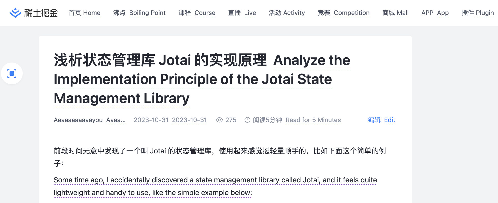
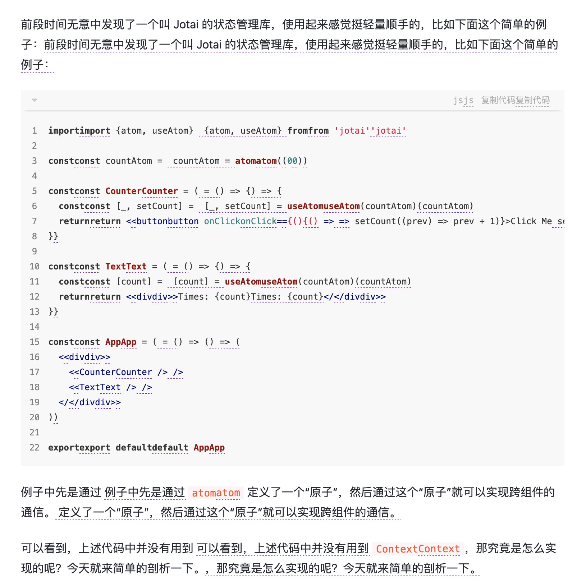

# 前言

Chrome 浏览器自带翻译功能，但是翻译后就看不到原文了，如果能够让原文和译文同时显示，是不是更加友好呢？就像这样：



好的，接下来就让我们来实现这个插件吧。很明显，实现整个插件大致包括两个部分：

第一部分就是前端部分，需要分析页面，提取出需要翻译的内容，并设计好译文显示的位置。第二部分就是翻译，计划对接一下 ChatGPT 来做翻译。

本文先来实现第一部分。

_关于插件开发环境搭建本文略过了，可以使用 vite + @crxjs/vite-plugin 快速搭建_

# 版本一

看到这个效果，很容易会想到可以遍历整个文档的 Text node，然后在其后面插入译文。

我们在 `content_script` 中先来实现一下：

```js
class ParallelTranslate {
  findTextNodes() {
    const textNodes = []
    const walker = document.createTreeWalker(
      document.body,
      NodeFilter.SHOW_TEXT,
      (node) => {
        if (node.nodeType === Node.TEXT_NODE) {
          return NodeFilter.FILTER_ACCEPT
        }
        return NodeFilter.FILTER_SKIP
      }
    )
    let node = walker.nextNode()
    while (node) {
      if (node.textContent?.trim()) {
        textNodes.push(node)
      }
      node = walker.nextNode()
    }

    return textNodes
  }

  translate() {
    const textNodes = this.findTextNodes()
    textNodes.forEach((textNode) => {
      const $transltedNode = document.createElement('translation')
      $transltedNode.innerText = textNode.textContent!
      $transltedNode.style.cssText = `
      background-repeat: repeat-x;
      background: linear-gradient( to right, #673AB7 0%, #9C27B0 50%, transparent 50%, transparent 100% ) repeat-x left bottom;
      background-size: 4px 1px;
      padding-bottom: 2px;`
      textNode.after($transltedNode)
    })
  }
}

new ParallelTranslate().translate()

```

我们通过 `createTreeWalker` 来遍历得到文档中的所有 Text 节点，然后在他们的后面插入了一个带有下划线样式的自定义标签 `translation`，不过目前我们没有实现翻译功能，暂用原文作为该标签的内容。看看效果：



很明显，有几个问题：

1 不应该翻译的内容，比如 `<code></code>` 中的内容也翻译了。
2 有些完整的段落没有作为一个整体被翻译，而是被拆成了好多小段。
