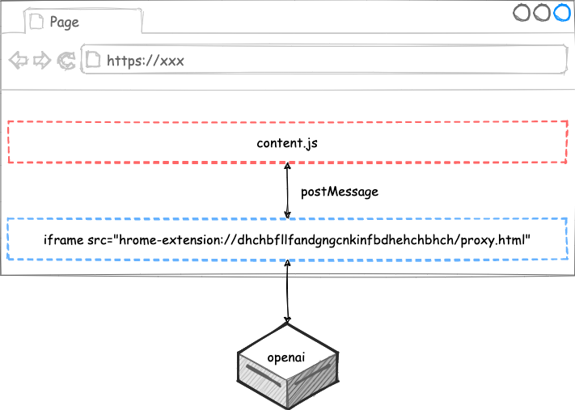

# 前言

[上篇文章](/2023/11/05/chrome-plugin-parallel-translate-1/) 介绍了插件的前端部分，这篇我们来介绍怎么对提取出来的内容进行翻译。生活在 ChatGPT 的时代，当然要好好利用一下这个工具了，所以本文就用它来进行翻译了。

# 接入 ChatGPT

本文没有采取官方 API_KEY 的方式，而是需要用户先自行登录 ChatGPT，然后利用跨站请求会自动携带 cookie 这一特性先请求 openai 的 `/api/auth/session` 接口获取 `accessToken`，然后使用其来发起对话，核心代码如下所示：

```js
  async sendMessage(params: {
    prompt: string
    onEvent: (p: OnEventParams) => void
  }) {
    if (!this.accessToken) {
      this.accessToken = await this.getAccessToken()
    }

    const rsp = await fetch(
      'https://chat.openai.com/backend-api/conversation',
      {
      ...
      }
    )

    this.parseSSEResponse(rsp, (message) => {
      console.log('msg', message)
      ...
    })
  }
```

由于 `conversation` 返回的 `Content-Type` 是 `text/event-stream` 类型的，所以本文使用了 `eventsource-parser` 来进行解析：

```js
async parseSSEResponse(resp: Response, onMessage: (message: string) => void) {
  if (!resp.ok) {
    const error = await resp.json().catch(() => null)
    if (!error) {
      throw new Error(JSON.stringify(error))
    }
    throw new Error(`${resp.status} ${resp.statusText}`)
  }
  const parser = createParser((event) => {
    if (event.type === 'event') {
      onMessage(event.data)
    }
  })
  const decoder = new TextDecoder()
  for await (const chunk of this.streamAsyncIterable(resp.body!)) {
    const str = decoder.decode(chunk)
    parser.feed(str)
  }
}

async *streamAsyncIterable(stream: ReadableStream) {
  const reader = stream.getReader()
  try {
    while (true) {
      const {done, value} = await reader.read()
      if (done) {
        return
      }
      yield value
    }
  } finally {
    reader.releaseLock()
  }
}

```

注意，这里的 `async *streamAsyncIterable` 是个 AsyncGenerator，感兴趣的可以自行学习。

但是，直接在 `content.js` 中运行上述代码是会跨域的，因为我们插件的 `content.js` 其实是运行在其他网页之中，那么怎么解决呢？答案就是代理。

首先，从插件的页面发起请求到 openai 是不会跨域的，所谓插件的页面就是类似于这样的页面：`chrome-extension://dhchbfllfandgngcnkinfbdhehchbhch/index.html`，其中 `//` 后面那一串是插件的唯一 id。所以，我们可以在网页中插入一个不可见的 `iframe` 来作为 Proxy，通过 `postMessage` 让其跟 `content.js` 互相进行通信：



好了，搞定了 ChatGPT 的接入，接下来就是翻译了。

# 翻译

[上篇文章](/2023/11/05/chrome-plugin-parallel-translate-1/)中我们已经提取出了待翻译的内容，并且按照段落组织好了，所以，接下来的任务就轻松了。我们先把每个段落的待翻译文本收集成一个数组：

```js
paragraphs.forEach(
  ({commonAncestorEl, text, translationWrapperEl, translationEl}) => {
    commonAncestorEl.appendChild(translationEl)
    texts.push(text.trim())
  }
)
const results = await this.requestAI(texts)
```

接下来我们写一个这样的 Prompt，发送给 ChatGPT：

```json
`I will give you a JSON array, please translate each item from ${from} to ${to} and
return a JSON array whose items are translation result string, please return the JSON directly,
here is my JSON array: ${JSON.stringify(texts)}`
```

其中，文本中 `from` 和 `to` 分别是原文语言和目标语言。然后，我们把得到的翻译结果解析出来，并显示到页面上即可：

```js
paragraphs.forEach(({translationEl}, index) => {
  translationEl.innerText = results[index]
  translationEl.classList.remove(this.loadingClass)
  translationEl.classList.add(this.translationClass)
})
```

# 总结

我们通过两篇文章介绍了如何实现一个并行翻译的 Chrome 插件，实测发现，翻译的速度有点慢，即使我们做了只翻译视口中的内容的优化。但其实还有优化空间，比如我们现在是等所有的文本都翻译好以后再一起返回结果，但 openai 的返回是流式的，我们也可以流式地进行处理。之前在[编译原理之手写一门解释型语言](/2020/02/27/compile-simple-language/)中介绍的状态机貌似可以派上用场，即我们可以通过一个状态机来不停地匹配翻译后的文本 token，这个后面有空再优化了。最后，欢迎关注公众号“前端游”。
