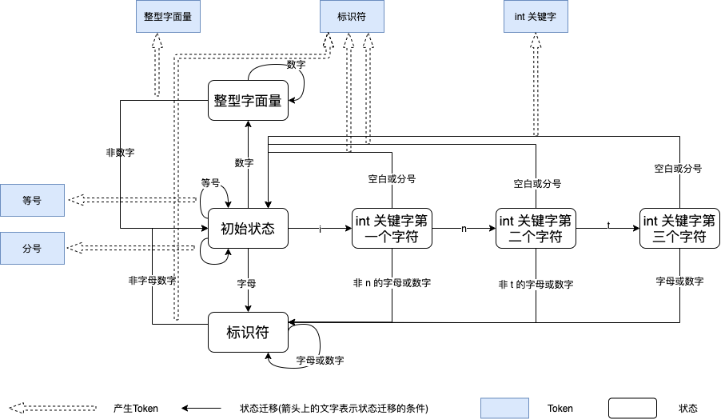

# 词法分析
词法分析是编译器的第一步，他的工作是将一个长长的字符串识别出一个个的单词，比如 `int age = 43;`，需要识别出如下这些 `Token`：

```
int: int 关键字
age: 标识符
=: 等号
43: 整型字面量
;: 分号
```

词法分析可以借助**有限状态机**来完成。

# 有限状态机
为了简单起见，假设我们的输入字符串中只有字母、数字、分号、空白（包括空格、制表符、换行），则我们的有限状态机如下图所示:



我们用黑色框表示状态，蓝色框表示生成的 `Token`，黑色实线表示从某状态迁移到另一状态，其中线上的文字表示状态迁移的条件，同时每当状态恢复到初始状态时都会产生一个 `Token`，我们用虚线的箭头来表示。

我们用 `int age = 43;` 来模拟一下有限状态机的工作过程：

1. 初始状态。
2. 遇到 `i`, 转移到 `int 关键字第一个字符` 状态。
3. 遇到 `n`, 转移到 `int 关键字第二个字符` 状态。
4. 遇到 `t`, 转移到 `int 关键字第三个字符` 状态。
5. 遇到 `空格`, 转移到初始状态，同时生成一个类型为 `int 关键字` 的 `Token`。
6. 连续遇到三个字母 `a` `g` `e`，然后遇到一个 `空格`，转移到初始状态，同时生成一个类型为 `标识符` 的 `Token`。
7. 遇到 `=`，生成一个类型为 `等号` 的 `Token`。
8. 连续遇到两个数字 `4` `3`，然后遇到一个 `空格`，转移到初始状态，同时生成一个类型为 `整型字面量` 的 `Token`。
9. 遇到 `=`，生成一个类型为 `分号` 的 `Token`。

明白了这个例子，再加入其它的一些状态和 `Token`，就可以实现一个简单的词法分析器了。具体实现详见[代码](https://github.com/ParadeTo/learn-compile/tree/master/craft-nodejs)。

注意到，像这样的代码 `int 3a;` 我们会识别为：
```
int: int 关键字
3: 整型字面量
a: 标识符
;: 分号
```

虽然很明显这是个不合法的语句，但是这种情况在词法分析阶段是没有问题的。识别出这是一个非法语句是语法阶段的工作，词法分析阶段只需要兢兢业业的生成一个个 `Token`。计算机科学的分层思想真的是随处可见。