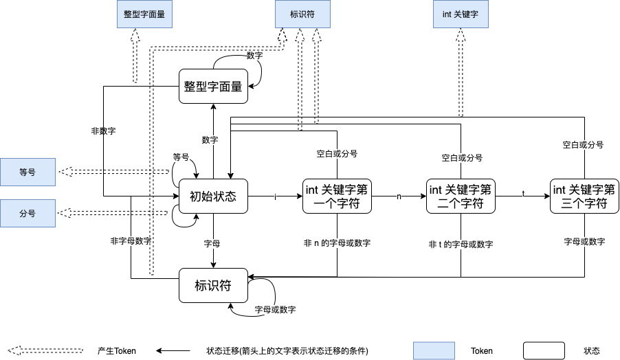

实现一门简单的解释型语言分三步：词法分析，语法分析，解释执行。
[完整代码](https://github.com/ParadeTo/learn-compile/tree/master/craft-nodejs)

# 词法分析
词法分析是编译器的第一步，他的工作是将一个长长的字符串识别出一个个的单词，比如 `int age = 43;`，需要识别出如下这些 `Token`：

```
int: int 关键字
age: 标识符
=: 等号
43: 整型字面量
;: 分号
```

词法分析可以借助**有限状态机**来完成。

## 有限状态机
为了简单起见，假设我们的输入字符串中只有字母、数字、分号、空白（包括空格、制表符、换行），则我们的有限状态机如下图所示:



我们用黑色框表示状态，蓝色框表示生成的 `Token`，黑色实线表示从某状态迁移到另一状态，其中线上的文字表示状态迁移的条件，同时每当状态恢复到初始状态时都会产生一个 `Token`，我们用虚线的箭头来表示。

我们用 `int age = 43;` 来模拟一下有限状态机的工作过程：

1. 初始状态。
2. 遇到 `i`, 转移到 `int 关键字第一个字符` 状态。
3. 遇到 `n`, 转移到 `int 关键字第二个字符` 状态。
4. 遇到 `t`, 转移到 `int 关键字第三个字符` 状态。
5. 遇到 `空格`, 转移到初始状态，同时生成一个类型为 `int 关键字` 的 `Token`。
6. 连续遇到三个字母 `a` `g` `e`，然后遇到一个 `空格`，转移到初始状态，同时生成一个类型为 `标识符` 的 `Token`。
7. 遇到 `=`，生成一个类型为 `等号` 的 `Token`。
8. 连续遇到两个数字 `4` `3`，然后遇到一个 `空格`，转移到初始状态，同时生成一个类型为 `整型字面量` 的 `Token`。
9. 遇到 `=`，生成一个类型为 `分号` 的 `Token`。

明白了这个例子，再加入其它的一些状态和 `Token`，就可以实现一个简单的词法分析器了。具体实现详见[代码](https://github.com/ParadeTo/learn-compile/tree/master/craft-nodejs)。

注意到，像这样的代码 `int 3a;` 我们会识别为：
```
int: int 关键字
3: 整型字面量
a: 标识符
;: 分号
```

虽然很明显这是个不合法的语句，但是这种情况在词法分析阶段是没有问题的。识别出这是一个非法语句是语法阶段的工作，词法分析阶段只需要兢兢业业的生成一个个 `Token`。计算机科学的分层思想真的是随处可见。


# 语法分析
单词有了，接下来就是要构成句子了，语法分析就是在词法分析的基础上识别出程序的语法结构。这个结构是一个树状结构，即我们通常所说的抽象语法树，是计算机容易理解和执行的。
## 语法规则
我们学英语的时候都学习过语法，比如句子结构一般是 "主谓宾" 结构。同样，我们的代码也需要语法规则。我们定义将要实现的语言语法规则如下：
```javascript
// 我们的程序由四种类型的语句组成：整型变量声明语句、表达式语句、赋值语句、打印日志语句
programm: intDeclare | expressionStatement | assignmentStatement | printCall
printCall: 'print' '(' additive ')' ';'
// 整型变量声明语句，? 表示没有或者一个
intDeclare: 'int' Id ( = additive)? ';'
// 表达式，表达式由加法语句后接一个分号组成。实际处理时为了简化，没有 expressionStatement 这个节点，而是直接返回了 additive 这个子节点
expressionStatement: additive ';'
// 赋值语句
assignmentStatement: Id = expressionStatement
// 加/减法语句，加法语句由一个或多个乘法语句组成，* 表示没有、一个或多个
additive: multiplicative ( (+ | -) multiplicative )*
// 乘/除法语句，乘法语句由一个或多个基本语句组成
multiplicative: primary ( (* | /) primary )*
// 基本语句，包括整型字面量、标识符、括号括起来的加法语句，实际处理时也没有 primary 这个类型的节点，直接返回了他的子节点
primary: IntLiteral | Id | '('additive')'
```

下面我们以加法表达式为例来说明一下解析过程：

```javascript
  /**
   * 加/减法表达式
   * Additive: multiplicative ( (+ | -) multiplicative )*
   */
  additive(reader: TokenReader): SimpleASTNode {
    // 尝试解析一个乘法表达式
    let child1 = this.multiplicative(reader)
    let node = child1
    let token
    // 尝试解析一个乘法表达式成功
    if (child1) {
      // 看后面是否还有 + / - 号
      while ((token = reader.peek())) {
        if (
          token &&
          (token.getType() === TokenType.Plus ||
            token.getType() === TokenType.Minus)
        ) {
          token = reader.read()
          // 尝试解析 + / - 后面的一个乘法表达式
          const child2 = this.multiplicative(reader)
          if (child2) {
            // 如果有左右子节点，则创建一个加法表达式的节点，否则其他情况都是直接把 child1 作为结果返回了
            node = new SimpleASTNode(ASTNodeType.Additive, token.getText())
            node.addChild(child1)
            node.addChild(child2)
            // 新生成的结点作为左边的节点，如何理解这个过程见下文解释
            child1 = node
          } else {
            throw new Error(
              'invalid additive expression, expecting the right part'
            )
          }
        } else {
          break
        }
      }
    }
    return node
  }
```

我们以 `1 * 2 + 3 * 4 + 5 * 6` 为例来梳理下这个过程：
1. 解析一个乘法语句。这里是得到 `1 * 2` 这个节点，为 child1。
2. 判断下一个 token 是否是 +/- 号，如果是，则尝试解析一个乘法语句，否则退出循环。这里会得到 `3 * 4` 这个节点，为 child2。
3. 如果左右子节点都有则构建一个加法表达式的节点，将 child1 和 child2 分别作为他的左右子节点，然后将 child1 赋值为该节点。这一步的作用是把整个节点作为下一个加法表达式的左节点。
4. 继续解析后面的 token 直到结束。

最后生成的 AST 如下图所示：


# 解释执行
得到 AST 以后，我们就可以基于它来解释执行我们的代码了。我们从 AST 的根节点开始，递归解释执行，具体规则如下：


1. 程序根节点 (programm)，取出所有子节点执行，最后一个语句的结果作为结果返回
2. 加法表达式节点 (additive)，解释执行左右子节点得到结果进行相加/减，然后返回结果
3. 乘法表达式节点 (multiplicative)，解释执行左右子节点得到结果进行相乘/除，然后返回结果
4. 日志打印节点 (printCall)， 解释执行子节点并将其结果进行打印
5. 标识符节点 (Id)，从 JS 对象中取出 Id 对应的值作为结果返回
6. 赋值节点 (assignmentStatement), 解释执行子节点 (expressionStatement，因为expressionStatement 简化过，所以这里就是 additive 节点) 得到结果，并更新 Id 在 JS 对象中的值。
7. 整型变量声明节点 (intDeclare)，在 JS 对象中新增一个属性， 属性名为 Id，如果有赋值操作则初始化它的值

其他更多细节详见[代码](https://github.com/ParadeTo/learn-compile/tree/master/craft-nodejs)。

借助 nodejs 的 `readline`，我们可以实现一个 REPL：

```javascript
  const parser = new Parser()
  const executor = new Executor(verbose)

  verbose && process.stdout.write('verbose mode\n')
  process.stdout.write('\n>')

  const rl = readline.createInterface({
    input: process.stdin
  })

  rl.on('line', input => {
    try {
      const astRoot = parser.parse(input)
      process.stdout.write(executor.execute(astRoot).toString())
    } catch (error) {
      process.stdout.write(error.toString())
    } finally {
      process.stdout.write('\n>')
    }
  })
```


或者直接读取代码文件内容执行：

```javascript
  const code = fs.readFileSync(filename)
  const parser = new Parser()
  const executor = new Executor(verbose)
  const astRoot = parser.parse(code.toString())
  executor.execute(astRoot)
```


没错，这门语言就叫做 `you` 语言。