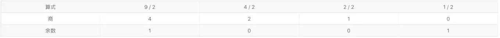
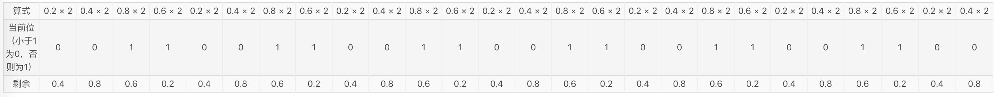
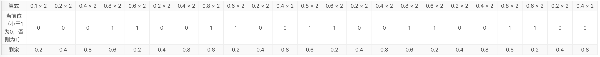

>本文不会讲解浮点数的表示原理，阅读前请先补充前置知识，可以先读读这几篇文章：
>https://zh.wikipedia.org/wiki/IEEE_754
>http://www.ruanyifeng.com/blog/2010/06/ieee_floating-point_representation.html

下面分别以 -0.2 和 9.1 为例来推导浮点数的二进制表示，这里只讨论单精度，双精度的推导方式是类似的。

# 整数部分二进制表示
将一个整数转为二进制的方法比较简单：1. 该整数除以 2 得到商和余数，余数作为低位；2. 将商作为整数继续重复 1。

所以 9.1 的整数部分转换过程如下：

将余数从右往左收集起来就得到了 9.1 的整数部分的二进制表示方法：1001

# 小数部分二进制表示
将一个小数转为二进制的方法跟整数类似，只不过除法要换成乘法：1. 该整数乘以 2 得到积，如果大于等于 1，则二进制位为 1，否则为 0；2. 若积大于等于 1，则减去 1，新的数继续重复步骤 1，否则原来的积继续重复步骤1。

所以 -0.2 和 9.1 的小数部分分别表示如下 (左边是高位，右边是低位)：

# 二进制科学计数法表示
-0.2：

.00110011001100110011001100 = 1.10011001100110011001100×2^(-3)

9.1：

1001.00011001100110011001100 = 1.00100011001100110011001×2^(3)

# 浮点数三要素
得到二进制的科学技术表示法后，浮点数的三要素就好计算了：

||s|f|e|
|-----|-----|-----|-----|
|-0.2|1|10011001100110011001100|-3 + 127 = 124 = 01111100|
|9.1|0|00100011001100110011001|3 + 127 = 130 = 10000010|

# 内存模型
最后，把三要素连在一起得到两个数在内存中的实际存储模型：

-0.2

9.1

最后附上几个在线获取二进制表示的小工具：
* [浮点数转换 by Ayou](/vue-float/)
* [在线进制转换器_浮点数转换](http://tools.5axxw.com/web/jinzhi.html)