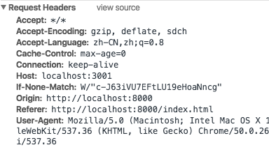
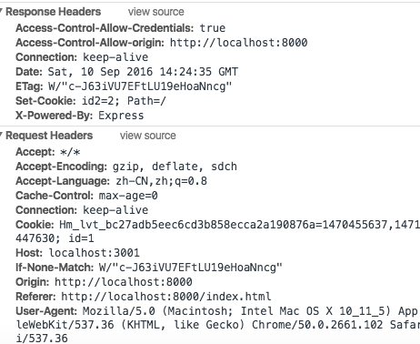
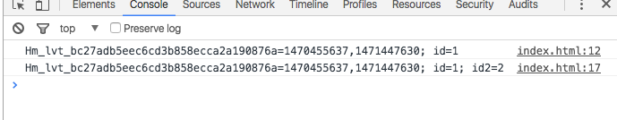
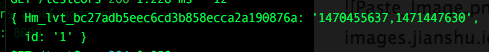

默认情况下，跨域请求不提供凭据(cookie，http认证及客户端ssl证明等)。如果需要，则需将XMLHttpRequest的withCredentials属性设置为true。

## 默认情况
### 远程服务端
使用``express``搭建了一个简单的远程服务器，部署在3001端口上
```javascript
router.get('/testCors', function(req, res, next) {
  res.setHeader('Access-Control-Allow-origin','*');
  res.send('跨域了！')
});
```

### 本地服务端
* index.html

```html
<!DOCTYPE html>
<html>
  <head>
    <meta charset="utf-8">
    <title>测试跨域</title>
  </head>
  <body>
    <h2>测试跨域</h2>
  </body>
  <script type="text/javascript">
    var xhr = new XMLHttpRequest();
    xhr.onreadystatechange = function() {
      if (xhr.readyState == 4) {
        if (xhr.status >= 200 && xhr.status < 300 || xhr.status===304) {
          console.log(xhr.responseText);
        } else {
          alert('error')
        }
      }
    }
    // 向远程服务器发送请求
    xhr.open('get','http://localhost:3001/testCors',true);
    xhr.send(null);
  </script>
</html>
```
* app.js
这里用node起了一个简单的[静态文件服务器](http://cnodejs.org/topic/4f16442ccae1f4aa27001071)

```javascript
var PORT = 8000;
var http = require('http');
var path = require('path');
var fs = require('fs');
var url = require("url");

var server = http.createServer(function(request, response) {
    var pathname = url.parse(request.url).pathname;
    var realPath = "." + pathname;
    fs.exists(realPath, function (exists) {
        if (!exists) {
            response.writeHead(404, {'Content-Type': 'text/plain'});
            response.write("This request URL " + pathname + " was not found on this server.");
            response.end();
        } else {
            fs.readFile(realPath, "binary", function(err, file) {
                if (err) {
                    response.writeHead(500, {'Content-Type': 'text/plain'});
                    response.end(err);
                } else {
                    response.writeHead(200, {'Content-Type': 'text/html'});
                    response.write(file, "binary");
                    response.end();
                }
             });
          }
      });
});
server.listen(PORT);
console.log("Server runing at port: " + PORT + ".");
```

### 结果
果然没有发送cookie


## 修改
### 远程服务端
```javascript
router.get('/testCors', function(req, res, next) {
  console.log(req.cookies);
  res.setHeader('Access-Control-Allow-origin','http://localhost:8000'); // 指定了credentials时不能用＊
  res.setHeader('Access-Control-Allow-Credentials','true');
  // 添加cookie
  res.cookie('id2','2');
  res.send('跨域了！')
});
```

### 本地服务端
```javascript
document.cookie = 'id=1';
console.log(document.cookie);
var xhr = new XMLHttpRequest();
xhr.onreadystatechange = function() {
  if (xhr.readyState == 4) {
    if (xhr.status >= 200 && xhr.status < 300 || xhr.status===304) {
      console.log(document.cookie);
    } else {
      alert('error')
    }
  }
}
xhr.open('get','http://localhost:3001/testCors',true);
xhr.withCredentials = true;
xhr.send(null);
```

### 结果
* 浏览器日志
发送了``id＝1``的cookie




* 远程服务端


