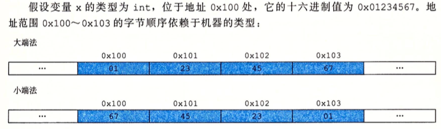
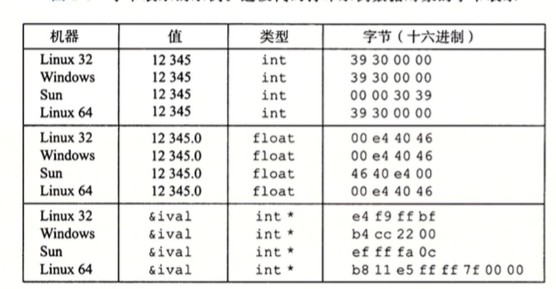
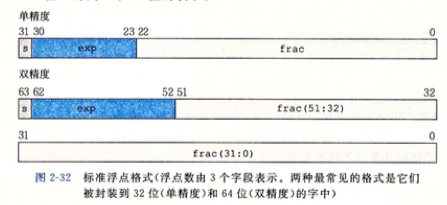
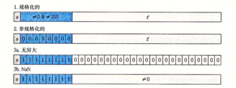

# 2.1子数据大小
* 对于一个字长为 w 位的机器而言，虚拟地址的范围为 0~2^w-1，程序最多访问2^w个字节。[32位系统最大只能支持4GB内存之由来](http://www.cnblogs.com/dolphin0520/archive/2013/05/31/3110555.html)

## 2.1.3 寻址和字节顺序
* 大端法，小端法



例子：




```
#include <iostream>
typedef unsigned char *byte_pointer;

void show_bytes(byte_pointer start, size_t len) {
    size_t i;
    for (i = 0; i < len; i++) {
        printf("%.2x", start[i]);
    }
    printf("\n");
}

void show_int(int x) {
    show_bytes((byte_pointer) &x, sizeof(int));
}


void show_float(float x) {
    show_bytes((byte_pointer) &x, sizeof(float));
}


void show_pointer(void *x) {
    show_bytes((byte_pointer) &x, sizeof(void *));
}

void test_show_bytes(int val) {
    int ival = val;
    float fval = (float) ival;
    int *pval = &ival;
    show_int(ival);
    show_float(fval);
    show_pointer(pval);
}
int main(int argc, const char * argv[]) {
    test_show_bytes(12345);
    int val = 0x87654321;
    byte_pointer valp = (byte_pointer) &val;
    show_bytes(valp, 1);
    show_bytes(valp, 2);
    show_bytes(valp, 3);
    const char *s = "12345";
    show_bytes((byte_pointer) s, strlen(s));
    return 0;
}
//
39300000 // 小端法表示
00e44046
a8f7bf5fff7f0000
21
2143
214365
31323334350000 // ascii: 1->0x31
```

## 2.1.6 布尔代数简介
* 位向量表示有限集合
	
	a = 01101001 表示集合 {0, 3, 5, 6}
	
	b = 01010101 表示集合 {0, 2, 4, 6}
	
	a & b = 01000001 表示集合 {0, 6}
	
## 2.2.3 补码编码

[1111] = -1 * 2^3 + 1 * 2^2 + 1 * 2^1 + 1 = -1

-[1111] = [10000] - [1111] = [0001]

## 2.2.4 有符号和无符号之间的转换

unsigned u = [1111]

位值不变，只是改变了解释这些位的方式，所以上面等于 15

## 2.2.6 拓展一个数字的位表示

* 无符号，左边加0
* 有符号，左边加最高有效位的值

## 2.2.7 截断数字

```c
int x = 53191; // [00000000 00000000 11001111 11000111]
short sx = (short) x; // [11001111 11000111]
int y = sx; // [11111111 11111111 11001111 11000111]
```

# 2.3 整数运算
## 2.3.1 无符号加法
* 溢出
 考虑一个4位数字 x = [1001] y = [1100], x + y = [10101] 丢弃最高位得到 [0101]
 
# 2.4 浮点数
## 2.4.2 IEEE浮点表示

V = (-1)^S * M * 2^e

s: 0 表示正数，1表示负数




参考：

[浅谈计算机中浮点数的表达方法（IEEE 754）](http://zhan.renren.com/programming4idiots?gid=3602888498026486936&checked=true):

以32位单精度浮点数为例，其具体的转换规则是：首先把二进制小数（补码）用二进制科学计数法表示，比如上面给出的例子1111101.001=1.111101001*2^6。符号位sign表示数的正负（0为正，1为负），故此处填0。exponent表示科学计数法的指数部分，请务必注意的是，这里所填的指数并不是前面算出来的实际指数，而是等于实际指数加上一个数（指数偏移），偏移量为2^(e-1)-1，其中e是exponent的宽度（位数）。对于32位单精度浮点数，exponent宽度为8，因此偏移量为127，所以exponent的值为133，即10000101。之后的fraction表示尾数，即科学计数法中的小数部分11110100100000000000000（共23位）。因此32位浮点数125.125D在计算机中就被表示为01000010111110100100000000000000。

为什么要加上偏移量？

为了表示负数的指数，小于127的是负数，大于127的是正数