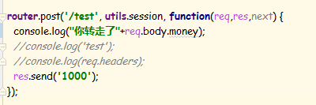
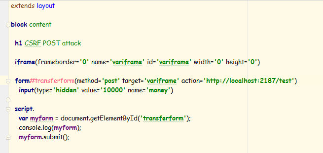
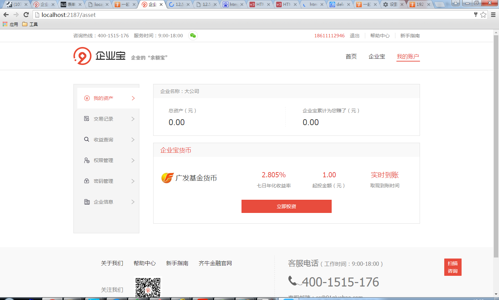
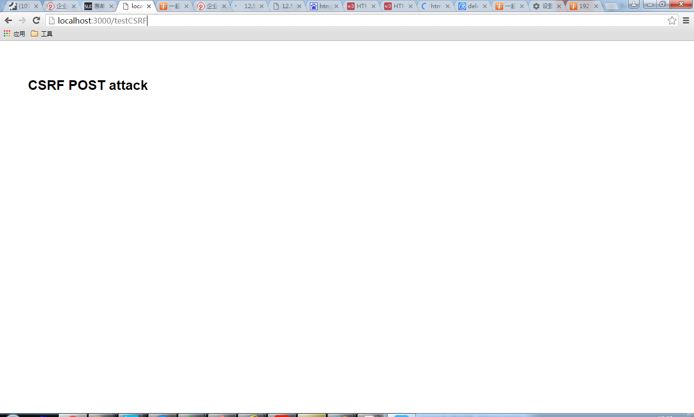
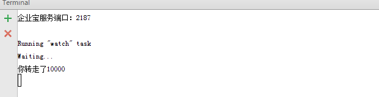

前端时间小小的研究了下网络安全，基于Express框架并亲身测试了一下CSRF(Cross-site request forgery跨站请求伪造)，以下是过程：

## 测试路由

这个路由添加了一个验证登录的中间件，客户端若是未登录会重定向到登录页。

## 攻击页面

发送了一个请求，并带上了名为money的参数

## 模拟受害者登录

受害者首先登录了测试网站

## 模拟受害者无意中打开了攻击页面

## 中招了

## 原因
以上CSRF能成功的原因是因为攻击页面向目标站点发送请求时，浏览器也会发送该站点下的Session Cookie（《白帽子讲WEB安全》）

## 防御
《白帽子讲WEB安全》一书中提到了3种方法：

* 验证码
    CSRF往往是在用户不知情的情况下构造了网络请求。而验证码，则强调用户必须与应用交互，才能完成最终请求。这里要注意：验证码每次使用完后都要刷新或者设置过期规则，否则攻击者可以先人工识别验证码，然后用程序无限的发送请求。一般的接口还好，若是像获取手机验证码这样的接口，那后果就比较严重了。
* Referer Check
    通过检查Referre判断请求是否来源于本站，来过滤非法请求。但是Referer也是可以伪造的。
* Token
    CSRF为什么能够成功？本质原因是重要操作的所有参数都是可以被攻击者猜测到的。出于这个原因，可以想到一个解决方案，使用token，其思想就是服务器事先产生一个随机字符串到请求提交的页面，然后请求发送的时候带上该字符串作为参数，个人认为其本质与验证码是一样的。
    针对这个，npm提供了一个包[csurf](https://www.npmjs.com/package/csurf)，我们公司已经在使用。
    
## 结语
道高一尺，魔高一丈，WEB安全没有一劳永逸的银弹，我们能做的就是了解攻击手法并相应的增加防范措施，增加攻击者的攻击成本。