# 引言
## 编码技巧
* currentColor 文本的颜色

# 背景与边框
## 半透明边框
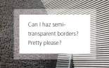
```css
div {
    padding: 50px;
    border: 10px solid rgba(255,255,255,0.5);
    background: red;
    background-clip: padding-box; // 保留padding的背景
}
```
## 多重边框
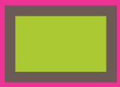
### box-shadow
```javascript
box-shadow: 0 0 0 10px #655, 0 0 0 20px red;
```

* 不会影响布局，可通过内边距或外边距来模拟
* 不会影响鼠标事件，可以通过inset关键字加上内边距来实现
* 只能产生实线

### outline
* 可以通过`outline-offset`来指定与边缘的距离，可以为负值
* 没有圆角

## 灵活的背景定位

### background-position方案
```javascript
background: url(***) no-repeat bottom right red; /* 回退方案 */
background-position: right 10px bottom 10px;
```

### background-origin + padding方案
```javascript
padding: 10px;
background: url(***) no-repeat red;
background-origin: content-box; /* border-box padding-box(默认) */
```

### calc()
```javascript
background-position: calc(100% - 20px) calc(100% - 10px);
```

## 边框内圆角
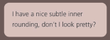
```javascript
background: tan;
border-radius: .8em;
padding: 1em;
box-shadow: 0 0 0 .6em #655; // 可以根据border-radius计算得到
outline: .6em solid #655;
```

## 条纹背景
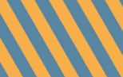
比较复杂，看书比较好理解

另外，这个：
https://hugogiraudel.com/2013/02/04/css-gradients/#a-few-things-about-linear-gradients

```javascript
background: linear-gradient(#fb3 33.3%, blue 0, blue 66.7%, red 0); /* 10px:10px:10px 最后面的30%可以写为0*/
background-size: 100% 30px;
```

```javascript
background: #58a;
background-image: repeating-linear-gradient(30deg,
            hsla(0, 0%, 100%, .1),
            hsla(0, 0%, 100%, .1) 15px,
            transparent 0, transparent 30px);
```

## 复杂的背景图案
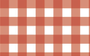
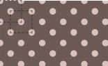
```javascript
/* 波点 */
background-image:
    radial-gradient(tan 30%, transparent 0),
    radial-gradient(tan 30%, transparent 0);
background-size: 30px 30px;
background-position: 0 0, 15px 15px;
```
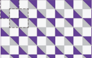
```javascript
/* 棋盘 */
background-image:
    linear-gradient(45deg, tan 25%, transparent 0),
    linear-gradient(45deg, transparent 75%, red 0),
    linear-gradient(45deg, blue 25%, transparent 0),
    linear-gradient(45deg, transparent 75%, green 0);
background-size: 30px 30px;
background-position: 0 0, 15px 15px, 15px 15px, 0px 0px;

or

background-image:
    linear-gradient(45deg, tan 25%, transparent 0, transparent 75%, tan 0),
    linear-gradient(45deg, blue 25%, transparent 0, transparent 75%, blue 0);
background-size: 30px 30px;
background-position: 0 0, 15px 15px;
```

## 伪随机背景
“蝉原则”，质数的思想

## 连续的图像边框
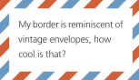
```javascript
/* 老式信封样式边框 */
background: linear-gradient(white, white) padding-box,
          repeating-linear-gradient(-45deg,
            red 0, red 12.5%,
            transparent 0, transparent 25%,
            #58a 0, #58a 37.5%,
            transparent 0, transparent 50%) 0 / 5em 5em;
background-origin: border-box;
```


```javascript
/* 蚂蚁行军边框 */
@keyframes ants {
  to {
    background-position: 100%;
  }
}
background: linear-gradient(white, white) padding-box,
          repeating-linear-gradient(-45deg,
            black 0, black 25%,
            white 0, white 50%) 0 / 0.5em 0.5em;
background-origin: border-box;
animation: ants 12s linear infinite;
```


```javascript
/* 脚注 */
.footnote {
	border-top: .15em solid transparent;
	border-image: 100% 0 0 linear-gradient(90deg, currentColor 4em, transparent 0);
	padding-top: .5em;
	font: 220%/1.4 Baskerville, Palatino, serif;
}
```

# 形状
## 自适应的椭圆
```javascript
/* 半椭圆 */
border-radius: 50% / 100% 100% 0 0;
```

## 平行四边形
```javascript
button  {
  width: 200px;
  height: 100px;
  position: relative;
  background: transparent;
  border: none;
}
button::before {
  content: '';
  position: absolute;
  top: 0; right: 0; bottom: 0;  left: 0;
  z-index: -1;
  background: #58a;
  transform: skew(45deg);
}
```

## 菱形图片
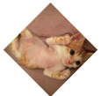
```javascript
.picture {
  margin: 200px auto;
  width: 155px;
  height: 155px;
  transform: rotate(45deg);
  overflow: hidden;
  border: 1px solid gray;
}
.picture > img {
  max-width: 100%;
  transform: rotate(-45deg) scale(1.42);
}
```

更好的方案

```javascript
img:hover {
  clip-path: polygon(50% 0, 100% 50%, 50% 100%, 0 50%);
}
img {
  transition: 1s clip-path;
  clip-path: polygon(0 0, 100% 0, 100% 100%, 0 100%);
}
```

## 切角效果
四个角的切角效果
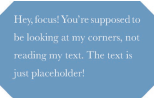
```javascript
background: #58a;
background:
	linear-gradient(135deg, transparent 15px, #58a 0) top left,
	linear-gradient(-135deg, transparent 15px, #58a 0) top right,
	linear-gradient(-45deg, transparent 15px, #58a 0) bottom right,
	linear-gradient(45deg, transparent 15px, #58a 0) bottom left;
background-size: 50% 50%;
background-repeat: no-repeat;
```

内凹圆角
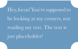
```javascript
background:
	radial-gradient(circle at top left, transparent 15px, #58a 0) top left,
	radial-gradient(circle at top right, transparent 15px, #58a 0) top right,
	radial-gradient(circle at bottom left, transparent 15px, #58a 0) bottom left,
	radial-gradient(circle at bottom right, transparent 15px, #58a 0) bottom right;
background-size: 50% 50%;
background-repeat: no-repeat;
```

svg + border-image 的方案
```javascript
background: #58a;
background-clip: padding-box;
border: 15px solid #58a;
/* 1对应svg文件的坐标系统，可以用33.4% */
border-image: 1 url('data:image/svg+xml,\
<svg xmlns="http://www.w3.org/2000/svg"\
  width="3" height="3" fill="%2358a">\
  <polygon points="0,1 1,0 2,0 3,1 3,2 2,3 1,3 0,2"/>\
</svg>')
```

裁切路径方案
```javascript
clip-path: polygon(
	20px 0, calc(100% - 20px) 0, 100% 20px,
	100% calc(100% - 20px), calc(100% - 20px) 100%,
	20px 100%, 0 calc(100% - 20px), 0 20px
);
```

## 梯形标签页
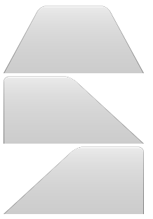
```javascript
div::before {
  content: '';
  position: absolute;
  top: 0; right: 0; bottom: 0; left: 0;
  z-index: -1;
  background: #ccc;
  background-image: linear-gradient(hsla(0, 0%, 100%, .6), hsla(0, 0%, 100%, 0));
  border: 1px solid rgba(0, 0, 0, .4);
  border-bottom: none;
  border-radius: 1em 1em 0 0;
  box-shadow: 0 .15em white inset;
}

#div1:before {
  transform: perspective(.5em) scaleY(2) rotateX(5deg);
  transform-origin: bottom;
}

#div2:before {
  transform: perspective(0.5em) scaleY(2) rotateX(5deg);
  transform-origin: bottom left;
}

#div3:before {
  transform: perspective(0.5em) scaleY(2) rotateX(5deg);
  transform-origin: bottom right;
}
```

## 饼图
一个饼图动画

```javascript
@keyframes spin {
    to {transform: rotate(.5turn)}
}
@keyframes bg {
    50% {background: #655}
}
.pie {
    width: 100px;
    height: 100px;
    border-radius: 50%;
    background: yellowgreen;
    background-image: linear-gradient(to right, transparent 50%, #655 0);
}
.pie::before {
    content: '';
    display: block;
    margin-left: 50%;
    height: 100%;
    border-radius: 0 100% 100% 0 / 50%;
    background-color: yellowgreen;
    transform-origin: left;
    animation: spin 3s linear infinite,
                bg 6s step-end infinite;
}
```

各种比率的饼图

```javascript
<!--五分之一的饼图 因为20/50/2-->
<div class="pie" style="animation-delay: -20s"></div>

@keyframes spin {
    to {transform: rotate(.5turn)}
}
@keyframes bg {
    50% {background: #655}
}
.pie {
    width: 100px;
    height: 100px;
    border-radius: 50%;
    background: yellowgreen;
    background-image: linear-gradient(to right, transparent 50%, #655 0);
}
.pie::before {
    content: '';
    display: block;
    margin-left: 50%;
    height: 100%;
    border-radius: 0 100% 100% 0 / 50%;
    background-color: yellowgreen;
    transform-origin: left;
    animation: spin 50s linear infinite,
                bg 100s step-end infinite;
    animation-play-state: paused;
    animation-delay: inherit;
}

```

SVG解决方案

```javascript
<svg viewBox="0 0 32 32">
  <!--半径为16的圆周长约为100-->
  <circle r="16" cx="16" cy="16" />
</svg>

@keyframes fillup {
  to {
    stroke-dasharray: 158 158;
  }
}
svg {
  width: 200px;
  height: 200px;
  transform: rotate(-90deg);
  background: yellowgreen;
  border-radius: 50%;
}
circle {
  fill: yellowgreen;
  stroke: #655;
  stroke-width: 32;
  stroke-dasharray: 0 158;
  animation: fillup 5s linear infinite;
}
```

# 视觉效果
## 单侧投影
```javascript
box-shadow: 0px 5px 4px -4px rgba(0,0,0,.5);
```

## 邻边投影
```javascript
box-shadow: 3px 3px 4px -2px rgba(0,0,0,.5);
```

## 两侧投影
```javascript
box-shadow: 6px 0 4px -2px rgba(0,0,0,.5),
          -6px 0 4px -2px rgba(0,0,0,.5);
```

## 不规则投影

```javascript
filter: drop-shadow(3px 3px 4px #000);
```
* 可以用到伪元素，边框等
* 文字也会被打上投影，且不会受`text-shadow`的影响

## 染色效果

```javascript
img {
  transition: .5s filter;
  filter: sepia(1) saturate(4) ;
}
img:hover,
img:focus {
  filter: none;
}
```

基于混合模式的方案
luminosity: 保留上层元素的HSL亮度信息，从下层吸取色相和饱和度信息

```javascript
<a>
  
</a>

a {
  display: inline-block;
  background: hsl(335, 100%, 50%);
}
img {
  mix-blend-mode: luminosity;
}
```

或

```javascript
.tinted-image {
  width: 640px;
  height: 440px;
  background-size: cover;
  background-color: hsl(335, 100%, 50%);
  background-blend-mode: luminosity;
  transition: .5s background-color;
}
.tinted-image:hover {
  background-color: transparent;
}
```

## 毛玻璃效果
```javascript
filter: blur(20px);
```

## 折角效果
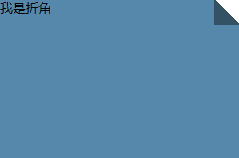

```javascript
div {
  background: #58a;
  width: 300px;
  height: 200px;
  background:
    linear-gradient(to left bottom,
      transparent 50%, rgba(0, 0, 0, .4) 0)
      no-repeat 100% 0 / 2em 2em,
    linear-gradient(-135deg,
            transparent 1.41em, #58a 0); /* 这里的2em是沿着渐变轴的所以要改成1.41 */
}
```

30度的折角呢？

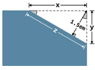
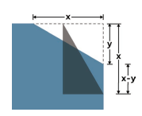

```javascript
div {
  position: relative;
  background: #58a;
  width: 300px;
  height: 200px;
  border-radius: .5em;
  background:
    linear-gradient(-150deg,
            transparent 1.5em, #58a 0);
}
div::before {
  content: '';
  position: absolute;
  top: 0;
  right: 0;
  background: linear-gradient(to left bottom,
    transparent 50%, rgba(0, 0, 0, .2) 0, rgba(0, 0, 0, .4)) 100% 0 no-repeat;
  width: 1.73em;
  height: 3em;
  transform: translateY(-1.3em) rotate(-30deg);
  transform-origin: bottom right;
  border-bottom-left-radius: inherit;
  box-shadow: -.2em .2em .3em -.1em rgba(0, 0, 0, .2);
}
```
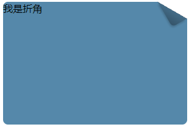

# 字体排印
## 插入换行
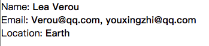

```javascript
dt, dd {
    display: inline;
}
dd {
    margin: 0;
    font-weight: bold;
}
dd + dt::before {
    content: '\A';
    white-space: pre;
}
dd + dd::before {
    content: ', ';
    font-weight: normal;
}

<dl>
    <dt>Name:</dt>
    <dd>Lea Verou</dd>
    <dt>Email:</dt>
    <dd>Verou@qq.com</dd><dd>youxingzhi@qq.com</dd>
    <dt>Location:</dt>
    <dd>Earth</dd>
</dl>
```

## 文本行的斑马条纹
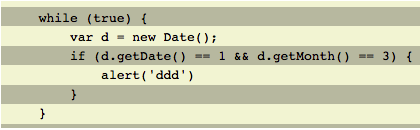
```javascript
pre {
    padding: .5em;
    line-height: 1.5;
    background: beige;
    background-image: linear-gradient(rgba(0,0,0,.2) 50%, transparent 0);
    background-size: auto 3em;
    background-origin: content-box;
}

<pre>
    while (true) {
        var d = new Date();
        if (d.getDate() == 1 && d.getMonth() == 3) {
            alert('ddd')
        }
    }
</pre>
```

## 调整tab的宽度
```
tab-size: 2
```

## 华丽的&符号
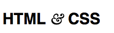
```javascript
@font-face {
    font-family: Ampersand;
    src: local('Baskerville-Italic'),
        local('GoudyOldStyleT-Italic'),
        local('Palatino-Italic'),
        local('BookAntiqua-Italic');
    unicode-range: U+26; /* '&'.charCodeAt(0).toString(16) => 26 */
}
h1 {
    font-family: Ampersand, Helvetica, sans-serif;
}
```

## 自定义下划线
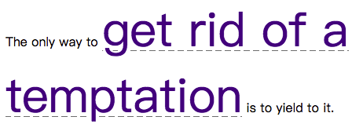
```javascript
a[href] {
    text-decoration: none;
    font-size: 60px;
    /*background: linear-gradient(gray, gray) no-repeat;*/
    background: linear-gradient(90deg, gray 66%, transparent 0) repeat-x; /* 虚线 */
    background-repeat: repeat-x;
    background-size: .2em 1px;
    background-position: 0 1.15em;
    text-shadow: .05em 0 white, -.05em 0 white; /* 不让下划线穿过字母 */
}
```

## 现实中的文字效果
### 凸版印刷效果
1. 深色背景，浅色字体

给文字顶部加深色投影:`text-shadow: 0 -1px 1px black`

2. 浅色背景，深色字体

给文字底部加浅色投影:`text-shadow: 0 1px 1px white`

### 空心字效果
```javascript
div {
    font-size: 100px;
    width: 300px;
    height: 200px;
    background-color: deeppink;
    color: white;
    text-shadow: 1px 1px black, -1px -1px black,
        1px -1px black, -1px 1px black;
}
```

```javascript
<div>
    <svg width="2em" height="1.2em">
        <use xlink:href="#css"/>
        <text id="css" y="1em">CSS</text>
    </svg>
</div>

div {
    color: white;
    font-size: 100px;
}
div text {
    fill: currentColor;
}
div use {
    stroke: black;
    stroke-width: 6;
    stroke-linejoin: round;
}
```

### 文字外发光效果
```javascript
div {
    font-size: 100px;
    background: #203;
    color: #ffc;
    transition: 1s;
}
div:hover {
    text-shadow: 0 0 .1em, 0 0 .3em;
}
```

### 文字凸起效果
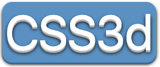
```javascript
button {
    outline: none;
    border-radius: 20px;
    border: none;
    font-size: 100px;
    background: hsl(204, 50%, 60%);
    color: white;
    box-shadow: 0 1px hsl(204, 50%, 60%),
    0 2px hsl(204, 50%, 55%),
    0 3px hsl(204, 50%, 50%),
    0 4px hsl(204, 50%, 45%),
    0 5px hsl(204, 50%, 40%),
    0 5px 10px black;
    text-shadow: 0 1px hsl(0, 0%, 85%),
        0 2px hsl(0, 0%, 80%),
        0 3px hsl(0, 0%, 75%),
        0 4px hsl(0, 0%, 70%),
        0 5px hsl(0, 0%, 65%),
        0 5px 10px black;
}
button:active, button:focus {
    box-shadow: none;
    text-shadow: none;
}

@mixin test-3d($color: white, $depth: 5) {
  $shadows: ();
  $shadow-color: $color;

  @for $i from 1 through $depth {
    $shadow-color: darken($shadow-color, 10%);
    $shadows: append($shadows, 0 ($i * 1px) $shadow-color, comma);
  }

  color: $color;
  text-shadow: append($shadows,
                0 ($depth * 1px) 10px black, comma);
}
```

### 环形文字
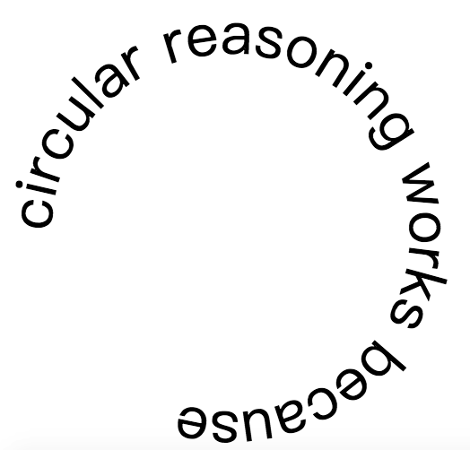
```javascript
.circular {
    width: 400px;
    height: 400px;
    margin: 400px auto;
}
.circular path {
    fill: none;
}
.circular svg {
    overflow: visible;
}

<div class="circular">
    <svg viewBox="0 0 100 100">
        <!--
            M 0，50 移动到点(0,50)
            a 50,50 0 1,1 0,1 以当前所在的这个点为起点,以当前点右侧 0 单位、下方 1 单位的那个点为终点,画一段圆弧。
            这段圆弧的水平 半径和垂直半径都必须是 50。如果存在两种可能的圆弧度数,选择 度数较大的那一种;
            同时,如果存在两种可能的圆弧方向,选择画 在这两个点右侧的那一种,而不是左侧的
            z 闭合
        -->
        <path d="M 0,50 a 50,50 0 1,1 0,1 z" id="circle" />
        <text>
            <textPath xlink:href="#circle">
                circular reasoning works because
            </textPath>
        </text>
    </svg>
</div>
```

# 用户体验
## 选用合适的鼠标光标
* 禁用 `cursor: not-allowed`
* 隐藏 `cursor: none`

## 扩大可点击区域
* 利用边框

```javascript
border: 10px solid trasparent;
background-clip: padding-box; /* 防止背景扩张到边框 */
```

* 利用伪元素
```javascript
button::before {
	content: '';
	position: absolute;
	top: -10px; right: -10px;
	bottom: -10px; left: -10px;
}
```

## 自定义复选框
* 自定义复选框/单选框
* 开关式按钮
利用`label`，具体略

## 滚动提示
```javascript
<ul>
    <li>1</li>
    <li>2</li>
    <li>3</li>
    <li>4</li>
    <li>5</li>
    <li>6</li>
    <li>7</li>
    <li>8</li>
    <li>9</li>
    <li>10</li>
    <li>11</li>
</ul>

ul {
    overflow: auto;
    width: 10em;
    height: 8em;
    padding: .3em .5em;
    border: 1px solid silver;
    background:
            linear-gradient(white, hsla(0,0%,100%,0)),
            radial-gradient(at 50% 0, rgba(0,0,0,.2),
                    transparent 70%);
    background-repeat: no-repeat;
    background-size: 100% 50px, 100% 15px;
    background-attachment: local, scroll;
}
```

## 交互式的图片对比控件
1. resize方案

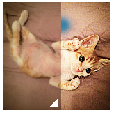

```javascript
img {
  user-select: none;
}
.image-slider {
  position: relative;
  display: inline-block;
}
.image-slider > div {
  position: absolute;
  top: 0; bottom: 0; left: 0; right: 0;
  width: 50%;
  max-width: 100%;
  overflow: hidden;
  resize: horizontal;
}
.image-slider > div::before {
  content: '';
  position: absolute;
  bottom: 0; right: 0;
  width: 12px; height: 12px;
  background: white;
  cursor: ew-resize;
  padding: 5px;
  background: linear-gradient(-45deg, white 50%, transparent 0);
  background-clip: content-box;
}
.image-slider img {
  display: block;
}

<div class="image-slider">
  <div>
    
  </div>
  
</div>
```

2. js方案

```javascript
img {
  user-select: none;
}
.image-slider {
  position: relative;
  display: inline-block;
}
.image-slider > div {
  position: absolute;
  top: 0; bottom: 0; left: 0; right: 0;
  width: 50%;
  overflow: hidden;
}
.image-slider img {
  display: block;
}
.image-slider input {
  position: absolute;
  left: 0; bottom: 10px;
  width: 100%;
  margin: 0;
  filter: contrast(.5);
  mix-blend-mode: luminosity;
}

<div class="image-slider">
  
  
</div>

var $$ = function (sel) {
  return document.querySelectorAll(sel)
}
$$('.image-slider').forEach(function (slider) {
  var div = document.createElement('div')
  var img = slider.querySelector('img')
  slider.insertBefore(div, img)
  div.appendChild(img)

  var range = document.createElement('input')
  range.type = 'range'
  range.oninput = function () {
    div.style.width = this.value + '%'
  }
  slider.appendChild(range)
})
```

# 结构与布局
## 自适应内部元素
```javascript
figure {
  max-width: 300px;
  border: 1px solid gray;
  width: min-content; /* 解析为这个容器内部最大的不可断行元素的宽度 */
  margin: auto;
}
figure > img {
  max-width: inherit;
}

<p>Some text [...]</p>
<figure>
  
  <figcaption>
    The great sir adam catlace was named after countess ada lovelace, the first programmer
  </figcaption>
</figure>
<p>More text [...]</p>
```

## 精确控制表格列宽
关于table几个重要的属性

```javascript
table-layout: fixed; /* 可以精确控制单元格的宽度 */
border-collapse: collapse; /* 单元格的边框进行合并 */
border-spacing: 0; /* 单元格之间的间距 */
```

## 根据兄弟元素的数量来设置样式
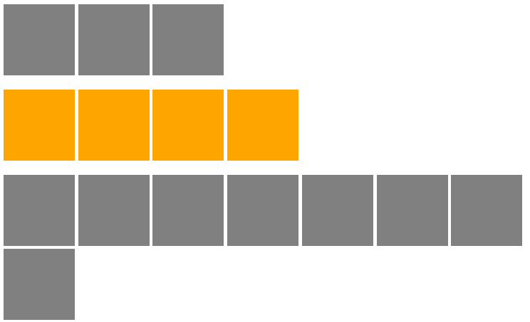

```javascript
li {
  list-style: none;
  width: 100px;
  height: 100px;
  background-color: gray;
  display: inline-block;
}

/*
  li:first-child:nth-last-child(4) 即是第一个又是倒数第四个
  li:first-child:nth-last-child(4) ~ li 它的所有后代li元素节点
*/
li:first-child:nth-last-child(4),
li:first-child:nth-last-child(4) ~ li {
  background-color: orange;
}

/* scss写法如下 */
@mixin n-items($n) {
  &:first-child:nth-last-child(#{$n}),
  &:first-child:nth-last-child(#{$n}) ~ & {
    @content;
  }
}

li {
  @include n-items(4) {
    background-color: yellow;
  }
}


<ul>
  <li></li>
  <li></li>
  <li></li>
</ul>

<ul>
  <li></li>
  <li></li>
  <li></li>
  <li></li>
</ul>

<ul>
  <li></li>
  <li></li>
  <li></li>
  <li></li>
  <li></li>
  <li></li>
  <li></li>
  <li></li>
</ul>
```

同理，可以利用这个技巧来实现列表项的总数大于等于4时选中所有列表:
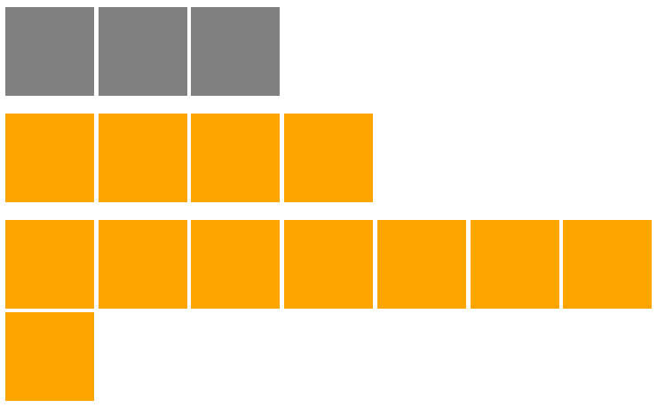

```javascript
li:first-child:nth-last-child(n+4),
li:first-child:nth-last-child(n+4) ~ li {
  background-color: orange;
}
```

或者，当列表项为2~6时，选中整个列表：

```javascript
li:first-child:nth-last-child(n+2):nth-last-child(-n+6),
li:first-child:nth-last-child(n+2):nth-last-child(-n+6) ~ li {
  background-color: orange;
}
```
