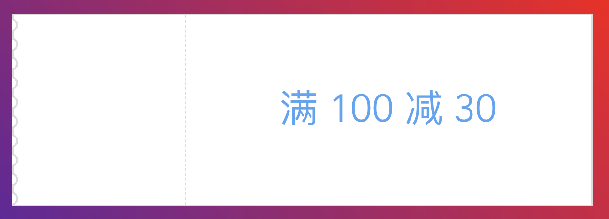
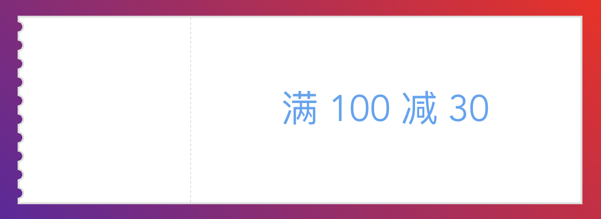

[之前](/2019/11/20/css-voucher/)通过 `radial-gradient` 实现过一个优惠券样式，但是该方案并不完美，一旦优惠券的背景不是纯色的话就无能为力了：



那就继续改进吧

# 锯齿部分剖析
参考之前的思路，锯齿部分仍然可以看做是几个图形片段组合而成，而每一个小的图形片段又可以分解成两部分：


这样我们可以用 `before` 和 `after` 两个伪元素分别来绘制这两部分。之前的锯齿部分是在父元素内的，现在要往左移动一个锯齿宽度，即要伸出父元素外。完整的代码如下所示：

```scss
@mixin leftSawtoothBorder(
  $height, // 优惠券的高度
  $num, // 锯齿个数，最好可以整除高度
  $radius, // 锯齿的半径
  $bgColor, // 优惠券的背景
  $borderColor, // 优惠券边框颜色
  $borderWidth // 边框宽度
) {
  $segmentHeight: $height / $num;
  $extendedRadius: $radius + $borderWidth;
  height: $height;
  border: $borderWidth solid $borderColor;
  border-left: none;
  box-sizing: content-box;

  &::before {
    content: '';
    box-sizing: content-box;
    position: absolute;
    border-top: $borderWidth solid $borderColor; // 上下绘制边框接上父元素的边框
    border-bottom: $borderWidth solid $borderColor;
    height: 100%;
    width: $extendedRadius;
    left: -$extendedRadius; // 往左偏移一个锯齿宽度
    top: -$borderWidth; // 往上偏移边框的大小
    background-image: radial-gradient(
      circle at 0px $segmentHeight / 2,
      transparent $radius,
      $borderColor $radius,
      $borderColor $extendedRadius,
      $bgColor $extendedRadius
    );
    background-size: $extendedRadius $segmentHeight;
  }

  $h: ($segmentHeight - 2 * $extendedRadius) / 2;
  &::after {
    content: '';
    position: absolute;
    height: 100%;
    width: $borderWidth;
    left: -$extendedRadius;
    top: 0;
    background-image: linear-gradient(
      to bottom,
      $borderColor $h,
      transparent $h,
      transparent $h + 2 * $extendedRadius,
      $borderColor $h + 2 * $extendedRadius
    );
    background-size: $borderWidth $segmentHeight;
  }
}
```

# 最终效果



