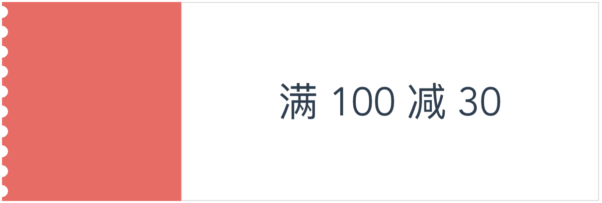
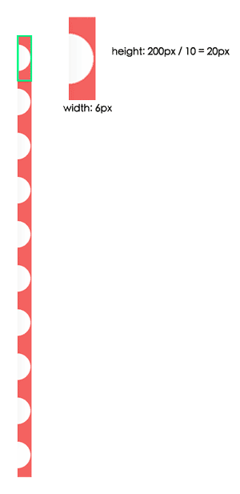
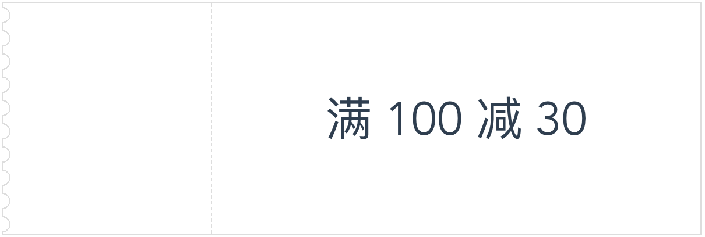
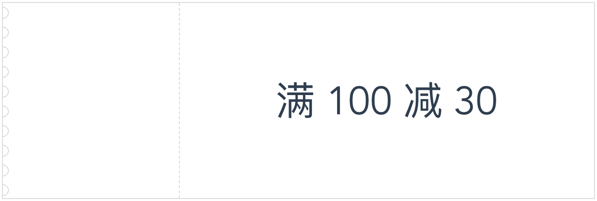

本文将介绍如何使用 css 中的 `radial-gradient` 实现如下图所示的优惠券样式效果：



# 绘制基本样式
首先，我们绘制出优惠券的基本样式，这很简单，就不多说了。

```html
<div class="voucher">
  <div class="left"></div>
  <div class="right">满 100 减 30</div>
</div>

/* scss */
.voucher {
  width: 600px;
  height: 200px;
  display: flex;
  .left {
    width: 30%;
    height: 100%;
    background-color: #f76260;
  }
  .right {
    height: 100%;
    border: 1px solid #ddd;
    flex: 1;
    display: flex;
    align-items: center;
    justify-content: center;
    font-size: 40px;
  }
}
```

# 锯齿实现剖析
锯齿部分其实可以看成是十个如下所示的图像片段拼接起来的。每个片段的宽为锯齿的半径 6px，高为 20px。所以我们只需要画出该片段，剩下的重复填充就好了。


我们把锯齿的样式加在 `voucher` 的伪元素上面就大功告成了：

```css
&::before {
  content: '';
  position: absolute;
  height: 100%;
  width: 6px;
  left: 0;
  top: 0;
  background-image: radial-gradient(circle at 0px 10px, white 6px, #f76260 6px);
  background-size: 6px 20px;
}
```

这里的核心代码是 `background-image: radial-gradient(circle at 0px 10px, white 6px, #f76260 6px);`。它其实是下面这种写法的简写方式：`background-image: radial-gradient(circle at 0px 10px, white 0, white 6px, #f76260 6px, #676260 100%);`，表示从 (0px, 10px) 的位置开始进行径向渐变，渐变的形状为圆形，从 0 到 6px 由 `white` 渐变成 `white`，也就是纯色; 6px 到图形边缘由 `#f76260` 渐变成 `#f76260`，也是纯色。

为了重用我们的锯齿样式代码，我们可以定义一个 scss 的 mixin：

```scss
/**
  * 为了实现比较好的效果，最好确保：
  * 1. $height 可以被 $num 整除
  * 2. 2 * $radius < $height / $num
  */
@mixin leftSawtooth($height, $num, $radius, $color, $bgColor) {
  $segmentHeight: $height / $num;
  height: $height;
  &::before {
    content: '';
    position: absolute;
    height: 100%;
    width: $radius;
    left: 0;
    top: 0;
    background-image:
      radial-gradient(circle at 0px $segmentHeight / 2, $bgColor $radius, $color $radius);
    background-size: $radius $segmentHeight;
  }
}
```

这样，用起来就很方便了：

```css
@include leftSawtooth(600px, 10, 6px, #f76260, white);
```

# 升级版


升级版的锯齿颜色和左边部分的背景颜色不一致，实现上会有些差异，不过思路还是一致的。

首先还是绘制出基本的样式：

```scss
.voucher {
  width: 600px;
  height: 200px;
  margin: 20px auto;
  display: flex;
  position: relative;
  border: 1px solid #ddd;
  .left {
    width: 30%;
    height: 100%;
    border-right: 1px dashed #ddd;
  }

  .right {
    height: 100%;
    flex: 1;
    display: flex;
    align-items: center;
    justify-content: center;
    font-size: 40px;
  }
}
```

然后，绘制锯齿部分。注意，这里圆的半径是空白部分5px加上1px的边框，所以背景片段绘制需要额外加一段渐变：

```css
background-image: radial-gradient(circle at 0px 10px,
  white 5px, /* 圆内的颜色是背景色 */
  #ddd 5px,
  #ddd 6px,
  transparent 6px /* 圆外的颜色是透明色 */
);
```

注意到我们把圆内的颜色设置为背景色，圆外的颜色设置为透明色，为什么要这样后面会有说明。现在的效果离目标已经越来越近了，不过还是有点出入：



解决办法是把伪元素往左移动一个边框大小的位置。这样半圆左边的线会被圆内的颜色覆盖，而其他地方因为是透明色，所以线会保留（这就是为什么要把圆内的颜色设置为背景色，圆外的颜色设置为透明色的原因了）。

完整的 `mixin` 如下所示：

```scss
@mixin leftSawtoothBorder($height, $num, $radius, $bgColor, $borderColor, $borderWidth) {
  $segmentHeight: $height / $num;
  $extendedRadius: $radius + $borderWidth;
  height: $height;
  border: $borderWidth solid $borderColor;
  &::before {
    content: '';
    position: absolute;
    height: 100%;
    width: $extendedRadius;
    left: -$borderWidth;
    top: 0;
    background-image: radial-gradient(circle at 0px $segmentHeight / 2,
      $bgColor $radius,
      $borderColor $radius,
      $borderColor $extendedRadius,
      transparent $extendedRadius
    );
    background-size: $extendedRadius $segmentHeight;
  }
}
```
