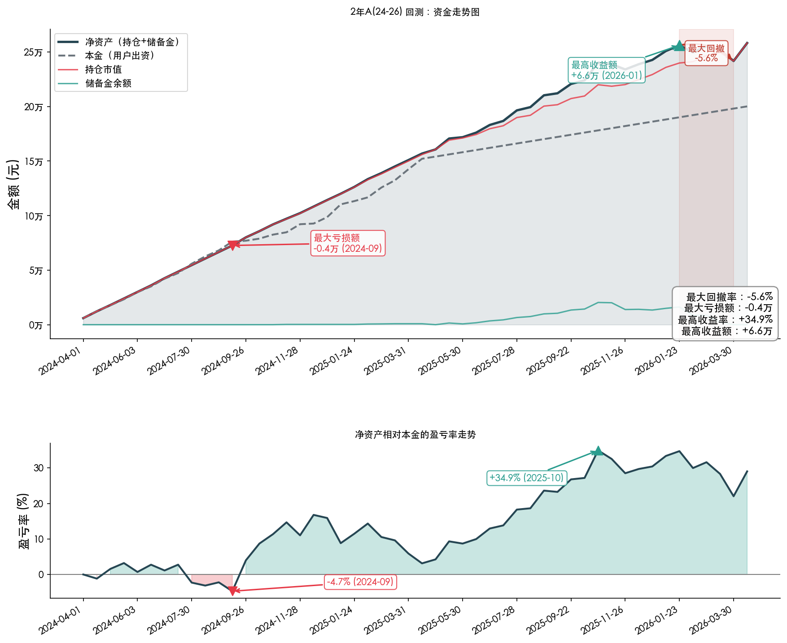

## 前言

定投是最适合普通人的投资方式。但"定期定额"有一个反直觉的问题：**涨了买一样多，跌了也买一样多，越涨越买越贵，越跌反而不敢加。**

这跟我们想要的恰好相反。理想状态应该是：涨多了少买点甚至卖一部分落袋为安，跌多了多买点摊低成本。

**恒定市值法**就是干这个的。它的核心思想是：给每只标的设一条线性增长的"目标市值线"，每期定投的金额不是固定的，而是**当前持仓市值与目标市值的差额**。涨了，持仓市值逼近目标，差额小，少投；跌了，持仓缩水，差额大，多投。用一个简单的公式就实现了"涨少投、跌多投"。

但光靠恒定市值法还不够。市场大涨的时候，你的持仓已经超过目标市值了，差额是负数，策略让你不投——可也没让你卖啊。大跌的时候，差额虽然大了，但你可能想更激进地加仓。这两种极端情况需要额外的机制来应对。

这篇文章就来设计一套完整的定投策略：用**恒定市值法**做基础，加上**网格收割**应对大涨、**大跌加码**应对大跌，最后拉真实历史数据做回测，看看这套策略在不同市场环境下到底表现如何。

## 一、标的选择与基础参数

先确定投什么。分散是定投的第一原则，所以选了三个市场的四只宽基指数 ETF：

| 市场 | 标的 | 权重 | 每期基准金额 |
|------|------|------|------------|
| A 股 | 沪深 300 ETF | 25% | 1,500 元 |
| A 股 | 中证 500 ETF | 25% | 1,500 元 |
| 港股 | 恒生指数 ETF | 10% | 600 元 |
| 美股 | 纳指 100 ETF | 40% | 2,400 元 |
| **合计** | | **100%** | **6,000 元** |

每两周投一次，每期总共 6,000 元。A 股平均分配各 25%，美股纳指 100 拿到最大权重 40%，港股恒生只占 10%。

这个配置的逻辑是：**纳指 100 长期趋势最确定，给最高权重；港股波动大、流动性弱，压缩到一成；A 股两只分散在大盘蓝筹和中小盘成长之间**。

恒定市值法的核心公式非常简单：

> **目标市值(n) = 基准金额 × n**
>
> **应投金额 = 目标市值(n) - 当前持仓市值**

用沪深 300 举个例子，走一遍前几期的操作：

| 期数 | 目标市值 | 持仓市值 | 应投金额 | 发生了什么 |
|------|---------|---------|---------|-----------|
| 第 1 期 | 1,500 | 0 | **1,500** | 初始买入 |
| 第 2 期 | 3,000 | 1,600（涨了） | **1,400** | 涨了，少投 100 |
| 第 3 期 | 4,500 | 2,700（跌了） | **1,800** | 跌了，多投 300 |
| 第 10 期 | 15,000 | 17,000（大涨） | **0** | 持仓已超标，不投 |

看到没？不需要你判断"现在该多投还是少投"，公式自动帮你做出正确的决定。涨了差额小，自然少投；跌了差额大，自然多投。

为了避免极端情况下单期投入过大（比如暴跌后差额可能到好几千），设了一个封顶：**常规应投不超过基准金额的 2.5 倍**。沪深 300 的基准是 1,500，那常规应投最多 3,750 元。

## 二、均线偏离度与行动梯度

恒定市值法解决了"涨少投、跌多投"的问题。但市场大涨大跌的时候，光靠调整投入金额还不够——大涨时需要卖一部分落袋为安，大跌时需要额外加码抄底。这些机制都需要一个"触发信号"。

用三套不同的指标会很复杂，所以统一用一个：**250 日均线偏离度**。

> **均线偏离度 = (当前价格 - 250日均线) / 250日均线**

250 个交易日大约是一年，跟定投的中长期视角匹配。不像 RSI 那样短期频繁震荡，信号更稳定，各大行情软件都能直接看到。偏离度为正说明市场偏热，为负说明市场偏冷。

算起来也很简单，看两个例子：

| 场景 | 当前价格 | 250日均线 | 偏离度 | 含义 |
|------|---------|----------|--------|------|
| 市场偏热 | 4.10 元 | 3.80 元 | **+7.9%** | 价格高于年线 8%，有点热了 |
| 市场偏冷 | 3.30 元 | 3.80 元 | **-13.2%** | 价格低于年线 13%，跌得不少 |

基于这一个指标，搭出一整套完整的行动梯度。从大跌到大涨，每个区间都有明确的操作：

| 偏离度 | 动作 | 说明 |
|--------|------|------|
| ≤ -26% | 三档加码（基准 × 100%） | 重度超跌，翻倍加仓 |
| -26% ~ -18% | 二档加码（基准 × 70%） | 中度超跌 |
| -18% ~ -8% | 一档加码（基准 × 40%） | 轻度超跌，小幅加仓 |
| -8% ~ +15% | 正常定投 | 市场正常，按恒定市值法操作 |
| +15% ~ +22% | 一档收割（超额 × 20%） | 轻度偏热，小比例收割 |
| +22% ~ +28% | 二档收割（超额 × 35%） | 中度偏热 |
| +28% ~ +40% | 三档收割（超额 × 50%） | 重度偏热，大比例收割 |
| > +40% | 清仓该标的 | 极端过热，全部卖出 |
| 回落至 < +5% | 解除冷却，恢复定投 | 市场降温，重新开始 |

这套参数有意设得比较**宽松**：收割线定在 +15%（而不是一涨就卖），清仓线定在 +40%，收割比例也只有 20/35/50%（而不是大刀阔斧地砍）。

这样做是为了**让趋势跑得更久**——涨的时候别跑太早，多吃一段上行；只有真正过热时才大力收割。代价是短期波动会大一点，但长期来看持仓更充分，复利效果更好。

执行的时候不需要主观判断"该不该卖""要不要加仓"——看偏离度，对照表格，照做就行。

下面把**网格收割**、**大跌加码**和**极端清仓**三个机制分别展开，示例表格的列与实际执行用的 Excel 记录表一致。

### 2.1 网格收割：大涨时部分落袋

**前提**：持仓市值必须已经超过目标市值（有超额部分），同时偏离度达到 +15% 以上。满足条件后，按偏离度档位卖出超出目标市值部分的一定比例，回收的资金进入**储备金池**。

以沪深 300 ETF（基准 1,500 元）为例，假设在一轮牛市中，不同阶段触发了不同档位的收割：

| 期数 | 目标市值 | 当前价格 | 250日均线 | 偏离度 | 持仓市值 | 常规应投 | 网格收割 | 实际操作 | 操作说明 |
|------|---------|---------|----------|--------|---------|---------|---------|---------|---------|
| 15 | 22,500 | 4.18 | 3.57 | +17.1% | 27,000 | 0 | -900 | **-900** | 一档收割（超额 4,500 × 20%） |
| 20 | 30,000 | 4.41 | 3.56 | +23.9% | 38,000 | 0 | -2,800 | **-2,800** | 二档收割（超额 8,000 × 35%） |
| 25 | 37,500 | 4.71 | 3.62 | +30.1% | 52,000 | 0 | -7,250 | **-7,250** | 三档收割（超额 14,500 × 50%） |

偏离度越高、超额越多，收割力度越大。随着牛市推进，从第 15 期的小幅收割 900 元到第 25 期的大笔收割 7,250 元。收割后的资金进入储备金池，留着大跌时用。

### 2.2 大跌加码：跌多了多买

偏离度跌破 -8%，在常规投入之外**额外**再加一笔钱。加码资金优先从储备金池支出，不够就从个人预留金出，两者都不够就按可用资金等比缩减，绝不借钱加码。安全阀：**单期单标的总投入（常规 + 加码）不超过基准金额的 5 倍**。

以中证 500 ETF（基准 1,500 元）为例，假设在一轮熊市中，不同阶段偏离度逐步加深：

| 期数 | 目标市值 | 当前价格 | 250日均线 | 偏离度 | 持仓市值 | 常规应投 | 加码金额 | 实际操作 | 操作说明 |
|------|---------|---------|----------|--------|---------|---------|---------|---------|---------|
| 12 | 18,000 | 7.00 | 8.00 | -12.5% | 16,000 | 2,000 | 600 | **2,600** | 跌了多投；一档加码（基准 × 40%） |
| 18 | 27,000 | 6.40 | 8.00 | -20.0% | 22,000 | 3,750 | 1,050 | **4,800** | 跌了多投；封顶(2.5倍)；二档加码（基准 × 70%） |
| 24 | 36,000 | 5.80 | 8.00 | -27.5% | 28,000 | 3,750 | 1,500 | **5,250** | 跌了多投；封顶(2.5倍)；三档加码（基准 × 100%） |

跌得越深，常规应投越大（但封顶在基准的 2.5 倍 = 3,750 元），加码金额也越大。熊市持续越久，每期投入的钱越多，不断在低位摊低成本。

### 2.3 极端清仓与冷却期

偏离度超过 **+40%**，说明市场已经严重过热，直接清仓该标的全部持仓，资金进入储备金池。清仓后进入冷却期，期间不做任何操作，等偏离度回落到 +5% 以下才恢复定投。

以纳指 100 ETF（基准 2,400 元）为例，看清仓 → 冷却 → 恢复的完整过程：

| 期数 | 目标市值 | 当前价格 | 250日均线 | 偏离度 | 持仓市值 | 常规应投 | 实际操作 | 操作说明 |
|------|---------|---------|----------|--------|---------|---------|---------|---------|
| 25 | 60,000 | 1.98 | 1.40 | +41.4% | 75,000 | 0 | **-75,000** | 清仓（偏离度 > +40%） |
| 26 | 62,400 | 1.92 | 1.40 | +37.1% | 0 | 0 | **0** | 冷却中，不操作 |
| 30 | 72,000 | 1.54 | 1.48 | +4.1% | 0 | 6,000 | **6,000** | 冷却解除，恢复定投；封顶(2.5倍) |

注意目标市值在冷却期间仍然递增（第 25 期 60,000 → 第 30 期 72,000），恢复时持仓为 0、差额巨大，常规应投直接封顶在 2.5 倍。这不需要特殊处理——封顶机制本身就是安全阀，而冷却期从 +40% 等到 +5% 以下的过程已经足够谨慎了。各标的的清仓判断是独立的——纳指 100 清仓了，不影响其他三只继续正常执行。

## 三、暂停投入与增量资金

当四只标的的**累计总投入达到 15 万元**时，停止常规定投。但网格收割和大跌加码仍然保留——涨了继续收割，跌了还能从储备金池加码。

暂停不是"这笔钱不要了"，而是"存量资金到位了，接下来看增量资金怎么安排"。

暂停后，假设每期还有 2,000 元的增量资金。这笔钱**全部进入储备金池**，平时不动。只有当某只标的均线偏离度跌破 -8%（触发大跌加码）时，才从储备金池拿钱出来加仓。

如果多只标的同时大跌，储备金不够怎么办？**按偏离度排序，最超卖的优先**。

举个例子，某一期储备金池有 8,000 元，两只标的同时触发加码：

| 标的 | 偏离度 | 需要加码 | 优先级 | 实际分配 | 剩余储备金 |
|------|--------|---------|--------|---------|-----------|
| 中证 500 | -22% | 1,050 元 | 先分配（跌更多） | **1,050 元** | 6,950 元 |
| 沪深 300 | -12% | 600 元 | 后分配 | **600 元** | 6,350 元 |

两只都拿到全额加码。但如果储备金只有 1,500 元呢？

| 标的 | 偏离度 | 需要加码 | 优先级 | 实际分配 | 剩余储备金 |
|------|--------|---------|--------|---------|-----------|
| 中证 500 | -22% | 1,050 元 | 先分配 | **1,050 元** | 450 元 |
| 沪深 300 | -12% | 600 元 | 后分配 | **450 元**（部分加码） | 0 元 |

储备金不足时，跌得更狠的中证 500 拿到全额，沪深 300 只能拿到剩余的 450 元。

整个增量阶段的逻辑就一句话：**平时攒子弹，暴跌时集中开火**。网格收割攒的钱 + 增量资金攒的钱，都在储备金池里等着，一旦大跌就集中部署，形成完整的"涨了收割攒钱 → 跌了加码花钱"的循环。

## 四、回测结果

用四只 ETF 的真实日线数据，每 10 个交易日取一个价格点，模拟两周一期的操作，回测了四段典型区间：

| 窗口 | 区间 | 期数 | 市场环境 |
|------|------|------|---------|
| 近2年（牛） | 2024-04 ~ 2026-04 | 50期 | A 股港股反弹，中小盘领涨 |
| 近2年（熊） | 2022-04 ~ 2024-03 | 49期 | A 股港股持续下跌，纳指逆势大涨 |
| 近5年 | 2021-04 ~ 2026-04 | 123期 | 完整牛熊周期，含 2022 年全球暴跌 |
| 近10年 | 2016-04 ~ 2026-04 | 244期 | 跨越多个完整牛熊，含贸易战、新冠、加息 |

### 4.1 整体收益

| 市场区间 | 已投入本金 | 净资产 | 收益率 | 年化收益率 |
|---------|-----------|--------|--------|-----------|
| 近2年（牛） | 200,082 | 258,152 | **+29.0%** | +14.2% |
| 近2年（熊） | 201,681 | 224,982 | **+11.6%** | +6.0% |
| 近5年 | 367,818 | 548,877 | **+49.2%** | +8.9% |
| 近10年 | 587,666 | 1,175,889 | **+100.1%** | +7.7% |

四个窗口全部正收益，包括那个 A 股港股全线下跌的近2年熊市。最差年化 6%，最好 14.2%。

"已投入本金"是实际买入股票的累计金额（不含储备金池里未花出去的部分）；"净资产"= 持仓市值 + 储备金池余额。

---

### 4.2 近2年牛市（2024-04 ~ 2026-04）：+29.0%

这段行情，按直觉应该是权重最高（40%）的纳指 100 贡献最大——结果不是，**中证 500 才是这段的赢家**。

| 标的 | 个股收益率 | 收割次数 | 加码次数 |
|------|-----------|---------|---------|
| 中证500 ETF | **+43.6%** | 11次 | 6次 |
| 沪深300 ETF | +26.3% | 5次 | 0次 |
| 恒生指数 ETF | +20.0% | 12次 | 1次 |
| 纳指100 ETF | +18.9% | 2次 | 0次 |

2024 年以来，A 股这轮反弹是中小盘主导的，中证 500 涨幅远超大盘蓝筹，恒生也借着港股的复苏贡献了一成。纳指 100 这段时间相对温吞，+18.9% 只是四只里最低的，而它占了组合四成权重。如果这两年只买纳指 100，组合整体收益会更低——分散配置这次是起了作用的。

策略在这段时间持续收割：中证 500 收割了 11 次，恒生收割了 12 次，两只 A 股合计触发收割 23 次，市场每往上走一段，就卖掉一部分锁定利润，进入储备金池。

净资产在 **2025-10-29 到达阶段高点 +34.9%**，之后 2026 年初略有回调（最大回撤 5.6%），最终以 +29.0% 收官。全程没有深度套牢，最大账面亏损仅 0.36 万（发生在 2024-09，刚开始没多久），当月就恢复正收益了。

---

### 4.3 近2年熊市（2022-04 ~ 2024-03）：+11.6%

这是最难的窗口，也是最能说明问题的一段。

2022 年，美联储激进加息，全球风险资产集体下跌。A 股和港股没有躲掉：

| 标的 | 个股收益率 | 收割次数 | 加码次数 |
|------|-----------|---------|---------|
| 沪深300 ETF | -7.8% | 0次 | 11次 |
| 中证500 ETF | -10.4% | 0次 | 5次 |
| 恒生指数 ETF | -6.6% | 0次 | 11次 |
| 纳指100 ETF | **+49.7%** | 6次 | 9次 |

三只亏损，组合整体却赚了 +11.6%，原因只有一个：**纳指 100 在这段逆势涨了 49.7%**，一己之力把另外三只的亏损全部盖过去。

这不是巧合，而是跨市场分散的本意：**A 股和美股的行情周期根本不同步**。A 股 2022 年跌，纳指 2022 年也跌（加息冲击）——但到了 2023 年，AI 浪潮推动纳指暴涨，而 A 股仍在低位横盘。正是这段时间差，让纳指 100 在 49 期里收割了 6 次、还额外加码了 9 次，边涨边锁利润。

与此同时，策略在 A 股三只持续下跌的时候，不断加码：沪深 300 加了 11 次，恒生也加了 11 次，中证 500 加了 5 次。账面在亏，但每次加码都是在更低的价格买入更多份额，为后来的反弹埋下伏笔。

**这两年最难熬的时刻：** 2022-11-01 账面浮亏 0.47 万，亏损率 -4.9%。只是那一个月，后来就回来了。盈亏率图里那段短暂的红色，是这段熊市唯一一次真正"亏钱"的时刻。

---

### 4.4 近5年（2021-04 ~ 2026-04）：+49.2%

五年覆盖了一个完整的牛熊周期，把策略的每一个机制都测试到了。

**最艰难的时刻在 2022-10-13。** 账面浮亏 3.01 万，亏损率 -15.2%。这是四个窗口里绝对亏损金额最大的一次，那时已经累计投入了约 20 万，持仓市值只有约 17 万，实实在在亏了 3 万。

那段时间发生了什么：2021 年下半年 A 股高位开始调整，2022 年美联储加息叠加俄乌战争，全球资产同步暴跌，纳指 100 那年也跌了超过 30%。策略面临的是四只全部亏损、没有任何对冲的至暗时刻。

但策略没有停。A 股和港股的偏离度深跌，加码机制持续买入，恒生指数一共触发了 12 次加码，在最便宜的价格积累份额。跌得越惨，买得越多。

| 标的 | 个股收益率 | 收割次数 | 加码次数 |
|------|-----------|---------|---------|
| 纳指100 ETF | **+78.4%** | 14次 | 1次 |
| 中证500 ETF | +39.9% | 4次 | 3次 |
| 恒生指数 ETF | +27.7% | 4次 | 12次 |
| 沪深300 ETF | +17.6% | 0次 | 3次 |

从 2022 年 10 月谷底到 2026 年 1 月峰值，净资产从不到 17 万涨到了 **50.6 万**（2026-01-28 最高收益额 +19.3 万，+53.8%），最终收官 +49.2%。

---

### 4.5 近10年（2016-04 ~ 2026-04）：净资产翻倍

十年是时间跨度最长的窗口。覆盖了 2018 年中美贸易战、2020 年新冠暴跌、2022 年全球加息三次大的市场冲击，也覆盖了两轮 A 股牛市和一轮科技大牛市。

先看最终结果：本金 58.8 万，净资产 117.6 万，**翻倍**，年化 7.7%。

**纳指 100 是十年里的绝对引擎。** 十年涨了 175.9%，触发了整整 39 次收割——平均每个季度就收割一次多。这些收割回来的利润不断进入储备金池，在后来的每次市场下跌中成为弹药。

| 标的 | 个股收益率 | 收割次数 | 加码次数 |
|------|-----------|---------|---------|
| 纳指100 ETF | **+175.9%** | 39次 | 0次 |
| 中证500 ETF | +48.1% | 13次 | 6次 |
| 沪深300 ETF | +32.9% | 15次 | 6次 |
| 恒生指数 ETF | +21.5% | 15次 | 2次 |

2022 年的大回撤是这十年里最大的净值波动：净资产从峰值跌了 **18.8%**（2022-01-04 到 2022-05-24）。但这里有个容易误解的地方——**净值回撤不等于亏损本金**。到了 2022 年，组合已经积累了多年浮盈，即使净值下跌 18.8%，账面仍然是盈利的。

十年里真正亏损本金最深的时刻，反而是 2018 年 12 月 27 日，账面亏损只有 0.48 万，亏损率 -2.4%——那时候总投入还小，所以绝对金额也小。

---

### 4.6 风险视角：最大亏损有多深？

很多人对定投的顾虑是"万一一直跌怎么办"。回测数据可以给一个具体答案：

| 窗口 | 最大净值回撤 | 最大账面亏损 | 亏损发生时间 |
|------|------------|-----------|------------|
| 近2年（牛） | -5.6% | **-0.36万** | 2024-09-10 |
| 近2年（熊） | -3.0% | **-0.47万** | 2022-11-01 |
| 近5年 | -7.8% | **-3.01万** | 2022-10-13 |
| 近10年 | -18.8% | **-0.48万** | 2018-12-27 |

"最大账面亏损"是净资产低于已投入本金的最大差值，也就是你最惨的时候实际亏了多少钱。

有几点值得注意：

**第一，净值回撤最大（18.8%）的窗口，账面亏损反而最小（0.48万）。** 这是因为 10 年窗口里的大回撤发生在 2022 年，那时组合已经是盈利状态，净值的大幅波动是在盈利区间内震荡，并没有亏到本金。

**第二，账面亏损最大（3.01万）的是5年窗口。** 2022 年 10 月，熊市最深处，确实是真实亏损了 3 万多。如果那时候撑不住割肉离场，就真的亏了。但策略的机制恰恰在那个时候最积极地买入——跌越深买越多，为后来的反弹积累了大量低位筹码。

**第三，最难的近2年熊市，最大亏损才 0.47 万。** 跨市场分散让组合在 A 股港股一起跌的时候，还有纳指 100 在对冲，账面亏损被压得非常浅。

---

### 4.7 结论

四段回测覆盖了不同长度、不同市场环境的周期，整套策略的表现可以归纳为：

- **熊市不深亏**——最难的近2年熊市，账面最多亏 0.47 万，跨市场对冲发挥了作用
- **牛市跟得住**——近2年牛市 +29%，收割机制边涨边锁利润，不踏空也不全跑
- **至暗时刻会过去**——5年窗口 2022 年底亏了 3 万，策略继续买入，两年后回本翻倍
- **时间越长越稳**——10年翻倍，年化 7.7%，39 次收割让纳指 100 的利润持续落袋

没有哪个策略能在所有市场环境下都赚钱，但这套策略做到了一件更重要的事：**让你在任何时候都知道该干什么**。不需要猜"现在是该加仓还是止损"，看偏离度，对照规则，照做就行。回测里那段 2022 年亏 3 万的至暗时刻，策略的答案是"继续买"——事后看，那是对的。

## 总结

整套策略的核心思路回顾：

1. **恒定市值法**做底层——目标市值线性增长，持仓多了少投，少了多投
2. **250 日均线偏离度**做信号——一个指标驱动所有决策，不用盯多个指标
3. **网格收割**应对大涨——超额部分按比例卖出，落袋为安（+15%/+22%/+28% 三档）
4. **大跌加码**应对大跌——额外投入，摊低成本（-8%/-18%/-26% 三档）
5. **极端清仓**应对过热——偏离度超 +40% 全部清仓，等冷却后再进场
6. **增量资金**进储备金池——平时攒子弹，暴跌时集中开火

这套策略的设计目标不是"跑赢大盘"，而是**让定投的执行有章可循**。什么时候该多投、什么时候该收割、什么时候该停手，全部有明确的数字标准，不需要临场做判断。

回测结果印证了这套设计：四段不同的市场环境下，策略始终有明确的操作指令，执行者不需要猜"现在该怎么办"。真正重要的不是历史数据上多赚了几个百分点，而是选一套你能坚持执行下去的规则。尤其是 2022 年那段亏损 3 万的至暗时刻——策略的指令是"继续买"，坚持下来的人，最终都回来了。
