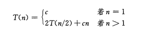

### 迭代式
《算法导论》上归并排序算法复杂度迭代式为：


### 通式推导
由此可以导出其通式，如下（分了分析方便，假设n是2的倍数）：

上面公式可以写成这样，这里的lg表示2为底的对数：
T(n)=2T(n/2)+cn
T(n/2)=2T(n/4)+c(n/2)
...
T(4)=2T(2)+c(n/(2^(lgn-2))
T(2)=2T(1)+c(n/(2^(lgn-1))

每行左右分别乘以1,2,4,8,…….2^(lgn-1)，然后左右等式分别相加，并消项，得到：
T(n)=2^(lgn)c+lgn*cn=cnlgn+cn=O(nlgn)

### 代码实现
```javasript
function dcSort(arr) {
  divide(arr,0,arr.length-1);
}

function divide(arr,p,r) {
  if (p<r) {
    var q = parseInt((p+r) / 2);
    divide(arr, p, q); // 分治
    divide(arr, q+1, r); // 分治
    merge(arr, p, q, r); // 合并
  }
}

function merge(arr, p, q, r) {
  var n1 = q-p+1;
  var n2 = r-q;
  var L = [];
  var R = [];
  for (var i=0;i<n1;i++) {
    L[i] = arr[p+i];
  }
  for (var j=0;j<n2;j++) {
    R[j] = arr[q+1+j];
  }
  L[n1] = 9999; // 设置一个极大值
  R[n2] = 9999; // 极大值
  i=0;
  j=0;
  for (var k=p;k<=r;k++) {
    if (L[i] <= R[j]) {
      arr[k] = L[i++];
    } else {
      arr[k] = R[j++];
    }
  }
}

var a = [5,4,3,2,1];
dcSort(a);
console.log(a); // [1,2,3,4,5]
```

