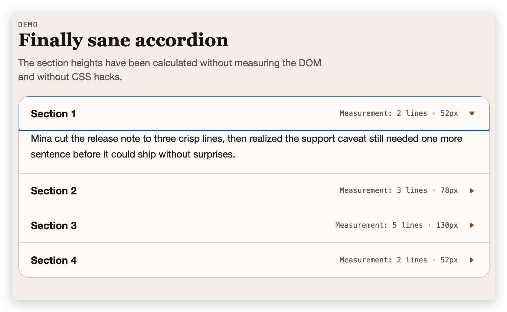
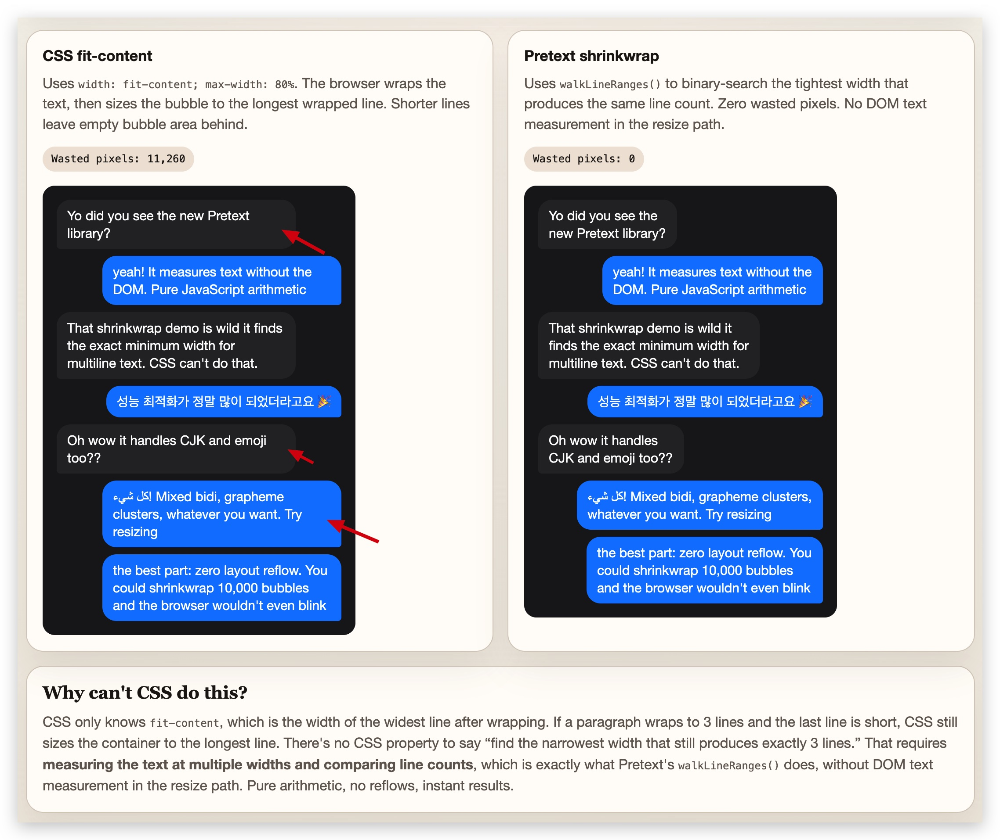
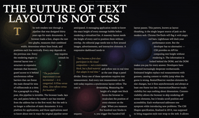
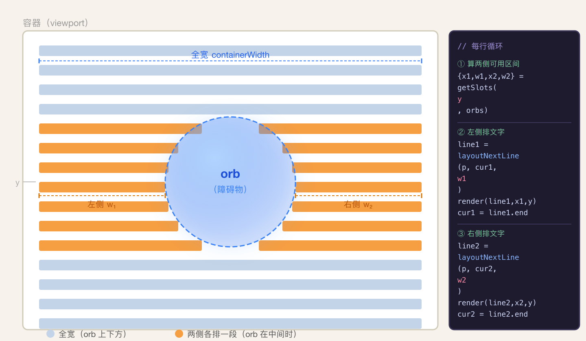

# 前言

做过虚拟滚动的同学应该都碰过这个问题：列表里的每一项高度不固定，有的一行，有的好几行，甚至还有图片、引用块。

虚拟滚动的核心是"提前知道每项的高度"，但文本高度偏偏不是一个你能直接算出来的值——它取决于字体、字号、行高、容器宽度，还有每个字符的实际渲染宽度。

传统的解决思路是**让浏览器帮你量**：把内容插入 DOM，离屏渲染，读 `offsetHeight`，然后再删掉。这个方法虽然不会影响视觉，但**只要元素在 document 里，读取 `offsetHeight` 就会触发"强制同步布局（Forced Synchronous Layout）"**——浏览器必须先把所有未提交的样式变更全部 flush、完成布局计算，才能返回值。这个代价跟元素在不在屏幕内无关。

[Pretext](https://github.com/chenglou/pretext) 的思路则是：**完全不碰 DOM**，用 canvas 的 `measureText` 测量字符宽度，再用纯算术模拟换行，在这些场景里是更自然的选择。

# 一、Pretext 是什么

[Pretext](https://github.com/chenglou/pretext) 的核心思路：

1. **用 canvas `measureText` 测量每个文本段的宽度** —— canvas 测量不触发 DOM layout
2. **自己实现换行算法** —— 根据容器宽度，模拟浏览器的换行行为
3. **缓存测量结果** —— 同字体下每个文本段只测量一次

API 分两层：

- **`prepare()` + `layout()`**：快速路径，只关心高度和行数
- **`prepareWithSegments()` + `walkLineRanges()` / `layoutNextLine()`**：富路径，可以拿到每一行的文本和宽度，用于自定义渲染

安装：

```bash
npm install @chenglou/pretext
```

最简单的用法：

```typescript
import {prepare, layout} from '@chenglou/pretext'

// 第一步：prepare —— 重活，只做一次
// font 参数要和页面 CSS 里实际渲染的字体完全一致
const prepared = prepare('AGI 春天到了 🚀', '16px Inter')

// 第二步：layout —— 轻活，resize 时反复调用也没关系
const {height, lineCount} = layout(prepared, containerWidth, 24) // lineHeight，单位 px
```

两个关键点：

- `font` 参数要和页面 CSS 里实际渲染的字体**完全一致**，否则测量结果会有偏差
- `prepare` 的结果可以复用：同一段文本在不同容器宽度下 `layout`，**不需要重新 `prepare`**

`prepare` 是重活（分词 + canvas 测量），`layout` 是轻活（纯数字加法）。根据仓库的 benchmark，500 条文本 `prepare` 约 **19ms**，同一批 `layout` 只要 **0.09ms**——差了 200 倍。具体原理第三章再展开。

# 二、官方 Demo

光说 API 太抽象，来看看实际能做什么。官方提供了三个 Demo，复杂度逐级递增，刚好对应 Pretext 的三层 API——从"只要高度"到"逐行精排"：

## 2.1 Accordion：在动画前算好高度

先上效果：



Accordion 展开/收起应该大家都写过：点击标题，内容区从 `height: 0` 动画过渡到完整高度。麻烦的是——你得先知道目标高度是多少。

CSS 的常规做法要么是先把 `height` 设为 `auto` 再读 `scrollHeight`（一写一读，reflow 跑不掉），要么是用 `max-height` 做过渡——但 `max-height` 设多少合适？设大了动画拖沓，设小了内容截断。总之都不太舒服。

而 Pretext 可以在渲染之前就把高度算好，不碰 DOM：

```typescript
import {prepare, layout} from '@chenglou/pretext'

// 1. 从 DOM 读一次计算字体（只在字体变化时读）
const font = getComputedStyle(copyEl).font
const lineHeight = parseFloat(getComputedStyle(copyEl).lineHeight)
const contentWidth = copyEl.getBoundingClientRect().width

// 2. prepare 所有文本（字体变化时重新 prepare）
const prepared = items.map((item) => prepare(item.text, font))

// 3. layout 得到每个面板的精确高度
for (let i = 0; i < items.length; i++) {
  const {height, lineCount} = layout(prepared[i], contentWidth, lineHeight)
  // 直接设置目标高度，动画一帧到位
  panel.style.height = isOpen ? Math.ceil(height + paddingY) + 'px' : '0px'
}
```

Demo 里还展示了每个面板测量到的行数和像素高度，可以实时验证结果的准确性。

这就是最基础的用法：`prepare()` + `layout()` 两步走，字符宽度只测量一次，换行逻辑纯算术，resize 时只需要重跑 `layout()` 就行。

## 2.2 Bubbles：找到气泡的最紧宽度

先上效果：



这个 Demo 叫 "Shrinkwrap Showdown"，听名字就知道——是来和 CSS 正面对比的。

做过聊天气泡的同学应该有体感：给气泡设 `width: fit-content; max-width: 80%`，看起来很合理，但实际效果经常不理想。我们来看看到底怎么回事。

`fit-content` 的计算过程是这样的：浏览器先算出文本不换行时的宽度（max-content），发现它超过了 `max-width`，于是**气泡宽度直接等于 `max-width`**。文本在这个宽度内换行，但换行发生在**单词边界**——最后一个放得下的单词右边界不太可能刚好顶到 `max-width`，所以最长行右边也会留出一截空白。更短的行就更不用说了。

整个气泡松松垮垮，浪费面积不少——Demo 里的 "Wasted pixels" 动辄上万。

你可能会想：那手动把宽度缩小不就贴合了？但缩多少是个问题。缩太多，行数就变了，气泡形状全乱；缩太少，空白还在。CSS 没有属性能表达"**找到最小宽度，使换行后行数不变**"——这需要在不同宽度下反复试算并比较行数，CSS 是声明式的，干不了这种迭代逻辑。

**Demo 左右两栏对比的就是 CSS 和 Pretext 两种方案：**

- **CSS `fit-content`（左侧）**：气泡宽度 = `max-width`，所有行右侧都有空白
- **Pretext Shrinkwrap（右侧）**：找到「保持相同行数的最小宽度」，再取最长行设为气泡宽度，零浪费

Demo 里有一个宽度滑块，可以拖动实时看两种方案的差异和 "Wasted pixels"。用 Pretext 方案，无论容器宽度怎么变，浪费像素始终是 0。

**Pretext 是怎么做到的？**

关键观察：宽度与行数是**单调关系**——越窄行数越多。先在 `max-width` 下换行拿到基准行数（比如 3 行），然后二分搜索：找到维持 3 行的最窄宽度。

`layout()` 又快又没副作用，试一万次也无所谓，天然适合二分。代码很简洁：

```typescript
import {prepareWithSegments, layout, walkLineRanges} from '@chenglou/pretext'

const prepared = prepareWithSegments(text, FONT)
const contentMaxWidth = bubbleMaxWidth - PADDING_H * 2

// 1. 先在 contentMaxWidth 下换行，拿到基准行数
const targetLines = layout(prepared, contentMaxWidth, LINE_HEIGHT).lineCount

// 2. 二分搜索：找到维持相同行数的最小宽度
let lo = 1,
  hi = Math.ceil(contentMaxWidth)
while (lo < hi) {
  const mid = Math.floor((lo + hi) / 2)
  if (layout(prepared, mid, LINE_HEIGHT).lineCount <= targetLines) hi = mid
  else lo = mid + 1
}

// 3. 在最紧宽度下遍历每行，取最长行宽度设为气泡宽度
let maxLineWidth = 0
walkLineRanges(prepared, lo, (line) => {
  if (line.width > maxLineWidth) maxLineWidth = line.width
})
bubble.style.width = Math.ceil(maxLineWidth) + PADDING_H * 2 + 'px'
```

注意这里用了 `prepareWithSegments()` 而不是 `prepare()`。二分搜索本身只需要 `layout()` 拿行数就够了，但最后一步要在最紧宽度下遍历每行拿到**实际行宽**，这就需要 `walkLineRanges()`——它逐行回调，每次传入包含 `width` 等信息的对象。这就是富路径的用武之地。

## 2.3 Editorial Engine：零 DOM 读取的全场景排版

先上效果：



前两个 Demo 还算"常规需求的优化"，这个就有点秀了。可以看到，图中的文字排版随着小球的运动一直在变化，那是怎么做到的呢？

核心思路是**逐行算出每行的可用区间，再用 `layoutNextLine()` 往里填文字**。



看这张示意图：蓝色行是 orb 上下方全宽可用的区域；橙色行是 orb 处于中间位置时、左右两侧各排一段文字的效果——两侧分别调用一次 `layoutNextLine()`，各自维护独立的文字游标。orb 是圆形，越靠近圆心截面越宽，所以两侧可用宽度沿 y 轴呈抛物线变化。右侧代码面板展示的就是每行循环的三步：算两侧区间 → 左侧排文字 → 右侧排文字。

orb 一旦移动，只需重新跑这个循环，文字就自动 reflow——因为所有计算都在 JS 里完成，不依赖 DOM，想跑多快跑多快。

代码的核心循环长这样：

```typescript
import {
  prepareWithSegments,
  layoutNextLine,
  type LayoutCursor,
} from '@chenglou/pretext'

const prepared = prepareWithSegments(bodyText, BODY_FONT)
let cursor: LayoutCursor = {segmentIndex: 0, graphemeIndex: 0}
let y = 0

while (true) {
  // 根据当前 y 坐标和障碍物（orb）计算这一行的可用区间
  const {x, width} = getAvailableSlot(y, obstacles)

  const line = layoutNextLine(prepared, cursor, width)
  if (line === null) break

  // 绝对定位渲染这一行
  const el = document.createElement('div')
  el.className = 'line'
  el.style.cssText = `top:${y}px; left:${x}px`
  el.textContent = line.text
  stage.appendChild(el)

  cursor = line.end // 从上一行的结尾继续
  y += BODY_LINE_HEIGHT
}
```

`layoutNextLine()` 每次调用返回一行的文本和结束游标，下一次从这个游标继续。因为每行的起点和宽度可以独立指定，文字可以绕开任何形状。实际 demo 里，当 orb 居中时同一行会有左右两个可用 slot，代码会对每个 slot 各调用一次 `layoutNextLine()`，左右两侧的文字共享同一个游标向前推进。

# 三、原理浅析

Demo 看完了，来瞅一眼源码，看看"不碰 DOM 算文本高度"到底是怎么做到的。

## 3.1 两阶段设计：贵的只做一次

整个库的核心思路是**把"贵的"和"便宜的"操作彻底分开**：

```
prepare(text, font)      ← 贵：分词 + canvas 测量，只做一次
    ↓
layout(prepared, width, lineHeight)  ← 便宜：纯数字加法，随便跑
```

`prepare` 阶段用 `Intl.Segmenter` 分词，把文本拆成一个个"段"（`["hello", " ", "world", "!"]` 这种粒度），再用 canvas 的 `measureText` 测量每段的像素宽度，存成一个数字数组。

`layout` 阶段完全不碰 Canvas，不碰 DOM，不做字符串操作——只是在那个数字数组上跑一个 `for` 循环，模拟浏览器的换行逻辑。这就是为什么 `layout` 能跑到 0.09ms/批的原因。

## 3.2 Canvas 只做一件事

Canvas 的使用极其克制，只用了 `measureText().width` 这一个值：

```typescript
// measurement.ts（简化）
function getSegmentMetrics(seg: string, cache: Map<string, SegmentMetrics>) {
  if (cache.has(seg)) return cache.get(seg)!
  const metrics = {
    width: ctx.measureText(seg).width, // ← 唯一的 Canvas 调用
    containsCJK: isCJK(seg),
  }
  cache.set(seg, metrics)
  return metrics
}
```

缓存是两级 Map：外层 key 是 font 字符串，内层 key 是 segment 文本。拿两次调用举例：

```
prepare('AGI 春天到了 🚀', '16px Inter')
prepare('Hello 世界', '14px Arial')
```

缓存结构：

```
Map {
  "16px Inter" => Map {
    "AGI"  => ???px,  // 次像素精度，因系统/字体渲染而异
    " "    => ???px,
    "春"   => ???px,
    "天"   => ???px,
    "到"   => ???px,
    "了"   => ???px,
    "🚀"   => ???px,
  },
  "14px Arial" => Map {
    "Hello" => ???px,
    " "     => ???px,
    "世"    => ???px,
    "界"    => ???px,
  },
}
```

英文按词、CJK 按字、空格和 emoji 各自独立。之后只要字体不变，任何文本里再出现 "春" 字就直接查 `"16px Inter"` 下的内层 Map 拿 16.0px，不再调 `measureText`。缓存没有自动淘汰，需要时可以手动调 `clearCache()` 释放。

## 3.3 换行算法：数字数组上的 for 循环

`layout` 的核心是 `countPreparedLinesSimple`，逻辑很直白——用 `lineW` 记录当前行已累积的宽度，逐段累加，超过 `maxWidth` 就换行：

```typescript
// line-break.ts（简化）
for (let i = 0; i < widths.length; i++) {
  const w = widths[i]!
  const newW = lineW + w

  if (newW > maxWidth + lineFitEpsilon) {
    if (isCollapsibleSpace(kinds[i])) continue // 行末空格"悬挂"，不计入宽度
    lineCount++
    lineW = w // 新行，从这个段开始
    continue
  }

  lineW = newW
}
```

这里有两个细节值得注意：

**行末空格悬挂**：CSS `white-space: normal` 规范里，行末空格不触发换行也不占宽度。代码里用 `lineEndFitAdvance`（判断是否溢出用）和 `lineEndPaintAdvance`（实际绘制宽度）两套值来区分，空格的 `lineEndFitAdvance = 0`，所以永远不会因为行末空格撑出一行。

**浮点容差 `lineFitEpsilon`**：不同浏览器的浮点比较行为不一样。Safari 用 `1/64 ≈ 0.0156`，Chrome/Firefox 用 `0.005`。Pretext 用 UA 识别（`getEngineProfile()`）来选容差，精确对齐各引擎的真实行为，而不是猜。

当一个单词本身比 `maxWidth` 还宽时（`overflow-wrap: break-word` 场景），会降级到逐字符强制换行——这时就用到了 `prepare` 阶段预先测量好的 `graphemeWidths`（每个字符的宽度数组），同样零 Canvas 调用。

## 3.4 CJK 的禁则处理

中文、日文每个字符都是潜在的断行点，但有"禁则"规则：行首不能是句号逗号，行尾不能是开括号。Pretext 在 `prepare` 阶段对 CJK 文本逐字展开，遇到违反禁则的相邻字符就合并：

```typescript
// analysis.ts（简化）
for (const gs of graphemeSegmenter.segment(cjkText)) {
  const g = gs.segment
  if (kinsokuStart.has(g)) {
    // 行首禁则字符（如"。"）：合并到前一段，不允许单独留在行首
    unitText += g
    continue
  }
  pushSegment(unitText) // 把积累的内容作为一个独立段
  unitText = g
}
```

`"AGI 春天到了。"` 经过这个处理后，变成 `["AGI ", "春", "天", "到", "了。"]`——"了。"合并在一起，因为"。"是行首禁则字符，不能换行后单独留在下一行。

## 3.5 一个有趣的 Emoji 修正

macOS 上，Chrome/Firefox 在小字号下，`canvas.measureText('😀').width` 会比 DOM 实际渲染宽度偏大（Apple Color Emoji 字体的 canvas 膨胀问题）。Safari 没有这个问题。

Pretext 的处理方式：用 emoji 对照一次 DOM 测量（`getBoundingClientRect`），算出偏差值，按 font 缓存，之后所有 emoji 的宽度都减去这个值。整个修正只触发一次 DOM 读取，之后全部走 Canvas。

# 总结

Pretext 做的事情一句话说完：**在 JS 里把浏览器的换行逻辑重新实现了一遍**，从此文本高度可以算，不用量。

三个 Demo 对应三层 API，复杂度依次递增：

| Demo             | API                                                       | 核心能力                             |
| ---------------- | --------------------------------------------------------- | ------------------------------------ |
| Accordion        | `prepare()` + `layout()`                                  | 算高度、数行数，resize 只跑 layout   |
| Bubbles          | `prepareWithSegments()` + `layout()` + `walkLineRanges()` | 二分出最紧气泡宽度，零空白           |
| Editorial Engine | `prepareWithSegments()` + `layoutNextLine()`              | 每行独立控制起点和宽度，绕任意障碍物 |

适合引入 Pretext 的场景：

- **虚拟列表 / 无限滚动**，列表项高度不固定，scrollTo 前要知道目标偏移量
- **Accordion / 展开收起**，需要在动画开始前算好目标高度
- **聊天气泡 Shrinkwrap**，想让气泡贴合文字不留空白
- **Canvas / WebGL 渲染文字**，根本没有 DOM 布局引擎
- **自定义编辑器 / 复杂排版**，需要精确控制每一行的起点和宽度

不适合的场景：普通静态页面、文本内容少、对高度精度要求不高的地方——直接读一次 `offsetHeight` 就够了，不值得引入。
