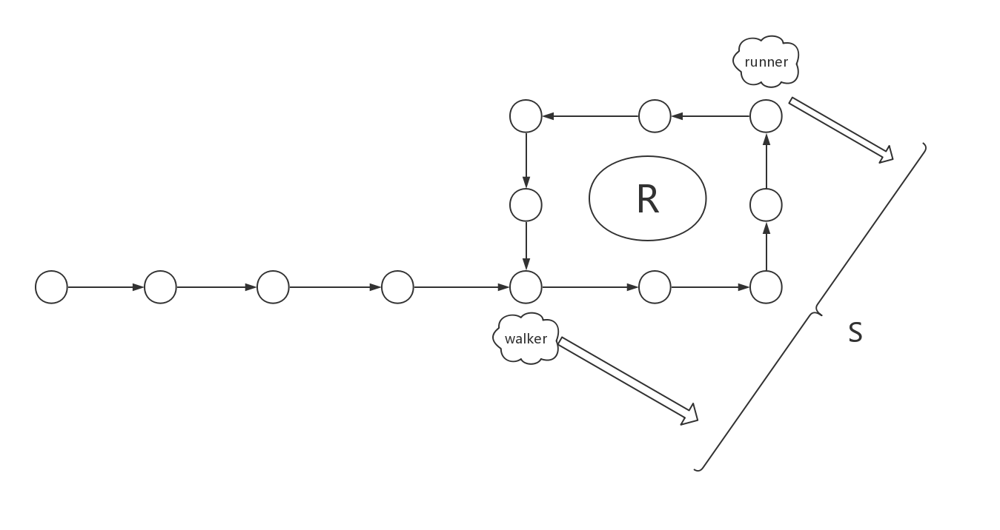

# 链表
* 循环列表
```go
type Node struct {
	Val int
	Next *Node
}

type LinkList struct {
	head *Node
}

func (l *LinkList) insert(node *Node)  {
	if l.head == nil { // 第一个节点
		l.head = node
		node.Next = l.head
		return
	}
	p := l.head
	for p.Next != l.head  { // 找到最后一个节点
		p = p.Next
	}
	p.Next = node
	node.Next = l.head
	l.head = node
}

func (l *LinkList) walk (fn func(*Node)) {
	p := l.head
	fn(p)
	for p.Next != l.head {
		p = p.Next
		fn(p)
	}
}

func main() {
	link := new(LinkList)
	link.insert(&Node{Val: 1})
	link.insert(&Node{Val: 2})
	link.insert(&Node{Val: 3})
	link.insert(&Node{Val: 4})
	link.insert(&Node{Val: 5})
	link.insert(&Node{Val: 6})
	link.walk(func(node *Node) {
		fmt.Println(node.Val)
	})
}

```

* 约瑟夫问题
  
人们站在一个等待被处决的圈子里。 计数从圆圈中的指定点开始，并沿指定方向围绕圆圈进行。 在跳过指定数量的人之后，执行下一个人。 对剩下的人重复该过程，从下一个人开始，朝同一方向跳过相同数量的人，直到只剩下一个人，并被释放。

问题即，给定人数、起点、方向和要跳过的数字，选择初始圆圈中的位置以避免被处决。

```go
func josephusProblem(n, m int) int {
	if m == 0 {
		return n
	}
	link := new(LinkList)
	for i := n; i > 0; i-- {
		link.insert(&Node{Val: i})
	}

	head := link.head
	var pre *Node
	cur := head
	for cur.Next != cur {
		for i := 0; i < m; i++ {
			pre = cur
			cur = cur.Next
    }
    fmt.Println(vur.Val) // 每次被处决的人
		pre.Next = cur.Next
		cur.Next = nil
		cur = pre.Next
	}
	return cur.Val // 最后留下的人
}
```

每次要遍历 m 个节点，一共需要 n - 1 次，复杂度为 O(m*n)

* LRU (Least Recently Used) 缓存
```go
type LRU struct {
	head *Node
	size int
	cap int
}

func (l *LRU) get(val int) *Node {
	if l.size == 0 {
		node := &Node{Val: val}
		l.head = node
		l.size++
		return node
	}
	var pre *Node
	var cur = l.head
	inCache := false
	for cur.Next != nil {
		if cur.Val == val {
			inCache = true
			break
		}
		pre = cur
		cur = cur.Next
	}

	if inCache {
		pre.Next = cur.Next
		cur.Next = l.head
		l.head = cur
		return cur
	} else {
		node := &Node{Val: val}
		node.Next = l.head
		l.head = node
		if l.size < l.cap {
			l.size += 1
		} else {
			pre.Next = cur.Next
			cur.Next = nil
		}
		return node
	}
}

func (l *LRU) walk (fn func(*Node)) {
	p := l.head
	fn(p)
	for p.Next != nil {
		p = p.Next
		fn(p)
	}
}

func NewLRU(cap int) *LRU {
	return &LRU{size: 0, cap: 3}
}

func main() {
	l := NewLRU(3)
	l.get(1)
	l.get(2)
	l.get(3)
	l.get(2)
	l.walk(func(node *Node) {
		fmt.Println(node.Val)
	})
}

```

* 链表反转

递归法：
```go
func reverseList(head *ListNode) *ListNode {
  if (head == nil) {
    return nil
  }
  h, _ := helper(head)
  return h
}

func reverseRest(head *ListNode) (*ListNode, *ListNode) {
  if head.Next == nil {
    return head, head
  }
  restHead, restTail := reverseRest(head.Next)
  head.Next = nil
  restTail.Next = head
  return restHead, head
}
```

迭代法：
```go
func reverseList(head *ListNode) *ListNode {
  if head == nil {
    return nil
  }
  if head.Next == nil {
    return head
  }
  var pre *ListNode
  cur := head
  for cur.Next != nil {
    prepre := pre
    pre = cur
    cur = cur.Next
    pre.Next = prepre
  }
  cur.Next = pre
  head = cur
  return head
}
```

* 检测链表中是否有环


以图片为例，假设环的长度为R，当慢指针 walker 走到环入口时快指针 runner 的位置如图，且二者之间的距离为S。在慢指针进入环后的t时间内，快指针从距离环入口S处走了2t个节点，相当于从环入口走了S+2t个节点。而此时慢指针从环入口走了t个节点。

假设快慢指针一定可以相遇，那么有S+2t−t=nR，即S+t=nR，如果对于任意的S，R，n，总可以找到一个t满足上式，那么就可以说明快慢指针一定可以相遇，满足假设。显然 n = 1， t = R - S 即可。即，慢指针都不用走一圈就可以相遇。

实现：

```go

```


# 栈
使用 go 实现一个栈跟别的语言有点不一样：
```go
type Stack []interface{}

func (stack *Stack) Push(item interface{}) bool {
	if len(*stack) == cap(*stack) {
		fmt.Println("full")
		return false
	}
	*stack = append(*stack, item)
	return true
}

func (stack *Stack) Pop() interface{} {
	if len(*stack) == 0 {
		fmt.Println("empty")
		return nil
	}
	top := (*stack)[len(*stack) - 1]
	*stack = (*stack)[:len(*stack) - 1]
	return top
}

...

func main() {
	s := make(Stack, 0, 3)
	s.Push(1)
	s.Push("a")
	fmt.Println(s.Pop())
	fmt.Println(s.Pop())
}
```

接下来，利用两个栈来实现简单的四则运算:

```go
var m map[string]int = map[string]int{
	"(": 0,
	")": 0,
	"+": 1,
	"-": 1,
	"*": 2,
	"/": 2,
}

func getResult(n1, n2 float32, symbol string) float32 {
	switch symbol {
	case "+":
		return n1 + n2
	case "-":
		return n1 - n2
	case "*":
		return n1 * n2
	case "/":
		return n1 / n2
	default:
		return n1
	}
}

func compute (arr []string) float32 {
	stack1 := make(Stack, 0, 10)
	stack2 := make(Stack, 0, 10)
	for _, s := range arr {
		// 运算符号放到 stack2
		if w, ok := m[s]; ok {
			// 当前栈顶运算符优先级不小于待处理符号则先进行运算
			for top, ok := stack2.Top().(string); ok && m[top] >= w; {
				if top == "(" && s == ")" {
					stack2.Pop()
					break
				}
				top, _ = stack2.Pop().(string)
				n1, _ := stack1.Pop().(float32)
				n2, _ := stack1.Pop().(float32)
				r := getResult(n2, n1, top)
				stack1.Push(r)
				top, ok = stack2.Top().(string)
			}
			if s != ")" {
				stack2.Push(s)
			}
		} else { // 数字放到 stack1
			n, _ := strconv.Atoi(s)
			stack1.Push(float32(n))
		}
	}
	for top, ok := stack2.Pop().(string); ok; {
		n1, _ := stack1.Pop().(float32)
		n2, _ := stack1.Pop().(float32)
		r := getResult(n2, n1, top)
		stack1.Push(r)
		top, ok = stack2.Pop().(string)
	}
	return stack1.Top().(float32)
}
```