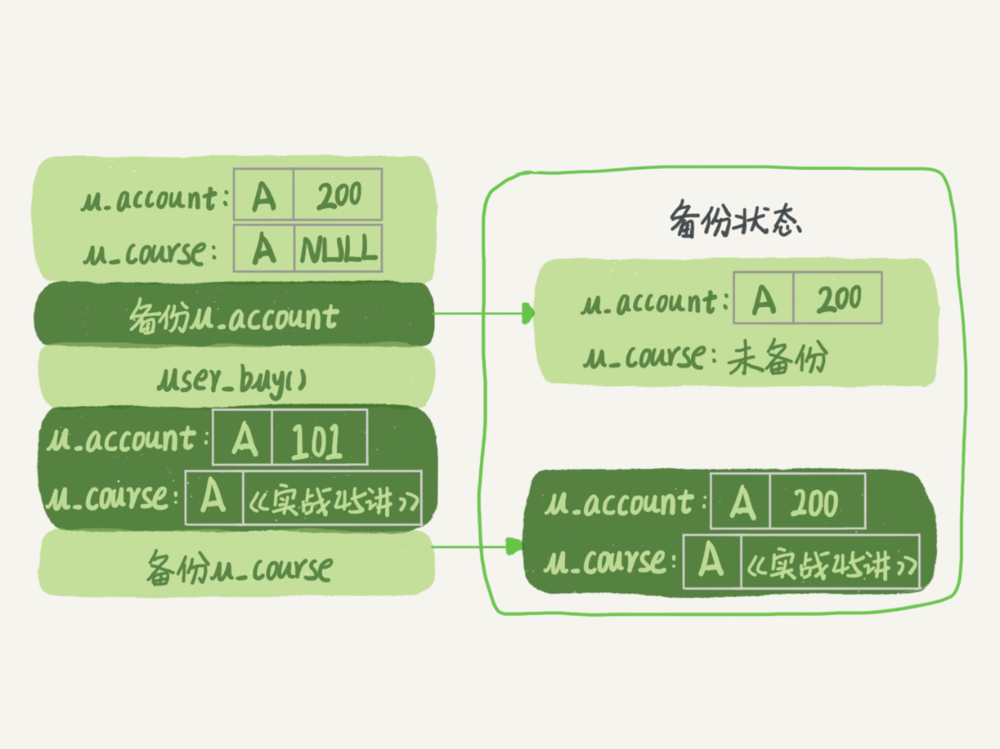

# 基础架构：一条 SQL 查询语句是如何执行的？
## 基本架构图


总体来说，分为**Server层**和**存储引擎层**两部分。

Server 层：
* 连接器
* 查询缓存
* 分析器
* 优化器
* 执行器
* 所有内置函数
* 跨存储引擎的功能（存储过程、触发器、视图）

存储引擎层：
* 数据的存储和提取
* 默认 InnoDB


## 连接器
* 一个用户成功建立连接后，即使你用管理员账号对这个用户的权限做了修改，也不会影响已经存在连接的权限。修改完成后，只有再新建的连接才会使用新的权限设置。

* wait_timeout 控制连接时间

* 长连接、短连接，是否使用长连接和短连接是由客户端来决定的，服务端不会主动断开连接，除非到达了 wait_timeout 的时间

## 查询缓存
* 只要有更新操作，缓存就会被清空
* 8.0 去掉了该功能

## 分析器
* 词法分析，比如，判断列名是否正确
* 语法分析，语句是否合法

## 优化器
* 决定索引的使用
* 决定 join 的顺序

## 执行器
* 判断权限。为什么之前不先做？因为 sql 要操作的表不只是 sql 上的那些，比如有个触发器，得在执行器阶段才能确定。
* 调取引擎的接口获取数据

# 日志系统：一条 SQL 更新语句是如何执行的？
## redo log
* InnoDB 引擎特有
* WAL 技术（Write-Ahead Logging），先写日志，再写磁盘。
* write pos 当前写的位置
* checkpoint 是当前擦除的位置，write pos 到它之间的空间是可以写入的
* innodb_flush_log_at_trx_commit 设置为 1 表示每次事务的 redo log 都直接持久化到磁盘

## binlog
* 有两种格式：statement 格式的记 sql 语句，row 格式记录行的更新前后
* sync_binlog 设置为 1 表示每次事务的 binlog 都持久化到磁盘
* server 层
* 与 redo log 比较：
  * redo log 是 InnoDB 引擎特有，binlog 是 MySQL 的 Server 层实现的，所有引擎都可使用
  * redo log 是物理日志，记录的是“在某个数据页上做了什么修改”，binlog 是逻辑日志，记录的是这个语句的原始逻辑，比如“给 id = 2 这一行的 c 字段加 1”
  * redo log 是循环写的，空间固定会用完；binlog 是可以追加写入的。“追加写”是指 binlog 文件写到一定大小后会切换到下一个，并不会覆盖以前的日志。

## 更新数据流程
以该更新语句为例
```
update T set c=c+1 where ID=2;
```

更新流程为：


## 两阶段提交
这里将 redo log 的写入拆成了两个步骤：prepare 和 commit，即“两阶段提交”。

为什么需要两阶段提交？
1. 假设先写 redo log，再写 binlog。。假设在 redo log 写完，binlog 还没有写完的时候，MySQL 进程异常重启。由于我们前面说过的，redo log 写完之后，系统即使崩溃，仍然能够把数据恢复回来，所以恢复后这一行 c 的值是 1。而 binlog 里面没有这个数据，以后如果需要使用 binlog 来恢复数据的时候，就会少了这一次更新
2. 先写 binlog 后写 redo log。如果在 binlog 写完之后 crash，由于 redo log 还没写，崩溃恢复以后这个事务无效，所以这一行 c 的值是 0。但是 binlog 里面已经记录了“把 c 从 0 改成 1”这个日志。所以，在之后用 binlog 来恢复的时候就多了一个事务出来，恢复出来的这一行 c 的值就是 1，与原库的值不同。

**如果提交事务那一步奔溃了怎么办？**
利用 redo log 进行恢复的时候会根据事务 id 去检查 binlog 是否完整，如果完整会接受这个事务并自动提交。但是这样一来是不是都不用两阶段提交了，我每次恢复的时候都去检查就行了。个人认为这可能是一种优化吧，如果每次都去检查 binlog 就太低效率，而加上两阶段提交的步骤，进行恢复的时候只有当 redo log 没有提交的时候需要去检查 binlog。

# 事务隔离：为什么你改了我还看不见？
## 隔离级别
* 读未提交（read uncommitted）：一个事务还没提交，它做的变更就能被别的事务看到
* 读提交（read committed）：一个事务提交后，它做的变更才会被其他事务看到
* 可重复读（repeatable read）：一个事务执行过程中的数据总是一致的。
* 串行化（serializable）：对于同一行记录，读写都会加锁。后面的事务必须等待前面一个事务完成。

## 隔离级别举例说明

事务A|事务B
:----:|:----:
启动事务查询得到值1|启动事务
-|查询得到值1
-|将1改成2
查询得到值V1|-
-|提交事务B
查询得到值V2|-
提交事务A|-
查询得到值V3|-

* 读未提交：V1 的值为2。V2, V3 为2。
* 读提交：V1 的值为1。V2, V3 为2。
* 可重复读：V1, V2 的值为1。V3 为2。
* 串行化：V1、V2 值是 1，V3 的值是 2。

## 隔离级别实现
在实现上，数据库里面会创建一个视图，访问的时候以视图的逻辑结果为准。

在“可重复读”隔离级别下，这个视图是在事务启动时创建的，整个事务存在期间都用这个视图。
在“读提交”隔离级别下，这个视图是在每个 SQL 语句开始执行的时候创建的。
“读未提交”隔离级别下直接返回记录上的最新值，没有视图概念
而“串行化”隔离级别下直接用加锁的方式来避免并行访问。

不同时刻启动的事务会有不同的视图，如下图所示，对于视图 A，要得到 1，就必须将当前值依次执行图中的回滚操作得到。


要避免使用长事务，从而导致回滚记录过多。

## 如何避免长事务对业务的影响？
从应用开发端来看：
1. 确认是否使用了 set autocommit=0。这个确认工作可以在测试环境中开展，把 MySQL 的 general_log 开起来，然后随便跑一个业务逻辑，通过 general_log 的日志来确认。一般框架如果会设置这个值，也就会提供参数来控制行为，你的目标就是把它改成 1。
2. 确认是否有不必要的只读事务。有些框架会习惯不管什么语句先用 begin/commit 框起来。我见过有些是业务并没有这个需要，但是也把好几个 select 语句放到了事务中。这种只读事务可以去掉。
3. 业务连接数据库的时候，根据业务本身的预估，通过 SET MAX_EXECUTION_TIME 命令，来控制每个语句执行的最长时间，避免单个语句意外执行太长时间。（为什么会意外？在后续的文章中会提到这类案例）

从服务端来看：
1. 监控 information_schema.Innodb_trx 表，设置长事务阈值，超过就报警 / 或者 kill；
2. Percona 的 pt-kill 这个工具不错，推荐使用；
3. 在业务功能测试阶段要求输出所有的 general_log，分析日志行为提前发现问题；
4. 如果使用的是 MySQL  5.6 或者更新版本，把 innodb_undo_tablespaces 设置成 2（或更大的值）。如果真的出现大事务导致回滚段过大，这样设置后清理起来更方便。

## 启动方式
1. 显式启动事务语句， begin 或 start transaction。配套的提交语句是 commit，回滚语句是 rollback。
2. set autocommit=1。注意 set autocommit=0，这个命令会将这个线程的自动提交关掉。意味着如果你只执行一个 select 语句，这个事务就启动了，而且并不会自动提交。这个事务持续存在直到你主动执行 commit 或 rollback 语句，或者断开连接。


# 深入浅出索引
## 常见类型
* 哈希表
  **只适合等值查询**
  
* 有序数组
  支持二分法快速查找
  支持范围查询
  但是更新数据比较麻烦，所以只适合数据不经常变换的场景
* 二叉搜索树
  查询和更新都能保证 O(logn) 的复杂度
  一般用多叉，为了保证一个节点的大小刚好为一个数据块的大小

## InnoDB 的索引模型


如上图所示，两棵树分别表示主键 ID 的索引和字段 k 的索引。
主键索引的叶子节点存的是整行数据。
非主键索引的叶子节点内容是主键的值，即如果使用该索引查询数据，需要回表。

### 索引维护
如果插入的数据是递增的，则维护操作比较简单，往后追加即可。
如果插入的数据非递增，则还涉及到分页等操作。
所以这就是为什么推荐使用递增主键。另外主键长度越小，普通索引的叶子节点也越小，占用的空间也小。

## 重建索引
为什么要重建索引，因为索引可能在维护过程中导致数据数据页有空洞，重建索引会创建一个全新的索引，把数据按顺序插入，使得页面的利用率最高，索引更紧凑、更省空间。
对于上面的例子，重建索引可以这样写：
```
alter table T drop index k;
alter table T add index(k);
alter table T drop primary key;
alter table T add primary key(id);
```
但是，这样的话，前面 k 的索引重建就白做了，因为后面重建了主键索引。可以用一个语句代替：
```
alter table T engine=InnoDB
```
## 推测扫描行


假设有如上索引，我们执行：
```
select * from T where k between 3 and 5;
```
将会扫描多少行？

1. 在 k 索引上找到 k=3 的记录（这里还会扫描几个非叶子节点），取得 ID = 300；
2. 到 ID 索引树查到 ID = 300 对应的 R3；
3. 顺着 k=3 的记录在 k 索引上找到 k=5 的记录，取得 ID = 500；
4. 回到 ID 索引树查到 ID = 500 对应的 R4；
5. 在 k 索引树取下一个值 k = 6，不满足条件，结束。

## 覆盖索引
还是上面那句，如果执行：
```
select ID from T where k between 3 and 5;
```
因为 ID 的值已经在 k 索引树上了，因此可以直接提供查询结果，不需要回表。

问题：**在一个市民信息表上，是否有必要将身份证号和名字建立联合索引？**

我们知道，身份证号是市民的唯一标识。也就是说，如果有根据身份证号查询市民信息的需求，我们只要在身份证号字段上建立索引就够了。而再建立一个（身份证号、姓名）的联合索引，是不是浪费空间？如果现在有一个高频请求，要根据市民的身份证号查询他的姓名，这个联合索引就有意义了。它可以在这个高频请求上用到覆盖索引，不再需要回表查整行记录，减少语句的执行时间。

## 最左前缀原则
我们以 (name, age) 联合索引来说明：


上图表示索引项是按照索引定义里面出现的字段顺序排序的。

如果查询语句为 `where name like '张%'` 会匹配到 ID3 那条记录，然后向后遍历。

**建立联合索引的时候，如何安排索引内的字段顺序？**
有了 (a, b) 联合索引，一般就不用单独在 a 上建立索引了。所以，第一原则是，如果调整顺序可以少维护一个索引，那么这个顺序往往就是需要优先考虑采用的。
如果既有联合查询，又有基于 a、b 各自的查询呢？这个时候考虑的就是空间了。比如，name 字段是比 age 字段大的，那么创建 (name, age) 和 (age) 的索引会比创建 (age, nanme) 和 (name) 的索引要省空间。

## 索引下推
以下面这个语句为例：
```
mysql> select * from tuser where name like '张 %' and age=10 and ismale=1;
```

在 MySQL 5.6 之前，查询过程如下所示，即每条数据都需要回表：


而 MySQL 5.6 引入的索引下推优化，可以在索引遍历过程中先做判断：


## 题目
假设有下表：
```
CREATE TABLE `geek` (
  `a` int(11) NOT NULL,
  `b` int(11) NOT NULL,
  `c` int(11) NOT NULL,
  `d` int(11) NOT NULL,
  PRIMARY KEY (`a`,`b`),
  KEY `c` (`c`),
  KEY `ca` (`c`,`a`),
  KEY `cb` (`c`,`b`)
) ENGINE=InnoDB;
```
业务中有这样的两种语句：
```
select * from geek where c=N order by a limit 1;
select * from geek where c=N order by b limit 1;
```

问：'ca' 和 'cb' 这两个索引是否必要？

答：
假设数据表如下：

a|b|c|d
:----:|:----:|:----:|:----:
1|2|3|d
1|3|2|d
1|4|3|d
2|1|3|d
2|2|2|d
2|3|4|d

需要注意的是，**普通索引中是会自动按照主键来排序的**，所以
`c` 和 `ca` 的效果是一样的，先按 c 排序，再按 a 排序，最后按 b 排序：

c|a|b
:----:|:----:|:----:
2|1|3
2|2|2
3|1|2
3|1|4
3|2|1
4|2|3

所以 `ca` 可以去掉，`cb` 需要保留

# 全局锁和表锁 ：给表加个字段怎么有这么多阻碍？
## 全局锁
加锁语句： `Flush tables with read lock (FTWRL)`。

使用场景：**全库逻辑备份**，即把整库都 select 出来存成文本。

**备份为什么要加锁？**
假设有用户账户余额和用户所买课程表。如果时间顺序上是先备份账户余额表，然后备份用户课程表，备份期间不加锁会发生如下情况：




如果引擎支持可重复读的隔离级别，可以在备份的时候使用 `--single-transaction` ，这样不会锁表，数据可以正常更新

**为什么不用 `set global readonly=true`？**
1. 在有些系统中，readonly 的值会被用来做其他逻辑，比如用来判断一个库是主库还是备库。因此，修改 global 变量的方式影响面更大，我不建议你使用。
2. 在异常处理机制上有差异。如果执行 FTWRL 命令之后由于客户端发生异常断开，那么 MySQL 会自动释放这个全局锁，整个库回到可以正常更新的状态。而将整个库设置为 readonly 之后，如果客户端发生异常，则数据库就会一直保持 readonly 状态，这样会导致整个库长时间处于不可写状态，风险较高。

## 表级锁
加锁语句：`lock tables ... read/write`。可以用 unlock tables 主动释放，也可以在客户端断开的时候自动释放。lock tables 语法除了会限制别的线程的读写外，也限定了本线程接下来的操作对象。

另一类表级的锁是 MDL（metadata lock)。MDL 不需要显式使用，在访问一个表的时候会被自动加上。MDL 的作用是，保证读写的正确性。你可以想象一下，如果一个查询正在遍历一个表中的数据，而执行期间另一个线程对这个表结构做变更，删了一列，那么查询线程拿到的结果跟表结构对不上，肯定是不行的。当对一个表做增删改查操作的时候，加 MDL 读锁，当对表结构做变更操作时，加 MDL 写锁。

## 如何给一个表加字段

先看一个例子：

sessionA|sessionB|sessionC|sessionD
:----:|:----:|:----:|:----:
begin;|-|-|-
select * from t limit 1;|-|-|-
-|select * from t limit 1;|-|-
-|-|alter table t add f int;(blocked)|-
-|-|-|select * from t limit 1;(blocked)

如上图所示，前面两个 session 都可以正常进行，因为都是加的 MDL 读锁，sessionC 由于要修改表字段，所以给表加了 MDL 写锁，会阻塞住后面所有的查询。通过查看当前连接也可以看到这一信息：


手动将 sessionA 提交后，后面的 session 都可以进行了。所以我们在修改表结构的时候要先解决掉正在进行中的事务。

一种比较好的方法是：
```
ALTER TABLE tbl_name WAIT N add column ...
```
这里的 N 单位是秒。

## 课后题目（不懂）
备份一般都会在备库上执行，你在用 –-single-transaction 方法做逻辑备份的过程中，如果主库上的一个小表做了一个 DDL，比如给一个表上加了一列。这时候，从备库上会看到什么现象呢？

备份过程中几个关键的语句：

```
Q1:SET SESSION TRANSACTION ISOLATION LEVEL REPEATABLE READ;
Q2:START TRANSACTION  WITH CONSISTENT SNAPSHOT；
/* other tables */
Q3:SAVEPOINT sp;
/* 时刻 1 */
Q4:show create table `t1`;
/* 时刻 2 */
Q5:SELECT * FROM `t1`;
/* 时刻 3 */
Q6:ROLLBACK TO SAVEPOINT sp;
/* 时刻 4 */
/* other tables */
```

1. 如果在 Q4 语句执行之前到达，现象：没有影响，备份拿到的是 DDL 后的表结构；
2. 如果在“时刻 2”到达，则表结构被改过，Q5 执行的时候，报 Table definition has changed, please retry transaction，现象：mysqldump 终止；
3. 如果在“时刻 2”和“时刻 3”之间到达，mysqldump 占着 t1 的 MDL 读锁，binlog 被阻塞，现象：主从延迟，直到 Q6 执行完成；
4. 从“时刻 4”开始，mysqldump 释放了 MDL 读锁，现象：没有影响，备份拿到的是 DDL 前的表结构。

# 行锁功过：怎么减少行锁对性能的影响
## 两阶段锁
**在 InnoDB 事务中，行锁是在需要的时候才加上的，但并不是不需要了就立刻释放，而是要等到事务结束时才释放。这个就是两阶段锁协议。**

**如果你的事务中需要锁多个行，要把最可能造成锁冲突、最可能影响并发度的锁尽量往后放。即要减少锁的时间**

## 死锁和死锁检测
如下图所示，事务A在等待事务B释放 id=2 的行锁，而事务B在等待事务A释放 id=1 的行锁，出现了互相等待，即死锁。

事务A|事务B
:----:|:----:
begin;update t set k=k+1 where id=1;|begin;
_|update t set k=k+1 where id=2;
update t set k=k+1 where id=2;|_
-|update t set k=k+1 where id=1;

有两种策略解决死锁：
1. 一种策略是，直接进入等待，直到超时。这个超时时间可以通过参数 innodb_lock_wait_timeout 来设置。
2. 另一种策略是，发起死锁检测，发现死锁后，主动回滚死锁链条中的某一个事务，让其他事务得以继续执行。将参数 innodb_deadlock_detect 设置为 on，表示开启这个逻辑。每个线程锁住之后都要判断死锁，所以这个时间复杂度是 O(n)，整个系统的时间复杂度就是 O(n^2) 了。因此你会看到 CPU 利用率很高，但是执行不了几个事务。

**怎么解决由这种热点行更新导致的性能问题呢？**
1. 关掉死锁检测，前提是能确保不会出现死锁，显然这种方法不合适
2. 控制并发度。基本思路就是，对于相同行的更新，在进入引擎之前排队。这样在 InnoDB 内部就不会有大量的死锁检测工作了。
3. 你可以考虑通过将一行改成逻辑上的多行来减少锁冲突。还是以影院账户为例，可以考虑放在多条记录上，比如 10 个记录，影院的账户总额等于这 10 个记录的值的总和。这样每次要给影院账户加金额的时候，随机选其中一条记录来加。这样每次冲突概率变成原来的 1/10，可以减少锁等待个数，也就减少了死锁检测的 CPU 消耗。当然余额变成 0 了再要减的时候也要特殊处理。

# 事务到底是隔离的还是不隔离的
## 例子
事务A|事务B|事务C
:---:|:---:|:---:
start transaction with consistent snapshot;|-|-
-|start transaction with consistent snapshot;|-
-|-|update k set k=k+1 where id=1;
-|update t set k=k+1 where id=1;select k from t where id=1;|_
select k from t where id=1;commit|-|-
-|commit;|-

1. 如果落在绿色部分，表示这个版本是已提交的事务或者是当前事务自己生成的，这个数据是可见的；
2. 如果落在红色部分，表示这个版本是由将来启动的事务生成的，是肯定不可见的；
3. 如果落在黄色部分，那就包括两种情况
  * 若 row trx_id 在数组中，表示这个版本是由还没提交的事务生成的，不可见；
  * 若 row trx_id 不在数组中，表示这个版本是已经提交了的事务生成的，可见。

