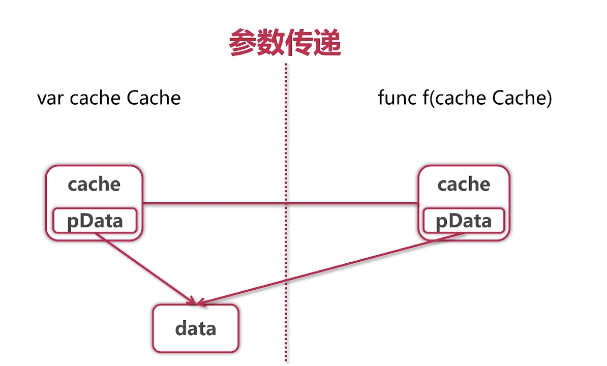
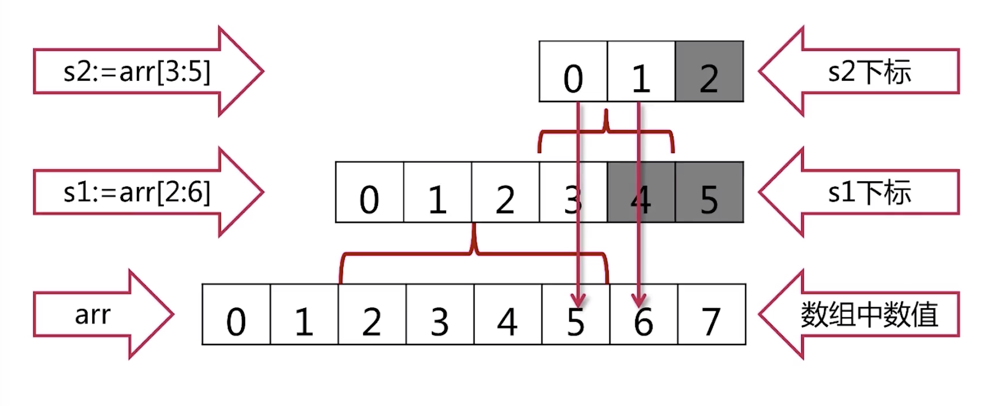
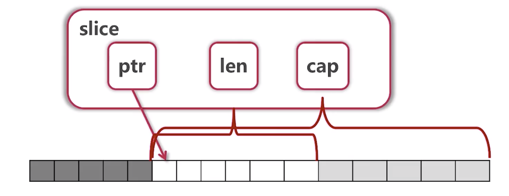

# 基础语法
## 变量定义
* var 定义，不赋值
```go
var a int
var s string
fmt.Printf("%d, %q", a, s) // 默认值 0, ""
```
* var 指定初值
```go
var a, b int = 1, 2
var c = 3 // 类型推断
```
* := （不能在函数外部使用）
```go
a, b := 1, 2
```
* var ()
```go
var (
  a = 1
  b = "abc"
)
```

## 内建变量类型

* bool
* string
* (u)int, (u)int8, (u)int16, (u)int32, (u)int64, uintptr
* byte
* rune 字符型，4 个字节，等于是 int32 , 至于为什么不是 unit32，可以参考(https://stackoverflow.com/questions/24714665/why-is-rune-in-golang-an-alias-for-int32-and-not-uint32)
* float32, float64, complex64, complex128

*没有类型隐式转换，必须强制转换，如：*
```go
a, b := 3, 4
var c int
c = int(math.Sqrt(float64(a*a+b*b)))
```

## 常量与枚举
* 常量
```go
const filename = "abc.txt"
const a, b = 3, 4 //! 可作为各种类型使用 c := math.Sqrt(a*a+b*b)
or
const (
  filename = "abc.txt"
  a, b = 3, 4
)
```

* 枚举 iota
```go
const (
  a = iota
  b
  c
)
fmt.Println(a, b, c) // 0 1 2
```
也可以跳过某一个
```go
const (
  a = iota
  _
  c
)
fmt.Println(a, c) // 0 2
```
也可以在表达式中使用
```go
const (
  b = 1 << (10 * iota)
  kb
  mb
  gb
  tb
  pb
)
```

上面的语句可以看成这样:
```go
const (
  b = 1 << (10 * iota) // iota 此时为 0
  kb = 1 << (10 * iota) // iota 此时为 1
  ...
)
```

## 条件语句
### if
* if 条件可以不要括号
* if 条件里可以赋值
```go
if contents, err := ioutil.ReadFile("./test.txt"); err == nil {
  fmt.Println(string(contents))
} else {
  fmt.Println(err)
}
```

### switch
* 会自动 break，除非使用 fallthrough
```go
func eval(a, b int, op string) int {
	var result int
	switch op {
	case "+":
		result = a + b
	case "-":
		result = a - b
	default:
		panic("unsupported: " + op)
	}
	return result
}
```

or

```go
func eval(a, b int, op string) int {
	var result int
	switch {
	case op == "+":
		result = a + b
	case op == "-":
		result = a - b
	default:
		panic("unsupported: " + op)
	}
	return result
}
```

### 循环
* 不需要括号
* 可以省略初始条件，结束条件，递增表达式
```go
func convertToBin(n int) string {
	result := ""
	for ; n > 0; n /= 2 {
		lsb := n % 2
		result = strconv.Itoa(lsb) + result
	}
	return result
}
```
* 没有 while
```go
for n > 0 {} // 相当于 while
```

## 函数
* 多返回值
```go
func div(a, b int) (q, r int) {
	return a / b, a % b
}

or

func div(a, b int) (q, r int) {
  q = a / b
  r = a % b
	return
}
```
* 匿名函数
* 可变参数
```go
func sum(numbers ...int) int {}
```

## 指针
```go
var a int = 2
var pa *int = &a
*pa = 3
fmt.Println(a)
```

* 指针不能运算
* 参数传递 值传递？引用传递？值传递！



## 数组、切片、容器

### 数组
* 数组定义
```go
	var arr1 [5]int
	arr2 := [3]int{1, 3, 5}
	arr3 := [...]int{2, 4, 6, 8, 10} // 没有 ... 的话就是切片了
	var grid [4][5]int

	fmt.Println(arr1, arr2, arr3)
	fmt.Println(grid)
```
* 数组遍历
```go
for i := 0; i < len(arr3); i++ {
  fmt.Print(arr3[i])
}
for _, v := range arr3 {
  fmt.Print(v)
}
```

*上面第二种方式中 v 涉及到闭包的时候是一个坑*，比如：
```go
type myFunc func()
var myFuncs = []myFunc{}
for _, v := range arr3 {
  myFuncs = append(myFuncs, func() {fmt.Println("name" + strconv.Itoa(v))})
  // 改成下面做法
  // f := v // 这里 f 每次循环都会重新定一个变量，是个块级作用域
  // myFuncs = append(myFuncs, func() {fmt.Println("name" + strconv.Itoa(f))})
}
for _, f := range myFuncs  {
  f()
}
// 打印的全是 name10
```

* 数组是值类型

```go
func changeArr(arr [5]int) {
	arr[0] = 100
	for i, v := range arr {
		fmt.Printf("%d-%d ", i, v) // 0-100 ...
	}
}
...
changeArr(arr3)
for i, v := range arr3 {
  fmt.Printf("%d-%d ", i, v) // 0-2 ...
}
```

调用函数的时候，传入的参数会做一个拷贝，可以通过传入指针的方式来实现上面的需求：

```go
func changeArr(arr *[5]int) {
	arr[0] = 100
	for i, v := range arr {
		fmt.Printf("%d-%d ", i, v) // 0-100 ...
	}
}
changeArr(&arr3)
```
### 切片
* 从数组得到切片
```go
	arr := [...]int{0, 1, 2, 3, 4, 5, 6, 7}
	fmt.Println("arr[2:6] = ", arr[2:6])
	fmt.Println("arr[:6] = ", arr[:6])
	fmt.Println("arr[2:] = ", arr[2:])
	fmt.Println("arr[:] = ", arr[:])
```

* 作为参数时的特性

```go
func updateSlice(s []int) {
	s[0] = 100
}
	arr := [...]int{0, 1, 2, 3, 4, 5, 6, 7}
	s1 := arr[2:]
	updateSlice(s1)
	fmt.Println(s1) // [100 3 4 5 6 7]
	fmt.Println(arr) // [0 1 100 3 4 5 6 7]
```

* reslice 切片上还可以生成切片

```go
	arr := [...]int{0, 1, 2, 3, 4, 5, 6, 7}
  s1 := arr[2:6]
	s2 := s1[3:5]
	fmt.Println(s1) // 2 3 4 5
	fmt.Println(s2) // 5 6 !!!! why
```



* 切片的实现




* 获取切片的长度和容量

```go
fmt.Printf("s1=%v, len(s1)=%d, cap(s1)=%d\n", s1, len(s1), cap(s1))
fmt.Printf("s2=%v, len(s2)=%d, cap(s2)=%d\n", s2, len(s2), cap(s2))
// s1=[2 3 4 5], len(s1)=4, cap(s1)=6
// s2=[5 6], len(s2)=2, cap(s2)=3
```

* 操作切片
```go
  // s3 没有超过 cap，与 s2 是同一个 array
  s3 := append(s2, 10)
  // s4 与 s5 是另外一个 array
	s4 := append(s3, 11)
	s5 := append(s4, 12)
  fmt.Println(s2, s3, s4, s5)
  // [100 6] [100 6 10] [1000 6 10 11] [1000 6 10 11 12]
```

