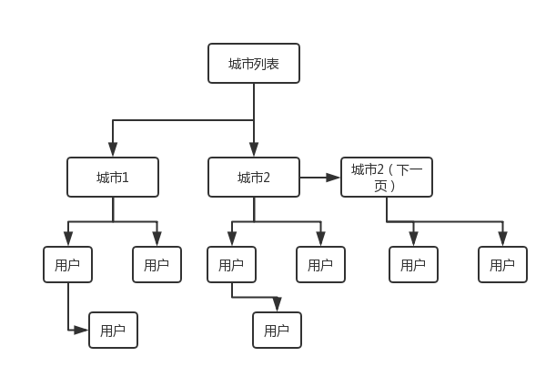
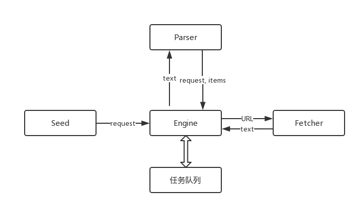
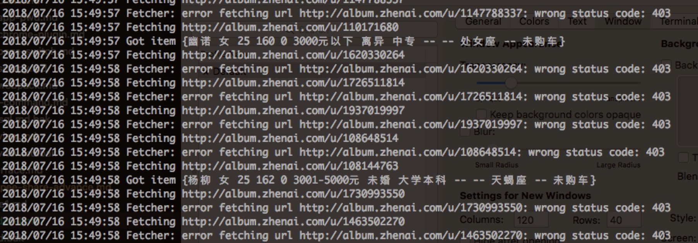

> 最近学习 Go 语言，打算写个爬虫，爬取相亲网站数据

# 网站分析
打开网页 `http://www.zhenai.com/zhenghun`， 这是一个城市列表，进入某个城市后可以看到用户列表（分页），点击用户可以进入用户详情，这个就是我们要爬取的数据。整个的爬取流程可以归结为下图：



# 热身
## 爬取网页并打印
先从简单的开始，让我们爬取网页，并打印出来：

```go
package main

import (
	"bufio"
	"fmt"
	"io"
	"io/ioutil"
	"net/http"

	"golang.org/x/net/html/charset" // determine type by 1024 bytes
	"golang.org/x/text/encoding"
	"golang.org/x/text/transform" // transfer Reader
)

// 根据文件内容来判断文件的编码格式
func determineEncoding(r *bufio.Reader) encoding.Encoding {
	bytes, err := r.Peek(1024)
	if err != nil {
		log.Panicf("Fetcher error: %s", err)
		return unicode.UTF8
	}
	e, _, _ := charset.DetermineEncoding(bytes, "")
	return e
}

func main() {
	resp, err := http.Get("http://www.zhenai.com/zhenghun")
	if err != nil {
		panic(err)
	}

	defer resp.Body.Close()

	if resp.StatusCode != http.StatusOK {
		fmt.Println("Error: status code", resp.StatusCode)
		return
	}

	bodyReader := bufio.NewReader(resp.Body)
	e := determineEncoding(bodyReader)
	utf8Reader := transform.NewReader(bodyReader, e.NewDecoder())
	all, err := ioutil.ReadAll(utf8Reader)
	if err != nil {
		panic(err)
	}
	fmt.Printf("%s\n", all)
}
```

注意到这里使用了一些第三方库来推测并转换编码格式。

## 正则表达式提取城市 url
拿到网页内容后，我们可以利用正则表达式来提取城市的 url:


```go
func printCityList(contents []byte) {
	re := regexp.MustCompile(`<a href="(http://www.zhenai.com/zhenghun/[0-9a-z]+)"[^>]*>([^<]+)</a>`)
	matches := re.FindAllSubmatch(contents, -1)
	for _, m := range matches {
		fmt.Printf("City: %s, URL: %s\n", m[2], m[1])
	}
	fmt.Printf("Matches found: %d\n", len(matches))
}
```

# 单任务版爬虫
热身结束，让我们来构建一个简单的单任务版爬虫。下面是单任务版爬虫的架构图：



1. 传入初始的种子到 `Engine` 中启动整个爬取过程，种子会被保存到任务队列中
2. `Engine` 从队列中拿出一个 `Request` 对象 `request`，将所要爬取的网页 URL 发送给 `Fetcher`, `Fethcer` 将网页下载下来给 `Engine`
3. 拿到 `Fetcher` 返回的网页文本后交给 `Parser`, `Parser` 从文本中提取出所要爬取的数据 `items`，或者根据需要提取出需要进一步访问的网页 url 并组装成 `Request` 对象
4. `Engine` 拿到返回的数据后，如果是 `items` 则保存下来，而如果是 `request`，则将其添加到任务队列中。然后重复 2 - 4 步，直到任务队列为空。

## 项目目录结构

```
├── engine
│   ├── simple.go
│   └── types.go
├── fetcher
│   └── fetcher.go
├── model
│   └── profile.go
└── zhenai
    └── parser
        ├── city.go
        ├── citylist.go
        ├── profile.go
├── main.go
```

### types
types 里面是用到的数据结构，如下所示：

```go
type Request struct {
	Url        string // 网页 url
	ParserFunc func([]byte) ParseResult // 网页的解析器
}

type ParseResult struct {
	Requests []Request // 解析器返回的需要继续爬取的 Request 数组
	Items    []interface{} // 解析器返回的目标数据，这里使用了 Go 中的“泛型”
}
```

### fetcher
fetcher 目录下是网页下载器，热身篇中有提到过，这里不赘述，不过实际爬取过程中加入了限制爬取速率的功能：

```go
...
var rateLimiter = time.Tick(100 * time.Millisecond)

// Fetch fetch body from url
func Fetch(url string) ([]byte, error) {
  <-rateLimiter
  ...
```

### model
model 中定义了目标数据的结构：

```go
package model

type Profile struct {
	Name       string
	Gender     string
	Age        int
	Height     int
	Weight     int
	Income     string
	Marriage   string
	Education  string
	Occupation string
	Hokou      string
	Xinzuo     string
	House      string
	Car        string
}
```

### parser
`zhenai/parser` 下面定义的是各网页对应的解析器，其中 `citylist` 用来解析城市列表页，`city` 用来解析单个城市页，`profile` 用来解析个人详情页。

*citylist*

```go
const cityListRe = `<a href="(http://www.zhenai.com/zhenghun/[0-9a-z]+)"[^>]*>([^<]+)</a>`

func ParseCityList(contents []byte) engine.ParseResult {
	re := regexp.MustCompile(cityListRe)
	matches := re.FindAllSubmatch(contents, -1)

	result := engine.ParseResult{}
	for _, m := range matches {
		result.Items = append(result.Items, "City "+string(m[2]))
		result.Requests = append(result.Requests, engine.Request{
			Url:        string(m[1]), // 单个城市页面的 url
			ParserFunc: ParseCity, // 单个城市页面对应的解析器
		})
	}

	return result
}
```

*city*

```go
const cityRe = `<a href="(http://album.zhenai.com/u/[0-9]+)"[^>]*>([^<]+)</a>`

func ParseCity(contents []byte) engine.ParseResult {
	re := regexp.MustCompile(cityRe)
	matches := re.FindAllSubmatch(contents, -1)

	result := engine.ParseResult{}
	for _, m := range matches { // every time, m is the same variable
		// every time, username is a new variable
		username := string(m[2])
		result.Items = append(result.Items, "User "+username)
		result.Requests = append(result.Requests, engine.Request{
			Url: string(m[1]),
			ParserFunc: func(contents []byte) engine.ParseResult {
				// fmt.Printf("Value: %d Value-Addr: %X\n", username, &username)
				// fmt.Printf("Value: %d Value-Addr: %X\n", m, &m)
				return ParseProfile(contents, username) // 把姓名字段传给个人详情页解析器
			},
		})
	}

	return result
}
```


*profile*

```go
var ageRe = regexp.MustCompile(`<td><span class="label">年龄：</span>(\d+)岁</td>`)
var heightRe = regexp.MustCompile(`<td><span class="label">身高：</span>(\d+)CM</td>`)
var weightRe = regexp.MustCompile(`<td><span class="label">体重：</span><span field="">(\d+)KG</span></td>`)
var genderRe = regexp.MustCompile(`<td><span class="label">性别：</span><span field="">([^<]+)</span></td>`)
var xinzuoRe = regexp.MustCompile(`<td><span class="label">星座：</span><span field="">([^<]+)</span></td>`)
var incomeRe = regexp.MustCompile(`<td><span class="label">月收入：</span>([^<]+)</td>`)
var marriageRe = regexp.MustCompile(`<td><span class="label">婚况：</span>([^<]+)</td>`)
var educationRe = regexp.MustCompile(`<td><span class="label">学历：</span>([^<]+)</td>`)
var occupationRe = regexp.MustCompile(`<td><span class="label">职业： </span>([^<]+)</td>`)
var hokouRe = regexp.MustCompile(`<td><span class="label">籍贯：</span>([^<]+)</td>`)
var houseRe = regexp.MustCompile(`<td><span class="label">住房条件：</span><span field="">([^<]+)</span></td>`)
var carRe = regexp.MustCompile(`<td><span class="label">是否购车：</span><span field="">([^<]+)</span></td>`)

func ParseProfile(contents []byte, name string) engine.ParseResult {
	profile := model.Profile{}

	profile.Name = name

	if age, err := strconv.Atoi(extractString(contents, ageRe)); err == nil {
		profile.Age = age
	}

	if height, err := strconv.Atoi(extractString(contents, heightRe)); err == nil {
		profile.Height = height
	}

	if weight, err := strconv.Atoi(extractString(contents, weightRe)); err == nil {
		profile.Weight = weight
	}

	profile.Gender = extractString(contents, genderRe)
	profile.Xinzuo = extractString(contents, xinzuoRe)
	profile.Income = extractString(contents, incomeRe)
	profile.Marriage = extractString(contents, marriageRe)
	profile.Education = extractString(contents, educationRe)
	profile.Occupation = extractString(contents, occupationRe)
	profile.Hokou = extractString(contents, hokouRe)
	profile.House = extractString(contents, houseRe)
	profile.Car = extractString(contents, carRe)

  // 没有需要继续访问的网页了，所以这里只返回 Items
	result := engine.ParseResult{
		Items: []interface{}{profile},
	}
	return result
}

func extractString(contents []byte, re *regexp.Regexp) string {
	match := re.FindSubmatch(contents)

	if len(match) >= 2 {
		return string(match[1])
	}

	return ""
}
```


### engine
该目录下面是爬虫引擎，目前只有一个单任务版 `SimpleEngine`：

```go
package engine

import (
	"log"

	"../fetcher"
)

type SimpleEngine struct {
}

func (e SimpleEngine) Run(seeds ...Request) {
	var requests []Request
	for _, r := range seeds {
		requests = append(requests, r)
	}

  // 每次循环从任务队列里面拿出一个 request 进行处理，直到其为空
	for len(requests) > 0 {
		r := requests[0]
		requests = requests[1:]

    // 下载网页内容并解析交给 worker 去做
		parseResult, err := worker(r)
		if err != nil {
			continue
		}
		requests = append(requests, parseResult.Requests...)

    // 暂时没有实现保存
		for _, item := range parseResult.Items {
			log.Printf("Got item %v", item)
		}
	}
}

func worker(r Request) (ParseResult, error) {
	log.Printf("Fetching %s", r.Url)
	body, err := fetcher.Fetch(r.Url)
	if err != nil {
		log.Printf("Fetcher: error "+"fetching url %s: %v", r.Url, err)
		return ParseResult{}, err
	}

	return r.ParserFunc(body), nil
}

```

说了这么多，最后我们来跑一跑吧：

```go
	e := engine.SimpleEngine{}
	e.Run(engine.Request{
		Url:        "http://www.zhenai.com/zhenghun",
		ParserFunc: parser.ParseCityList,
	})
```



# 总结
本文实现了一个简单的单任务版爬虫，整个爬虫的架构还是比较清晰易懂的。而且，通过自定义 parser，可以实现一个比较灵活的工作流。但是这个版本的爬虫爬取的效率很慢，远远达不到实际应用的需求。所以，借助 Go 语言独特的 goroutine，下一节我们要来实现一个多任务版本的爬虫。