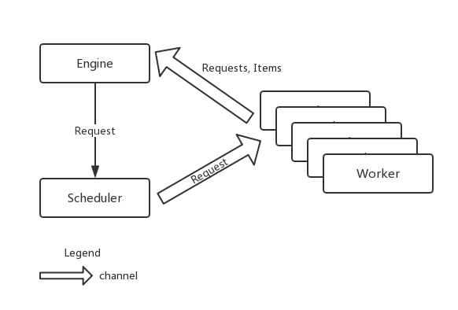
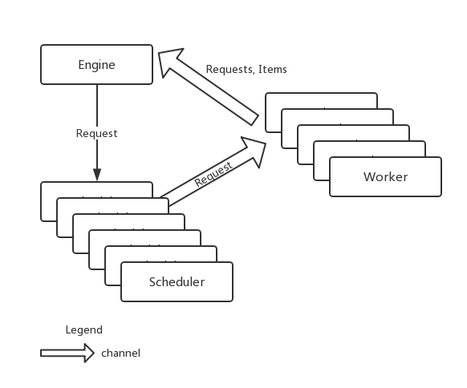
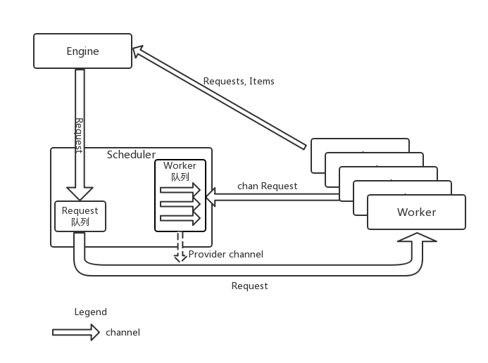

> 上一篇文章中构建了一个单任务版爬虫，这篇文章我们来构建一个并发版的爬虫

[项目代码](https://github.com/ParadeTo/imooc-go/tree/master/crawler)

# 并发版爬虫-简单调度器
## 项目架构
上一篇文章中我们定义了 `Parser` 和 `Fetcher` 的概念，最后实现的时候这两个模块的工作放在 `worker` 中，这里我们继续延续这个做法，只不过我们的 `Engine` 会创建多个 `worker`（对应多个 goroutine），同时我们引入 `Scheduler` 的概念，用于任务调度，`Engine` 得到的 `Request` 都会交给它来统一调度，如下图所示：



这里，`Scheduler` 和 `Worker` 之间，`Worker` 和 `Engine` 之间都是通过 channel 来通信。

## Scheduler
`Scheduler` 是一个接口，包含两个方法：

```go
type Scheduler interface {
	Submit(Request) // 提交 Request 给 Scheduler 进行调度
	ConfigureMasterWorkerChan(chan Request) // 配置 Scheduler 与 Worker 之间的 channel
}
```

一个简单的实现如下所示：

```go
import (
	"../engine"
)

type SimpleScheduler struct {
	workerChan chan engine.Request
}

func (s *SimpleScheduler) Submit(r engine.Request) {
	// 将 Request 发到 channel 里面
	s.workerChan <- r
}

func (s *SimpleScheduler) ConfigureMasterWorkerChan(c chan engine.Request) {
	s.workerChan = c
}
```

## Engine
并发版的 `Engine` 如下所示：

```go
type ConcurrentEngine struct {
	Scheduler   Scheduler // 所使用的调度器
	WorkerCount int // 所要启动的 worker 个数
}

func (e *ConcurrentEngine) Run(seeds ...Request) {
	in := make(chan Request)
	out := make(chan ParseResult)

	e.Scheduler.ConfigureMasterWorkerChan(in)

	for i := 0; i < e.WorkerCount; i++ {
		createWorker(in, out)
	}

	for _, r := range seeds {
		e.Scheduler.Submit(r)
	}

	for {
		result := <-out
		for _, item := range result.Items {
			log.Printf("Got item %v", item)
		}

		for _, r := range result.Requests {
			e.Scheduler.Submit(r)
		}
	}
}
```

## Worker
我们的 `Worker` 没有单独抽象成一个 struct，简单的使用 `createWorker` 来创建：

```go
func createWorker(in chan Request, out chan ParseResult) {
	go func() {
		for {
			// 从 channel 里拿 Request
			request := <-in
			result, err := worker(request)
			if err != nil {
				continue
			}
			// 将结果发送到 channel 中
			out <- result
		}
	}()
}
```

## 问题
一切就绪，让我们运行一下：

```go
func main() {
	e := engine.ConcurrentEngine{
		Scheduler:   &scheduler.SimpleScheduler{},
		WorkerCount: 3,
	}
	e.Run(engine.Request{
		Url:        "http://www.zhenai.com/zhenghun",
		ParserFunc: parser.ParseCityList,
	})
}
```

但是当我们运行后发现程序“卡”住了。

什么原因呢？然我们看看下面的代码：

```go
		for _, r := range result.Requests {
			e.Scheduler.Submit(r)
		}
```

```go
func (s *SimpleScheduler) Submit(r engine.Request) {
	// 将 Request 发到 channel 里面
	s.workerChan <- r
}
```

假设这里有 10 个 Request，因为我们只启动了 3 个 `Worker`，所以这里只可以提交 3 个，然后程序阻塞在这里无法往下运行，而三个 `Worker` 则会阻塞在下面代码所示的位置：


```go
			// 将结果发送到 channel 中
			out <- result
```

这样就造成了 `Engine` 中需要等待 `Worker` 来消费 Request，而 `Worker` 中需要等待 `Engine` 来消费解析得到的结果，从而形成了循环等待。

为了验证我的结论，将 `Worker` 的值调大一些再次尝试：

```go
	e := engine.ConcurrentEngine{
		Scheduler:   &scheduler.SimpleScheduler{},
		WorkerCount: 99999,
	}
```

结果程序可以正常运行。

## 解决循环等待
上一节我们分析了循环等待的主要问题在这里：

```go
for _, r := range result.Requests {
	e.Scheduler.Submit(r)
}
```

```go
func (s *SimpleScheduler) Submit(r engine.Request) {
	// 将 Request 发到 channel 里面
	s.workerChan <- r
}
```

为了不让 `e.Scheduler.Submit(r)` 阻塞程序的继续执行，我们很自然的会想到将 `Submit` 的代码放到 goroutine 中去执行，就像这样：

```go
func (s *SimpleScheduler) Submit(r engine.Request) {
  // 将 Request 发到 channel 里面
  go func() {
	  s.workerChan <- r
  }()
}
```

这样我们的架构图就如下所示：



这样，每提交一个 Request 就会创建一个 goroutine，这种方式虽然解决了循环依赖的问题，但是会源源不断地创建 goroutine，所以我们打算换一种实现方式。

# 并发版爬虫-带队列的调度器
## 项目架构


如图，这是一个新的架构。我们在调度器中维护了一个 `Request` 队列 和 一个 `Worker` 队列，其中 `Request` 队列用于存储从 `Engine` 提交过来的 Request。`Worker` 队列用于存储从 `Worker` 发送过来的 chan Request，这里的 chan Request 是一个 channel，该 channel 用于从 `Scheduler` 发送 Request 到 `Worker`。`Worker` 产生的数据最后会发送给 `Engine`。正如图中虚线表示的那样， `Worker` 队列中的 chan Request 最后成了 `Scheduler` 和 `Worker` 之间通信的 channel。

## Scheduler
对 Scheduler 接口做了一些调整，以便两个调度器可以共用一个接口。

```go
type Scheduler interface {
	ReadyNotifier
	Submit(Request)
	WorkerChan() chan Request
	Run()
}

type ReadyNotifier interface {
	WorkerReady(chan Request)
}
```

然后实现了一个 `QueueScheduler`:

```go
type QueueScheduler struct {
	requestChan chan engine.Request
	workerChan  chan chan engine.Request
}

func (s *QueueScheduler) WorkerChan() chan engine.Request {
	return make(chan engine.Request)
}

func (s *QueueScheduler) Submit(r engine.Request) {
	s.requestChan <- r
}

func (s *QueueScheduler) WorkerReady(w chan engine.Request) {
	s.workerChan <- w
}

func (s *QueueScheduler) Run() {
	s.workerChan = make(chan chan engine.Request)
	s.requestChan = make(chan engine.Request)

	go func() {
		var requestQ []engine.Request
		var workerQ []chan engine.Request
		for {
			var activeRequest engine.Request
			var activeWorker chan engine.Request
			if len(requestQ) > 0 && len(workerQ) > 0 {
				activeRequest = requestQ[0]
				activeWorker = workerQ[0]
			}

			select {
			// 有 Request 来，就存到 Request 队列中
			case r := <-s.requestChan:
				requestQ = append(requestQ, r)
			// 有准备好的 Worker 来，就存到 Worker 队列中
			case w := <-s.workerChan:
				workerQ = append(workerQ, w)
			// 要么就将 Request 发送给 Worker 去工作
			case activeWorker <- activeRequest:
				requestQ = requestQ[1:]
				workerQ = workerQ[1:]
			}
		}
	}()
}
```

## Engine
`Engine` 与之前差别不大，只是在 `createWorker` 的时候从 `Scheduler` 中生成了一个 channel 传入。

```go
func (e *ConcurrentEngine) Run(seeds ...Request) {
	out := make(chan ParseResult)

	e.Scheduler.Run()

	for i := 0; i < e.WorkerCount; i++ {
		createWorker(e.Scheduler.WorkerChan(), out, e.Scheduler)
	}

	for _, r := range seeds {
		e.Scheduler.Submit(r)
	}

	for {
		result := <-out
		for _, item := range result.Items {
			log.Printf("Got item #%d: %v", itemCount, item)
		}

		for _, r := range result.Requests {
			e.Scheduler.Submit(r)
		}
	}
}
```

## Worker
`Worker` 差别不大，增加了一行代码以便在每个 Worker 做完事情后通知 `Scheduler` 自己已准备好工作：

```go
func createWorker(in chan Request, out chan ParseResult, ready ReadyNotifier) {
	go func() {
		for {
			// tell scheduler i am ready
			ready.WorkerReady(in)

			request := <-in
			result, err := worker(request)
			if err != nil {
				continue
			}
			out <- result
		}
	}()
}
```