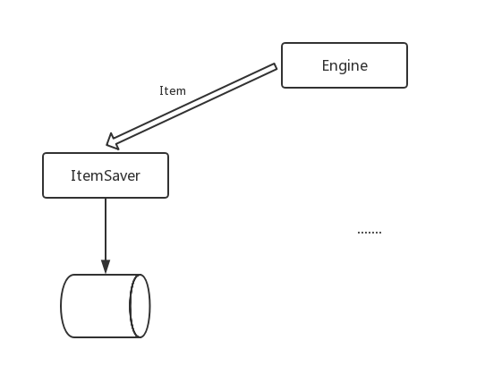

> 这篇我们来实现将我们爬取到的数据保存到 elasticsearch 中以供查询。
> 其实实际生产中的做法往往是将数据保存到 mysql 这样的传统数据库中，然后 elasticsearch 只是定期从这些数据库中同步数据，本文只是实验，故没有采取这种做法。

# 项目架构
还记得我们前面的项目架构图吗，原来的我就不放上来了，我们现在补充一下左边部分（好吧，我承认我把原图给弄丢了）：



# 实现 ItemSaver
我们新建一个 persit 目录，并创建 itemsaver 文件：

```go
package persist

import (
	"log"
	"gopkg.in/olivere/elastic.v5"
	"context"
	"../engine"
	"github.com/pkg/errors"
)

func ItemSaver(index string) (chan engine.Item, error) {
	client, err := elastic.NewClient(
		// Must turn off sniff in docker
		elastic.SetSniff(false))

	if err != nil {
		return nil, err
	}

	out := make(chan engine.Item)
	go func() {
		itemCount := 0
		for {
			item := <-out
			log.Printf("Item Saver: got item #%d: %v", itemCount, item)
			itemCount++

			err := save(client, index, item)
			if err != nil {
				log.Panicf("Item Saver: error saving item %v: %v", item, err)
			}
		}
	}()
	return out, nil
}

func save(client *elastic.Client, index string, item engine.Item) error {
	if item.Type == "" {
		return errors.New("must supply Type")
	}

	indexService := client.Index().
		Index(index).
		Type(item.Type).
		BodyJson(item)
	if item.Id != "" {
		indexService.Id(item.Id)
	}
	_, err := indexService.Do(context.Background())

	if err != nil {
		return err
	}

	return nil
}

```

`ItemSaver` 会创建一个 channel 并作为返回值，然后会启动一个 goroutine，不断从 channel 中获取数据并保存到 elasticsearch 中。

启动爬虫的时候，会将 `ItemSaver` 返回的 channel 传递给 `Engine`：

```go
e := engine.ConcurrentEngine{
  Scheduler:   &scheduler.QueueScheduler{},
  WorkerCount: 100,
  ItemChan:    itemChan,
  Deduplicate: engine.NewSimpleDeDuplicate(),
}
```

当 `Engine` 中得到 `Items` 数据的时候，会将它们发送到 `ItemChan` 中：

```go
for _, item := range result.Items {
  go func() { e.ItemChan <- item }()
}
```

# 总结
本文基于前面构建的爬虫框架，将爬取到的数据保存到 elasticsearch 中，代码还是比较直观的，但是 `ItemSaver` 中硬编码了 elasticsearch 的一些代码，这里可以抽象一下，使得我们的 `ItemSaver` 可以支持多个数据源。
