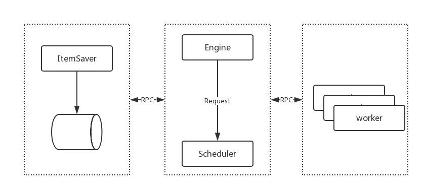

> 这篇我们来设计一下我们的分布式爬虫，并将我们的 itemSaver 抽离出来成为一个单独的服务


# 分布式爬虫架构


如果是我们的分布式爬虫架构，简单来说就是将之前的 `worker` `itemSaver` 抽象成单独的服务，然后爬虫引擎通过 RPC 与这些服务进行通信。有关 RPC 的概念，请[参考](/2018/08/15/go-rpc/)。

# 构建 ItemSaver 服务
## ItemSaverService
首先我们新建一个提供 item 保存功能的一个 `Service`：
```go
type ItemSaverService struct {
	Client *elastic.Client
	Index  string
}

func (s *ItemSaverService) Save(item engine.Item, result *string) error {
	log.Println(s.Client, s.Index, item)
	err := persist.Save(s.Client, s.Index, item)
	log.Printf("Item %v saved.", item)
	if err == nil {
		*result = "ok"
	} else {
		log.Printf("Error saving item %v: %v", item, err)
	}
	return err
}
```

## RPC Server
RPC 服务端会注册上面的 `Service` 然后监听某个端口，一旦有客户端连接则开始进行服务:

```go
func main () {
  client, err := elastic.NewClient(elastic.SetSniff(false))
	if err != nil {
		return err
	}

	return rpcsupport.ServeRpc(host, &persist.ItemSaverService{
		Client: client,
		Index:  index,
	})
}

func ServeRpc(host string, service interface{}) error {
	rpc.Register(service)
	listener, err := net.Listen("tcp", host)
	if err != nil {
		return err
	}

	for {
		conn, err := listener.Accept()
		if err != nil {
			log.Printf("accept error: %v", err)
			continue
		}

		go jsonrpc.ServeConn(conn)
	}
}
```

## RPC Client
RPC Client 是属于爬虫引擎的部分，他从引擎获取 item，然后通过 RPC 发送给 `ItemSaver`:
```go
func main () {
  itemChan, err := client.ItemSaver(fmt.Sprintf(":%d", config.ItemSaverPort))
	if err != nil {
		panic(err)
	}
	e := engine.ConcurrentEngine{
		Scheduler:   &scheduler.QueueScheduler{},
		WorkerCount: 100,
		ItemChan:    itemChan,
		Deduplicate: engine.NewSimpleDeDuplicate(),
	}
	e.Run(engine.Request{
		Url:        "http://www.zhenai.com/zhenghun/shanghai",
		ParserFunc: parser.ParseCity,
	})
}

// client/itemsaver
func ItemSaver(host string) (chan engine.Item, error) {
	client, err := rpcsupport.NewClient(host)
	if err != nil {
		return nil, err
	}

	out := make(chan engine.Item)
	go func() {
		itemCount := 0
		for {
			item := <-out
			log.Printf("Item Saver: got item #%d: %v", itemCount, item)
			itemCount++

			// call rpc to save item
			result := ""
			err = client.Call(config.ItemSaverRpc, item, &result)
			if err != nil {
				log.Panicf("Item Saver: error saving item %v: %v", item, err)
			}
		}
	}()
	return out, nil
}
```

# 总结
这一篇文章我们将 `ItemSaver` 单独抽离出来成了一个服务，好处是方便动态伸缩，缺点是数据交互通过网络传输，效率方面会有些牺牲。下一篇我们来构建 `worker` 服务。