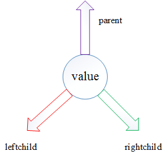
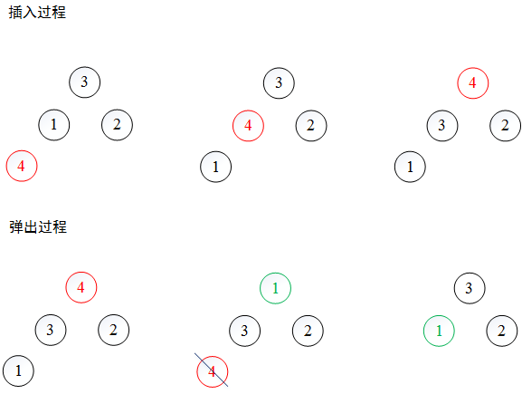
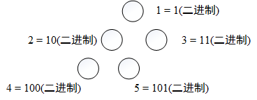

# 构建堆的树节点
用于构建堆的树节点需要有如下几个属性：
* value 值
* parent 指向父节点
* leftchild 指向左子节点
* rightchild 指向右子节点



# 堆
一个堆最重要的两个方法是：
* push 增加一个元素到堆尾，并沿着路径上行到合适位置
* pop 交换堆首尾元素，取出队尾元素，将堆顶元素下行到合适位置

## 示例


## 如何根据结点的序号快速的定位结点
在堆的两个方法``push`` ``pop``需要解决如何快速地寻找队尾元素，可以采取如下的方法：

如上图，若现在堆大小为4，则插入元素位置应该在5，其二进制101表示其路径为：根节点->左子树->右子树

# 代码实现
```c
#include <iostream>
#include <list>
using namespace std;

// 整数转二进制
list<int> BinaryVector(int n) {
	int temp;  
	temp=n;  
	list<int> L;  
	while(temp!=0)  
	{  
		L.push_front(temp%2);  
		temp=temp >> 1;  
	}  
	return L;
}

template<class T>
class treenode {
	public:
		treenode() ;
		treenode(T newelem){
			value = newelem;
			parent = leftchild = rightchild = NULL;
		}
		T value;
		treenode *parent, *leftchild, *rightchild;
};

template<class T>
class heap {
	public:
		heap() {
			root = NULL;
			size = 0;
		}
		~heap(){
		}
		bool push(T newelem);
		T pop();
		void recursion_inorder_traversal();
		void recursion_preorder_traversal();
	private:
		int size;
		treenode<T> *root;
		void _recursion_inorder_traversal(treenode<T> *p);
		void _recursion_preorder_traversal(treenode<T> *p);
};


// 中序遍历
template <class T>  
void heap<T>::_recursion_inorder_traversal(treenode<T> *p) {
	if (p==NULL) return;
	_recursion_inorder_traversal(p->leftchild);
	cout << p->value << ' ';
	_recursion_inorder_traversal(p->rightchild);
	return ;
}

template <class T>  
void heap<T>::recursion_inorder_traversal() {
	_recursion_inorder_traversal(root);
}

// 前序遍历
template <class T>  
void heap<T>::_recursion_preorder_traversal(treenode<T> *p) {
	if (p==NULL) return;
	cout << p->value << " ";
	_recursion_preorder_traversal(p->leftchild);
	_recursion_preorder_traversal(p->rightchild);
	return ;
}

template <class T>  
void heap<T>::recursion_preorder_traversal() {
	_recursion_preorder_traversal(root);
}

//  插入
template <class T>  
bool heap<T>::push(T newelem) {
	// 数量+1
	size += 1;
	// 创建一个节点
	treenode<T> *p = new treenode<T>(newelem);

	// 第一个节点为根节点
	if (size == 1) {
		root = p;
		return true;
	}

	// 插入到堆尾
	list<int> L = BinaryVector(size);
	list<int>::iterator iter=L.begin();
	treenode<T> *rec = root;
	for (iter++;iter!=L.end();iter++) {
		// 往左走
		if (*iter == 0) {
			if (rec->leftchild == NULL) {
				rec->leftchild = p;
				p->parent = rec;
				break;
			}
			rec = rec->leftchild;
		}
		// 往右走
		if (*iter == 1) {
			if (rec->rightchild == NULL) {
				rec->rightchild = p;
				p->parent = rec;
				break;
			}
			rec = rec->rightchild;
		}
	}

	// 上行
	while(p->parent != NULL && p->value > p->parent->value) {
		T tmp = p->value;
		p->value = p->parent->value;
		p->parent->value = tmp;
		p = p->parent;
	}
}

// 弹出
template <class T>  
T heap<T>::pop() {
	if(size == 0) {
		T nil;
		return nil;
	}


	T res = root->value;
	if (size == 1) {
		delete root;
		return res;
	}

	// 交换首尾元素并删除尾部
	list<int> L = BinaryVector(size);
	list<int>::iterator iter=L.begin();
	treenode<T> *rec = root;
	for (iter++;iter!=L.end();iter++) {
		// 往左走
		if (*iter == 0) {
			rec = rec->leftchild;
			// 到达了叶子节点
			if(rec->leftchild == NULL && rec->rightchild == NULL)
				rec->parent->leftchild = NULL;
		}
		// 往右走
		if (*iter == 1) {
			rec = rec->rightchild;
			// 到达了叶子节点
			if(rec->leftchild == NULL && rec->rightchild == NULL)
				rec->parent->rightchild = NULL;
		}
	}
	T tmp = rec->value;
	rec->value = root->value;
	root->value = tmp;
	delete rec;

	size -= 1;

	// 顶部元素下行
	L = BinaryVector(size);
	treenode<T> *p = root;
	for (iter=L.begin();iter!=L.end();iter++) {
		if (p->leftchild == NULL && p->rightchild == NULL) break;
		// 找到子树中较大的
		treenode<T> *maxChild;
		if (p->leftchild == NULL) {
			maxChild = p->rightchild;
		} else if (p->rightchild == NULL) {
			maxChild = p->leftchild;
		} else {
			maxChild = (p->leftchild->value > p->rightchild->value) ? p->leftchild : p->rightchild;
		}
		// 比较父节点与子节点中较大者并交换
		if (p->value < maxChild->value) {
			T tmp = p->value;
			p->value = maxChild->value;
			maxChild->value = tmp;
		}
		p = maxChild;
	}
	return res;
}


int main(int argc, char** argv) {

	heap<int> *h = new heap<int>();
	h->push(2);
	h->push(1);
	h->push(3);
	h->push(4);
	cout << "中序遍历" << endl;
	h->recursion_inorder_traversal();
	cout << endl;
	cout << "前序遍历" << endl;
	h->recursion_preorder_traversal();
	cout << endl;
	int a = h->pop();
	cout << endl;
	cout << a << endl;
	a = h->pop();
	cout << a << endl;
	a = h->pop();
	cout << a << endl;
	a = h->pop();
	cout << a << endl;

	return 0;
}
```

输出结果：
中序遍历
1 3 4 2
前序遍历
4 3 1 2

4
3
2
1
