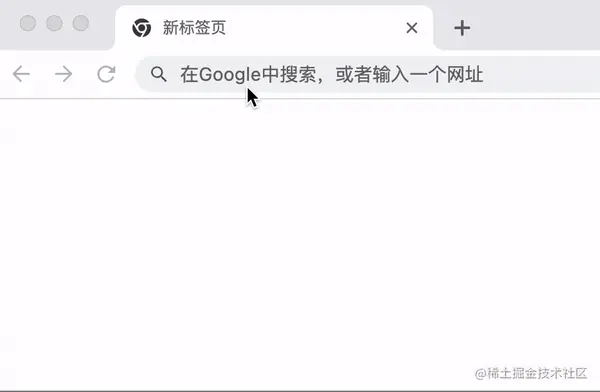

# 背景

某日，Leader 说：“给我们的 SSR 服务整一下流式渲染吧！”。听完我心想：这不是小弟已经研究过的玩意吗。所以果断回答 OK 没问题。

一天之后，本地修改完毕，部署到 Test 环境，开始验证！咦，返回的头部里面怎么没有 `Transfer-Encoding: chunked` 这个头部呀？鉴于我们的服务是部署在 Nginx 网关之后的，所以果断甩锅给运维，“怎么把我的头给弄丢了！”。

一番拉扯之后，运维甩过来一个链接：[Transfer-Encoding](https://developer.mozilla.org/en-US/docs/Web/HTTP/Headers/Transfer-Encoding)。意思就是，这不是我们的锅呀，这个是 HTTP2 的规定。

所以现在的问题总结下来就是：


问题原因知道了，那就面向 Google 开发呗，可以经过各种组合搜索后也没有找到相关的内容。没方法了，只能灰溜溜的跟 Leader 说做不了了。

但是这个问题一直萦绕在我脑海，害得我夜不能寐，饭不能食。毕竟，丢了的面子得找回来，而且不可能大家的服务都没有像这样部署过吧，肯定还是自己太菜了。而且，根据上面这个链接所说：“HTTP2 提供了比 `chunked` 更为高效的数据流传输机制”，所以有可能 HTTP2 已经默默的帮我们做了些什么了。既然这样，我们还是来验证一下吧。

# 验证

本文所需要的验证工具包括：

- Nginx：需要开启 HTTP2，需要生成自签名证书，相关内容可自行搜索。这里仅给出配置文件：

```nginx
events {
    worker_connections 2048;
}

http {
  server {
    ssl_certificate      mydomain.crt;
    ssl_certificate_key  private.key;

    listen 443 ssl http2;

    location / {
      proxy_http_version      1.1; # 注意这个参数不能省略，否则默认会用 1.0，1.0 不支持 chunked
      proxy_pass http://127.0.0.1:2048;
    }
  }
}
```

- 返回 chunked 内容的 server：本文使用 Node.js，代码如下：

```js
const express = rquire('express')

const app = express()

app.get('/chunk_demo', (req, res, next) => {
  res.write(`<!DOCTYPE html>
      <html>
        <head>
          <title>Chunk Demo</title>
        </head>
        <body>
          <strong>Hello`)

  setTimeout(() => {
    res.end(` World</strong>
    </body>
  </html>`)
  }, 4000)
})

const listener = app.listen(2048, () => {
  console.log('Your app is listening on port ' + listener.address().port)
})
```

- 支持 HTTP2 的客户端，这个一般的浏览器应该都支持。

然后，我们在浏览器中访问一下。从调试面板发现，协议确实是 HTTP2，且没有返回 `Transfer-Encoding: chunked` 头部，但是效果确实是我们想要的：




看来 HTTP2 确实自动做了些什么，这个面子终于可以找回来了。不过咱是有追求的人，还是得搞清楚到底是怎么回事，要不然又睡不着了。

研究网络协议最好的方法还是抓包看看数据，这里我们使用 wireshark，需要配置其可以解密 HTTP2 流量，可参考[使用 Wireshark 调试 HTTP/2 流量](https://imququ.com/post/http2-traffic-in-wireshark.html)。

# HTTP2 抓包分析

HTTP2 相关内容太多了，这里仅介绍一下本文相关的内容。

我们把过滤器设置成 `tcp.port == 443`，只看客户端与 `Nginx` 之间的数据。

首先我们可以看到有一个叫 `GET /chunk_demo` 的包，毫无疑问这个就是客户端请求 `Nginx` 的。


我们来看一下 `HyperText Transfer Protocol 2` 里面的内容
