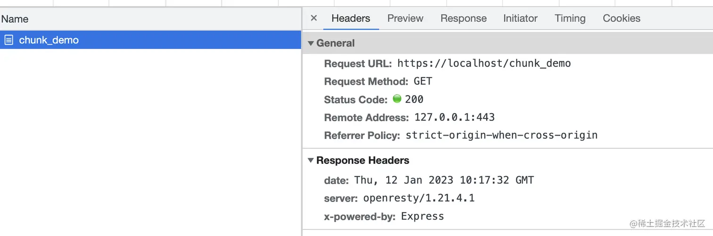
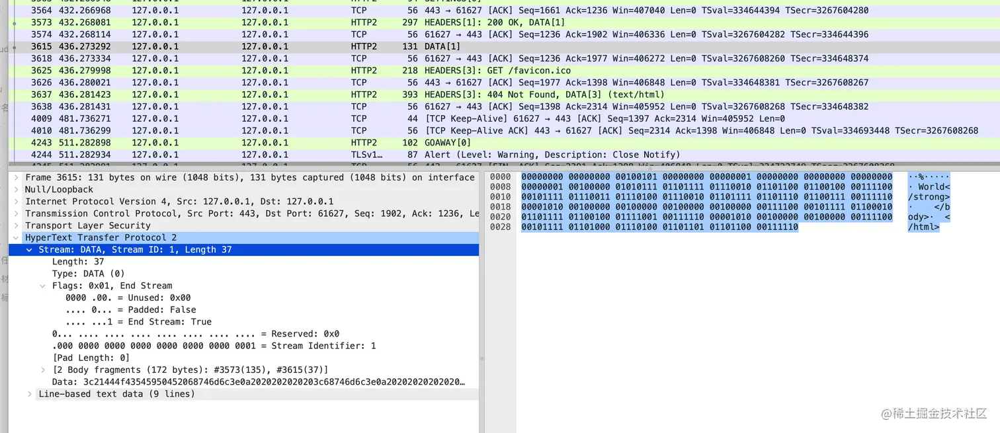

# 背景

某日，Leader 说：“给我们的 SSR 服务整一下流式渲染吧！”。听完我心想：这不是小弟已经研究过的玩意吗。所以果断回答 OK 没问题。

一天之后，本地修改完毕，部署到 Test 环境，开始验证！咦，返回的头部里面怎么没有 `Transfer-Encoding: chunked` 这个头部呀？鉴于我们的服务是部署在 Nginx 网关之后的，所以果断甩锅给运维，“怎么把我的头给弄丢了！”。

一番拉扯之后，运维甩过来一个链接：[Transfer-Encoding](https://developer.mozilla.org/en-US/docs/Web/HTTP/Headers/Transfer-Encoding)。意思就是，这不是我们的锅呀，这个是 HTTP2 的规定。

所以现在的问题总结下来就是：


问题原因知道了，那就面向 Google 开发呗，可是经过各种组合搜索后也没有找到相关的内容。没方法了，只能灰溜溜的跟 Leader 说做不了了。

但是这个问题一直萦绕在我脑海，害得我夜不能寐，饭不能食。毕竟，丢了的面子得找回来，而且不可能大家的服务都没有像这样部署过吧，肯定还是自己太菜了。

而且，根据上面这个链接所说：“HTTP2 提供了比 `chunked` 更为高效的数据流传输机制”，所以有可能 HTTP2 已经默默的帮我们做了些什么了？既然有此疑虑，直接验证一下呗。

# 验证

本文所需要的验证工具包括：

- Nginx：需要开启 HTTP2，需要生成自签名证书，相关内容可自行搜索。这里仅给出配置文件：

```nginx
events {https://juejin.cn/post/7133238781452222472
    worker_connections 2048;
}

http {
  server {
    ssl_certificate      mydomain.crt;
    ssl_certificate_key  private.key;

    listen 443 ssl http2;

    location / {
      proxy_http_version      1.1; # 注意这个参数不能省略，否则默认会用 1.0，1.0 不支持 chunked
      proxy_pass http://127.0.0.1:2048;
    }
  }
}
```

- 返回 chunked 内容的 server：本文使用 Node.js，代码如下：

```js
const express = require('express')

const app = express()

app.get('/chunk_demo', (req, res, next) => {
  res.write(`<!DOCTYPE html>
      <html>
        <head>
          <title>Chunk Demo</title>
        </head>
        <body>
          <strong>你好`)

  setTimeout(() => {
    res.end(` World</strong>
    </body>
  </html>`)
  }, 4000)
})

const listener = app.listen(2048, () => {
  console.log('Your app is listening on port ' + listener.address().port)
})
```

- 支持 HTTP2 的客户端，这个一般的浏览器应该都支持。

然后，我们在浏览器中访问一下。从调试面板发现，协议确实是 HTTP2，且没有返回 `Transfer-Encoding: chunked` 头部，但是效果确实是我们想要的（不过这个浏览器貌似不太礼貌，不好好输出你好就算了，还骂我是“犲”。开个玩笑，这里显然是乱码了，文末有说明）：




看来 HTTP2 确实自动做了些什么。

我们可以通过 wireshark 进一步的验证我们的想法，使用 wireshark 抓包需要配置其可以解密 HTTP2 流量，可参考[使用 Wireshark 调试 HTTP/2 流量](https://imququ.com/post/http2-traffic-in-wireshark.html)。

如下所示，`chunked` 的两部分数据被 HTTP2 作为了两个 Data 帧进行传输，两个 Data 帧的时间相差 4 秒左右。




看来我们的 SSR 流式渲染可以顺利上线了，这个面子终于找回来了。

不过好不容易抓到了包，那就再顺手研究下 HTTP2 中 Header 和 Data 帧的数据格式吧。

# 补充内容

## Header 和 Data 帧格式解析

首先，我们来看一下 `GET /chunk_demo` 这个 Header 帧的数据：


这段数据包含 9 个字节的头部和 444 个字节的数据。

首先，我们来看看头部：

```
0000000 00000001 10111100 00000001 00100101 00000000 00000000 00000000 00000001
```

- 1-3（0000000 00000001 10111100）：数据长度。这里是 444，表示 9 个字节的头部后面跟着 444 个字节的数据。
- 4（00000001）：帧类型，这里是 1，表示是 Header 帧。
- 5（00100101）：标志位。
- 6-9（00000000 00000000 00000000 00000001）：流标识符，标识该帧属于哪个流。

接下来，是数据部分：

首先是 4 个字节的 `Stream Dependency` 用来表示该流的依赖和 1 个字节的 `Weight` 用来表示优先级，后面的全是请求头相关的内容了，这一部分内容可以参考[HTTP/2 头部压缩技术介绍](https://juejin.cn/post/7133238781452222472)，这里挑几个来解析一下。

比如第 15 个字节 `10000010`，它属于“整个头部键值对都在字典中”的情况：

```js
  0   1   2   3   4   5   6   7
+---+---+---+---+---+---+---+---+
| 1 |        Index (7+)         |
+---+---------------------------+
```

具体解析方法为：第一位是 `1`，表示“整个头部键值对都在字典中”，剩下的 7 位表示其在字典中的索引 `2`，查字典得到键值对为：“:method: GET”。其中完整的字典在[这里](https://httpwg.org/specs/rfc7541.html#static.table.definition)。如果是用 HTTP/1.1 来表示请求方法，则需要 3 个字节。

再比如 16-23 字节 `01000001 10000110 10100000 11100100 00011101 00010011 10011101 00001001`，它属于“头部名称在字典中，更新动态字典”的情况：

```js
  0   1   2   3   4   5   6   7
+---+---+---+---+---+---+---+---+
| 0 | 1 |      Index (6+)       |
+---+---+-----------------------+
| H |     Value Length (7+)     |
+---+---------------------------+
| Value String (Length octets)  |
+-------------------------------+
```

具体解析方法为：前两位 `01` 表示“头部名称在字典中，需要更新动态字典”，后面 6 位表示其在字典中的索引 `1`，查字典得到其 key 为 `:authority`，之后的一个字节 `10000110` 表示使用了霍夫曼编码，且数据长度为 `6`，最后面的 6 个字节就是霍夫曼编码后的数据，查[霍夫曼编码表](https://httpwg.org/specs/rfc7541.html#huffman.code)后得到结果为 `localhost`：

```js
101000 - l
00111 - o
00100 - c
00011 - a
100111 - h
01000 - s
01001 - t

10100000 11100100 00011101 00010011 10011101 00001001
     |     |    |     |      |      |    |     |    |
     l     o    c     a      l      h    o     s    t
```

那么，这里的更新动态字典是啥意思呢？我们来看看另外一个包的数据就知道了，刚好浏览器请求网页的时候会自动发一个请求 `GET /favicon.ico` 去请求网页图标，我们就来看看这个包的 `:authority`：


从上图可以看到，更新完动态字典后 `:authority` 现在也属于“整个头部键值对都在字典中”的情况了，用 1 个字节即可表示，数据进一步得到了压缩。

然后，我们来看看 Data 帧的数据：


同样也是 9 个字节的头部，就不赘述了。

之后就是 135 个字节的数据，注意这里的数据是 UTF8 编码的，由于前面都是 ASCII 表中的字符，所以一个字节即可表示，而“你好”是中文，每一个需要 3 个字节表示：

```js
11100100 10111101 10100000 11100101 10100101 10111101
```

那为什么浏览器显示乱码了呢？因为实验环境的浏览器默认使用 GBK 编码，我们查一下 `浣犲ソ` 的 GBK 编码，可得到：

```js
浣 - E4BD - 11100100 10111101
犲 - A0E5 - 10100000 11100101
ソ - A5BD - 10100101 10111101
```

连起来刚好跟“你好”的 UTF8 编码是一样的。

怎么解决呢？在返回的 `html` 中添加 `meta` 标签指定编码方式即可：

```html
<meta charset="UTF-8" />
```

# 总结

本文从 SSR 流式渲染的需求出发，通过一个实验介绍了 HTTP2 对 `chunked` 的处理，并简单分析了一下 HTTP2 的帧格式。最终结论简单来说就是 HTTP2 会自动处理 `Transfer-Encoding：chunked`，将其转换为多个 Data 帧来传输。
