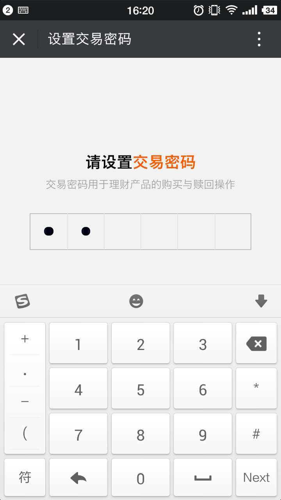

## 效果图


## 实现方式
将input框移出屏幕，用label来代替其捕捉输入动作，监听input的input事件，根据input的值来绘制圆点，具体见下面的代码：
### html
```
<div class="contain" id="setTradePwd">
  <h2>请设置<em>交易密码</em></h2>
  <span class="note">交易密码用于理财产品的购买与赎回操作</span>
  <input class="pwd-input" type="tel" id="pwdInput1">
  <label class="pwd-input-fake" id="pwdInput1Fake" for="pwdInput1">
    <span id="pwdInput1P1"></span>
    <span id="pwdInput1P2"></span>
    <span id="pwdInput1P3"></span>
    <span id="pwdInput1P4"></span>
    <span id="pwdInput1P5"></span>
    <span id="pwdInput1P6"></span>
  </label>
</div>
```
### less
```
@baseFontSize: 20px;
.px2rem(@which, @size) {  
  @{which}: 1rem * ( @size / @baseFontSize )
}
.pwd-input {
  transform: translateY(-500px);//移出屏幕
  .px2rem(height, 25px);
}
.pwd-input-fake {
  display: inline-block;
  .px2rem(height, 42px);
  .px2rem(width, 252px);
  span {
    display: inline-block;
    margin: 0;
    .px2rem(height, 42px);
    .px2rem(width, 42px);
    border-top: 1px solid #bcbcbc;
    border-bottom: 1px solid #bcbcbc;
    border-left: 1px solid #e3e3e3;
    position: relative;
    &.active:after {
      content:'';
      .px2rem(height, 10px);
      .px2rem(width, 10px);
      display: inline-block;
      top: 50%;
      left: 50%;
      transform: translateX(-50%) translateY(-50%);
      border-radius: 1rem;
      background-color: #000011;
      position: absolute;
    }
  }
  span:first-child {
    border-left: 1px solid #bcbcbc;
  }
  span:last-child {
    border-right: 1px solid #bcbcbc;
  }
}
```
### js
```
/**
 * 仿原生APP密码输入
 * @param id 密码输入input
 */
function imitatePwd(id) {
  var defer = $.Deferred();
  var pwd = null;
  var $span = $('#'+id+'Fake'+' span');
  var spanLen = $span.length;
  var lastPwdLen = 0;
  var active = 0;
  $('#'+id).on('input',function() {
	pwd = $(this).val();
	if (lastPwdLen < pwd.length) {
	  active += 1;
	  $('#'+id+'P'+active).addClass('active');
	  lastPwdLen = pwd.length;
	} else {
	  $('#'+id+'P'+active).removeClass('active');
	  active -= 1;
	  lastPwdLen = pwd.length;
	}
	if (pwd.length == spanLen) {
	  $(this).attr('disabled', 'disabled');
	  defer.resolve(pwd);
	}
  });
  return defer.promise();
}
// 使用示范
imitatePwd('pwdInput1')
    .then(function(pwd){
       alert(pwd)
    });
```


