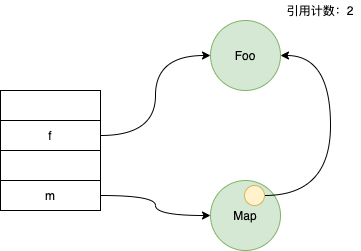
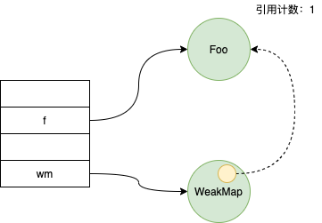
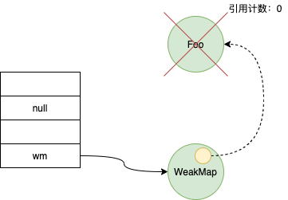
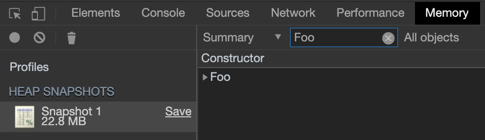
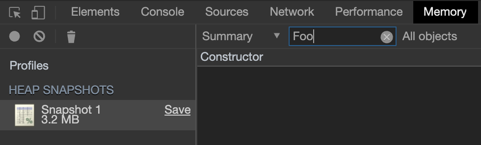

关于 WeakMap 有很多资料，可以参考：

[ES6 入门教程](https://es6.ruanyifeng.com/)
[ES6 系列之 WeakMap](https://juejin.im/post/5b594512f265da0f6263840f)

本文主要记录下怎么理解“弱引用”这个概念

# 弱引用 vs 强引用

我们通过对比 `WeakMap` 和 `Map` 来理解弱引用和强引用的区别：

```javascript
var m = new Map()
function Foo() {
  this.arr = new Array(5 * 1024 * 1024)
}
var f = new Foo()
m.set(f, 'data')
```

```javascript
var wm = new WeakMap()
function Foo() {
  this.arr = new Array(5 * 1024 * 1024)
}
var f = new Foo()
wm.set(f, 'data')
```

上面两块代码的内存模型可以大致这么表示：




图一 `Foo` 对象由于同时被 `f` 和 `Map` 对象所引用，其引用计数为 2，而图二中因为是被 `WeakMap` 对象引用，是弱引用，不计入引用计数，所以值为 1。

# 弱引用与垃圾回收

如果我们断开 `f` 对 `Foo` 对象的引用，则 `Foo` 对象由于引用计数为 0，会被垃圾回收器回收掉。

```javascript
var wm = new WeakMap()
function Foo() {
  this.arr = new Array(5 * 1024 * 1024)
}
var f = new Foo()
wm.set(f, 'data')
f = null
```



为了验证 `WeakMap` 起作用了，我们一般会尝试去打印 `wm.get(f)`，结果是 `undefined`：

```javascript
var wm = new WeakMap()
function Foo() {
  this.arr = new Array(5 * 1024 * 1024)
}
var f = new Foo()
wm.set(f, 'data')
f = null
console.log(wm.get(f)) // undefined
```

结果满足预期，非常不错！

如果就这样结束了的话，那就太天真了。还是上面的代码，我们把 `WeakMap` 改成 `Map`，发现结果也是 `undefined`。

为什么呢？因为 `wm.get(f)` 执行的时候，其实执行的是 `wm.get(null)` ，这个不管是 `WeakMap` 还是 `Map`，始终都是 `undefined`。事实上，当 `f` 断开了与 `Foo` 对象的引用后，通往 `Foo` 对象的唯一通道也被切断了。这样就形成了一个互相矛盾的局面：要让对象可回收，就必须断掉所有的引用；而 `WeakMap` 需要对象的引用才能执行 `get`。

那怎么验证 `WeakMap` 起作用了呢？

# 如何验证 WeakMap 起作用了

`nodejs` 中如何验证，[这篇文章](https://juejin.im/post/5b594512f265da0f6263840f)已经写过了，这里补充一条浏览器中的验证方法：

在 Chrome 浏览器中，我们可以通过开发者工具中的 `memory` 面板来调试，我们先来调试下 `Map`：

1. 在控制台执行下面代码

```javascript
var m = new Map()
function Foo() {
  this.arr = new Array(5 * 1024 * 1024)
}
var f = new Foo()
m.set(f, 'data')
f = null
```

2. 点击 `memory` 面板中的小圆点，记录当前内存快照，搜索 `Foo`，发现存在一个，可见 `Foo` 对象没有被回收。
   

然后再来试一下 `WeakMap`：

1. 在控制台执行下面代码

```javascript
var wm = new WeakMap()
function Foo() {
  this.arr = new Array(5 * 1024 * 1024)
}
var f = new Foo()
wm.set(f, 'data')
f = null
```

2. 点击 `memory` 面板中的小圆点，记录当前内存快照，搜索 `Foo`，发现不存在，可见其已被回收。
   

# 总结

一直觉得 `WeakMap` 应该是个很简单的东西，但是稍微深入下还是挖掘出来不少知识点，以后真不敢“轻视”任何知识了。
