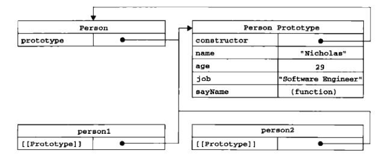
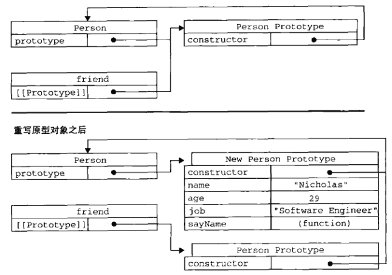
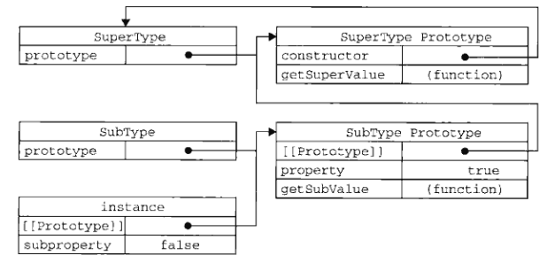
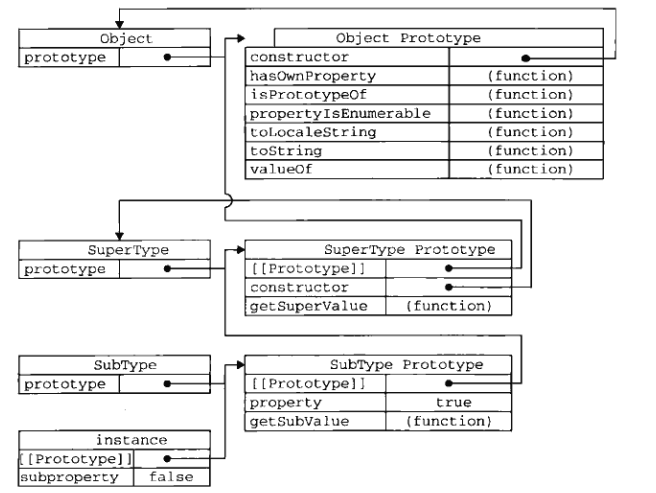
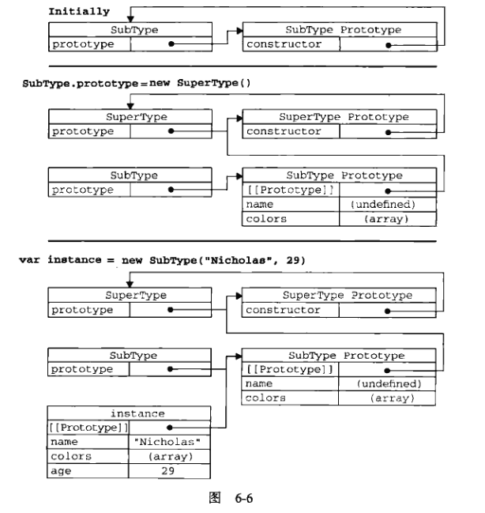
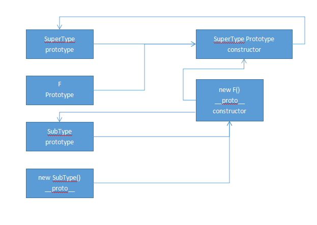

## 理解对象
### 属性类型
#### 数据属性
  * Configurable: 能否delete，能否修改其特性，能否修改为访问器属性。默认true
  * Enumerable: 能否通过for-in循环返回。默认true
  * Writable: 能否修改值。默认true
  * Value: 属性的数据值。默认undefined

** defineProperty： **
```
var person = {};
Object.defineProperty(person, 'name', {
  configurable: false,
  value: 'Nicholas'
});
alert(person.name); // 'Nicholas'
delete person.name; // 无法删除，非严格模式什么都不会发生，严格模式会导致错误
alert(person.name); // 'Nicholas'
```
** 一旦把属性定义为不可配置的，就不能再调用其修改除writable之外的其他特性 **
#### 访问器属性
* Configurable
* Enumerable
* Get
* Set

```
var book ={
  _year: 2004,
  edition: 1
};

Object.defineProperty(book, 'year', {
  get: function() {
    return this._year
  },
  set: function(newValue) {
    if (newValue > 2004) {
      this._year = newValue;
      this.edition += newValue - 2004;
    }
  }
});

book.year = 2005;
alert(book.edition);
```
不一定要同时指定两者，当set/get没有指定时，表示该属性不可写/读
### 定义多个属性
```
var book = {};
Object.defineProperties(book,{
  _year: {
    value: 2004
  },
  year: {
    get: function() {
      
    },
    set: function() {
      
    }
  }
});
```
### 读取属性的特性
Object.getOwnPropertyDescriptor
这个方法只能用于实例属性，要取得原型属性的描述符，必须直接在原型对象上调用
```
var descriptor = Object.getOwnPropertyDescriptor(book,'year')
console.log(descriptor.value); // undefined
console.log(descriptor.configurable); // false
```
## 创建对象
### 工厂模式
```
// 工厂模式
function createPerson(name, age, job) {
  var o = new Object();
  o.name = name;
  o.age = age;
  o.job = job;
  o.sayName = function() {
    console.log(this.name);
  }
  return o;
}
```
没有解决对象识别的问题（即怎样知道一个对象的类型）
### 寄生构造函数模式（不常用）
一个与工厂模式几乎一样的
```
function Persion(name, age, job) {
  var o = new Object();
  o.name = name;
  o.age = age;
  o.job = job;
  o.sayName = function() {
    console.log(this.name);
  }
  return o;
}
// 创建对象是用new，与工厂模式不同
var p = new Person(...)
```
可以用于在特殊的情况下为对象创建构造函数
```
function SpeicialArray() {
  var values = new Array();
  values.push.apply(values,arguments);
  values.toPipedString = function() {
    return this.join("|");
  }
  return values;
}
```
有个小问题：
```
var colors = new SpeicialArray('red','blue');
console.log(colors instanceof SpeicialArray); // false
console.log(colors instanceof Array); // true
```

### 稳妥构造函数模式（不常用）
```
function Person(name, age, job) {
  var o = new Object();
  // 可以在这里定义私有含量和函数
  o.sayName = function(){
    console.log(name);
  }
  return o;
}
```

### 构造函数模式
```
/// 构造函数模式
function Person(name, age, job) {
  this.name = name;
  this.age = age;
  this.job = job;
  this.sayName = function () {
    console.log(this.name);
  };
}

var p =new Person('ayou', 27, 'Web Front End Developer');
```
与工厂模式不同处：
* 没有显示的创建对象
* 直接将属性和方法赋给了this对象
* 没有return语句
new一个对象会经历4个步骤：
1. 创建一个对象
2. 将构造函数的作用域赋给新对象(this指向了这个新对象)
3. 执行构造函数中的代码(为这个新对象添加属性)
4. 返回新对象

p会有一个constructor（构造函数）属性，改属性指向Person
```
console.log(p.constructor == Person); // true
```
constructor可以用来标识对象类型，但是还是instanceof更可靠一些
#### 将构造函数当作函数
```
// 作为普通函数用
Person('ddd',23,'ddd'); 
window.sayName();
// 在另一个对象的作用域中调用
var o = new Object();
Person.call(0, "Kristen", 24, "Nurse");
o.sayName();
```
#### 构造函数的问题
每个方法都要在每个实例上面重新创建一遍，比如上例中的sayName，可以用这样一种奇葩的方式
```
function Person(name, age, job) {
  this.name = name;
  this.age = age;
  this.job = job;
  this.sayName = sayName;
}
function sayName() {
  console.log(this.name);
}
```
毫无封装性可言
### 原型模式
每个函数都有一个prototype属性，它是一个指针，指向一个对象，这个对象的用途是包含可以由特定类型的所有实例共享的属性和方法
#### 理解原型对象


```
console.log(Person.prototype.constructor == Person); // true
console.log(p.__proto__ == Person.prototype); // true
```
* isPrototypeOf
* getPrototypeOf

```
Person.prototype.isPrototypeOf(p);
Object.getPrototypeOf(p)
```
当我们给对象添加一个属性时，这个属性会屏蔽原型对象中保存的同名属性，可以通过delete删除这个属性，从而重新访问原型中的属性
* hasOwnProperty
该方法检测属性是存在实例中（返回true）还是原型中（返回false）

#### 原型与in操作符
in操作符会在通过对象能够访问给点属性时返回true，无论该属性存在于实例中还是原型中，同时与hasOwnProperty配合，可以确定属性存在哪里：
```
function hasPrototypeProperty(object, name){
  return !object.hasOwnProperty(name) && (name in object);
}
```
for-in循环中，返回的是能够通过对象访问的、可枚举的属性（实例+原型+**屏蔽了原型中不可枚举属性的实例属性**（IE8及更早除外））
要取得对象上所有**可枚举**的实例属性，可以使用Object.keys()方法
```
// 返回原型上的属性
var keys = Object.keys(Person.prototype);
// 返回实例上的属性
var objKeys = Object.keys(p);
```
要取得所有属性（**无论是否可枚举**），可以使用Object.getOwnPropertyNames()
```
var keys = Object.getOwnPropertyNames(Person.prototype);
console.log(keys); // constructor, name, age, job, sayName
```

#### 更简单的原型语法
前面每次给原型添加一个属性或方法都要敲一遍Person.prototype。为减少不必要的输入，可以这样：
```
function Person() {
}
Person.prototype = {
  name: 'ayou',
  age: 29,
  job: 'Software Engineer',
  sayName: function () {
    console.log(this.name);
  }
}
```

但是，**constructor属性不再指向Person了**，本质上完全重写了默认的prototype对象，因此constructor属性也就变成了新对象的constructor属性（**指向Object构造函数**），尽管instanceof操作符还能返回正确的结果，但通过constructor已经无法确定对象的类型了。
```
var p = new Person();
console.log(p instanceof Object);// true
console.log(p instanceof Person); // true
console.log(p.constructor == Person); // false
console.log(p.constructoor == Object); // true
```

不过可以想下面一样，重置回适当的值
```
function Person() {
}
Person.prototype = {
  constructor: Person, // 重设为Person构造函数
  name: 'ayou',
  age: 29,
  job: 'Software Engineer',
  sayName: function () {
    console.log(this.name);
  }
}
```

但是上述方法会导致constructor的Enumerable设置为true，原生的constructor是不可枚举的，可以用defineProperty(node6.9.4中好像有些问题)：
```
Object.defineProperty(Person.prototype,'constructor',{
  enumerable: false,
  value: Person
});
```

#### 原型的动态性
```
var friend = new Person();
Person.prototype.sayHi = function() {
  console.log('Hi');
};
friend.sayHi();// Hi 虽然方法是在创建实例后添加到原型的，但是还是可以访问
```

但是如果是重写了原型对象，则会有问题：
```
function Person() {
}
var p = new Person();
Person.prototype = {
  constructor: Person, // 重设为Person构造函数
  name: 'ayou',
  age: 29,
  job: 'Software Engineer',
  sayName: function () {
    console.log(this.name);
  }
};
p.sayName(); // errow
```

其原因可以从图中清晰的看出来：



#### 原生对象的原型
可以给原生对象添加自定义方法**不推荐**
```
String.prototype.startsWith = ......
```

#### 原型对象的问题
当原型对象中有引用类型的属性时，会有问题
```
function Person() {
}
Person.prototype = {
  ...  
  friends : ['Ayou','Aling']
  ...
}
var p1 = new Person();
var p2 = new Person();
p1.friends.push('AA'); // 会导致p2中的friends属性也发生变化
...
```
### 组合使用改造函数模式和原型模式
构造函数用于定义实例属性，原型模式用于定义方法和共享的属性
```
function Person(name, age, job) {
  this.name = name;
  this.age = age;
  this.job = job;
  this.friends = ['Ayou','Aling'];
}
Person.prototype = {
  constructor:Person,
  sayName:........
}
```

### 动态原型模式
把构造函数和原型分开写，对熟悉了OOP开发人员来说会显得奇怪，所以动态原型模式就出现了
```
function Person(name, age, job) {
  this.name = name;
  this.age = age;
  this.job = job;
  // 只会在第一次执行构造函数时才会执行
  if (typeof this.sayName != "function") {
    console.log('执行了！');
    Person.prototype.sayName = function() {
      return this.name;
    };
  }
}
var p1 = new Person('ayou',12,'web'); // 执行了
var p2 = new Person('ayou2',22,'web2');
```

## 继承
终于开始学“装逼”的东西了，嘿嘿
### 原型链
基本模式：
```
// 超类
function SuperType() {
  this.property = true;
}
SuperType.prototype.getSuperValue = function() {
  return this.property;
}
// 子类
function SubType() {
  this.subproperty = false;
}
// 继承
SubType.prototype = new SuperType();
SubType.prototype.getSubValue = function () {
  return this.subproperty;
}
var instance = new SubType();
console.log(instance.getSuperValue()); // true
console.log(SubType.prototype);// SuperType { property: true, getSubValue: [Function] }
console.log(SuperType.prototype);//SuperType { getSuperValue: [Function] }
```



**instance.getSuperValue():1)搜索实例；2)搜索SubType.prototype；3)搜索SuperType.prototype**

#### 别忘记默认的原型



#### 确定原型和实例的关系
使用instanceof，凡是原型链中出现过的构造函数，都会返回true

#### 谨慎的定义方法
子类有时需要重写超类型中的某个方法，或者需要添加超类型中不存在的某个方法。但不管怎么样，给原型添加方法的代码一定要放在替换原型的语句之后。
```
...
// 继承
SubType.prototype = new SuperType();
// 添加新方法，这里不能使用对象字面量的方法，因为这样会重写原型链
SubType.prototype.getSubValue = function() {
  return this.subproperty;
}
// 重写超类中的方法
...
```
#### 原型链的问题
原型链中的属性会被所有实例共享，所以我们一般在构造函数中定义属性。但是，当通过原型来实现继承时，**原型实际上会变成超类型的实例，于是超类型的实例属性也就顺理成章地变成了子类的原型属性了。**
```
function SuperType() {
  this.colors = ["red","blue","green"];
}
function SubType(){
}
// 继承了SuperType
SubType.prototype = new SuperType();
var instance1 = new SubType();
instance1.colors.push("black");
console.log(instance1.colors);

var instance2 = new SubType();
console.log(instance2.colors);

// 超类
var super1 = new SuperType();
super1.colors.push('white');
console.log(super1.colors);

var super2 = new SuperType();
console.log(super2.colors);
结果：
[ 'red', 'blue', 'green', 'black' ]
[ 'red', 'blue', 'green', 'black' ]
[ 'red', 'blue', 'green', 'white' ]
[ 'red', 'blue', 'green' ]
```

### 借用构造函数
为了解决上面的问题，采用**借用构造函数**的技术（**伪造对象或经典继承**）
```
function SuperType() {
  this.colors = ["red","blue","green"];
}
function SubType() {
  SuperType.call(this);
}
var instance1 = new SubType();
instance1.colors.push("black");
console.log(instance1.colors); // red, blue, green, black

var instance2 = new SubType();
console.log(instance2.colors); // red, blue, green
```

#### 传递参数
相比原型链而言，借用构造函数可以向超类型构造函数传递参数。
```
function SuperType(name) {
  this.name = name;
}
function SubType() {
  SuperType.call(this,'Nicolas');//放在最前面，防止重写子类型的属性
  this.age = 29;
}
```

#### 借用构造函数的问题
方法都在构造函数中定义，因此函数复用就无从谈起，超类型中的方法，对子类型也是不可见的

### 组合继承（最常用）
使用原型链实现对原型属性和方法的继承
使用构造函数来实现对实例属性的继承
```
function SuperType(name) {
  this.name = name;
  this.colors = ["red","blue","green"];
}
SuperType.prototype.sayName = function() {
  console.log(this.name);
}
function SubType(name, age) {
  // 继承实例属性
  SuperType.call(this, name);
  this.age = age;
}
// 继承原型方法
SubType.prototype = new SuperType();
SubType.prototype.sayAge = function() {
  console.log(this.age);
}

var i1 = new SubType("ayou",29);
i1.colors.push('black');
console.log(i1.colors); // red, blue, green, black
i1.sayName(); // ayou
i1.sayAge(); // 29

var i2 = new SubType("aling",27);
console.log(i2.colors); // red, blue, green
i2.sayName(); // aling
i2.sayAge(); // 27
```
不足：
会调用两次超类型的构造函数
1. SubType.prototype = new SuperType();
2. SuperType.call(this, name);

### 原型式继承
```
function object(o) {
  function F(){};
  F.prototype = o;
  return new F();
}

var p = {
  name: 'ayou',
  friends: ['ayou','xing','zhi']
}
var s1 = object(p);
s1.name = 'aling';
s1.friends.push('rob');
console.log(s1.friends); // ayou, xing, zhi , rob
```
#### Object.create()
```
var person = {
  name: 'ayou',
  friends:['xing','zhi']
}
var obj = Object.create(person);
obj.name = 'aling';
obj.friends.push('rob');
// 有第二个参数
var obj2 = Object.create(person,{name:'azhi'});
console.log(obj2.name); // azhi
```
### 寄生式继承
思路与原型式继承紧密相关
```
function createAnother(original) {
  var clone = object(original); // 这里的object是上面的方法
  clone.sayHi = function() {
    console.log('hi'); 
  }
  return clone;
}
```
### 寄生组合式继承
前面说过，组合继承是最常用的继承方式，但是会调用两次超类型构造函数。

```
function SuperType(name) {
  console.log('调用了超类型的构造函数');
  this.name = name;
  this.colors = ['red','blue','green'];
}

SuperType.prototype.sayName = function() {
  console.log(this.name);
}

function SubType(name, age) {
  SuperType.call(this, name); // 第二次调用SuperType()
  this.age = age;
}

SubType.prototype = new SuperType(); // 第一次调用SuperType()
SubType.prototype.constructor = SubType; // 上面重写了原型，其constructor已不指向SubType
SubType.prototype.sayAge = function() {
  console.log(this.age);
};

var instance = new SubType('Nicholas'， 29); //打印两次 调用了超类型的构造函数
```
上面的代码可以用下图来归纳（这里还应该把SubType Prototype的constructor连到SubType上，每个实例中有一个指针，指向构造函数的原型对象，ECMA-262管它叫做[[Prototype]]，Firefox, Safari, Chrome, nodejs上是__proto__）：



**寄生组合式继承：**
```
function object(o) {
  function F(){};
  F.prototype = o;
  return new F(); // 
}

function inheritPrototype(subType, superType) {
  var prototype = object(superType.prototype)；
  prototype.constructor = subType;
  subType.prototype = prototype;
}

// 上面的代码中这两行可以替换
SubType.prototype = new SuperType(); // 第一次调用SuperType()
SubType.prototype.constructor = SubType; // 上面重写了原型，其constructor已不指向SubType
// 替换成
inheritPrototype(SubType, SuperType);
```
如图所示：




# 后记
书要越读越薄，现在可以做个归纳了：

1.类式继承：

``SubType.prototype = new SuperType()``

问题：

* 子类公用父类中的引用类型。

* 无法向父类传参数。

2.构造函数继承：

``SuperType.call(this,args)``

问题：父类原型中的方法无法继承

3.组合继承

上述两者综合

问题：父类构造函数执行了两次

4.原型式继承

这种方式错误：

``SubType.prototype = SuperType.prototype;``

（如果子类在原型上添加了自己的方法后，会影响父类）

需要增加中间过渡对象：

```
function inheritObject(o){
  function F(){}
  F.prototype = o;
  return new F();
}
```

5.寄生式

```
function (SubType, SuperType) {
  var p = inheritObject(SuperType.prototype)
  p.constructor = SubType;
  SubType.prototype = p;
}
```

可以这么理解：

``SubType.prototype = new F() ----> SuperType.prototype``

