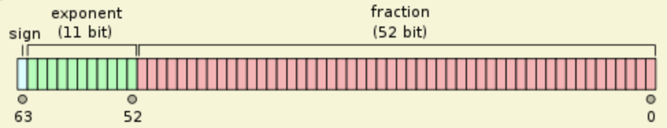

在 javascript 语言中，`Number` 下分别有两个常量 `MAX_VALUE` 和 `MAX_SAFE_INTEGER`。

其中，`MAX_VALUE` 表示在 JavaScript 里所能表示的最大数值，`MAX_SAFE_INTEGER` 表示在 JavaScript 中最大的安全整数，他们的值分别如下：

```javascript
Number.MAX_VALUE // 1.7976931348623157e+308
Number.MAX_SAFE_INTEGER // 9007199254740991
```

那你知道这些值是怎么来的吗？

# 双精度浮点数

我们知道， javascript 中的数都是用 IEEE754 标准的双精度浮点数来表示的：


其中，sign 为 0 表示正数，为 1 表示负数，exponent 表示科学计数法中的指数部分，实际存储的时候必须加上一个偏移值 1023，fraction 表示小数点后的部分，整数部分永远为 1，计算机不存储，但是运算的时候会加上。比如：

0 01111111011 0000000000000000000000000000000000000000000000000000

表示的就是 1.0000000000000000000000000000000000000000000000000000 \* 2^(1019 - 1023) = 0.0625

# MAX_VALUE

我们知道了 js 中数的表示方法，那么他能表示的最大的数是多少呢，聪明的你肯定会想到是下面这个数：

0 11111111111 1111111111111111111111111111111111111111111111111111

但是，这种情况在 IEEE754 标准中表示 `NaN`，最大的数其实是：

0 11111111110 1111111111111111111111111111111111111111111111111111

转换成二进制的科学计数法表示如下：

1.1111111111111111111111111111111111111111111111111111 \* 2^(2046 - 1023)

= 1.1111111111111111111111111111111111111111111111111111 \* 2^1023

= 11111111111111111111111111111111111111111111111111111 \* 2^971

= (2^53 - 1) \* 2^971

= 1.7976931348623157e+308

我们在浏览器调试窗口里面验证下：

```c
(Math.pow(2, 53) - 1) * Math.pow(2, 971) // 1.7976931348623157e+308
(Math.pow(2, 53) - 1) * Math.pow(2, 971) === Number.MAX_VALUE // true
```

# MAX_SAFE_INTEGER

`MAX_SAFE_INTEGER` 表示在 JavaScript 中最大的安全整数。所谓的安全，就是大于这个数的整数不一定可以精确表示。他的值其实是 2^53 - 1，表示成二进制为：

0 10000110100 1111111111111111111111111111111111111111111111111111

表示成二进制的科学计数法为：

1.1111111111111111111111111111111111111111111111111111 \* 2^52

= 11111111111111111111111111111111111111111111111111111

比这个数大一的数为：

100000000000000000000000000000000000000000000000000000

= 1.00000000000000000000000000000000000000000000000000000 \* 2^53

在计算机中表示成:

0 10000110101 0000000000000000000000000000000000000000000000000000 ~~0~~

注意到我们省去掉了一位，按照[向偶舍入](https://blog.csdn.net/qq_34369618/article/details/52247350)的规则，不会产生进位。所以这个数还是可以精确表示的，没有问题。

我们再来看看比 `MAX_SAFE_INTEGER` 大二的数：

100000000000000000000000000000000000000000000000000001

= 1.00000000000000000000000000000000000000000000000000001 \* 2^53

在计算机中表示成:

0 10000110101 0000000000000000000000000000000000000000000000000000 ~~1~~

注意到我们省去掉了一位，按照[向偶舍入](https://blog.csdn.net/qq_34369618/article/details/52247350)的规则，还是不会产生进位。这个时候就有问题了，这个数跟刚才那个数竟然是相等的，我们来验证下：

```javascript
const a = Number.MAX_SAFE_INTEGER
a + 1 === a + 2 // true
```

所以，在进行大数的相关运算的时候要小心了，最好是使用 `BigInt` 类型。
