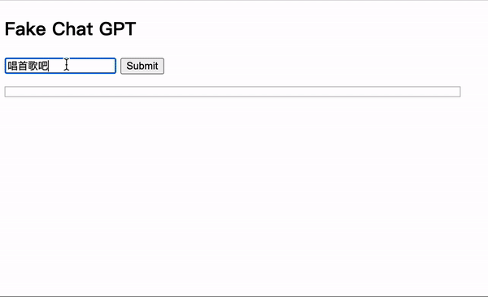

在使用 ChatGPT 时一直都好奇它生成答案的动画效果是怎么做的，今天我们就简单的来模拟下。

先上效果：



我们先准备一下接口，代码如下：

```js
const express = require('express')

const app = express()

const sleep = (ms) =>
  new Promise((resolve, reject) => {
    setTimeout(resolve, ms)
  })

app.use(express.static('.'))

const answer = '一群嗜血的蚂蚁被腐肉所吸引，我面无表情看孤独的风景...'

app.get('/ai', async (req, res, next) => {
  for (let i = 0; i < answer.length; i++) {
    res.write(answer[i].toString())
    await sleep(200)
  }
  res.end()
})

app.listen(8000)
```

可以看到，`/ai` 接口数据会以分块传输的方式返回。

我们在前端试着请求一下：

```js
fetch('/ai')
  .then((rsp) => rsp.text())
  .then(console.log)
```

然而，测试发现要等到数据全部传输完才会打印。怎么才能提前读取已经传输好的数据块呢？答案就是 [ReadableStream](https://developer.mozilla.org/en-US/docs/Web/API/ReadableStream)。上面代码中，`rsp` 上的 `body` 属性其实就是 `ReadableStream` 对象，可以调用它的 `getReader()` 方法返回一个 `reader` 来读取数据，所以我们稍加改造一下就可以了：

```js
fetch('/ai')
  .then((rsp) => rsp.body.getReader())
  .then((reader) => {
    function read() {
      reader.read().then(({done, value}) => {
        // If there is no more data to read
        if (done) {
          console.log('done', done)
          return
        }
        // decode Uint8Array to string
        console.log(new TextDecoder().decode(value))
        read()
      })
    }
    read()
  })
```

好了，关键的数据读取部分搞定了，前端效果部分就不详细介绍了，完整代码如下：

```html
<h2>Fake Chat GPT</h2>
<input type="text" id="input" />
<button id="btn">Submit</button>
<ul id="messages"></ul>
<script>
  const $submit = document.querySelector('#btn')
  const $messages = document.querySelector('#messages')
  const $input = document.querySelector('#input')

  function addQuestion(text) {
    const $li = document.createElement('li')
    const $span = document.createElement('span')
    $span.innerText = text
    $li.classList.add('question')
    $li.append($span)
    $messages.append($li)
  }

  function addAnswer() {
    const $li = document.createElement('li')
    const $span = document.createElement('span')
    $li.classList.add('answer')
    $li.append($span)
    $messages.append($li)
    return $span
  }

  $submit.addEventListener('click', () => {
    const question = $input.value
    addQuestion(question)
    fetch('/ai')
      .then((rsp) => rsp.body.getReader())
      .then((reader) => {
        const $span = addAnswer()

        function read() {
          reader.read().then(({done, value}) => {
            // If there is no more data to read
            if (done) {
              console.log('done', done)
              return
            }
            $span.appendChild(
              document.createTextNode(new TextDecoder().decode(value))
            )
            read()
          })
        }

        read()
      })
  })
</script>
```

