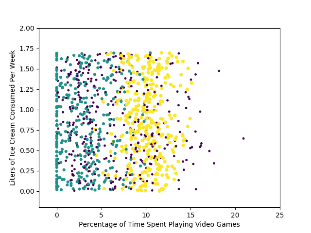

# k近邻算法
## 原理
存在一个样本数据集合，也称作训练样本集，且我们知道样本中每个数据的分类信息。
当我们输入未分类的新数据后，得到新数据与每个样本数据之间的"距离"，选择前k个距离
最近的样本中类别出现次数最多者作为新数据的类别

* 优点：精度高、对异常值不敏感、无数据输入假定
* 缺点：计算复杂度高、空间复杂度高
* 适用数据范围：数值型和标称型

## 示例
假设我们有如下样本集

|电影名称|打斗镜头|接吻镜头|电影类型|
|-------|-------|-------|------|
|California Man|3|104|爱情片|
|He's Not Really into Dudes|2|100|爱情片|
|Beautiful Woman|1|81|爱情片|
|Kevin Longblade|101|10|动作片|
|Robo Slayer 3000|99|5|动作片|
|Amped 2|98|2|动作片|
|？|18|90|未知|

即便我们不知道未知电影的类型，我们也可以计算出来。首先得到未知电影与已知数据之间的距离：

|电影名称|与未知电影的距离|
|-------|-------|
|California Man|20.5|
|He's Not Really into Dudes|18.7|
|Beautiful Woman|19.2|
|Kevin Longblade|115.3|
|Robo Slayer 3000|117.4|
|Amped 2|118.9|

现在可以找到k个距离最近的电影，取k=3，则可发现这三个电影均为爱情片，所以可以判断该电影为爱情片。

## knn算法的步骤
1. 计算已知类别数据集中的点与当前点之间的距离；
2. 按照距离递增次序排序；
3. 选取与当前点距离最小的k个点；
4. 确定前k个点所在类别的出现频率；
5. 返回前k个点出现频率最高的类别作为当前点的预测分类。

## 代码实现
```python
from numpy import tile, operator

def classify0(inX, dataSet, labels, k):
    """
    knn分类函数
    :param inX: 待分类的向量
    :param dataSet: 样本数据集
    :param labels: 样本数据对应的分类向量
    :param k: 最近邻数目
    :return: 类别标签
    """
    # 得到数据大小
    dataSetSize = dataSet.shape[0]

    # 欧氏距离
    diffMat = tile(inX, (dataSetSize, 1)) - dataSet
    sqDiffMat = diffMat**2
    sqDistances = sqDiffMat.sum(axis=1)
    distances = sqDistances**0.5

    # [-1 -1 -7] => [2 0 1]
    sortedDistIndicies = distances.argsort()
    classCount={}
    for i in range(k):
        voteIlabel = labels[sortedDistIndicies[i]]
        """
            {
                "label1": 34,
                 "label2": 23,
                 "label3": 35
            }
        """
        classCount[voteIlabel] = classCount.get(voteIlabel,0) + 1

    """
        [('label3', 35), ('label1', 34), ('label2', 23)]
    """
    sortedClassCount = sorted(classCount.iteritems(), key=operator.itemgetter(1), reverse=True)
    return sortedClassCount[0][0]
    pass
```

# 示例：使用k近邻算法改进约会网站的配对效果

## 数据

|每年飞行常客里程数|玩视频游戏所耗时间百分比|每周消费冰激凌公升数|吸引力类型
|-------|-------|-------|------|
|40920|	8.32697|0.953952|largeDoses|
|14488|7.153469|1.673904|smallDoses|
|...|...|...|...|

## 解析数据
```python
def file2matrix(filename):
    fr = open(filename)
    numberOfLines = len(fr.readlines())         #get the number of lines in the file
    returnMat = zeros((numberOfLines,3))        #prepare matrix to return
    classLabelVector = []                       #prepare labels return
    fr = open(filename)
    index = 0
    for line in fr.readlines():
        line = line.strip()
        listFromLine = line.split('\t')
        returnMat[index,:] = listFromLine[0:3]
        classLabelVector.append(int(listFromLine[-1]))
        index += 1
    return returnMat,classLabelVector
```

## 分析数据：绘图
### 安装matplotlib
```
pip install matplotlibrc

vi ~/.matplotlib/matplotlibrc

backend: TkAgg

```

### 绘图
```python
plt.figure()
l = plt.scatter(datingDataMat[:,1], datingDataMat[:,2], 6*array(datingLabels), (datingLabels), label='1')
plt.axis([-2,25,-0.2,2.0])
plt.xlabel('Percentage of Time Spent Playing Video Games')
plt.ylabel('Liters of Ice Cream Consumed Per Week')
plt.show()
```




## 数据归一化
数据中不同的属性之间量程相差很大，需要对数据进行归一化处理，常用的
归一化公式为：

```
newValue = (oldValue-min)/(max-min)
```

实现代码：

```python
def autoNorm(dataSet):
    """
    [
        [ 1  1 -2]
        [-2 -2 -5]
    ]
    """
    minVals = dataSet.min(0) # [-2 -2 -5]
    maxVals = dataSet.max(0) # [ 1  1 -2]
    ranges = maxVals - minVals
    normDataSet = zeros(shape(dataSet))
    m = dataSet.shape[0]
    normDataSet = dataSet - tile(minVals, (m,1))
    normDataSet = normDataSet / tile(ranges, (m,1))   #element wise divide
    return normDataSet, ranges, minVals
```

## 测试算法
```python
def datingClassTest():
    # 测试数据的占比
    hoRatio = 0.50
    datingDataMat, datingLabels = file2matrix('datingTestSet2.txt')
    # 归一化
    normMat, ranges, minVals = autoNorm(datingDataMat)
    m = normMat.shape[0]
    numTestVecs = int(m * hoRatio)
    errorCount = 0.0
    for i in range(numTestVecs):
        classifierResult = classify0(normMat[i, :], normMat[numTestVecs:m, :], datingLabels[numTestVecs:m], 3)
        print "the classifier came back with: %d, the real answer is: %d" % (classifierResult, datingLabels[i])
        if (classifierResult != datingLabels[i]): errorCount += 1.0
    print "the total error rate is: %f" % (errorCount / float(numTestVecs))
    print errorCount
...
the classifier came back with: 2, the real answer is: 2
the classifier came back with: 1, the real answer is: 1
the classifier came back with: 1, the real answer is: 1
the classifier came back with: 2, the real answer is: 2
the total error rate is: 0.064000
32.0

```

在测试数据为50%的情况下，得到了6.4%的误差率，分类效果还可以。

## 完善分类器的应用
接下来就是利用该分类器来对数据进行分类了，即判断约会对象的吸引力：

```python
def classifyPerson():
    resultList = ['不喜欢', '一点点喜欢', '非常喜欢']
    percentTats = float(raw_input("花在玩游戏的时间比例:"))
    ffMiles = float(raw_input("每年飞行里程数:"))
    iceCream = float(raw_input("每年消费的冰激凌公升数:"))
    datingDataMat, datingLabels = file2matrix('datingTestSet2.txt')
    normMat, ranges, minVals = autoNorm(datingDataMat)
    inArr = array([ffMiles, percentTats, iceCream])
    classifierResult = classify0((inArr-minVals)/ranges, normMat, datingLabels, 3)
    print "你会喜欢这个人吗？", resultList[classifierResult - 1]
...
    
花在玩游戏的时间比例:4
每年飞行里程数:0
每年消费的冰激凌公升数:0.01
你会喜欢这个人吗？ 一点点喜欢 # 原来我还是有点吸引力的
```

# 实例：手写识别系统
为简单起见，这里只处理``0-9``的数字。原始图像经过处理后，得到如下所示的数据：

```
00000000000001100000000000000000
00000000000000111000000000000000
00000000000111111100000000000000
00000000000111111110000000000000
00000000011111111110000000000000
00000000001111100111100000000000
00000000011111000111100000000000
00000001111110000011100000000000
00000000111111000001110000000000
00000000111111000001111100000000
00000001111111000001111100000000
00000000111110000000011110000000
00000000111100000000011110000000
00000000111100000000011110000000
00000001111100000000001110000000
00000001111110000000000111000000
00000001111100000000000111000000
00000001111100000000000111000000
00000000111110000000000011100000
00000000111110000000000011100000
00000000111110000000000111100000
00000000111110000000001111100000
00000000011111100000001111110000
00000000011111100000001111100000
00000000011100000000111111000000
00000000001110000000111111000000
00000000011111000111111110000000
00000000001111111111111100000000
00000000000111111111111100000000
00000000000111111111110000000000
00000000000011111111000000000000
00000000000000100000000000000000

```

上图是数字``0``的二维数据(``32*32``)，需要先转为``1*1024``的数据才能使用前面的分类算法。

```python
def img2vector(filename):
    returnVect = zeros((1, 1024))
    fr = open(filename)
    # 遍历行
    for i in range(32):
        lineStr = fr.readline()
        # 遍历每行的每个数字
        for j in range(32):
            returnVect[0, 32 * i + j] = int(lineStr[j])
    return returnVect
```

接下来，测试分类器的分类效果：

```python
def handwritingClassTest():
    # 训练数据的类标签向量
    hwLabels = []
    trainingFileList = listdir('trainingDigits')
    # 初始化训练矩阵
    m = len(trainingFileList)
    trainingMat = zeros((m, 1024))
    # 遍历每个文件
    for i in range(m):
        # 得到类别
        fileNameStr = trainingFileList[i]
        fileStr = fileNameStr.split('.')[0]
        classNumStr = int(fileStr.split('_')[0])
        hwLabels.append(classNumStr)
        # 得到属性向量
        trainingMat[i, :] = img2vector('trainingDigits/%s' % fileNameStr)
    # 测试文件
    testFileList = listdir('testDigits')
    errorCount = 0.0
    mTest = len(testFileList)
    for i in range(mTest):
        # 分类
        fileNameStr = testFileList[i]
        fileStr = fileNameStr.split('.')[0]  # take off .txt
        classNumStr = int(fileStr.split('_')[0])
        vectorUnderTest = img2vector('testDigits/%s' % fileNameStr)
        classifierResult = classify0(vectorUnderTest, trainingMat, hwLabels, 3)
        # 检测分类结果
        print "the classifier came back with: %d, the real answer is: %d" % (classifierResult, classNumStr)
        if (classifierResult != classNumStr): errorCount += 1.0
    print "\nthe total number of errors is: %d" % errorCount
    print "\nthe total error rate is: %f" % (errorCount / float(mTest))

...
the classifier came back with: 9, the real answer is: 9
the classifier came back with: 9, the real answer is: 9
the total number of errors is: 11
the total error rate is: 0.011628
```

#

# 小结
上述代码稍微运行了一会才出来结果，因为需要对每个测试向量计算2000次距离计算，包括1024个浮点运算，比较耗时。

另外，如果训练数据很大，需要使用大量的存储空间。

k近邻算法的另外一个缺陷是它无法给出任何数据的基础结构信息，因此也无法知晓平均实例样本和典型实例样本具有什么特征。

# 附录-js实现knn
[machine learning in js](http://burakkanber.com/blog/machine-learning-in-js-k-nearest-neighbor-part-1/)