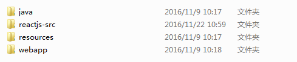
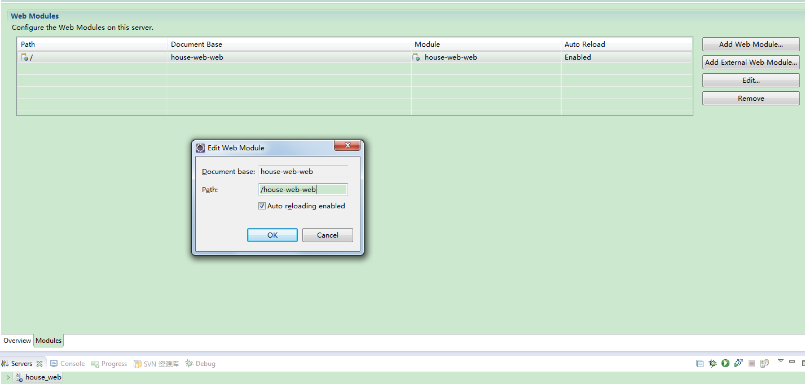
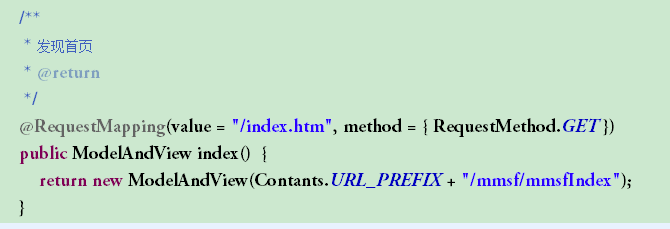

# 起因
目前项目采用的是经典的MVC架构，前端模版使用vm，对于即会java又懂前端的人来说，这种方式没有什么不好，反而开发会很快。

但是，现在的互联网是分工协作的，我们现在的方式是前端开发人员负责静态页面样式及交互的开发，后端人员拿到静态页面进行数据的绑定，如果一次能搞定，那当然没什么问题，但是一旦涉及到bug的修改，功能的调整，那就是折磨了。再加上几经人手，前端代码已经丑陋不堪。所以，我萌生出了对项目进行重构并进行前后端分离的想法。[为什么要前后端分离，这篇文章讲得不错](http://2014.jsconf.cn/slides/herman-taobaoweb/index.html#/)

刚好最近学习了react，实战中也尝试了下，并且我们的这个项目特别适合做成一个SPA（single page application，单页面应用），所以就决定利用其进行逐步重构。

# 项目路径规划
因为SPA的代码最后都需要编译打包成一个文件，所以我把我的前端工程跟java工程放在一起，方便文件直接生成到java工程中


# webpack打包路径设置
```javascript
...
var staticPath = '../../webapp/assets'; // java工程静态文件路径
var viewFilename= '../../webapp/view/main/mmsf/mmsfIndex.vm' // java工程试图文件路径
...
// 文件打包后直接生成到java工程下
    entry: {
      bundle:path.resolve(__dirname, 'app/main.js')
  },
  output: {
    path: path.resolve(__dirname ,staticPath ),
    publicPath: '/',
    filename: '/js/mmsf/[name].js'
  },
...
// 图片
  module: {
    loaders:[
      ...
      { test: /\.(png|jpg)$/, loader: 'file-loader?limit=8192&name=i/mmsf/[name].[ext]'},
    ]
  },
...
// html文件及配置文件处理
plugins: [
    ...
    new CopyWebpackPlugin([
      { from: './app/mmsfIndex.html', to: path.resolve(__dirname, viewFilename) },
      { from: './app/config.js', to: path.resolve(__dirname ,staticPath + '/js/mmsf/config.js') },
    ]),
  ]
```

# 如何方便的与后端进行接口联调
前后端分离时，数据交换一般采取http的方式。开发时由于前后端不在同一个域，需要进行一些处理，以解决js跨越的限制。
常见的方法有：
* 浏览器设置（chrome），原来确实是一个最方便的方式，在新版的chrome浏览器上试过，但是没成功
* jsonp的方式，有点麻烦，放弃
* 后端设置http头（Access-Allow-Control-Origin）,本公司后端不会，懒得去求他们，还是自己想办法吧。
* ngix，最后决定用这个

如果我将ngix配置成如下所示：
```java
#user  nobody;
worker_processes  1;

#error_log  logs/error.log;
#error_log  logs/error.log  notice;
#error_log  logs/error.log  info;

#pid        logs/nginx.pid;


events {
    worker_connections  1024;
}


http {
    include       mime.types;
    default_type  application/octet-stream;

    #log_format  main  '$remote_addr - $remote_user [$time_local] "$request" '
    #                  '$status $body_bytes_sent "$http_referer" '
    #                  '"$http_user_agent" "$http_x_forwarded_for"';

    #access_log  logs/access.log  main;

    sendfile        on;
    #tcp_nopush     on;

    #keepalive_timeout  0;
    keepalive_timeout  65;
    server {
        listen       80;
        server_name  localhost;
        #access_log  logs/host.access.log  main;
        location /api {
			      proxy_connect_timeout   3;  
            proxy_send_timeout      30;  
            proxy_read_timeout      30;
			      #rewrite (.*) site-web-personal/$1 permanent;
			      proxy_set_header   Host    $host;
            proxy_set_header   Remote_Addr    $remote_addr;
            proxy_set_header   X-Real-IP    $remote_addr;
            proxy_set_header   X-Forwarded-For    $proxy_add_x_forwarded_for;
            proxy_pass http://192.168.10.171:8282/api;
        }		
        location / {
			      proxy_connect_timeout   3;  
            proxy_send_timeout      30;  
            proxy_read_timeout      30;
			      #rewrite (.*) site-web-personal/$1 permanent;
			      proxy_set_header   Host    $host;
            proxy_set_header   Remote_Addr    $remote_addr;
            proxy_set_header   X-Real-IP    $remote_addr;
            proxy_set_header   X-Forwarded-For    $proxy_add_x_forwarded_for;
            proxy_pass http://192.168.10.169:8888/;  
        }		
        error_page   500 502 503 504  /50x.html;
        location = /50x.html {
            root   html;
        }
    }
}
```
这样当我访问``http://localhost/*``时会转发到我本地起的前端调试web服务，当我访问``http://localhost/api``时会转发到后端接口服务。

但是，我们的后端一开始并没有统一规划，所以也就没有区别接口的url地址和访问页面的url地址。

最后想到的办法是，利用eclipse->server可以给工程配置一个统一的url根目录来解决：


然后``ngix``配置改成:
```javascript
...
location /house-web-web {
    proxy_connect_timeout   3;  
    proxy_send_timeout      30;  
    proxy_read_timeout      30;
    #rewrite (.*) site-web-personal/$1 permanent;
    proxy_set_header   Host    $host;
    proxy_set_header   Remote_Addr    $remote_addr;
    proxy_set_header   X-Real-IP    $remote_addr;
    proxy_set_header   X-Forwarded-For    $proxy_add_x_forwarded_for;
    proxy_pass http://192.168.10.171:8282/house-web-web;
}		
...
```

此时，访问``http://localhost/house-web-web``的请求会转发给后台接口，当然前端也需要进行配置：
```javascript
// 上线需要改这两个参数
window.debug = true;

// baseurl
window.apiBase = window.debug ? '/house-web-web' : ''

// 前端路由
window.url = {
	'discoverIndex' : '/discover/index.htm', // 发现首页
	'discoverDetail' :  '/discover/detail.htm', //  发现详情
	'searchIndex' : '/search/index.htm', // 搜索首页
	'searchDetail' : '/search/detail.htm' // 搜索详情
}

// api
 window.api = {
 	'discoverIndex': window.apiBase + '/discover/getIndexJson.htm', //发现首页
 	'discoverDetail': window.apiBase + '/discover/detailPage.htm', // 发现详情
 }
```
这样，此时在浏览器中访问``http://localhost/#/discover/index.htm``则会到本地前端调试的服务，在该页面中访问``http://localhost/house-web-web/discover/getIndexJson.htm``则会访问后台的接口

# 前端路由
react的前端路由有两种方式``hashHistory``和``browserHistory``
由于开发时``webpack-dev-server``启动的服务不支持``browserHistory``，所以开发时用``hashHistory``，生产上用``browserHistory``
```javascript
  <Router history={window.debug ? hashHistory : browserHistory}>
		    <Route path="/">
                 <Route path={window.url.discoverIndex} component={DiscoverList}/>
                 <Route path={window.url.discoverDetail} component={DiscoverDetail}/>
                 <Route path={window.url.searchIndex} component={SearchIndex}/>
  	    	      <Route path={window.url.searchDetail} component={SearchDetail}/>
		    </Route>
		  </Router>
```

# 图片处理
图片有点不好弄，因为react中引入图片是相对于工程的路径，而到浏览器中访问时是相对于java静态文件目录的路径，所以这里的处理方式是：
* 对于小图片，统一使用base64格式，这样不仅优化了访问速度，也解决了图片路径问题
* 对于大图片，保证前端图片路径与java静态文件图片路径一致，且图片的访问路径用绝对路径

例子：
```css
background-image: url('/assets/i/mmsf/search-banner.png')
```
为了确保webpack对图片进行处理，在react中对用到的图片均``import``
```javascript
// 这里引入只是为了使webpack将图片拷贝到正确的路径
import bannerElderly from '../../assets/i/mmsf/discover-detail-banner.png'
import iconShare from '../../assets/i/mmsf/icon-share.png'
```

# 后端url处理
由于生产上还是需要使用真实路径，所以需要后端进行配合，所有用前端路由的url地址均渲染``mmsfIndex.vm``


# 总结
总的下来，实现这一方案，用了很多非主流的方法，也让我知道了做技术只要掌握了原理，是可以根据自己的需要进行变通的。接下来就是逐步把原来的页面都迁移到新项目中来了，可以跟原来丑陋的代码说拜拜咯。
