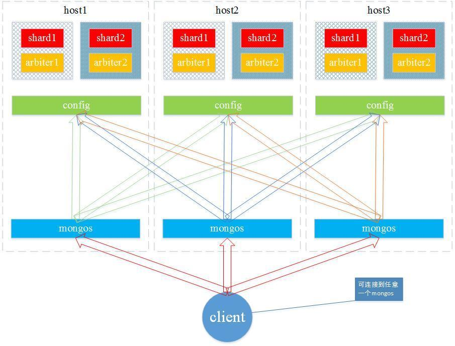
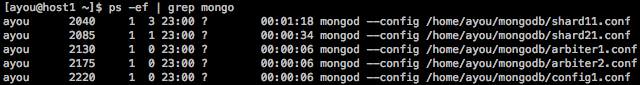
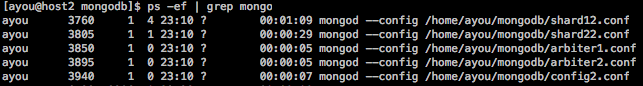
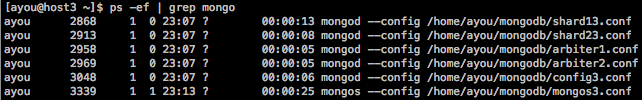
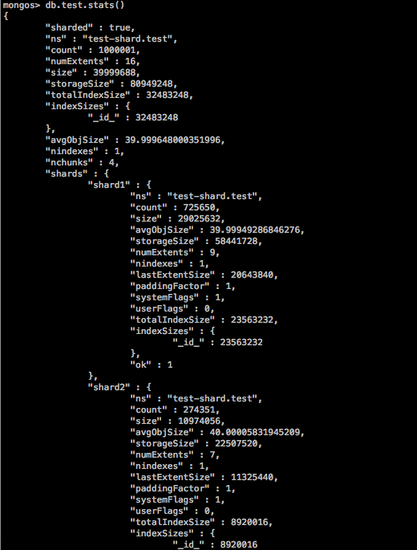
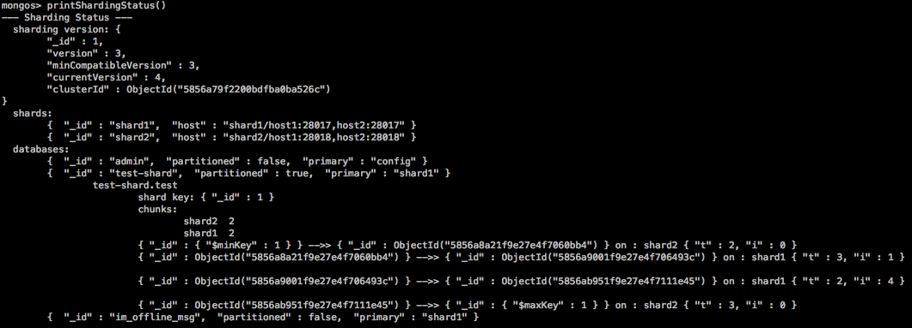

# 环境说明
## 三台机器(centos6.4)
* host1 192.168.1.201
* host2 192.168.1.202
* host3 192.168.1.203

## mongdb版本
2.4.0

## 服务规划



* shard1 28017：shard1的数据服务
* shard2 28018：shard2的数据服务
* config 20000：存储分片集群的的元数据，其中包括在每个mongod实例的基本信息和块信息
* arbiter1 28031：shard1的仲裁节点
* arbiter2 28032：shard2的仲裁节点
* mongos 28885：数据和请求分发的中心，使单一的mongod实例组成互相关联的集群

*仲裁节点是一种特殊的节点，它本身不存储数据，主要的作用是决定哪一个备用节点在主节点挂掉之后提升为主节点。*

# 配置文件
## host1
### 数据节点
shard11表示分片一的第一个节点
shard21表示分片二的第一个节点
```javascript
mkdir -p /home/ayou/mongodb/shard11
cat > /home/ayou/mongodb/shard11.conf <<EOF
shardsvr=true
replSet=shard1
port=28017
dbpath=/home/ayou/mongodb/shard11
oplogSize=2048
logpath=/home/ayou/mongodb/shard11.log
logappend=true
fork=true
rest=true
nojournal=true
EOF
```

```javascript
mkdir -p /home/ayou/mongodb/shard21
cat > /home/ayou/mongodb/shard21.conf <<EOF
shardsvr=true
replSet=shard2
port=28018
dbpath=/home/ayou/mongodb/shard21
oplogSize=2048
logpath=/home/ayou/mongodb/shard21.log
logappend=true
fork=true
rest=true
nojournal=true
EOF
```

### 配置节点
```javascript
mkdir -p /home/ayou/mongodb/config
cat > /home/ayou/mongodb/config1.conf <<EOF
configsvr=true
dbpath=/home/ayou/mongodb/config/
port=20000
logpath=/home/ayou/mongodb/config1.log
logappend=true
fork=true
nojournal=true
EOF
```

### 表决节点
arbiter1表示为分片一的仲裁节点
arbiter2表示为分片二的仲裁节点
```javascript
mkdir -p /home/ayou/mongodb/arbiter1
cat > /home/ayou/mongodb/arbiter1.conf <<EOF
shardsvr=true
replSet=shard1
port=28031
dbpath=/home/ayou/mongodb/arbiter1
oplogSize=100
logpath=/home/ayou/mongodb/arbiter1.log
logappend=true
fork=true
rest=true
nojournal=true
EOF
```

```javascript
mkdir -p /home/ayou/mongodb/arbiter2
cat > /home/ayou/mongodb/arbiter2.conf <<EOF
shardsvr=true
replSet=shard2
port=28032
dbpath=/home/ayou/mongodb/arbiter2
oplogSize=100
logpath=/home/ayou/mongodb/arbiter2.log
logappend=true
fork=true
rest=true
nojournal=true
EOF
```
### 路由节点
```javascript
mkdir -p /home/ayou/mongodb/mongos1
cat > /home/ayou/mongodb/mongos1.conf <<EOF
configdb=host1:20000,host2:20000,host3:20000
port=28885
chunkSize=100
logpath=/home/ayou/mongodb/mongos1.log
logappend=true
fork=true
EOF
```

## host2
### 数据节点
```javascript
mkdir -p /home/ayou/mongodb/shard12
cat > /home/ayou/mongodb/shard12.conf <<EOF
shardsvr=true
replSet=shard1
port=28017
dbpath=/home/ayou/mongodb/shard12
oplogSize=2048
logpath=/home/ayou/mongodb/shard12.log
logappend=true
fork=true
rest=true
nojournal=true
EOF
```

```javascript
mkdir -p /home/ayou/mongodb/shard22
cat > /home/ayou/mongodb/shard22.conf <<EOF
shardsvr=true
replSet=shard2
port=28018
dbpath=/home/ayou/mongodb/shard22
oplogSize=2048
logpath=/home/ayou/mongodb/shard22.log
logappend=true
fork=true
rest=true
nojournal=true
EOF
```

### 配置节点
```javascript
mkdir -p /home/ayou/mongodb/config
cat > /home/ayou/mongodb/config2.conf <<EOF
configsvr=true
dbpath=/home/ayou/mongodb/config/
port=20000
logpath=/home/ayou/mongodb/config2.log
logappend=true
fork=true
EOF
```

### 表决节点
```javascript
mkdir -p /home/ayou/mongodb/arbiter1
cat > /home/ayou/mongodb/arbiter1.conf <<EOF
shardsvr=true
replSet=shard1
port=28031
dbpath=/home/ayou/mongodb/arbiter1
oplogSize=100
logpath=/home/ayou/mongodb/arbiter1.log
logappend=true
fork=true
rest=true
nojournal=true
EOF
```

```javascript
mkdir -p /home/ayou/mongodb/arbiter2
cat > /home/ayou/mongodb/arbiter2.conf <<EOF
shardsvr=true
replSet=shard2
port=28032
dbpath=/home/ayou/mongodb/arbiter2
oplogSize=100
logpath=/home/ayou/mongodb/arbiter2.log
logappend=true
fork=true
rest=true
nojournal=true
EOF
```
### 路由节点
```javascript
mkdir -p /home/ayou/mongodb/mongos2
cat > /home/ayou/mongodb/mongos2.conf <<EOF
configdb=host1:20000,host2:20000,host3:20000
port=28885
chunkSize=100
logpath=/home/ayou/mongodb/mongos2.log
logappend=true
fork=true
EOF
```

## host3
### 数据节点
```javascript
mkdir -p /home/ayou/mongodb/shard13
cat > /home/ayou/mongodb/shard13.conf <<EOF
shardsvr=true
replSet=shard1
port=28017
dbpath=/home/ayou/mongodb/shard13
oplogSize=2048
logpath=/home/ayou/mongodb/shard13.log
logappend=true
fork=true
rest=true
nojournal=true
EOF
```

```javascript
mkdir -p /home/ayou/mongodb/shard23
cat > /home/ayou/mongodb/shard23.conf <<EOF
shardsvr=true
replSet=shard2
port=28018
dbpath=/home/ayou/mongodb/shard23
oplogSize=2048
logpath=/home/ayou/mongodb/shard23.log
logappend=true
fork=true
rest=true
nojournal=true
EOF
```

### 配置节点
```javascript
mkdir -p /home/ayou/mongodb/config
cat > /home/ayou/mongodb/config3.conf <<EOF
configsvr=true
dbpath=/home/ayou/mongodb/config/
port=20000
logpath=/home/ayou/mongodb/config3.log
logappend=true
fork=true
EOF
```

### 表决节点
```javascript
mkdir -p /home/ayou/mongodb/arbiter1
cat > /home/ayou/mongodb/arbiter1.conf <<EOF
shardsvr=true
replSet=shard1
port=28031
dbpath=/home/ayou/mongodb/arbiter1
oplogSize=100
logpath=/home/ayou/mongodb/arbiter1.log
logappend=true
fork=true
rest=true
nojournal=true
EOF
```

```javascript
mkdir -p /home/ayou/mongodb/arbiter2
cat > /home/ayou/mongodb/arbiter2.conf <<EOF
shardsvr=true
replSet=shard2
port=28032
dbpath=/home/ayou/mongodb/arbiter2
oplogSize=100
logpath=/home/ayou/mongodb/arbiter2.log
logappend=true
fork=true
rest=true
nojournal=true
EOF
```
### 路由节点
```javascript
mkdir -p /home/ayou/mongodb/mongos3
cat > /home/ayou/mongodb/mongos3.conf <<EOF
configdb=host1:20000,host2:20000,host3:20000
port=28885
chunkSize=100
logpath=/home/ayou/mongodb/mongos3.log
logappend=true
fork=true
EOF
```

# 启动服务
* mongos服务可以只启动一台，本文在host3上启动
* 如果启动不了，可以尝试同步时间``/usr/sbin/ntpdate *`` ``*``表示需要与之同步的机器名

## host1
```javascript
mongod --config /home/ayou/mongodb/shard11.conf
mongod --config /home/ayou/mongodb/shard21.conf
mongod --config /home/ayou/mongodb/arbiter1.conf
mongod --config /home/ayou/mongodb/arbiter2.conf
mongod --config /home/ayou/mongodb/config1.conf
mongos --config /home/ayou/mongodb/mongos1.conf
```
## host2
```javascript
mongod --config /home/ayou/mongodb/shard12.conf
mongod --config /home/ayou/mongodb/shard22.conf
mongod --config /home/ayou/mongodb/arbiter1.conf
mongod --config /home/ayou/mongodb/arbiter2.conf
mongod --config /home/ayou/mongodb/config2.conf
mongos --config /home/ayou/mongodb/mongos2.conf
```
## host3
```javascript
mongod --config /home/ayou/mongodb/shard13.conf
mongod --config /home/ayou/mongodb/shard23.conf
mongod --config /home/ayou/mongodb/arbiter1.conf
mongod --config /home/ayou/mongodb/arbiter2.conf
mongod --config /home/ayou/mongodb/config3.conf
mongos --config /home/ayou/mongodb/mongos3.conf
```

# 启动路由
任选一台机器，执行如下命令
```javascript
cat > /home/ayou/mongodb/mongos.conf <<EOF
configdb=host1:20000,host2:20000,host3:20000
port=41000
chunkSize=100
logpath=/home/ayou/mongodb/mongos.log
logappend=true
fork=true
EOF

mongos --config /home/ayou/mongodb/mongos.conf
```

# 查看运行状态






# 配置分片
* 可以在任意台机器上进行如下操作
* 可能需要关闭防火墙

```javascript
mongo host1:28017/admin

config = {_id:'shard1', members: [{_id: 0, host: "host1:28017"},{_id: 1, host:"host2:28017"},{ _id : 2,host:"host3:28017",slaveDelay :7200 ,priority:0},{_id: 3, host: 'host1:28031', arbiterOnly : true},{_id: 4,host: 'host2:28031', arbiterOnly : true},{_id: 5, host: 'host3:28031',arbiterOnly : true}]};
rs.initiate(config);
```

```javascript
mongo host2:28018/admin

config = {_id:'shard2', members: [{_id: 0, host: "host1:28018"},{_id: 1, host:"host2:28018"},{ _id : 2,host:"host3:28018",slaveDelay :7200 ,priority:0},{_id: 3, host: 'host1:28032', arbiterOnly : true},{_id: 4,host: 'host2:28032', arbiterOnly : true},{_id: 5, host: 'host3:28032',arbiterOnly : true}]};
rs.initiate(config);
```

# 添加分片
任选一台机器
```javascript
mongo host3:28885/admin
db.runCommand({"addshard" : "shard1/host1:28017,host2:28017"})

db.runCommand({"addshard" : "shard2/host1:28018,host2:28018"})

db.runCommand( { "enablesharding" : "test-shard"})

db.runCommand( { shardcollection : "test-shard.test",key : {_id: 1} } )
```

# 测试
往test-shard.test中插入大量数据
```
for(var i=0;i<1000000;i++) db.test.insert({name:"no"+i})
```

查看分片状态




