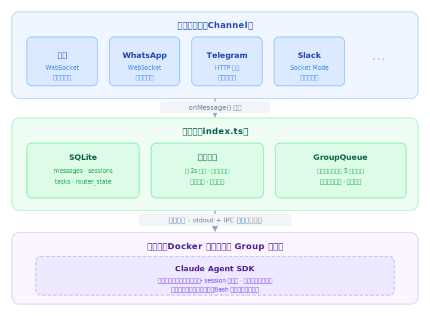
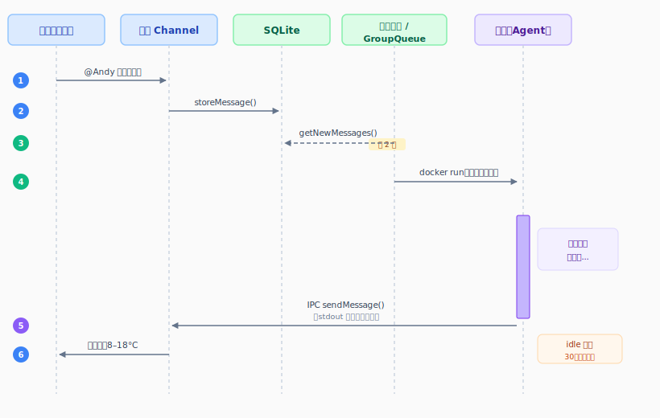

# 前言

我用飞书和 AI 对话已经有一段时间了。这件事听起来简单，背后其实需要一套完整的基础设施：消息要能收发、对话上下文要能持久化、agent 执行环境要足够安全。

OpenClaw 是这个领域最知名的开源项目，功能相当完整。但当我真正想搞清楚它是怎么工作的时候，发现这几乎是不可能的事——**近 50 万行代码，53 个配置文件，70+ 个依赖**，4-5 个进程同时运行。软件跑在我的机器上，我却完全不知道它在干什么。

NanoClaw 就是为了解决这个问题而生的。它提供了相同的核心能力，但整个 codebase 小到一个下午就能通读。

接下来我们从整体架构开始，到一条消息的完整旅程，再到各个模块的细节，一起把它拆开来看。

---

# 一、整体架构

NanoClaw 是一个**单 Node.js 进程**，内部分三层：



几个关键概念先说清楚：

**Group（群组）**：每个注册的对话就是一个 Group。比如你的飞书私聊是一个 Group，一个工作群是另一个 Group。每个 Group 有独立的记忆文件（`CLAUDE.md`）、独立的工作目录、独立的对话 session，互不干扰。同一个 Group 同时只跑一个容器；全局最多 5 个容器并发，超出的进等待队列，有槽位自动补上。失败会指数退避重试，最多 5 次。

**Channel**：消息来源的抽象。飞书、WhatsApp、Telegram 都是 Channel，各自实现同一套接口，启动时自注册进来。你不需要哪个 Channel，代码里就没有它的任何痕迹。

**容器**：每次 agent 处理消息，都在一个独立的 Linux 容器里执行。容器只能看到明确挂载进去的目录，bash 命令跑在容器内，不影响宿主机。

---

# 二、一条消息的完整旅程

用一个具体例子串起全流程：**在飞书里发一条消息 `@Andy 帮我查一下北京天气`**。

## 2.1 飞书 Channel 接收消息

飞书 Channel 用的是 WebSocket 长连接（Lark SDK 的 `WSClient`），消息实时推送过来，不需要轮询。

收到消息后，调用 `onMessage()` 回调，把消息写入 SQLite：

```typescript
// src/channels/feishu.ts
const dispatcher = new lark.EventDispatcher({}).register({
  'im.message.receive_v1': async (data) => {
    const chatId = data.message.chat_id
    const jid = `feishu:${chatId}`
    const content = JSON.parse(data.message.content).text

    this.opts.onMessage(jid, {
      id: data.message.message_id,
      chat_jid: jid,
      sender: data.sender.sender_id.open_id,
      sender_name: data.sender.sender_id.open_id,
      content,
      timestamp: new Date(Number(data.message.create_time)).toISOString(),
    })
  },
})
```

此时消息已经在 SQLite 的 `messages` 表里了，等待被处理。

## 2.2 消息循环检测触发词

主进程里有一个每 2 秒轮询一次的消息循环：

```typescript
// src/index.ts
while (true) {
  const {messages, newTimestamp} = getNewMessages(
    jids,
    lastTimestamp,
    ASSISTANT_NAME,
  )

  if (messages.length > 0) {
    // 检查触发词 @Andy
    const triggerPattern = getTriggerPattern(group.trigger) // /^@Andy\b/i
    const hasTrigger = groupMessages.some((m) =>
      triggerPattern.test(m.content.trim()),
    )

    if (hasTrigger) {
      queue.enqueueMessageCheck(chatJid)
    }
  }

  await new Promise((resolve) => setTimeout(resolve, POLL_INTERVAL)) // 2000ms
}
```

实际日志里能看到这个过程：

```
{"level":30,"time":"2026-03-30T10:37:17.545Z","count":1,"msg":"New messages"}
{"level":30,"time":"2026-03-30T10:37:17.592Z","group":"Feishu Main","messageCount":1,"msg":"Processing messages"}
{"level":30,"time":"2026-03-30T10:37:17.617Z","group":"Feishu Main","containerName":"nanoclaw-main-1774867037616","mountCount":7,"msg":"Spawning container agent"}
```

## 2.3 组装 prompt，启动容器

触发词命中后，从 SQLite 拉取这个 Group 上次 agent 回复之后的所有消息（最多 10 条），组装成 XML 格式的 prompt：

```xml
<context timezone="Asia/Shanghai" />
<messages>
<message sender="youxingzhi" time="2026-03-30 14:23:10">@Andy 帮我查一下北京天气</message>
</messages>
```

然后启动一个 Docker 容器：

```bash
docker run -i --rm \
  --name nanoclaw-main-1774867037616 \
  -e TZ=Asia/Shanghai \                                          # 容器时区跟随宿主机
  -e ANTHROPIC_BASE_URL=http://host.docker.internal:3001 \      # API 流量走凭证代理
  -e ANTHROPIC_API_KEY=placeholder \                            # 真实 key 由代理注入，容器看不到
  --add-host host.docker.internal:host-gateway \                # 让容器能访问宿主机
  --user 501:20 \                                               # 以宿主用户身份运行，挂载文件权限一致
  -e HOME=/home/node \
  -v /path/to/nanoclaw:/workspace/project:ro \                  # 项目代码只读
  -v /dev/null:/workspace/project/.env:ro \                     # 遮蔽 .env，secrets 不暴露给容器
  -v /path/to/nanoclaw/groups/main:/workspace/group \           # group 工作目录（可写）
  -v /path/to/nanoclaw/data/sessions/main/.claude:/home/node/.claude \ # 对话 session 持久化
  -v /path/to/nanoclaw/data/ipc/main:/workspace/ipc \           # IPC 双向通信目录（详见 3.3 节）
  nanoclaw-agent:latest
```

几个关键点：

- **API key 永远不进容器**：`ANTHROPIC_BASE_URL` 指向宿主机上的**凭证代理**（credential proxy），这是 NanoClaw 主进程启动时在 3001 端口开的一个 HTTP 服务。容器里的 Claude Agent SDK 以为自己在访问 Anthropic API，实际上所有请求都先到代理，代理把 `ANTHROPIC_API_KEY=placeholder` 替换成真实 key，再转发给 Anthropic。容器里的 agent 拿不到真实 key——即使被 prompt injection 攻击也无法泄露。
- **`--add-host host.docker.internal:host-gateway`**：在容器的 `/etc/hosts` 里写一条记录，把 `host.docker.internal` 指向宿主机的 IP（Docker 网桥的网关地址）。macOS 上 Docker Desktop 会自动做这件事，Linux 上需要手动加。有了这条记录，容器才能通过 `host.docker.internal:3001` 访问到宿主机上的凭证代理。
- **`.env` 被 `/dev/null` 遮蔽**：项目根目录是只读挂载的，但 `.env` 里有 secrets，用 `/dev/null` 覆盖挂载点，agent 读不到任何内容。
- **只能看到挂载的目录**：容器内没有宿主机的其他文件系统，agent 执行 `bash` 命令也只影响容器内部。

## 2.4 Agent 处理，结果通过 stdout 返回

容器内 Claude Agent SDK 读取 prompt，开始处理（调用工具查天气等）。处理完成后向 stdout 打印边界标记：

```
---NANOCLAW_OUTPUT_START---
{"status":"success","result":"北京今天晴，气温 8-18°C，东风 3 级。","newSessionId":"sess_abc123"}
---NANOCLAW_OUTPUT_END---
```

NanoClaw 主进程（Node.js）用 `child_process.spawn` 执行 `docker run` 命令，通过 stdout pipe 实时监听输出。**不需要等容器退出**——每次检测到完整的标记对，立刻解析 JSON 并回复用户：

```typescript
// src/container-runner.ts
container.stdout.on('data', (chunk) => {
  parseBuffer += chunk
  while (parseBuffer.includes('---NANOCLAW_OUTPUT_START---')) {
    const startIdx = parseBuffer.indexOf('---NANOCLAW_OUTPUT_START---')
    const endIdx = parseBuffer.indexOf('---NANOCLAW_OUTPUT_END---')
    if (endIdx === -1) break // 数据还没收全，等下一个 chunk

    const output = JSON.parse(
      parseBuffer.slice(startIdx + marker.length, endIdx).trim(),
    )
    onOutput(output) // 立刻回复用户
    parseBuffer = parseBuffer.slice(endIdx + endMarker.length)
  }
})
```

回复发出后，**容器并不退出**，而是进入 idle 状态继续监听 `input/` 目录。下一条消息到来时直接注入，容器无缝处理，标记对再次出现，用户收到新的回复。30 分钟无活动后容器才自动销毁。

用边界标记而不是直接解析最后一行，是因为 Claude Agent SDK 本身也会向 stdout 打印东西（工具调用日志、思考过程等），两个标记能精准定位真正的输出，不会被噪声干扰。

## 2.5 完整时序图



---

# 三、各模块详解

## 3.1 Channel 层：统一接口，自注册

所有 Channel 实现同一套接口：

```typescript
// src/types.ts
interface Channel {
  name: string
  connect(): Promise<void>
  sendMessage(jid: string, text: string): Promise<void>
  isConnected(): boolean
  ownsJid(jid: string): boolean // 判断某个 JID 归属哪个 Channel
  disconnect(): Promise<void>
  setTyping?(jid: string, typing: boolean): Promise<void>
}
```

每个 Channel 在模块加载时自注册，主进程统一 connect。以飞书为例，用的是 Lark SDK 的 WebSocket 长连接，不需要暴露公网端口，连接稳定：

```typescript
// src/channels/feishu.ts
registerChannel('feishu', (opts: ChannelOpts) => {
  const appId = process.env.FEISHU_APP_ID
  const appSecret = process.env.FEISHU_APP_SECRET
  if (!appId || !appSecret) return null // 没配置就跳过
  return new FeishuChannel(opts, appId, appSecret, mainChatId)
})
```

不同 Channel 的传输方式各不相同：

| Channel  | 传输方式                   |
| -------- | -------------------------- |
| 飞书     | WebSocket（Lark WSClient） |
| Slack    | WebSocket（Socket Mode）   |
| WhatsApp | WebSocket（Baileys）       |
| Telegram | HTTP 长轮询                |
| Gmail    | HTTP 轮询                  |

**JID**（Jabber ID）是跨 Channel 的统一标识符。飞书群的 JID 格式是 `feishu:{chat_id}`，Telegram 是 `telegram:{chatId}`，所有路由逻辑都用 JID 而不是 Channel 原始 ID。

## 3.2 消息编排：SQLite + 游标机制

消息存入 SQLite 的 `messages` 表后，消息循环通过**游标**来追踪处理进度：

- `lastTimestamp`：全局游标，记录最后一次"看到"哪条消息
- `lastAgentTimestamp[chatJid]`：每个 Group 的游标，记录 agent 上次处理到哪条

两个游标分开是有原因的：消息"看到"和"处理完"是两件事。主进程先推进全局游标（防止重复检测），agent 处理完后才推进 Group 游标。如果 agent 出错，Group 游标回滚，下次会重新处理。

两个游标都持久化在 SQLite 的 `router_state` 表里，进程重启后从数据库恢复，不会丢失处理进度。

## 3.3 宿主-容器通信（IPC）

这是整个系统最精妙的部分——宿主机和容器完全通过**文件系统**通信，不走网络。

容器启动时，`data/ipc/{folder}/` 目录被挂载进来：

```
data/ipc/main/
├── input/      # 宿主 → 容器（追加消息、关闭信号）
├── messages/   # 容器 → 宿主（发送消息）
└── tasks/      # 容器 → 宿主（创建/管理定时任务）
```

**宿主 → 容器：两种路径**

路径 A：启动容器时通过 stdin 传入初始 prompt（一次性）。

路径 B：容器运行期间，新消息通过文件写入 `input/` 目录。容器内的 agent-runner 定期轮询这个目录，发现文件立刻读取并注入 agent：

```typescript
// src/group-queue.ts
sendMessage(groupJid: string, text: string): boolean {
  const inputDir = path.join(DATA_DIR, 'ipc', state.groupFolder, 'input');
  const filename = `${Date.now()}-${Math.random().toString(36).slice(2, 6)}.json`;
  fs.writeFileSync(tempPath, JSON.stringify({ type: 'message', text }));
  fs.renameSync(tempPath, filepath); // 原子写入，防止容器读到半截文件
  return true;
}
```

关闭信号也是文件：写一个空的 `_close` 文件，容器收到后优雅退出。

**容器 → 宿主：三种路径**

路径 A：最终结果通过 stdout 的边界标记：

```
---NANOCLAW_OUTPUT_START---
{"status":"success","result":"...","newSessionId":"sess_xxx"}
---NANOCLAW_OUTPUT_END---
```

路径 B：发送消息给用户，写 `messages/` 目录：

```json
{
  "type": "message",
  "chatJid": "feishu:oc_xxx",
  "text": "北京今天晴，气温 8-18°C"
}
```

路径 C：创建定时任务，写 `tasks/` 目录：

```json
{
  "type": "schedule_task",
  "prompt": "每天早上汇报天气",
  "schedule_type": "cron",
  "schedule_value": "0 9 * * *",
  "targetJid": "feishu:oc_xxx"
}
```

宿主的 IPC watcher 每秒扫描 `messages/` 和 `tasks/`，处理完立刻删除文件。

## 3.4 会话与记忆

容器是临时的——idle 30 分钟后会被销毁。但对话不能因此断掉。NanoClaw 把"记忆"分成两层来解决这个问题。

**第一层：NanoClaw 的调度记忆（SQLite）**

轮询、触发词检测、多消息合并——这些都发生在 Claude 介入之前。SQLite 的 `messages` 表存的是原始消息文本，`router_state` 表存的是游标，这两张表是 NanoClaw 自己的调度中枢，Claude 根本不知道它们的存在。

**第二层：Claude 的对话记忆（SDK session）**

Claude Agent SDK 把完整的对话历史存成 `.jsonl` 文件，每个 session 有一个唯一 ID。NanoClaw 把这个 `sessionId` 持久化在 SQLite 的 `sessions` 表里：

```
$ sqlite3 store/messages.db "SELECT group_folder, session_id FROM sessions;"
main|796347c3-64fe-4f86-9d9f-b16b17de0380
feishu_work|c2d1be5d-58d4-46fe-9b09-c923574b7505
```

对应的文件就在磁盘上：

```
data/sessions/main/.claude/projects/-workspace-group/
└── 796347c3-64fe-4f86-9d9f-b16b17de0380.jsonl   ← 完整对话历史
```

这个格式和你本机安装的 Claude Code 完全一样——Claude Code 把 session 存在 `~/.claude/projects/{工作目录}/` 下，NanoClaw 的 session 存在容器挂载的 `data/sessions/{folder}/.claude/projects/` 下，都是同一套 Claude Agent SDK 的标准格式，只是挂载路径不同。NanoClaw 没有自己实现任何对话持久化，而是直接复用了 Claude Code 本身的能力。

容器销毁时，`.jsonl` 文件还在磁盘上，`sessionId` 还在 SQLite 里。下次消息到来，新容器启动，NanoClaw 把 `sessionId` 传给 SDK，SDK 读取对应的 `.jsonl` 文件，对话无缝继续——Claude 看到的是一条从未中断的对话。

**第三层：人设与背景知识（CLAUDE.md）**

每个 Group 还有一个 `groups/{folder}/CLAUDE.md`，在容器启动时作为系统提示读入。我的主群 `CLAUDE.md` 里定义了 Andy 的名字、能力范围、回复风格。你也可以直接在飞书里告诉 Andy「记住我在北京，平时早上 8 点前不要主动打扰我」，Andy 会把这些写进 `CLAUDE.md`，之后每次容器启动都会读到。

## 3.5 定时任务

Agent 可以通过 IPC 文件给自己或其他 Group 创建定时任务。支持三种调度类型：

| 类型       | 例子                   | 说明             |
| ---------- | ---------------------- | ---------------- |
| `cron`     | `0 9 * * *`            | 每天早上 9 点    |
| `interval` | `3600000`              | 每小时（毫秒）   |
| `once`     | `2026-04-01T09:00:00Z` | 指定时间执行一次 |

主进程的 scheduler 每 60 秒扫描 `scheduled_tasks` 表，对到期任务启动独立容器执行，结果写回 `task_run_logs`。

比如你告诉 Andy「每天早上 9 点给我发天气预报」，agent 会写一个 IPC 文件到 `tasks/`，主进程创建任务记录，之后每天定时触发，不需要你再做任何事。

---

# 四、NanoClaw vs OpenClaw

有了前面的架构理解，再来看两者的差异就很具体了。

|                | OpenClaw             | NanoClaw                      |
| -------------- | -------------------- | ----------------------------- |
| 代码量         | ~50 万行             | 几千行，一个下午能通读        |
| 进程数         | 4-5 个               | 1 个 Node.js 进程             |
| 安全隔离       | 应用层白名单、配对码 | OS 层容器隔离                 |
| Agent 执行环境 | 同一进程，共享内存   | 独立 Linux 容器，只看挂载目录 |
| 定制方式       | 配置文件             | fork + 改代码                 |
| 扩展方式       | 内置功能             | Skill（git 分支 merge）       |
| 依赖数量       | 70+                  | 精简                          |

安全这一块值得多说一句。OpenClaw 的 agent 跑在主进程里，如果 agent 被诱导执行了恶意命令（比如 prompt injection），它实际上能访问你机器上所有 OpenClaw 有权限访问的东西。

NanoClaw 的 agent 跑在容器里，`bash` 命令执行的是容器内的 bash。即使 agent 被欺骗，它也只能动容器内挂载的那几个目录，出不了沙箱。

**Skill 机制**是另一个值得说的差异。NanoClaw 的功能扩展不是往主仓库加代码，而是维护在独立的 git 分支上。不需要的功能，代码里完全不存在。

以 Gmail 集成为例。在你的 fork 里对 Claude Code 说 `/add-gmail`，Claude Code 会：

1. 把 `nanoclaw-gmail` 仓库加为 git remote，fetch 并 merge 对应分支
2. Merge 带进来的改动：`src/channels/gmail.ts`（GmailChannel 实现）、barrel 文件里的 import、容器挂载配置（`~/.gmail-mcp`）、agent 侧的 MCP server 配置
3. 引导你完成 GCP OAuth 授权，把凭证写到 `~/.gmail-mcp/`
4. 重新构建容器镜像，重启服务

整个过程 Claude Code 全程操作，你只需要在浏览器里点一次 OAuth 授权。之后 agent 就能读邮件、发邮件，或者在收到新邮件时主动触发对话——取决于你选了 tool 模式还是 channel 模式。

如果你之后不想要 Gmail 了，反向操作：删掉 `gmail.ts`、移除挂载和 MCP 配置、重建容器。代码回到没有任何 Gmail 痕迹的状态。

当然，NanoClaw 也有明显的局限：

- **固定延迟**：消息循环每 2 秒轮询一次，加上容器 cold start，响应速度不如常驻进程方案
- **维护负担**：定制靠 fork，上游有更新时需要自己 merge，冲突自己解决
- **只支持文本**：图片、文件、语音需要自己扩展 channel 实现
- **没有管理界面**：查任务、改配置、看日志全靠命令行
- **不适合规模化团队部署**：全局最多 5 个容器并发，超出排队；单进程单机，没有高可用方案；所有群组共享同一套权限，没有角色和审计机制。几个人共用一个群聊完全没问题，但如果你想给一个组织的几十个群同时提供服务，这套架构撑不住

这些局限大多是"简单"这个目标的代价。如果你需要毫秒级响应、多媒体支持、或者企业级的权限管控，NanoClaw 不是合适的选择。

---

# 总结

NanoClaw 的核心主张只有一句话：**你应该真正理解跑在自己机器上的软件。**

- 代码少到可以通读
- 安全靠容器隔离，不是靠应用层君子协定
- 通过文件系统做 IPC，没有隐藏的网络通信
- 按需 fork，不是全家桶

如果你也想用飞书（或者 WhatsApp、Telegram）和一个真正属于自己的 AI 助手对话，但又想要个轻量级的工具，可以试试。
