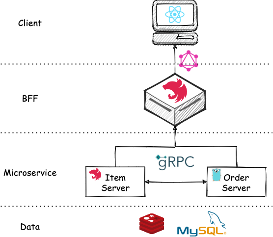

# 前言

Nest.js 微服务实战系列计划实现一个简单的基于微服务的系统（TaoLJ），系统架构如下：



系统分为 Client，BFF（Backend For Frontend），Microservice，Data 四层。Client 使用 React 实现，与 BFF 通过 GraphQL 通信。BFF 使用 Nest.js 搭建，与 Microservice 之间通过 gRPC 通信。系统包含两个微服务 Item Server 和 Order Server，分别用 Node.js（Nest.js 框架） 和 Golang 来编写，微服务之间也通过 gRPC 通信。数据层就使用最常用的 MySQL 和 Redis。

本篇是 Nest.js 微服务实战的第一篇，搭建 RPC 服务。即图中的 Item Server 和 Order Server。

# 搭建 RPC 服务

首先规划一下我们的目录结构：

```js
.
├── client-for-debug // 用来调试的客户端，可以连接 BFF 和 Microservice
├── item-server
├── order-server
└── proto // 用来放 gRPC 需要用到的 proto 文件
```

由于 proto 文件需要被客户端和服务端共享，所以这里单独拿出来作为一个目录。接下来，先来搭建 Item Server。

## Nest.js 搭建 Item Server 微服务

首先，我们在 `proto` 目录下新建 `item.proto`：

```proto
syntax = "proto3";

package item;

import "common.proto";

service ItemService {
  rpc FindOne (ItemById) returns (Item) {}
  rpc GetItems (common.Pagination) returns (Items) {}
}

message ItemById {
  int32 id = 1;
}

message Item {
  int32 id = 1;
  string name = 2;
}

message Items {
  repeated Item list = 1;
}
```

然后，参考官网 [gRPC](https://docs.nestjs.com/microservices/grpc) 搭建出项目结构，如下所示：

```js
.
├── src
  ├── app.module.ts
  ├── gen-code // 存放通过 proto 文件生成的代码
  ├── item.controller.ts
  ├── item.service.ts
  └── main.ts
```

其中 `gen-code` 用于存放通过 proto 文件生成的代码，那接下来就是生成代码。

需要先安装如下工具：

`protoc`：用来编译 `proto` 文件到代码的工具，本文使用 brew 安装，其他平台可自行搜索相关方式。
`ts-proto`：`protoc` 的插件，用来生成 `TS` 代码

之后，在 `item-server` 目录下执行如下命令：

```js
protoc --plugin=./node_modules/.bin/protoc-gen-ts_proto --ts_proto_out=./src/gen-code --ts_proto_opt=nestJs=true --proto_path=../proto item.proto
```

即可生成 Nest.js 风格的代码：

```js
.
├── gen-code
│   ├── common.ts
│   └── item.ts
```

接着，我们需要按照 `proto` 文件中的定义实现我们的 `controller`：

```js
import {Controller} from '@nestjs/common'
import {Pagination} from './gen-code/common'
import {
  Item,
  Items,
  ItemServiceController,
  ItemServiceControllerMethods,
} from './gen-code/item'
import {ItemById} from './gen-code/item'

const items = [
  {id: 1, name: 'Banana Peel'},
  {id: 2, name: 'Waste Paper'},
]

@Controller('item')
@ItemServiceControllerMethods()
export class ItemController implements ItemServiceController {
  getItems(request: Pagination): Items {
    return {list: items}
  }
  findOne(data: ItemById): Item {
    return items.find(({id}) => id === data.id)
  }
}
```

这样，Item Server RPC 服务算是搭建好了，我们写一个客户端来测试一下：

```js
const path = require('path')

const PROTO_PATH = path.resolve(__dirname, '../proto/item.proto')

const grpc = require('@grpc/grpc-js')
const protoLoader = require('@grpc/proto-loader')
const packageDefinition = protoLoader.loadSync(PROTO_PATH, {
  keepCase: true,
  longs: String,
  enums: String,
  defaults: true,
  oneofs: true,
})
const item = grpc.loadPackageDefinition(packageDefinition).item

const clientItem = new item.ItemService(
  'localhost:9001',
  grpc.credentials.createInsecure()
)

clientItem.findOne({id: 1}, function (err, response) {
  console.log('findOne: ', response)
})

clientItem.getItems({page: 1, pageSize: 10}, function (err, response) {
  console.log('getItems: ', response)
})
```

验证无误，继续搭建 Order Server RPC 服务。

## Golang 搭建 Order Server 微服务

> 本文 Golang 版本为 1.19

首先同样在 `proto` 目录下新建 `order.proto`，这里就不贴代码了。

然后，在 `order-server` 目录下执行：

```js
protoc --go_out=./pb --go_opt=paths=source_relative --proto_path={Your path here}/proto \
  --go-grpc_out=./pb --go-grpc_opt=paths=source_relative \
  order.proto common.proto
```

则会生成 Golang 所需的代码：

```js
.
├── pb
│   ├── common.pb.go
│   ├── order.pb.go
│   └── order_grpc.pb.go
```

然后，编写我们的服务端代码：

```go
package main

import (
	"context"
	"log"
	"net"
	"order-server/pb"
	"time"

	"google.golang.org/grpc"
)

const PORT = "9002"

type Server struct {
	pb.UnimplementedOrderServiceServer
}

func (s *Server) FindOne(ctx context.Context, params *pb.OrderById) (*pb.Order, error) {
	order := &pb.Order{Id: 1, Price: 99.9, CreateTime: time.Now().Unix(), ItemIds: []int32{1, 2}}
	return order, nil
}

func main() {
	server := grpc.NewServer()
	pb.RegisterOrderServiceServer(server, &Server{})

	lis, err := net.Listen("tcp", ":"+PORT)
	if err != nil {
		log.Fatalf("net.Listen err: %v", err)
	}
	server.Serve(lis)
}
```

这样，我们的 Golang RPC 服务端就搭好了。客户端则同上文类似，换一下 proto 文件和端口号即可。
