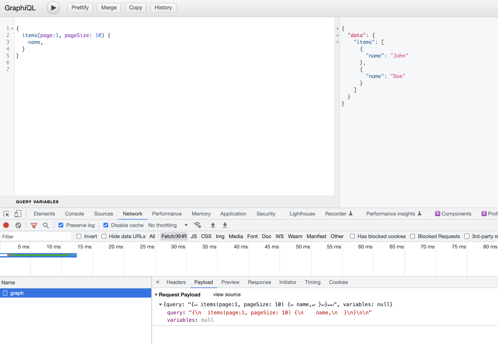
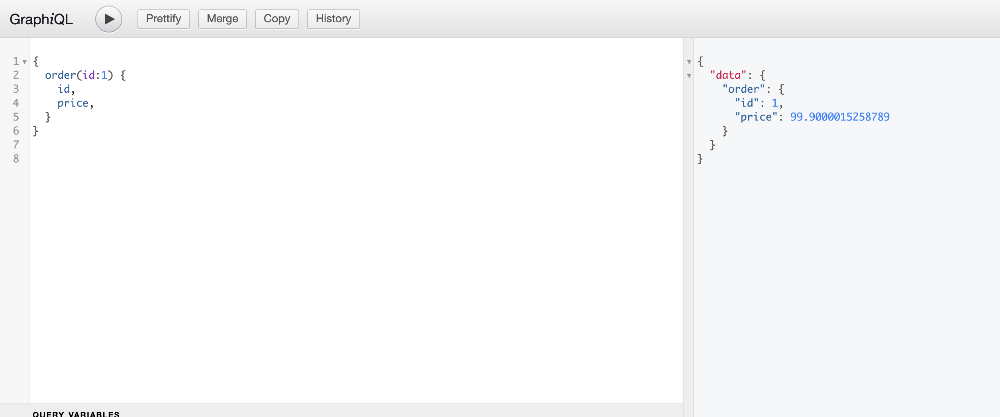
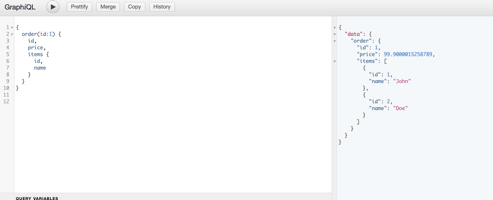
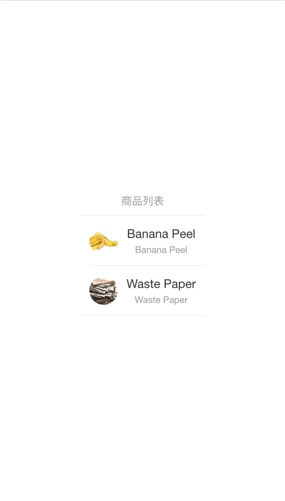

# 前言

Nest.js 微服务实战系列计划实现一个简单的基于微服务的系统（TaoLJ），系统架构如下：


系统分为 Client，BFF（Backend For Frontend），Microservice，Data 四层。Client 使用 React 实现，与 BFF 通过 GraphQL 通信。BFF 使用 Nest.js 搭建，与 Microservice 之间通过 gRPC 通信。系统包含两个微服务 Item Server 和 Order Server，分别用 Node.js（Nest.js 框架） 和 Golang 来编写，微服务之间也通过 gRPC 通信。数据层就使用最常用的 MySQL 和 Redis。

本篇是 Nest.js 微服务实战的第一篇，搭建系统框架。

你也可以直接查看[代码](https://github.com/ParadeTo/taolj/tree/milestone-1)。

# 搭建 RPC 微服务

首先规划一下我们的目录结构：

```js
.
├── bff
├── for-debug // 用来调试的客户端，可以连接 BFF 和 Microservice
├── item-server
├── order-server
└── proto // 用来放 gRPC 需要用到的 proto 文件
```

由于 proto 文件需要被客户端和服务端共享，所以这里单独拿出来作为一个目录。接下来，先来搭建 Item Server。

## Nest.js 搭建 Item Server 微服务

首先，我们在 `proto` 目录下新建 `item.proto`：

```proto
syntax = "proto3";

package item;

import "common.proto";

service ItemService {
  rpc FindOne (ItemById) returns (Item) {}
  rpc GetItems (common.Pagination) returns (Items) {}
}

message ItemById {
  int32 id = 1;
}

message Item {
  int32 id = 1;
  string name = 2;
  string url = 3;
}

message Items {
  repeated Item list = 1;
}
```

然后，参考官网 [gRPC](https://docs.nestjs.com/microservices/grpc) 搭建出项目结构，如下所示：

```js
.
├── src
  ├── app.module.ts
  ├── gen-code // 存放通过 proto 文件生成的代码
  ├── item.controller.ts
  ├── item.service.ts
  └── main.ts
```

其中 `gen-code` 用于存放通过 proto 文件生成的代码，那接下来就是生成代码。

需要先安装如下工具：

`protoc`：用来编译 `proto` 文件到代码的工具，本文使用 brew 安装，其他平台可自行搜索相关方式。
`ts-proto`：`protoc` 的插件，用来生成 `TS` 代码

之后，在 `item-server` 目录下执行如下命令：

```js
protoc --plugin=./node_modules/.bin/protoc-gen-ts_proto --ts_proto_out=./src/gen-code --ts_proto_opt=nestJs=true --proto_path=../proto item.proto
```

即可生成 Nest.js 风格的代码：

```js
.
├── gen-code
│   ├── common.ts
│   └── item.ts
```

接着，我们需要按照 `proto` 文件中的定义实现我们的 `controller`：

```js
import {Controller} from '@nestjs/common'
import {Pagination} from './gen-code/common'
import {
  Item,
  Items,
  ItemServiceController,
  ItemServiceControllerMethods,
} from './gen-code/item'
import {ItemById} from './gen-code/item'

const items = [
  {
    id: 1,
    name: 'Banana Peel',
    url: 'https://images.indianexpress.com/2021/10/banana-peel-1200.jpg',
  },
  {
    id: 2,
    name: 'Waste Paper',
    url: 'https://www.wpt-nl.com/images/module_image/img1_800_600_1593777835.jpg',
  },
]

@Controller('item')
@ItemServiceControllerMethods()
export class ItemController implements ItemServiceController {
  getItems(request: Pagination): Items {
    return {list: items}
  }
  findOne(data: ItemById): Item {
    return items.find(({id}) => id === data.id)
  }
}
```

这样，Item Server RPC 服务算是搭建好了，我们写一个客户端来测试一下：

```js
const path = require('path')

const PROTO_PATH = path.resolve(__dirname, '../proto/item.proto')

const grpc = require('@grpc/grpc-js')
const protoLoader = require('@grpc/proto-loader')
const packageDefinition = protoLoader.loadSync(PROTO_PATH, {
  keepCase: true,
  longs: String,
  enums: String,
  defaults: true,
  oneofs: true,
})
const item = grpc.loadPackageDefinition(packageDefinition).item

const clientItem = new item.ItemService(
  'localhost:9001',
  grpc.credentials.createInsecure()
)

clientItem.findOne({id: 1}, function (err, response) {
  console.log('findOne: ', response)
})

clientItem.getItems({page: 1, pageSize: 10}, function (err, response) {
  console.log('getItems: ', response)
})
```

验证无误，继续搭建 Order Server RPC 服务。

## Golang 搭建 Order Server 微服务

> 本文 Golang 版本为 1.19

首先同样在 `proto` 目录下新建 `order.proto`，这里就不贴代码了。

然后，在 `order-server` 目录下执行：

```js
protoc --go_out=./pb --go_opt=paths=source_relative --proto_path={Your path here}/proto \
  --go-grpc_out=./pb --go-grpc_opt=paths=source_relative \
  order.proto common.proto
```

则会生成 Golang 所需的代码：

```js
.
├── pb
│   ├── common.pb.go
│   ├── order.pb.go
│   └── order_grpc.pb.go
```

然后，编写我们的服务端代码：

```go
package main

import (
	"context"
	"log"
	"net"
	"order-server/pb"
	"time"

	"google.golang.org/grpc"
)

const PORT = "9002"

type Server struct {
	pb.UnimplementedOrderServiceServer
}

func (s *Server) FindOne(ctx context.Context, params *pb.OrderById) (*pb.Order, error) {
	order := &pb.Order{Id: 1, Price: 99.9, CreateTime: time.Now().Unix(), ItemIds: []int32{1, 2}}
	return order, nil
}

func main() {
	server := grpc.NewServer()
	pb.RegisterOrderServiceServer(server, &Server{})

	lis, err := net.Listen("tcp", ":"+PORT)
	if err != nil {
		log.Fatalf("net.Listen err: %v", err)
	}
	server.Serve(lis)
}
```

这样，我们的 Golang RPC 服务端就搭好了。客户端则同上文类似，换一下 proto 文件和端口号即可。

# 搭建 BFF 服务

为了更好的理解 GraphQL，我们先用纯 Node.js 搭建一遍，然后再使用 Nest.js 实现一遍。

## Node.js 版

一个简单的基于 `express` 的 GraphQL 服务如下：

```js
const express = require('express')
const {graphqlHTTP} = require('express-graphql')

const schema = require('./schema')

const app = express()
const PORT = 4000

app.use(
  '/graphql',
  graphqlHTTP({
    schema,
    graphiql: true,
  })
)

app.listen(PORT, () => {
  console.log(`Graph QL API is up and running on Port ${PORT}`)
})
```

显然，这里最重要的是 `schema.js` 这个文件：

```js
const Item = new GraphQLObjectType({
  name: 'item',
  fields: {
    id: {
      type: GraphQLInt,
    },
    name: {
      type: GraphQLString,
    },
  },
})

const RootQueries = new GraphQLObjectType({
  name: 'rootQuery',
  fields: {
    items: {
      type: new GraphQLList(Item),
      args: {
        page: {
          type: GraphQLInt,
        },
        pageSize: {
          type: GraphQLInt,
        },
      },
      resolve: async (_, args, a, b) => {
        return new Promise((resolve, reject) => {
          clientItem.getItems({page: 1, pageSize: 1}, (err, rsp) => {
            resolve((rsp && rsp.list) || [])
          })
        })
      },
    },
  },
})

const schema = new GraphQLSchema({
  query: RootQueries,
  types: [Item, Order],
})

module.exports = schema
```

该文件中定义了实体模型 `Item` 以及我们的 `RootQueries`。这里的 `RootQueries` 可以看成我们的接口定义，但其实它也只是一个 Object Type 而已，她每一个 Field 都实现了一个 `resolve`，该函数的返回值就是这个字段的值。

启动客户端，在浏览器中打开 `http://localhost:4000/graphql` 就可以体验了：



GraphQL 的一大魅力在于客户端可以自由定义返回的字段，我们用另一个例子更好的体会一下：

```js
const RootQueries = new GraphQLObjectType({
  name: 'rootQuery',
  fields: {
    order: {
      type: Order,
      args: {
        id: {
          type: GraphQLInt,
        },
      },
      resolve: async (root, args, context, info) => {
        const fields = graphqlFields(info)
        console.log(fields)
        return new Promise((resolve) => {
          let order
          clientOrder.findOne(args, async (err, rsp) => {
            order = rsp
            // If client needs items
            if (fields.hasOwnProperty('items')) {
              const promises = []
              // Get items info of an order
              for (let i = 0; i < rsp.itemIds.length; i++) {
                const itemId = rsp.itemIds[i]
                promises.push(
                  new Promise((resolve) => {
                    clientItem.findOne({id: itemId}, (err, rsp) => {
                      resolve(rsp)
                    })
                  })
                )
              }
              const items = await Promise.all(promises)
              order.items = items
              resolve(order)
              return
            }
            resolve(order)
          })
        })
      },
    },
  },
})
```

上面的例子用来查询一个 Order，当客户端没有指定返回 `items` 字段时，只调用 Order Server 的接口即可。否则需要调用 Item Server 的接口。




接下来看看使用 Nest.js 如何实现相同的功能。

## Nest.js 版

[Nest.js 官网](https://docs.nestjs.com/graphql/quick-start#schema-first) 中搭建 GraphQL 服务有 Code First 和 Schema First 两种方式，我们这里选择 Code First 方式，即自己定义 TS 的对象模型，然后自动生成 schema。

首先，我们定义 Item 和 Order 两个模型：

```ts
import {Field, ID, ObjectType, Float, Int} from '@nestjs/graphql'

@ObjectType({description: 'item'})
export class Item {
  @Field(() => ID)
  id: number

  @Field()
  name: string

  @Field()
  url: string
}

@ObjectType({description: 'order'})
export class Order {
  @Field(() => ID)
  id: number

  @Field(() => Float)
  price: number

  @Field(() => Int)
  createTime: number

  @Field(() => [Item])
  items?: Item[]
}
```

然后编写业务逻辑相关的部分，这里以 Item 这个模块为例，每个模块包含 module, resolver, service 三个文件：

```
.
├── item.module.ts // 模块入口
├── item.resolver.ts // 请求的接入点，类似 http 服务的 controller，一般在这里做参数处理等事情，会调用 service 中的方法
└── item.service.ts // 具体的业务逻辑
```

其中 `item.resolver.ts` 和 `item.service.ts` 如下：

```js
// item.resolver.ts
@Resolver(() => Item)
export class ItemResolver {
  constructor(private readonly itemService: ItemService) {}

  @Query(() => Item)
  async item(@Args('id', { type: () => ID }) id: number) {
    return this.itemService.findOne(id);
  }

  @Query(() => [Item])
  async items(
    @Args('page', { type: () => Int }) page: number,
    @Args('pageSize', { type: () => Int }) pageSize: number,
  ) {
    const items = await this.itemService.getItems(page, pageSize);
    return items;
  }
}

// item.service.ts
@Injectable()
export class ItemService {
  constructor(private rpcService: RPCService) {}

  async findOne(id: number): Promise<Item> {
    return await lastValueFrom(
      this.rpcService.itemServiceClient.findOne({ id }),
    );
  }

  async getItems(page: number, pageSize: number): Promise<Item[]> {
    const items = await lastValueFrom(
      this.rpcService.itemServiceClient.getItems({ page, pageSize }),
    );
    return items.list;
  }
}
```

其中的 `rpcService` 来自 rpc 这个模块，这里会初始化对接 item-server 和 order-server 的 RPC 客户端 `itemServiceClient` 和 `orderServiceClient`，代码就不贴了，直接看 [Github](https://github.com/ParadeTo/taolj/tree/milestone-1) 吧。

GraphQL 只是一个协议，最后还是需要一个网络服务来驱动，Nest.js 官网提供了 `@nestjs/apollo` 和 `@nestjs/mercurius` 两种，我们这里选择使用 `express-graphql` 来自定义：

```ts
class ExpressGraphQLDriver extends AbstractGraphQLDriver {
  async stop(): Promise<void> {
    console.log('stop')
  }
  async start(options: GqlModuleOptions<any>): Promise<void> {
    options = await this.graphQlFactory.mergeWithSchema(options)
    const {httpAdapter} = this.httpAdapterHost
    httpAdapter.use(
      '/graphql',
      graphqlHTTP({
        schema: options.schema,
        graphiql: true,
      })
    )
  }
}

@Module({
  imports: [
    RPCModule,
    ItemModule,
    OrderModule,
    GraphQLModule.forRoot({
      driver: ExpressGraphQLDriver,
      autoSchemaFile: 'schema.gql',
    }),
  ],
})
export class AppModule {}
```

一切就绪后打开 `http://localhost:9000/graphql` 即可跟上面一样进行调试。

# Client

最后，让我们来基于 `React` 写个简单的客户端，其中 GraphQL 客户端使用 `@appollo/client` 这个库，需要在入口进行配置：

```js
import {ApolloClient, InMemoryCache, ApolloProvider, gql} from '@apollo/client'


const client = new ApolloClient({
  uri: '/graphql',
  cache: new InMemoryCache(),
})

ReactDOM.createRoot(document.getElementById('root') as HTMLElement).render(
  <React.StrictMode>
    <ApolloProvider client={client}>
      <App />
    </ApolloProvider>
  </React.StrictMode>
)
```

组件中，按照如下方式使用即可：

```js

function App() {
  const {loading, error, data} = useQuery<{items: Item[]}>(
    gql`
      {
        items(page: 1, pageSize: 1) {
          id
          name
          url
        }
      }
    `
  )

  if (loading) return <p>Loading...</p>
  if (error) return <p>Error : {error.message}</p>

  return (
    ...
  )
}

```

所有服务都启动好以后，打开我们的客户端，就可以看到我们系统的雏形了：


终于赶在过年前把系统雏形打好了，接下来的计划是什么呢？当然是过年了！
