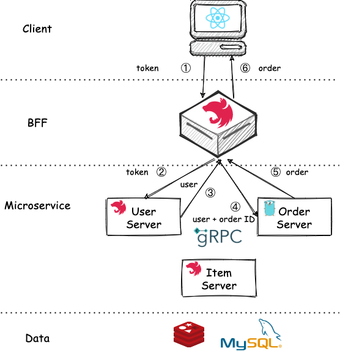

# 前言

[上篇文章]()搭建好了我们的微服务系统框架，今天我们来把用户认证加上。

# 用户认证

首先，我们添加一个 User Server 的微服务，则我们的架构演变成这样：

我们使用 JWT 来进行用户认证，首先是登录过程。

## 登录过程

登录过程很简单，如下所示:

用户在 Client 输入账号和密码，BFF 层负责转发到 User Server，User Server 返回 token 给 BFF，BFF 再转发给 Client 即可。

之后，Client 的请求都需要带上 token 来进行认证

## 认证过程

认证过程步骤相对要多一点，比如现在要获取某个用户下的某个订单，则 BFF 需要先调用 User Server 来进行认证，如果成功会返回用户信息，然后再连同订单 ID 一起传递给 Order Server 获取订单：

如果认证失败，则 BFF 直接返回错误：

