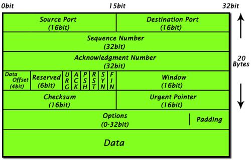
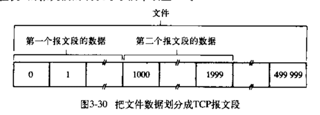
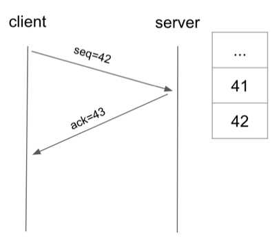
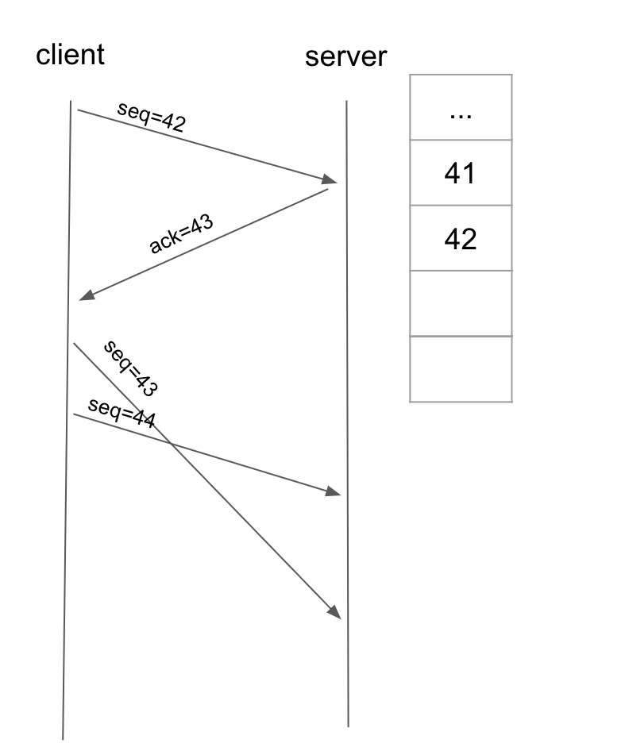
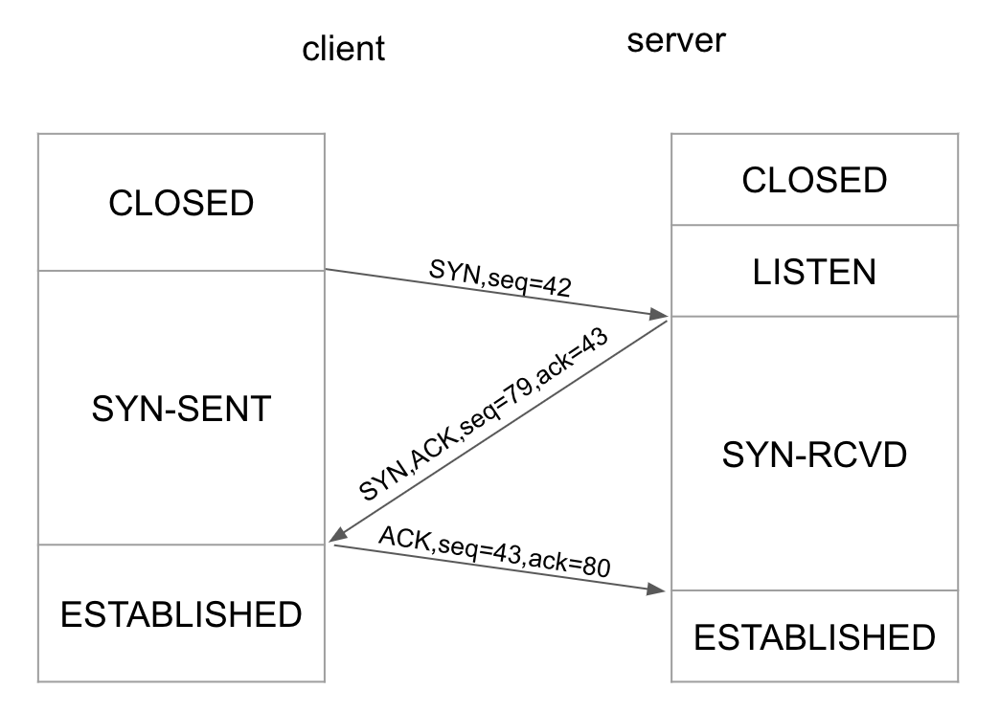
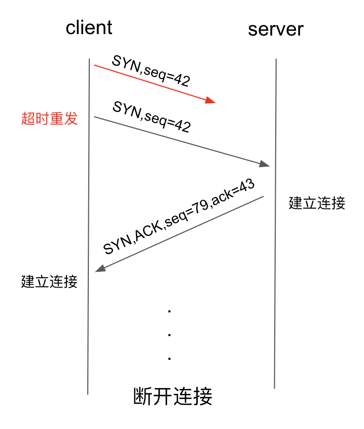
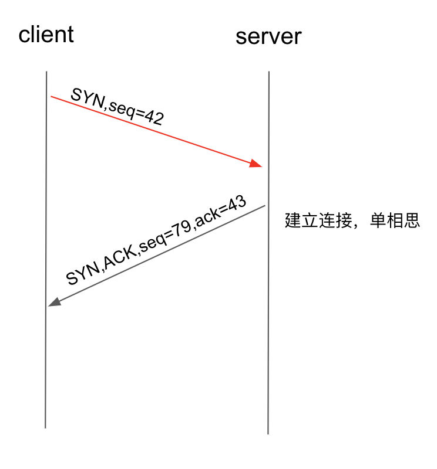
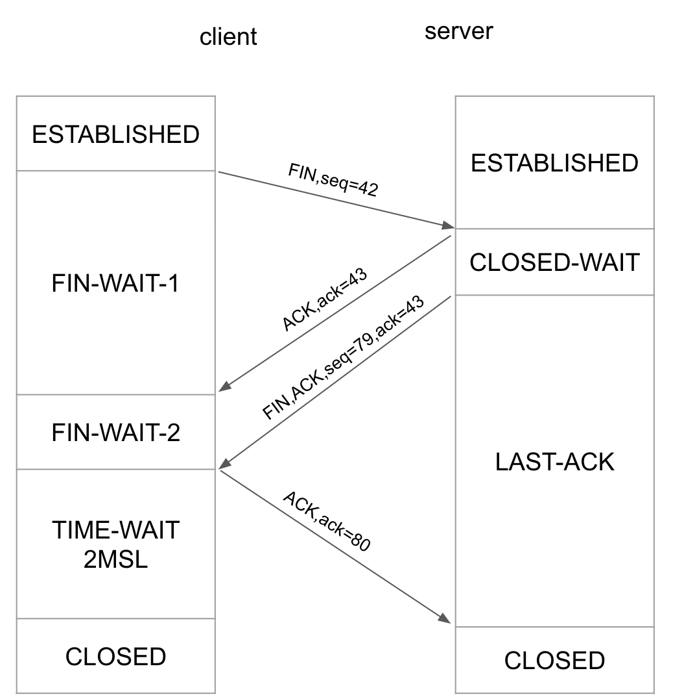
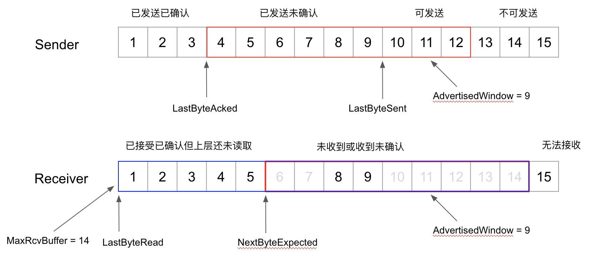

# 前言
上次组内分享有个哥们讲了 HTTP，受其启发，打算讲一讲 TCP。通过阅读《计算机网络-从上之下方法》一书，加深了一些理解，同时，自己尝试着写了一个小的 [demo](/vue-tcp)。

# TCP 包格式

其中，几个重要的字段分别表示：

* Source Port（源端口）：TCP 是两个进程之间通信的协议，所以需要源端口来标识数据的来源。
* Destination Port（目的端口）：同上面类似，表示数据要发送给哪个进程。
* Sequence Number（包序号）：上层数据交给 TCP 后会分成很多个 TCP 数据包，为了解决乱序的问题，需要给每个包编号。
* Acknowledgment Number（确认序号）：接收方对每个包的确认号。
* Data Offset（首部长度）：用于表明 TCP 首部的长度。
* ACK, SYN, FIN：状态位，其中 ACK 表示确认，SYN 表示发起连接，FIN 表示结束连接。
* Window （窗口）：用于流量控制。
* Checksum（校验号）：用于检测包是否损坏。
* Data：上层数据

# TCP 报文段编号
如图，假设现在有一个 500000 个字节的数据交给 TCP 进行传输，每个 TCP 报文段可以装载 1000 字节的数据，则该数据被分成 500 个报文传输。其中，第一个报文的序号为 0，第二个为 1000，第三个为 2000，以此类推。为了简单起见，下面的讨论都假设 TCP 报文段均只装载 1 个字节的数据。

# TCP 序号、确认号、累积确认
客户端和服务端之间一个最简单的 TCP 交流模型如下所示，客户端发送一个 SEQ 为 42 的包，服务端收到以后应答一个 ACK 为 43 的包，表示 43 号包之前的包均已收到。

一个值得讨论的问题如下所示，客户端发送了 43 44 号包，但是 44 号包先到达服务端，此时服务端该如何呢？

针对这种情况，有两种做法：
1. 服务端丢弃 44 号包，发送一个 ACK=43 的应答，这样会导致 44 号包重传。
2. 服务端缓存 44 号包，仍发送一个 ACK=43 的应答，等到 43 号包到达的时候，此时服务端发现下一个需要的包是 45，则服务端发送一个 ACK=45 的应答。这种做法就叫做累积确认。

很明显第二种做法更高效。

# 超时重传
发送方会维护一个定时器，对于超时未收到确认的包，会重新发送。其中超时时间的计算有个比较复杂的算法，这里不讨论。

# 三次握手
一个经典的三次握手如下图所示，这里就不阐述了。我想说的是，为什么不两次握手？

试想有这样一个情形（如下图）：客户端向服务端发起连接，但是这个包在网络中转了很长时间都没有发到服务端。此时，客户端检测到超时，重新发送这个包。然后经过两次握手后，双方都建立了连接，工作了一会后断开。

过了一会，先前在网络中迷路的那个包终于到达了服务端，此时服务端会误以为客户端要发起连接，结果陷入了“单相思”的状态。

# 四次挥手
有握手，就有挥手。挥手一般分为两个阶段，先是挥手发起一方（这里是客户端）表示自己要断开连接，不再发送数据。但是此时服务端可能还有事情需要处理或是还有包需要发送，并不会马上断开，等到服务端做完自己的事情之后，再发送断开连接的包。这里客户端在收到服务端请求断开连接的包之后并不会马上就断开，而是要等待一个时间，为什么呢？假设 client 直接跑路，那么当 server 收不到 ACK 重新发 FIN 的时候 client 就没法处理了；第二个原因是如果直接关闭，然后下一个应用占用了这个端口，会收到 server 还在在路上的包，造成混乱。

# 滑动窗口
滑动窗口主要用来做流量控制，我们来看看是怎么工作的。
1. 首先看接收端。接收端会有一个缓存 MaxRecBuffer，用于存放所有接受到的并且没有被上层所读取的包，缓存一旦塞满，接收端就不能再接收新的包了。LastByteRead 表示上一个被上层读取的包的序号，NextByteExpected 表示下一个期待接收的包序号，滑动窗口 `AdvertisedWindow = MaxRecBuffer - (NextByteExpected - LastByteRead) + 1`。该窗口会通过包发送给发送端。
2. 然后再看发送端。LastByteAcked 表示上一个已经被确认过的包序号，LastByteSent 表示上一个发送过的包序号，则需要保证 `LastByteSent - LastByteAcked <= AdvertisedWindow`。通过这样，就可以控制发送端的发送速率。

# 总结
文章只是稍微的复习了一下 TCP 的几个点，加深下自己的理解，更多内容还是自己看书比较靠谱，也可以自己动手实现一下。