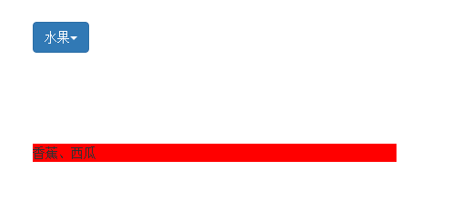

基于[http://valor-software.com/ng2-bootstrap/#/dropdowns](http://valor-software.com/ng2-bootstrap/#/dropdowns) 做的一个下拉列表控件，优化了如下功能：
* 列表内容由父组件传递
* 子组件选择框发生变化后会通知父组件

[项目地址](https://github.com/ParadeTo/ng2-dropdown-demo)

# demo


# 列表内容由父组件传递
这个主要利用到了ng2的``Input``，在子组件中声明一个变量，该变量的值可以从父组件获取：
```javascript
import { Component,Input,Output,EventEmitter } from '@angular/core';
...
// 父组件传递进来的参数
@Input('list') private list:any;
...
```
父组件中，可以这样传值：
```html
<my-drop-down-cmp [list]='list'></my-drop-down-cmp>
```

# 子组件选择框发生变化后会通知父组件
实现这个用到了ng2的``Output``，声明一个``EventEmit``的对象，用于向父组件发送消息
```javascript
// 当改变了选择时给父组件发送事件
@Output('selectChange') private selectChange = new EventEmitter();
...
// 当点击了下拉列表中的某一项
public changeSelect(id: any,text: any,i: any) {
  this.text = text;
  this.id = id;
  // 发送事件
  this._selectChange.emit({id:id,text:text,index:i})
}
```

父组件中，通过如下方式接收事件：
```html
<my-drop-down-cmp (_selectChange)='onChangeSelect($event)'></my-drop-down-cmp>
...
// 事件处理函数
onChangeSelect(e:any) {
  this.selectId = e.id;
}
```
