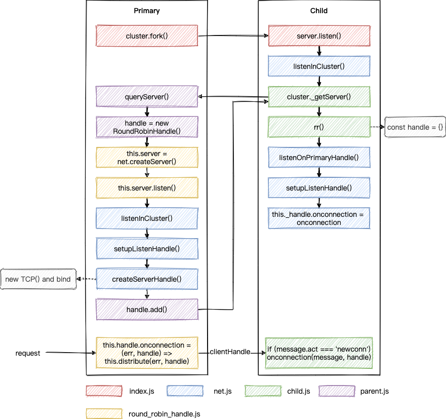

# 前言

日常工作中，对 Node.js 的使用都比较粗浅，趁这次 CY 之际，来学点稍微高级的，那就先从 cluster 开始吧。

鲁迅说过，“带着问题去学习是一个比较好的方法”，所以我们也来试一试。

当初使用 cluster 时，一直好奇它是怎么做到多个子进程监听同一个端口而不冲突的，比如下面这段代码：

```js
const cluster = require('cluster')
const net = require('net')
const cpus = require('os').cpus()

if (cluster.isPrimary) {
  for (let i = 0; i < cpus.length; i++) {
    cluster.fork()
  }
} else {
  net
    .createServer(function (socket) {
      socket.on('data', function (data) {
        socket.write(`Reply from ${process.pid}: ` + data.toString())
      })
      socket.on('end', function () {
        console.log('Close')
      })
      socket.write('Hello!\n')
    })
    .listen(9999)
}
```

该段代码通过父进程 `fork` 出了多个子进程，且这些子进程都监听了 9999 这个端口并能正常提供服务，这是如何做到的呢？我们来调试一下。

# 准备调试环境

学习 Node.js 官方提供库最好的方式当然是调试一下，所以，我们先来准备一下环境。注：本文的操作系统为 macOS Big Sur 11.6.6，其他系统请自行准备相应环境。

## 编译 Node.js

1. 下载 Node.js 源码

```
git clone https://github.com/nodejs/node.git
```

然后在 `lib/internal/cluster/primary.js` `queryServer` 函数中加个断点，方便后面调试用：

```js
function queryServer(worker, message) {
  debugger;
  // Stop processing if worker already disconnecting
  if (worker.exitedAfterDisconnect) return;

  ...
}
```

2. 进入目录，执行

```
./configure --debug
make -j4
```

之后会生成 `out/Debug/node`

## 准备 IDE 环境

使用 vscode 调试，配置好 `launch.json` 就可以了（其他 IDE 类似，请自行解决）：

```js
{
  "version": "0.2.0",
  "configurations": [
    {
      "type": "node",
      "runtimeExecutable": "****/out/Debug/node",
      "request": "launch",
      "name": "Debug Node",
      "args": [
        "--expose-internals",
        "--nolazy",
      ],
      "skipFiles": [], // 这个不能去掉
      "program": "${workspaceFolder}/index.js"
    }
  ]
}

```

# Cluster 源码调试

准备好调试代码（为了调试而已，这里启动一个子进程就够了）：

```js
debugger
const cluster = require('cluster')
const net = require('net')

if (cluster.isPrimary) {
  debugger
  cluster.fork()
} else {
  const server = net.createServer(function (socket) {
    socket.on('data', function (data) {
      socket.write(`Reply from ${process.pid}: ` + data.toString())
    })
    socket.on('end', function () {
      console.log('Close')
    })
    socket.write('Hello!\n')
  })
  debugger
  server.listen(9999)
}
```

很明显，我们的程序可以分父进程和子进程这两部分来进行分析。

_首先进入的是父进程：_

执行 `require('cluster')` 时，会进入 `lib/cluster.js` 这个文件：

```js
const childOrPrimary = 'NODE_UNIQUE_ID' in process.env ? 'child' : 'primary'
module.exports = require(`internal/cluster/${childOrPrimary}`)
```

会根据当前 `process.env` 上是否有 `NODE_UNIQUE_ID` 来引入不同的模块，此时是没有的，所以会引入 `internal/cluster/primary` 这个模块：

```js
...
const cluster = new EventEmitter();
...
module.exports = cluster

const handles = new SafeMap()
cluster.isWorker = false
cluster.isMaster = true // Deprecated alias. Must be same as isPrimary.
cluster.isPrimary = true
cluster.Worker = Worker
cluster.workers = {}
cluster.settings = {}
cluster.SCHED_NONE = SCHED_NONE // Leave it to the operating system.
cluster.SCHED_RR = SCHED_RR // Primary distributes connections.
...
cluster.schedulingPolicy = schedulingPolicy

cluster.setupPrimary = function (options) {
...
}

// Deprecated alias must be same as setupPrimary
cluster.setupMaster = cluster.setupPrimary

function setupSettingsNT(settings) {
...
}

function createWorkerProcess(id, env) {
  ...
}

function removeWorker(worker) {
 ...
}

function removeHandlesForWorker(worker) {
 ...
}

cluster.fork = function (env) {
  ...
}
```

该模块主要是在 `cluster` 对象上挂载了一些属性和方法，并导出，这些后面回过头再看，我们继续往下调试。往下调试会进入 `if (cluster.isPrimary)` 分支，代码很简单，仅仅是 `fork` 出了一个新的子进程而已：

```js
// lib/internal/cluster/primary.js
cluster.fork = function (env) {
  cluster.setupPrimary()
  const id = ++ids
  const workerProcess = createWorkerProcess(id, env)
  const worker = new Worker({
    id: id,
    process: workerProcess,
  })

  ...

  worker.process.on('internalMessage', internal(worker, onmessage))
  process.nextTick(emitForkNT, worker)
  cluster.workers[worker.id] = worker
  return worker
}
```

`cluster.setupPrimary()`：比较简单，初始化一些参数啥的。

`createWorkerProcess(id, env)`：

```js
// lib/internal/cluster/primary.js
function createWorkerProcess(id, env) {
  const workerEnv = {...process.env, ...env, NODE_UNIQUE_ID: `${id}`}
  const execArgv = [...cluster.settings.execArgv]

  ...

  return fork(cluster.settings.exec, cluster.settings.args, {
    cwd: cluster.settings.cwd,
    env: workerEnv,
    serialization: cluster.settings.serialization,
    silent: cluster.settings.silent,
    windowsHide: cluster.settings.windowsHide,
    execArgv: execArgv,
    stdio: cluster.settings.stdio,
    gid: cluster.settings.gid,
    uid: cluster.settings.uid,
  })
}
```

可以看到，该方法主要是通过 `fork` 启动了一个子进程来执行我们的 `index.js`，且启动子进程的时候设置了环境变量 `NODE_UNIQUE_ID`，这样 `index.js` 中 `require('cluster')` 的时候，引入的就是 `internal/cluster/child` 模块了。

`worker.process.on('internalMessage', internal(worker, onmessage))`：监听子进程传递过来的消息并处理。

_接下来就进入了子进程的逻辑：_

前面说了，此时引入的是 `internal/cluster/child` 模块，我们先跳过，继续往下，看下 `server.listen(9999)` 做了啥：

```js
// lib/net.js
Server.prototype.listen = function (...args) {
  ...
      listenInCluster(
        this,
        null,
        options.port | 0,
        4,
        backlog,
        undefined,
        options.exclusive
      );
}
```

可以看到，最终是调用了 `listenInCluster`：

```js
// lib/net.js
function listenInCluster(
  server,
  address,
  port,
  addressType,
  backlog,
  fd,
  exclusive,
  flags,
  options
) {
  exclusive = !!exclusive

  if (cluster === undefined) cluster = require('cluster')

  if (cluster.isPrimary || exclusive) {
    // Will create a new handle
    // _listen2 sets up the listened handle, it is still named like this
    // to avoid breaking code that wraps this method
    server._listen2(address, port, addressType, backlog, fd, flags)
    return
  }

  const serverQuery = {
    address: address,
    port: port,
    addressType: addressType,
    fd: fd,
    flags,
    backlog,
    ...options,
  }
  // Get the primary's server handle, and listen on it
  cluster._getServer(server, serverQuery, listenOnPrimaryHandle)

  function listenOnPrimaryHandle(err, handle) {
    err = checkBindError(err, port, handle)

    if (err) {
      const ex = exceptionWithHostPort(err, 'bind', address, port)
      return server.emit('error', ex)
    }

    // Reuse primary's server handle
    server._handle = handle
    // _listen2 sets up the listened handle, it is still named like this
    // to avoid breaking code that wraps this method
    server._listen2(address, port, addressType, backlog, fd, flags)
  }
}
```

由于是在子进程中执行，所以最后会调用 `cluster._getServer(server, serverQuery, listenOnPrimaryHandle)`：

```js
// lib/internal/cluster/child.js
// 这里的 cb 就是上面的 listenOnPrimaryHandle
cluster._getServer = function (obj, options, cb) {
  ...
  send(message, (reply, handle) => {
    debugger
    if (typeof obj._setServerData === 'function') obj._setServerData(reply.data)

    if (handle) {
      // Shared listen socket
      shared(reply, {handle, indexesKey, index}, cb)
    } else {
      // Round-robin.
      rr(reply, {indexesKey, index}, cb)
    }
  })

  ...
}
```

该函数最终会向父进程发送 `queryServer` 的消息，父进程处理完后会调用回调函数，最终调用 `listenOnPrimaryHandle`。看来，`listen` 的逻辑是在父进程中进行的了。

_接下来进入父进程：_

父进程收到 `queryServer` 的消息后，最终会调用 `queryServer` 这个方法：

```js
// lib/internal/cluster/primary.js
function queryServer(worker, message) {
  // Stop processing if worker already disconnecting
  if (worker.exitedAfterDisconnect) return

  const key =
    `${message.address}:${message.port}:${message.addressType}:` +
    `${message.fd}:${message.index}`
  let handle = handles.get(key)

  if (handle === undefined) {
    let address = message.address

    // Find shortest path for unix sockets because of the ~100 byte limit
    if (
      message.port < 0 &&
      typeof address === 'string' &&
      process.platform !== 'win32'
    ) {
      address = path.relative(process.cwd(), address)

      if (message.address.length < address.length) address = message.address
    }

    // UDP is exempt from round-robin connection balancing for what should
    // be obvious reasons: it's connectionless. There is nothing to send to
    // the workers except raw datagrams and that's pointless.
    if (
      schedulingPolicy !== SCHED_RR ||
      message.addressType === 'udp4' ||
      message.addressType === 'udp6'
    ) {
      handle = new SharedHandle(key, address, message)
    } else {
      handle = new RoundRobinHandle(key, address, message)
    }

    handles.set(key, handle)
  }

  ...
}
```

可以看到，这里主要是对 `handle` 的处理，这里的 `handle` 指的是调度策略，分为 `SharedHandle` 和 `RoundRobinHandle`，分别对应抢占式和轮询两种策略（文章最后补充部分有关于两者对比的例子）。

Node.js 中默认是 `RoundRobinHandle` 策略，可通过环境变量 `NODE_CLUSTER_SCHED_POLICY` 来修改，取值可以为 `none`（`SharedHandle`） 或 `rr`（`RoundRobinHandle`）。

## SharedHandle

首先，我们来看一下 `SharedHandle`，由于我们这里是 `TCP` 协议，所以最后会通过 `net._createServerHandle` 创建一个 `TCP` 对象挂载在 `handle` 属性上（注意这里又有一个 `handle`，别搞混了）：

```js
// lib/internal/cluster/shared_handle.js
function SharedHandle(key, address, {port, addressType, fd, flags}) {
  this.key = key
  this.workers = new SafeMap()
  this.handle = null
  this.errno = 0

  let rval
  if (addressType === 'udp4' || addressType === 'udp6')
    rval = dgram._createSocketHandle(address, port, addressType, fd, flags)
  else rval = net._createServerHandle(address, port, addressType, fd, flags)

  if (typeof rval === 'number') this.errno = rval
  else this.handle = rval
}
```

在 `createServerHandle` 中除了创建 `TCP` 对象外，还绑定了端口：

```js
// lib/net.js
function createServerHandle(address, port, addressType, fd, flags) {
  ...
  } else {
    handle = new TCP(TCPConstants.SERVER);
    isTCP = true;
  }

  if (address || port || isTCP) {
      ...
      err = handle.bind6(address, port, flags);
    } else {
      err = handle.bind(address, port);
    }
  }

  ...
  return handle;
}
```

然后，`queryServer` 中继续执行，会调用 `add` 方法，将 `TCP` 对象传递给子进程：

```js
// lib/internal/cluster/primary.js
function queryServer(worker, message) {
  ...
  if (!handle.data) handle.data = message.data

  // Set custom server data
  handle.add(worker, (errno, reply, handle) => {
    const {data} = handles.get(key)

    if (errno) handles.delete(key) // Gives other workers a chance to retry.

    send(
      worker,
      {
        errno,
        key,
        ack: message.seq,
        data,
        ...reply,
      },
      handle // TCP 对象
    )
  })
  ...
}
```

_之后进入子进程：_

子进程收到父进程对于 `queryServer` 的回复后，会调用 `shared`：

```js
// lib/internal/cluster/child.js
// `obj` is a net#Server or a dgram#Socket object.
cluster._getServer = function (obj, options, cb) {
  ...

  send(message, (reply, handle) => {
    if (typeof obj._setServerData === 'function') obj._setServerData(reply.data)

    if (handle) {
      // Shared listen socket
      shared(reply, {handle, indexesKey, index}, cb)
    } else {
      // Round-robin.
      rr(reply, {indexesKey, index}, cb) // cb 是 listenOnPrimaryHandle
    }
  })
  ...
}
```

`shared` 中最后会调用 `cb` 也就是 `listenOnPrimaryHandle`：

```js
// lib/net.js
function listenOnPrimaryHandle(err, handle) {
  err = checkBindError(err, port, handle)

  if (err) {
    const ex = exceptionWithHostPort(err, 'bind', address, port)
    return server.emit('error', ex)
  }
  // Reuse primary's server handle 这里的 server 是 index.js 中 net.createServer 返回的那个对象
  server._handle = handle
  // _listen2 sets up the listened handle, it is still named like this
  // to avoid breaking code that wraps this method
  server._listen2(address, port, addressType, backlog, fd, flags)
}
```

这里会把 `handle` 赋值给 `server._handle`，这里的 `server` 是 `index.js` 中 `net.createServer` 返回的那个对象，并调用 `server._listen2`，也就是 `setupListenHandle`：

```js
// lib/net.js
function setupListenHandle(address, port, addressType, backlog, fd, flags) {
  debug('setupListenHandle', address, port, addressType, backlog, fd)
  // If there is not yet a handle, we need to create one and bind.
  // In the case of a server sent via IPC, we don't need to do this.
  if (this._handle) {
    debug('setupListenHandle: have a handle already')
  } else {
    ...
  }

  this[async_id_symbol] = getNewAsyncId(this._handle)
  this._handle.onconnection = onconnection
  this._handle[owner_symbol] = this

  // Use a backlog of 512 entries. We pass 511 to the listen() call because
  // the kernel does: backlogsize = roundup_pow_of_two(backlogsize + 1);
  // which will thus give us a backlog of 512 entries.
  const err = this._handle.listen(backlog || 511)

  if (err) {
    const ex = uvExceptionWithHostPort(err, 'listen', address, port)
    this._handle.close()
    this._handle = null
    defaultTriggerAsyncIdScope(
      this[async_id_symbol],
      process.nextTick,
      emitErrorNT,
      this,
      ex
    )
    return
  }
}
```

这里最重要的一句就是 `this._handle.onconnection = onconnection`，当有客户端请求过来时会调用 `this._handle`（也就是 `TCP` 对象）上的 `onconnection` 方法建立起连接，然后调用 `listen` 监听连接，注意这里参数 `backlog` 跟之前不同，这里不是表示端口，指定在拒绝连接之前，操作系统可以挂起的最大连接数量，我们平时遇到的 `listen EADDRINUSE: address already in use` 错误就是这行代码导致的。再进入这个函数，就是套接字编程相关的内容了，暂时先不研究。

如果还有其他子进程，也会同样走一遍上述的步骤，不同之处是在主进程中 `queryServer` 时，由于已经有 `handle` 了，不需要再重新创建了：

```js

function queryServer(worker, message) {
  debugger;
  // Stop processing if worker already disconnecting
  if (worker.exitedAfterDisconnect) return;

  const key =
    `${message.address}:${message.port}:${message.addressType}:` +
    `${message.fd}:${message.index}`;
  let handle = handles.get(key);
  ...
}
```

内容太多了，整理成流程图如下：


所谓的 `SharedHandle`，其实是在多个子进程中共享 `TCP` 对象，当客户端请求过来时，多个进程会去竞争该请求的处理权，会导致任务分配不均的问题，这也是为什么需要 `RoundRobinHandle` 的原因。接下来继续看看这种调度方式。

## RoundRobinHandle

```js
// lib/internal/cluster/round_robin_handle.js
function RoundRobinHandle(
  key,
  address,
  {port, fd, flags, backlog, readableAll, writableAll}
) {
  ...
  this.server = net.createServer(assert.fail)

  ...
  else if (port >= 0) {
    this.server.listen({
      port,
      host: address,
      // Currently, net module only supports `ipv6Only` option in `flags`.
      ipv6Only: Boolean(flags & constants.UV_TCP_IPV6ONLY),
      backlog,
    })
  }
  ...
  this.server.once('listening', () => {
    this.handle = this.server._handle
    this.handle.onconnection = (err, handle) => {
      this.distribute(err, handle)
    }
    this.server._handle = null
    this.server = null
  })
}
```

如上所示，`RoundRobinHandle` 会调用 `net.createServer()` 创建一个 `server`，然后调用 `listen` 方法，最终会来到 `setupListenHandle`：

```js
// lib/net.js
function setupListenHandle(address, port, addressType, backlog, fd, flags) {
  debug('setupListenHandle', address, port, addressType, backlog, fd)
  // If there is not yet a handle, we need to create one and bind.
  // In the case of a server sent via IPC, we don't need to do this.
  if (this._handle) {
    debug('setupListenHandle: have a handle already')
  } else {
    debug('setupListenHandle: create a handle')

    let rval = null

    // Try to bind to the unspecified IPv6 address, see if IPv6 is available
    if (!address && typeof fd !== 'number') {
      rval = createServerHandle(DEFAULT_IPV6_ADDR, port, 6, fd, flags)

      if (typeof rval === 'number') {
        rval = null
        address = DEFAULT_IPV4_ADDR
        addressType = 4
      } else {
        address = DEFAULT_IPV6_ADDR
        addressType = 6
      }
    }

    if (rval === null)
      rval = createServerHandle(address, port, addressType, fd, flags)

    if (typeof rval === 'number') {
      const error = uvExceptionWithHostPort(rval, 'listen', address, port)
      process.nextTick(emitErrorNT, this, error)
      return
    }
    this._handle = rval
  }

  this[async_id_symbol] = getNewAsyncId(this._handle)
  this._handle.onconnection = onconnection
  this._handle[owner_symbol] = this

  ...
}
```

且由于此时 `this._handle` 为空，会调用 `createServerHandle()` 生成一个 `TCP` 对象作为 `_handle`，到此 `new RoundRobinHandle()` 就走完了。跟 `SharedHandle` 一样，最后也会回到子进程：

```js
// lib/internal/cluster/child.js
// `obj` is a net#Server or a dgram#Socket object.
cluster._getServer = function (obj, options, cb) {
  ...

  send(message, (reply, handle) => {
    if (typeof obj._setServerData === 'function') obj._setServerData(reply.data)

    if (handle) {
      // Shared listen socket
      shared(reply, {handle, indexesKey, index}, cb)
    } else {
      // Round-robin.
      rr(reply, {indexesKey, index}, cb) // cb 是 listenOnPrimaryHandle
    }
  })
  ...
}
```

不过，此时会执行 `rr`：

```js
function rr(message, {indexesKey, index}, cb) {
  ...
  // Faux handle. Mimics a TCPWrap with just enough fidelity to get away
  // with it. Fools net.Server into thinking that it's backed by a real
  // handle. Use a noop function for ref() and unref() because the control
  // channel is going to keep the worker alive anyway.
  const handle = {close, listen, ref: noop, unref: noop}

  if (message.sockname) {
    handle.getsockname = getsockname // TCP handles only.
  }

  assert(handles.has(key) === false)
  handles.set(key, handle)
  debugger
  cb(0, handle)
}
```

可以看到，这里构造了一个假的 `handle`，然后执行 `cb` 也就是 `listenOnPrimaryHandle`。最终跟 `SharedHandle` 一样会调用 `setupListenHandle` 执行 `this._handle.onconnection = onconnection`。

`RoundRobinHandle` 逻辑到此就结束了，好像缺了点什么的样子。回顾下，我们给每个子进程中的 `server` 上都挂载了一个假的 `handle`，但它跟绑定了端口的 `TCP` 对象没有任何关系，如果客户端请求过来了，是不会执行它上面的 `onconnection` 方法的。

此时，我们需要回到 `RoundRobinHandle`，有这样一段代码：

```js
// lib/internal/cluster/round_robin_handle.js
this.server.once('listening', () => {
  this.handle = this.server._handle
  this.handle.onconnection = (err, handle) => {
    this.distribute(err, handle)
  }
  this.server._handle = null
  this.server = null
})
```

在 `listen` 执行完后，会触发 `listening` 事件的回调，这里重写了 `handle` 上面的 `onconnection`。

当客户端请求过来时，会调用 `distribute` 在多个子进程中轮询分发，这里又有一个 `handle`，这里的 `handle` 姑且理解为 `clientHandle`，即客户端连接的 `handle`，别搞混了。总之，最后会将这个 `clientHandle` 发送给子进程：

```js
// lib/internal/cluster/round_robin_handle.js
RoundRobinHandle.prototype.handoff = function (worker) {
  ...

  const message = { act: 'newconn', key: this.key };
  // 这里的 handle 是 clientHandle
  sendHelper(worker.process, message, handle, (reply) => {
    if (reply.accepted) handle.close();
    else this.distribute(0, handle); // Worker is shutting down. Send to another.

    this.handoff(worker);
  });
};
```

而子进程在 `require('cluster')` 时，已经监听了该事件：

```js
// lib/internal/cluster/child.js
process.on('internalMessage', internal(worker, onmessage))
send({act: 'online'})

function onmessage(message, handle) {
  if (message.act === 'newconn') onconnection(message, handle)
  else if (message.act === 'disconnect')
    ReflectApply(_disconnect, worker, [true])
}
```

最终会走到 `net.js` 中的 `function onconnection(err, clientHandle)` 方法。这个方法第二个参数名就叫 `clientHandle`，这也是为什么前面的 `handle` 我想叫这个名字的原因。

还是用图来总结下：



跟 `SharedHandle` 不同的是，该调度策略中 `onconnection` 最开始是在主进程中触发的，然后通过轮询算法挑选一个子进程，将 `clientHandle` 传递给它。

# 为什么端口不冲突

cluster 模块的调试就到此告一段落了，接下来我们来回答一下一开始的问题，为什么多个进程监听同一个端口没有报错？

首先，网上很多地方都说是因为设置了 `SO_REUSEADDR`，但其实跟这个没关系。通过上面的分析知道，不管什么调度策略，最终都只会在主进程中对 `TCP` 对象 `bind` 一次。虽然每个子进程中都 `listen` 了，但是没什么关系，`SharedHandle` 策略时，在不同子进程中执行 `listen` 也还是这同一个 `TCP` 对象，而 `RoundRobinHandle` 就更绝了，子进程中执行 `listen` 的 `handle` 是一个假的对象而已。

我们可以修改一下源代码来测试一下：

```js
// deps/uv/src/unix/tcp.c 下面的 SO_REUSEADDR 改成 SO_DEBUG
if (setsockopt(tcp->io_watcher.fd, SOL_SOCKET, SO_REUSEADDR, &on, sizeof(on)))
```

编译后执行发现，我们仍然可以正常使用 cluster 模块。

那这个 `SO_REUSEADDR` 到底影响的是啥呢？我们继续来研究一下。

# SO_REUSEADDR

首先，我们我们知道，下面的代码是会报错的：

```js
const net = require('net')
const server1 = net.createServer()
const server2 = net.createServer()
server1.listen(9999)
server2.listen(9999)
```

但是，如果我稍微修改一下，就不会报错了：

```js
const net = require('net')
const server1 = net.createServer()
const server2 = net.createServer()
server1.listen(9999, '127.0.0.1')
server2.listen(9999, '10.53.48.67')
```

原因在于 `listen` 时，如果不指定 `address`，则相当于绑定了所有地址，当两个 server 都这样做时，请求到来就不知道要给谁处理了。

我们可以类比成找对象，`port` 是对外貌的要求，`address` 是对城市的要求。现在甲乙都想要一个 `port` 是 `1米7以上` 不限城市的对象，那如果有一个 `1米7以上` 来自 `深圳` 的对象，就不知道介绍给谁了。而如果两者都指定了城市就好办多了。

那如果一个指定了 `address`，一个没有呢？就像下面这样：

```js
const net = require('net')
const server1 = net.createServer()
const server2 = net.createServer()
server1.listen(9999, '127.0.0.1')
server2.listen(9999)
```

结果是：设置了 `SO_REUSEADDR` 可以正常运行，而修改成 `SO_DEBUG` 的会报错。

还是上面的例子，甲对城市没有限制，乙需要是来自 `深圳` 的，那当一个对象来自 `深圳`，我们可以选择优先介绍给乙，非 `深圳` 的就选择介绍给甲，这个就是 `SO_REUSEADDR` 的作用。

# 补充

## `SharedHandle` 和 `RoundRobinHandle` 两种模式的对比

```js
// cluster.js
const cluster = require('cluster')
const net = require('net')

if (cluster.isMaster) {
  for (let i = 0; i < 4; i++) {
    cluster.fork()
  }
} else {
  const server = net.createServer()
  server.on('connection', (socket) => {
    console.log(`PID: ${process.pid}!`)
  })
  server.listen(9997)
}
```

```js
// client.js
const net = require('net')
for (let i = 0; i < 20; i++) {
  net.connect({port: 9997})
}
```

_RoundRobin_
先执行 `node cluster.js`，然后执行 `node client.js`，会看到如下输出，可以看到没有任何一个进程的 PID 是紧挨着的。

```js
PID: 42904!
PID: 42906!
PID: 42905!
PID: 42904!
PID: 42907!
PID: 42905!
PID: 42906!
PID: 42907!
PID: 42904!
PID: 42905!
PID: 42906!
PID: 42907!
PID: 42904!
PID: 42905!
PID: 42906!
PID: 42907!
PID: 42904!
PID: 42905!
PID: 42906!
PID: 42904!
```

_Shared_

先执行 `NODE_CLUSTER_SCHED_POLICY=none node cluster.js`，则 Node.js 会使用 `SharedHandle`，然后执行 `node client.js`，会看到如下输出，可以看到同一个 PID 连续输出了多次，所以这种策略会导致进程任务分配不均的现象（有些人忙到 996，有些人天天摸鱼），不推荐使用。

```js
PID: 42561!
PID: 42562!
PID: 42561!
PID: 42562!
PID: 42564!
PID: 42561!
PID: 42562!
PID: 42563!
PID: 42561!
PID: 42562!
PID: 42563!
PID: 42564!
PID: 42564!
PID: 42564!
PID: 42564!
PID: 42564!
PID: 42563!
PID: 42563!
PID: 42564!
PID: 42563!
```

# 参考

https://cloud.tencent.com/developer/article/1600191
