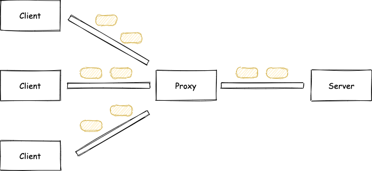
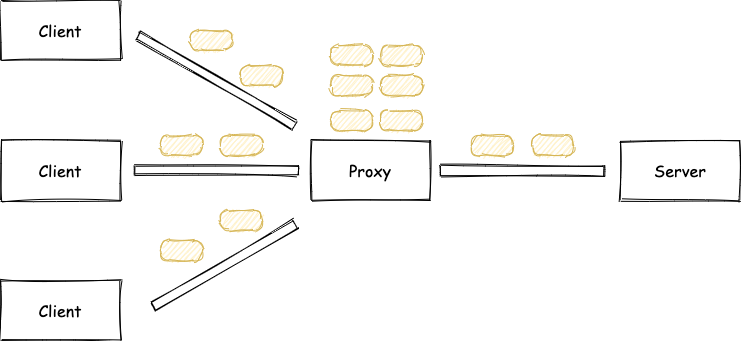
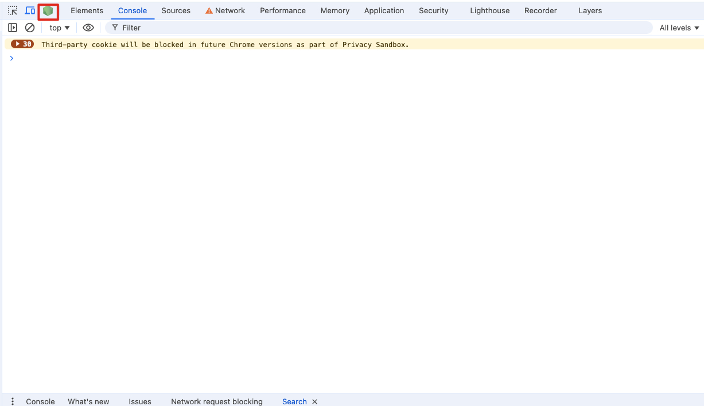
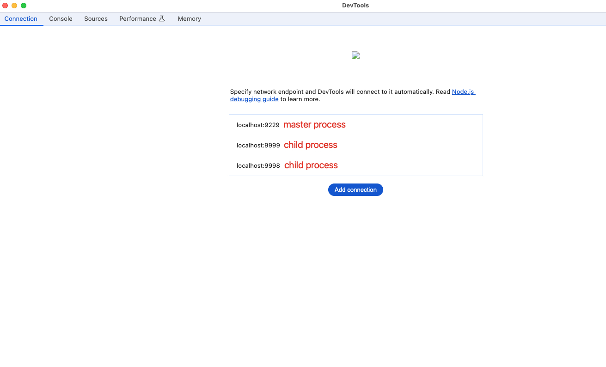
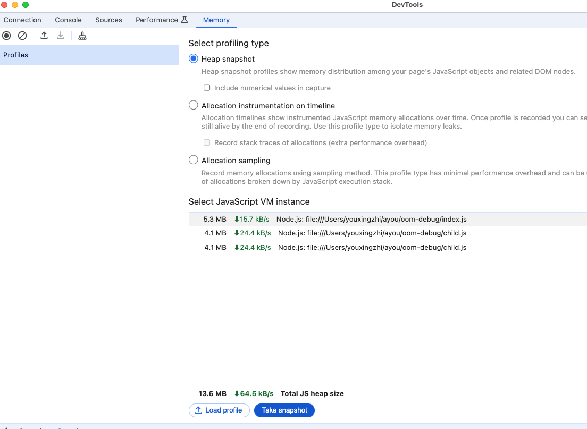

之前[这篇文章](/2024/01/16/nodejs-grayscale/)介绍了如何针对 Node.js 服务实现一个灰度发布系统，并选择了基于进程的方式。用代码来简单表示的话，就像这样：

```js
// index.js
const cp = require('child_process')
const url = require('url')
const http = require('http')

const child1 = cp.fork('child.js', [], {
  env: {PORT: 3000},
})
const child2 = cp.fork('child.js', [], {
  env: {PORT: 3001},
})

function afterChildrenReady() {
  let readyN = 0
  let _resolve

  const p = new Promise((resolve) => {
    _resolve = resolve
  })

  const onReady = (msg) => {
    if (msg === 'ready') {
      if (++readyN === 2) {
        _resolve()
      }
    }
  }

  child1.on('message', onReady)
  child2.on('message', onReady)

  return p
}

const httpServer = http.createServer(function (req, res) {
  const query = url.parse(req.url, true).query

  if (query.version === 'v1') {
    http.get('http://localhost:3000', (proxyRes) => {
      proxyRes.pipe(res)
    })
  } else {
    http.get('http://localhost:3001', (proxyRes) => {
      proxyRes.pipe(res)
    })
  }
})

afterChildrenReady().then(() => {
  httpServer.listen(8000, () => console.log('Start http server on 8000'))
})

// child.js
const http = require('http')

const httpServer = http.createServer(function (req, res) {
  res.writeHead(200, {'Content-Type': 'text/plain'})
  setTimeout(() => {
    res.end('handled by child, pid is ' + process.pid + '\n')
  }, 1000)
})

httpServer.listen(process.env.PORT, () => {
  process.send && process.send('ready')
  console.log(`Start http server on ${process.env.PORT}`)
})
```

简单解释下上面代码，运行 `index.js` 时，会 `fork` 出两个子进程，主进程根据请求参数来决定代理到哪个子进程，从而实现不同用户看到不同的内容。

不过，由于多了一层代理，服务的性能肯定会受到影响。为了优化，可以考虑复用 TCP 链接，即在调用 `http.request` 的时候使用 `agent`（更多内容请见[ 在 Node.js 中使用 HTTP Agent 实现 keep-alive](/2024/01/22/nodejs-http-agent/)）。不过，就是因为这个，导致服务出了问题。

我们来模拟一下，首先，修改一下上面的代码，启动 TCP 链接复用，并规定只开启一条链接：

```js
const agent = http.Agent({keepAlive: true, maxSockets: 1})

const httpServer = http.createServer(function (req, res) {
  const query = url.parse(req.url, true).query

  if (query.version === 'v1') {
    http.get('http://localhost:3000', {agent}, (proxyRes) => {
      proxyRes.pipe(res)
    })
  } else {
    http.get('http://localhost:3001', {agent}, (proxyRes) => {
      proxyRes.pipe(res)
    })
  }
})
```

然后，我们使用 `autocannon -c 400 -d 100 http://localhost:8000` 来进行压测。

测试结果发现：

- 压测过程中，访问 `http://localhost:8000` 超时
- 压测过程中，内存占用快速增长
- 压测结束后，访问 `http://localhost:8000` 仍然超时，内存占用缓慢下降，过了很久以后访问才会有响应

我们可以把 TCP 链接比喻成一条铁路，一个 HTTP 的内容则会被分成若干个车厢在这条铁路上运输：



由于 Proxy 与 Server 之间只有一条路，当 Client 来的请求太快时，需要排队等待处理：



这样就解释了为什么压测过程中，请求会超时了。

而且由于 Proxy 生成了很多“请求”在排队，所以内存也会快速地增长，这点可以通过 Node.js 的 inspect 功能进一步分析。

具体做法就是在启动 Node.js 进程的时候加上 `--inspect` 参数，通过 `fork` 函数启动的子进程可以使用 `execArgv` 来指定，如下所示：

```js
const child1 = cp.fork('child.js', [], {
  env: {PORT: 3000},
  execArgv: ['--inspect=9999'],
})
const child2 = cp.fork('child.js', [], {
  env: {PORT: 3001},
  execArgv: ['--inspect=9998'],
})
```

然后，打开 chrome 的调试面板，点击 Node.js 的 DevTools，新增三个 connection 后就可以看到如下效果了：







这里我们只看 master 进程，先获取一份内存快照，然后启动压测脚本，运行一段时间后再获取一次快照，比较前后两次快照，结果如下：


可以看到两次快照之间确实有很多 `ClientRequest` 新增，从而印证了我们前面的推测。

而压测结束后，虽然没有更多请求进入到 Proxy，但是由于之前已经积压了太多请求，而且 child.js 中每一个请求的响应都被我们人为的延迟了 1 秒，所以这些积压的请求处理起来非常慢，从而解释了为什么内存占用是缓慢地下降，并且要过很久以后访问才会有响应了。

“不要过早优化”是软件开发领域中一条金玉良言，这次算是深刻地体会到了，尤其是对某一项优化技术还处在一知半解的水平的时候更是如此。这次问题起因就是因为自诩之前对 Node.js 的 Agent 小有研究，才有“多此一举”，且没有仔细分析其影响以及做详细的性能压测。
