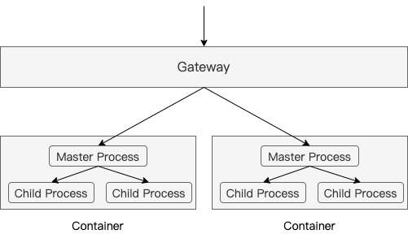
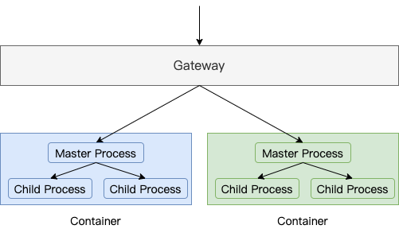
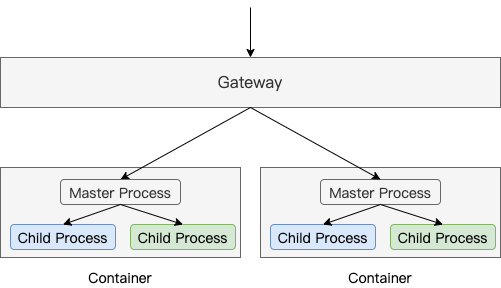
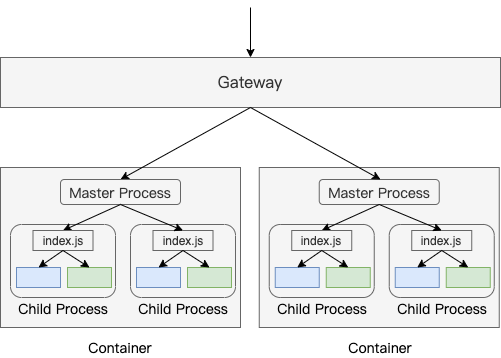
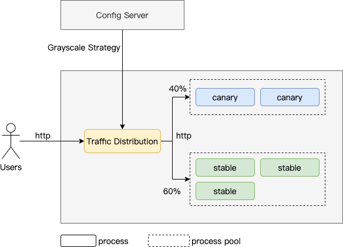

# 前言 - Preface

所谓灰度发布（本文特指金丝雀发布），就是线上同时存在两个版本，这里我们把新发布的版本称作金丝雀版，旧版称作稳定版。根据一定的策略让部分用户访问金丝雀版，部分用户访问稳定版。同时还需要根据线上两个版本的监控数据来调整流量比例。通过这种方式可以，我们可以：

- 在不影响太多用户的前提下，帮助我们提前发现软件中潜在的问题
- 方便我们在同一时期在两个版本之间进行一些对比

所以，实现灰度发布还是比较有意义的一件事情。

Grayscale release(In this article we refer to the canary release specifically) is to make there are two versions online at the same time(Here, we refer to the new version as Canary, and the old version as Stable). Then according to a specific strategy, we can expose the Canary to a portion of users, and expose the Stable to others.
At the same time, we need to adjust the traffic ratio based on the two versions' behavior. In this way, we can:

- Help us identify potential problems in advance without affecting many users
- Help us easily compare new and old versions during the same period

So building a grayscale release system is significant.

# 可选方案 - Solutions

一般情况下，我们的 Node.js 服务都会按照如下的架构运行：

Generally, a Node.js server will run under the follow architecture:



用户访问先到达网关层，网关层采用负载均衡策略把流量分发到各个容器，容器中通过 PM2 集群模式运行 Node.js 服务，主进程接收连接并分发到子进程（关于 Node.js cluster 模块可以看[这篇文章](/2022/12/15/nodejs-cluster-principle/)）。

The request reaches to the gateway, then the gateway will distribute the traffic to containers according to loading balance strategy. In a container, a Node.js server will be deployed in cluster mode using PM2. The master process will receive the connection and distribute among child processed. Refer to [this article](/2022/12/15/nodejs-cluster-principle/) to learn more about Node.js cluster.

所以，我们可以从不同的层面来实现灰度发布。

So, we can implement grayscale release from different levels.

## 基于容器 - Containers Based



优点：

- 对服务代码 0 侵入
- 不同版本之间完全隔离
- 借助现成的容器管理相关工具，可以比较方便地实现

缺点：

- 灵活性较差，比如如果我们需要根据用户的一些特征来进行流量分发的话需要在网关层写一些代码，但是网关层一般是通用的，不一定能支持。

Pros:

- No need to modify server code.
- Complete isolation between two version.
- It is convenient to realize with some containers management tools like K8s.

Cons:

- Bad flexibility, ad the gateway is generic, it may not support customization like distribute traffic according to users' characteristics.

## 基于进程 - Processes Based



优点：

- 非常灵活，可以在主进程中按照业务需求来实现各种策略的流量分发。
- 对服务代码侵入小，这里不说 0 侵入的原因是需要看具体的实现方式，见下文。
- 版本间通过进程来进行隔离，还是比较安全的。目前能够想到的一种会导致灰度发布系统不能正常工作的场景是：某个版本的代码运行抢占了大部分的资源，从而导致另一个版本无法提供服务。

缺点：

- 需要自己实现主进程并进行进程管理，无法复用 PM2。且主进程如果出现了比较严重的问题，整个灰度发布系统也会瘫痪。

Pros:

- Flexible, you can customize the traffic distribution strategy in master process.
- Need very few changes to server code. Why not zero changes? Because it depends how to implement, see below.
- The isolation between versions is implemented by multi-processes, and it is safe enough. There is a scenario that may make grayscale release system cannot work properly is that the resources are exhausted

Cons:

- Need to implement master process and manage processes by yourself, cannot use PM2 cluster mode to deploy. If something seriously goes wrong with the master process, the whole grayscale system will go down.

## 基于模块 - Modules Based



以 koa 为例，基于模块的方式，用代码表示大概就是这样：

Taking koa as an example, the modules based approach will be like this:

```js
// canary.js or stable.js
const koa = require('koa')
const app = new Koa()
app.use(async function(ctx) {
  ctx.body = 'canary' // or stable
})
module.exports = app

// index.js
const http = require('http')
const canaryApp = require('./canary')
const stableApp = require('./stable')

http.createServer((req, res) => {
  if (/* Canary */) {
    canaryApp.callback()(req, res)
  } else {
    stableApp.callback()(req, res)
  }

}).listen(8080)
```

优点：

- 同样可以非常灵活地实现各种策略的流量分发
- 相比基于进程的方式，不需要自己实现主进程及进程管理相关逻辑，可以复用 PM2

缺点：

- 不同版本运行在同一个上下文，版本间的隔离性非常依赖程序员的技术水平。比如，如果代码中有修改全局变量的操作，两者之间会互相影响。

Pros:

- It is also very flexible
- Compared to processed based way, it don't need to implement master process and process management logic and we can still use PM2 cluster mode to deploy.

Cons:

- It is very dependent on developers' skill levels to achieve a good level of isolation between two versions as they run in the same context. Fox example, if the server has the code that changes global variable, the two versions will affect each other.

考虑到我们的需求一：需要可以灵活制定流量分发策略，排除基于容器的方案。又由于我们的服务中确实有修改全局变量的操作，且重构起来有比较大的风险，所以不得已只好采取方案 2，即基于进程的方式。

Considering our requirement one: need to support customizing traffic distribution strategy flexibly, we ruled out solution which is based on container. Since our server indeed contains the operation of changing global variable, and refactoring is risky, we have to choose option two, which is processes based.

# 实现基于进程的灰度发布 - Implement Grayscale Release Based on Processes



系统架构图如上，我们需要开发一个 Traffic Distribution(TD) 服务，当它启动时会根据流量比例 fork 出 canary 和 stable 作为它的子进程。TD 维护两个进程池来管理这些子进程，进程池主要功能包括负载均衡，端口的管理（避免子进程启动时出现端口冲突），扩缩容等。TD 同时作为 HTTP 请求代理，上游对接用户请求，下游对接子进程。TD 对接配置服务，支持实时修改流量分发策略。

We need to implement a Traffic Distribution(TD) server, when it is started, it will fork out some canary and stable child processes. TD will use two process pools to manage these processes by group, the process pool's functions include: load balance, port management, scale/shrink etc. TD will act as a HTTP proxy between users and child processes. TD will connect to configuration server to support update strategy in real time.

看起来还不错，但是总感觉奇奇怪怪是怎么回事呢？系统不仅多了一次 HTTP 调用，而且还得小心地进行端口处理来避免多个进程监听同一个端口。能不能做到像 PM2 那么丝滑呢？仔细想了想，其实没法做到。我们知道，PM2 的 cluster 模式是通过进程间句柄传递来实现的，关于这个可以看[这篇文章](/2022/12/15/nodejs-cluster-principle/)，如果模仿它，简单的实现方式如下所示：

Looks good, but a bit strange. It add an extra HTTP calling, and need to manage the port carefully to avoid port conflict. Can we implement like PM2? The answer is no. As we al know that the PM2 cluster mode is implemented by passing handle, refer to this [article](/2022/12/15/nodejs-cluster-principle/). A simple mock demo is like this:

```js
// master.js
const cp = require('child_process')
const child1 = cp.fork('child.js')
const child2 = cp.fork('child.js')

const tcpServer = require('net').createServer()

const processes = [child1, child2]

tcpServer.on('connection', function (socket) {
  const child = processes.pop()
  child1.send('socket', socket)
  processes.unshift(child)
})

tcpServer.listen(8081)

// child.js
const http = require('http')

const httpServer = http.createServer(function (req, res) {
  res.writeHead(200, {'Content-Type': 'text/plain'})
  res.end('handled by child, pid is ' + process.pid + '\n')
})

process.on('message', function (m, socket) {
  if (m === 'socket') {
    httpServer.emit('connection', socket)
  }
})
```

上图代码表示的大概意思是，主进程建立好连接后把 handle 传递给子进程，交给子进程进行后续的处理。显然，主进程中此时是无法获取到任何应用层相关的信息的，如果流量分发策略仅跟用户 IP 地址相关的话是没问题的，因为 socket 里面有相关信息：

From the code above, we can learn that the master process cannot access anything infomation of application layer, if the strategy is only related with IP address, it is ok. As the socket contains these information:

```js
console.log(socket.remoteAddress, socket.remotePort)
```

但是如果是跟 HTTP 中的内容如 cookie 等相关的话，就无法实现了。

But if the strategy is related with the content of HTTP like cookie, it cannot achieve.

那有没有可能 master 和 child 之间的数据传输用别的更快的方式来实现呢？

# 总结

keep alive
