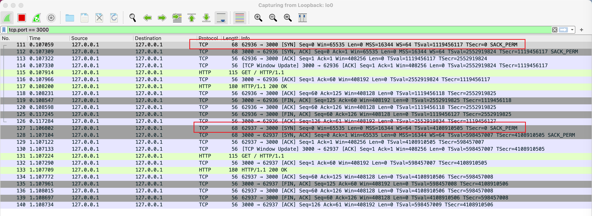
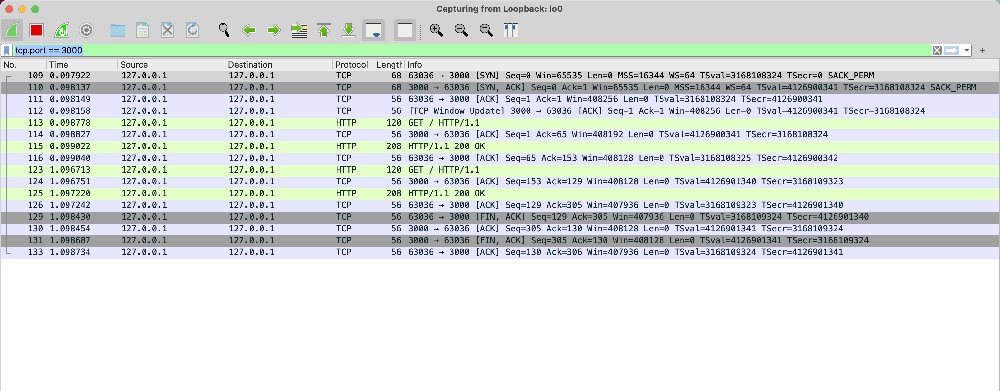
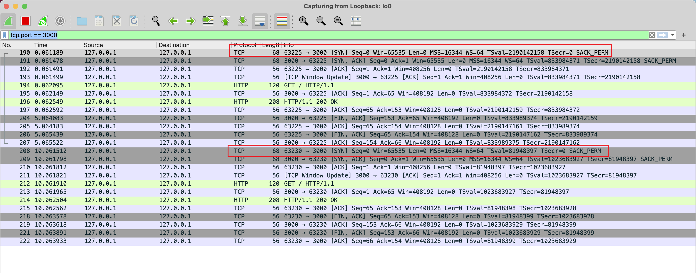

# Request without Keep-Alive

As we all know that in browsers, multi HTTP requests can resue a TCP connection with the HTTP header "connection: keep-alive;". But how to do in Node.js?

For example, here is a simple code snippet of requesting in Node.js:

我们都知道，浏览器中多个 HTTP 请求是可以通过请求头 `connection: keep-alive;` 来复用 TCP 连接的，但是在 Node.js 中怎么实现呢？

比如，下面是一段简单的发起请求的代码：

```js
// server.js
const http = require('http')

http
  .createServer((req, res) => {
    res.writeHead(200)
    res.end('Hello World')
  })
  .listen(3000)

// client.js
const http = require('http')

function request() {
  http
    .request(
      {
        host: 'localhost',
        port: 3000,
        pathname: '/',
      },
      (res) => {
        let buffer = []
        res.on('data', (chunk) => {
          buffer.push(chunk)
        })
        res.on('end', () => {
          console.log(buffer.toString())
        })
      }
    )
    .end()
}

request()

setTimeout(() => {
  request()
}, 1000)
```

When using wireshark to debug, we can find that the client port of two requets is different and there are two "Three-way Handshake" processes:

当我们用 wireshard 抓包分析师，我们可以两次请求的 client 端口是不同的，并且有两个“三次握手”的过程：



# Request with Keep-Alive using http.Agent

Now, let's request with keep-alive using http.Agent, we only need to add a short piece of code:

现在，让我们使用 `http.Agent` 来实现 `keep-alive` 请求，我们只需要加少量的代码：

```js
const agent = new http.Agent({
  keepAlive: true,
})

function request() {
  http
    .request(
      {
        agent,
        host: 'localhost',
        port: 3000,
        pathname: '/',
      },
      () => {
        // ...
      }
    )
    .end()
}
```

But, the result of wireshark won't change! Actually, we need to specify the `maxSockets` of the `agent`:

但是，wireshark 中的结果其实不会发生变化！实际上，我们需要指定 `agent` 的 `maxSockets` 参数：

```js
const agent = new http.Agent({
  keepAlive: true,
  maxSockets: 1,
})
```



Why? Because `maxSockets` indicats the max TCP connections that can be established per host. And the default value is `Infinity`. If we don't set its value, a new connection will always be established for every request.

为什么呢？因为 `maxSockets` 表示每个 host 所能建立的最大 TCP 连接数。其默认值是 `Infinity`。如果我们不指定它的值，那每个 HTTP 请求都会建立一个 TCP 连接。

Now, let's change our code a little:

接下来，我们修改一下代码：

```js
setTimeout(() => {
  request()
}, 10000) // 1000 -> 10000
```

The wireshark will show:

wireshark 抓包显示：



The keep-alive didn't work again! And we can see that the server send a FIN packet in about 5s. So is there any parameter for server to control the timeout? Yes, that is `keepAliveTimeout`，let's set it to 10s:

`keep-alive` 又不生效了！并且我们可以看到服务端 5s 左右后发送了一个 FIN 的包。难道有什么参数可以控制 `keep-alive` 的超时时间么？确实，也就是 `keepAliveTimeout`，我们把它设置为 10s:

```js
const http = require('http')

const server = http
  .createServer((req, res) => {
    res.writeHead(200)
    res.end('Hello World')
  })
  .listen(3000)

server.keepAliveTimeout = 10000
```

And now the keep-alive works again.

现在 `keep-alive` 又可以工作了。
