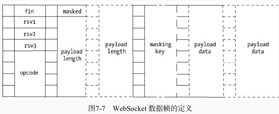
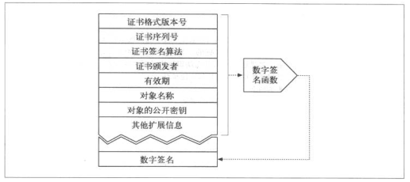

> 在Web领域，大多数的编程语言需要专门的Web服务器作为容器，如ASP、APS.NET需要IIS，PHP需要搭建Apache或Nginx环境，JSP需要Tomcat服务器等。但是对于Node而言，只需要几行代码即可构建服务器，无需额外的容器。
> Node提供了net、dgram、http、https四个模块分别用于处理TCP、UDP、HTTP、HTTPS，适用于服务器端和客户端。


# 构建TCP服务
## TCP
* 在网络七层协议中属于传输层协议
* 需要三次握手形成会话

**关于TCP的文章：**
* http://www.jellythink.com/archives/705
* http://blog.csdn.net/oney139/article/details/8103223

**【问题1】为什么连接的时候是三次握手，关闭的时候却是四次握手？**

答：因为当Server端收到Client端的SYN连接请求报文后，可以直接发送SYN+ACK报文。其中ACK报文是用来应答的，SYN报文是用来同步的。但是关闭连接时，当Server端收到FIN报文时，很可能并不会立即关闭SOCKET，所以只能先回复一个ACK报文，告诉Client端，"你发的FIN报文我收到了"。只有等到我Server端所有的报文都发送完了，我才能发送FIN报文，因此不能一起发送。故需要四步握手。

## 创建TCP服务器端和客户端
* server.js

```javascript
var net = require('net')

var server = net.createServer(function (socket) {
  // 新的连接
  socket.on('data', function (data) {
    console.log(data.toString())
    socket.write("你好")
  })

  socket.on('end', function () {
    console.log('连接断开')
  })
  socket.write("欢迎光临《深入浅出node.js》示例：\n")
})

server.listen(8124, function () {
  console.log('server bound')
})
```

* client.js

```javascript
var net = require('net')
var client = net.connect({port:8124}, function () {
  console.log('client connected')
  client.write('world!\r\n')
})

client.on('data', function (data) {
  console.log(data.toString())
  client.end()
})

client.on('end', function () {
  console.log('client disconnected')
})
```

先后启动``server.js``,``client.js``,得到如下输出：

```javascript
// server.js
server bound
world!

连接断开

// client.js
client connected
欢迎光临《深入浅出node.js》示例：

你好
client disconnected
```

## TCP（传输控制协议）服务的事件
### 服务器事件
* listening：在调用``server.listen()``后触发
* connection：客户端连接到服务器时触发，简洁写法为通过``net.createServer()``最后一个参数传递
* close：服务器关闭时触发
* error：服务器发生异常时触发，比如监听一个使用中的端口

### 连接时间
服务器可以与多个客户端连接，每个连接是典型的可写可读Stream对象。

* data：当一端调用``wirte()``发送数据时，另一端会触发data事件
* end：当连接中的任意一端发送了FIN数据时，将会触发该事件
* connet：该事件用于客户端，当套接字与服务器端连接成功时会被触发
* drain：任意一端调用``write()``发送数据时，当前这端会触发该事件
* error：当异常发生时，触发该事件
* close：当套接字完全关闭时，触发该事件
* timeout：当一定时间后连接不再活跃时，触发

```javascript
var net = require('net')

var server = net.createServer(function (socket) {
  socket.write('Echo server\r\n')
  // 从客户端来的数据又发送回客户端
  socket.pipe(socket)
})

server.listen(1337, '127.0.0.1')
...

Echo server
ssssss112233dddddddddd33333333aa11
```

**Nagle算法**

* 合并小数据包再发送，减少网络资源的浪费，可能延迟发送
* socket.setNoDelay(true)关闭


# 构建UDP（用户数据包协议）服务
## 创建UDP服务器端

```javascript
var dgram = require('dgram')
var server = dgram.createSocket('udp4')

var reply = new Buffer('收到你的来信！')
server.on('message', function (msg, rinfo) {
  console.log('server got: ' + msg + ' from ' + rinfo.address + ':' + rinfo.port)
})

server.on('listening', function () {
  var address = server.address()
  console.log('server listening' + address.address + ':' + address.port)
})

server.bind(41234)
```

## 客户端

```javascript
var dgram = require('dgram')

var message = new Buffer('深入浅出node.js')
var client = dgram.createSocket('udp4')
client.send(message, 0, message.length, 41234, 'localhost', function (err, bytes) {
  client.close()
})
```

## UDP套接字事件

* message：接收到消息后触发
* listening：开始监听时触发
* close：调用close事件触发
* error：发生异常时触发

# 构建HTTP服务

```javascript
var http = require('http')
http.createServer(function (req, res) {
  res.writeHead(200, {'Content-Type': 'text/plain'})
  res.end('Hello World\n')
}).listen(1337, '127.0.0.1')
```

## http模块
**请求**

```javascript
GET / HTTP/1.1
User-Agent: ***
Host: 127.0.0.1:1337
Accept: */*
```

* 报文头被解析后放置在``req.headers``属性上
* 报文体部分抽象为一个只读流对象，如果业务逻辑需要读取报文体中的数据，则要在这个数据流结束后才能进行操作：

```
function (req, res) {
  var buffers = []
  req.on('data', function(trunk) {
    buffers.push(trunk)
  }).on('end', function() {
    var buffer = Buffer.concat(buffers)
    res.end('Hello world')
  })
}
```

**响应**
```javascript
HTTP/1.1 200 OK
Content-Type: text/plain
Date: ***
Connection: keep-alive
...
```

* 一旦开始了数据的发送，``writeHead()``和``setHeader``将不再生效，如果调用会报``Can't set headers after they are sent``的错误
* 无论服务器端在处理业务逻辑时是否发送异常，务必在结束时调用``res.end()``结束请求，否则客户端将一直处于等待的状态。

**事件**

* connection：在开始HTTP请求和响应前，客户端与服务器端需要建立底层的TCP连接，这个连接可能因为开启了``keep-alive``，可以在多次请求响应之间使用；当这个连接建立时，服务器触发一次connection事件。

```javascript
var http = require('http')
var server = http.createServer(function (req, res) {
  // res.setHeader('Connection', 'close')
  res.end('Hello World\n')
}).listen(1337, '127.0.0.1')

server.on('connection', function() {
  console.log('connect')
})
```

* request：解析出HTTP请求后触发
* close：``server.close()``调用后触发
* checkContinue：客户端发送``Expect：100-continue``的请求（发送较大数据时，不直接发送）到服务器触发。与request事件互斥
* connect：客户端发起connect请求触发，HTTP代理时出现
* upgrade：客户端要求升级协议时触发
* clientError：客户端触发error事件时，这个错误会传递到服务器

## HTTP客户端

```javascript
var http = require('http')

var options = {
  hostname: '127.0.0.1',
  port: 1337,
  path: '/',
  method: 'GET'
}

var req = http.request(options, function (res) {
  console.log('STATUS: ' + res.statusCode)
  console.log('HEADERS: ' + JSON.stringify(res.headers))
  res.setEncoding('utf8')
  res.on('data', function (chunk) {
    console.log(chunk)
  })
})
```

**HTTP代理**

在keepalive的情况下，一个底层会话连接可以多次用于请求。为了重用TCP连接，http模块包含了一个默认的客户端代理对象http.globalAgent。对每个服务器端的连接进行管理，默认对同一个服务器发起的HTTP请求最多可以创建5个连接（实际上是个连接池）。

可以自行构造代理对象：

```javascript
var agent = new http.Agent({
  maxSockets: 10
})

var options = {
  hostname: '127.0.0.1',
  port: 1337,
  path: '/',
  method: 'GET',
  agent: agent
}
```

也可以设置agent选项为false值，脱离连接池的管理，不受并发的限制。

Agent对象的sockets和requests属性分别表示当前连接池中的连接数的处于等待状态的请求数，可以监视这两个值从而发现业务状态的繁忙程度。

**事件**
* response：得到服务器响应时
* socket：底层连接池中建立的连接分配给当前请求对象时
* connect：客户端向服务器端发起connect请求且服务器响应了200
* upgrade：客户端发起upgrade请求服务器响应101 switching protocols
* continue：客户端发起Expect: 100-continue，服务器响应100 continue

# 构建WebSocket服务
WebSocket协议与Node之间配合堪称完美：

* 时间模型相差无几
* Node事件驱动方式擅长与大量的客户端保持高并发

## WebSocket握手
这个部分是建立HTTP之上的

```javascript
GET / HTTP/1.1
...
Upgrade: websocket
Connection: upgrade
Sec-WebSocket-Key: *******
Sec-WebSocket-Protocol: char, superchat
Sec-WebSocket-Version: 12
```

其中，

```
Upgrade: websocket
Connection: upgrade
```

表示请求服务器端升级协议为WebSocket。``Sec-WebSocket-Key``用于安全校验，随机生成的Base64编码的字符串。服务器接收到之后将其与字符串``**********``（这个应该是客户端和服务器端都知道，因为后面客户端要校验）相连，形成字符串，通过sha1计算结果后，再进行base64编码，返回给客户端。剩下的两个字段指定子协议和版本号。

服务器处理完后响应：

```
HTTP/1.1 101 Switching Protocols
Upgrade: websocket
Connection: Upgrade
Sec-WebSocket-Accept: ******* (基于key生成的字符串)
Sec-WebSocket-Protocol: char （选中的子协议）
```

**Node模拟该过程**
首先，创建一个简单的``WebSocket``类：

```javascript
/**
 * Created by ayou on 2017/6/9.
 */
var crypto = require('crypto')
var http = require('http')

var WebSocket = function (url) {
  this.options = url ? this.parseUrl(url) : {}
  this.options.protocolVersion = 13
  this.connect()
}

WebSocket.prototype.parseUrl = function (url) {
  var address = url.split('//')[1]
  var hostname = address.split(':')[0]
  var port = address.split(':')[1]
  return {
    port: port,
    hostname: hostname
  }
}

WebSocket.prototype.onopen = function () {
  this.send('I am client')
}

WebSocket.prototype.send = function (msg) {
  this.socket.write(msg)
}

WebSocket.prototype.setSocket = function (socket) {
  this.socket = socket
  this.socket.on('data', this.receiver)
}

WebSocket.prototype.receiver = function (chunk) {
  console.log(chunk.toString())
}

WebSocket.prototype.connect = function () {
  var that = this
  var key = new Buffer(that.options.protocolVersion + '-' + Date.now()).toString('base64')
  var shasum = crypto.createHash('sha1')
  var expected = shasum.update(key + '258EAFA5-E914-47DA-95CA-C5AB0DC85B11').digest('base64')

  var options = {
    port: this.options.port,
    host: this.options.hostname,
    headers: {
      'Connection': 'Upgrade',
      'Upgrade': 'websocket',
      'Sec-WebSocket-Version': this.options.protocolVersion,
      'Sec-WebSocket-Key': key
    }
  }
  var req = http.request(options)
  req.end()

  req.on('upgrade', function (res, socket, upgradeHead) {
    // 连接成功
    that.setSocket(socket)
    // 触发open事件
    that.onopen()
  })
}

module.exports = WebSocket
```

然后，编写``server``端代码：

```javascript
var crypto = require('crypto')
var http = require('http')
var WebSocket = require('./WebSocket')

var server = http.createServer(function (req, res) {
  res.writeHead(200, {'Content-Type': 'text/plain'})
  res.end('Hello World\nAyou')
})
server.listen(12010)


server.on('upgrade', function (req, socket, upgradeHead) {
  console.log(req.headers)
  var key = req.headers['sec-websocket-key']
  var shasum = crypto.createHash('sha1')
  key = shasum.update(key + '258EAFA5-E914-47DA-95CA-C5AB0DC85B11').digest('base64')
  var headers = [
    'HTTP/1.1 101 Switching Protocols',
    'Upgrade: websocket',
    'Connection: Upgrade',
    'Sec-WebSocket-Accept: ' + key,
    'Sec-WebSocket-Protocol: chat'
  ]

  // 让数据立即发送
  socket.setNoDelay(true)
  socket.write(headers.concat('','').join('\r\n'))
  // 建立服务器端WebSocket连接
  var websocket = new WebSocket()
  websocket.setSocket(socket)
  websocket.send('I am server')
})
```

最后，编写``client``端代码：

```javascript
var WebSocket = require('./WebSocket')
var ws = new WebSocket('ws://localhost:12010')
```

Websocket发送数据时，可能会将这个数据封装为一帧或多帧数据发送。下面，以客户端发送``hello world!``到服务器端，服务器端以``yakexi``作为回应这个流程来研究数据帧协议的实现过程。



* fin:最后一帧为1，其余为0
* rsv1，rsv2，rsv3：用于拓展
* opcode：0表示附加数据帧，1表示文本数据帧，2表示二进制数据帧，8表示一个连接关闭的数据帧，9表示ping数据帧，10表示pong数据帧。ping和pong用于心跳检测，当一端发送ping时，另一端发送pong作为响应
* masked：客户端发送给服务器时为1，服务器发送给客户端时为0
* payload length：一个7、7+16、7+64位长的数据位，标识数据的长度，如果值在0~125之间，那么该值就是数据的真实长度；如果是126，则后面16位的值是数据的真实长度；如果值为127，则后面64位的值是数据的真实长度
* masking key：当masked为1时存在，是一个32位长的数据位，用于解密数据
* payload data：目标数据，位数为8的倍数

当客户端发送hello时，报文应当如下：

```
fin(1) + res(000) + opcode(0001) + masked(1) + payload length(1100000) + masking key(32位) + payload data(hello world!加密后的二进制位)
```

服务器回复yakexi时，报文如下：

```
fin(1) + res(000) + opcode(0001) + masked(0) + payload length(1100000) + payload data(yakexi的二进制)
```

# 网络服务与安全
node在网络安全上提供了3个模块，分别为``crypto``（用于加解密）、``tls``（与net模块类似）、``https``

## TLS/SSL
**密钥**
生成私钥：

```javascript
// 服务器端私钥
openssl genrsa -out server.key 1024
// 客户端私钥
openssl genrsa -out client.key 1024
```

通过上面的私钥生成公钥：

```javascript
// 服务器端公钥
openssl rsa -in server.key -pubout -out server.pem
// 客户端私钥
openssl rsa -in client.key -pubout -out client.pem
```

为了防止中间人攻击，需要对公钥进行认证，以确认得到的公钥是出自目标服务器，从而引入了数字证书。

**数字证书**
典型的数字证书结构如下所示：



自签名：

```javascript
// 生成ca私钥
openssl genrsa -out ca.key 1024
// 生成csr文件
openssl req -new -key ca.key -out ca.csr
// 生成crt文件
openssl x509 -req -in ca.csr -signkey ca.key -out ca.crt
```

服务器端申请签名证书：

```javascript
# 注意这里必须填服务器的域名地址:Organization Name (eg, company) [Internet Widgits Pty Ltd]:localhost
openssl req -new -key server.key -out server.csr
openssl x509 -req -CA ca.crt -CAkey ca.key -CAcreateserial -in server.csr -out server.crt
```

客户端申请签名证书：

```javascript
openssl req -new -key client.key -out client.csr
openssl x509 -req -CA ca.crt -CAkey ca.key -CAcreateserial -in client.csr -out client.crt
```

## TLS服务
**创建服务器端**

```javascript
var tls = require('tls')
var fs = require('fs')

var options = {
  key: fs.readFileSync('./server.key'),
  cert: fs.readFileSync('./server.crt'),
  requestCert: true,
  ca: [fs.readFileSync('./ca.crt')]
}

var server = tls.createServer(options, function (stream) {
  console.log('server connected', stream.authorized ? 'authorized' : 'unauthorized')
  stream.write('welcome!\n')
  stream.setEncoding("utf8")
  stream.pipe(stream)
})

server.listen(8000, function () {
  console.log('server bound')
})
```

**TLS客户端**
这里还有些问题！！！！

```javascript
var tls = require('tls')
var fs = require('fs')

var options = {
  key: fs.readFileSync('./client.key'),
  cert: fs.readFileSync('./client.crt'),
  ca: [fs.readFileSync('./ca.crt')]
}

var stream = tls.connect(8000, options, function () {
  console.log('client connected', stream.authorized ? 'authorized' : 'unauthorized')
  process.stdin.pipe(stream)
  process.stdin.resume()
})

stream.setEncoding('utf8')
stream.on('data', function (data) {
  console.log(data)
})
stream.on('end', function () {
  // server.close()
})
```

## HTTPS服务

```javascript
var https = require('https')
var fs = require('fs')

var options = {
  key: fs.readFileSync('./server.key'),
  cert: fs.readFileSync('./server.crt')
}

https.createServer(options, function (req, res) {
  console.log(req.headers.authorization)
  res.setHeader('Connection', 'close')
  res.end('Hello World\n')
}).listen(8000)
```

通过curl进行测试，结果为：

```javascript
curl: (60) SSL certificate problem: unable to get local issuer certificate
More details here: http://curl.haxx.se/docs/sslcerts.html

curl performs SSL certificate verification by default, using a "bundle"
 of Certificate Authority (CA) public keys (CA certs). If the default
 bundle file isn't adequate, you can specify an alternate file
 using the --cacert option.
If this HTTPS server uses a certificate signed by a CA represented in
 the bundle, the certificate verification probably failed due to a
 problem with the certificate (it might be expired, or the name might
 not match the domain name in the URL).
If you'd like to turn off curl's verification of the certificate, use
 the -k (or --insecure) option.
```

* 加-k选项，忽略验证
* 设置--cacert，告知CA证书使之完成对服务器证书的验证:``curl --cacert ca.crt https://localhost:8000``


***https公钥交换过程简述***

服务器提交自己的公钥，比如abc，得到一个数字证书（用来把服务器的公钥告诉给浏览器）

ayouWeb
abc
org(第三方机构)
证书中的ayouWeb,abc,org进过hash算法计算出来一个摘要yyyooo，经过org的私钥计算（其实就是解密）得到一个签名：sdgjg

浏览器检查：

1. org是知名的，浏览器有org的公钥：浏览器用公钥加密数字签名（sdgjg）得到的结果与摘要进行对比，如果一致说明证书可靠，如果不一致，说明证书被篡改或者签名不正确

2. 不知名，会提示用户