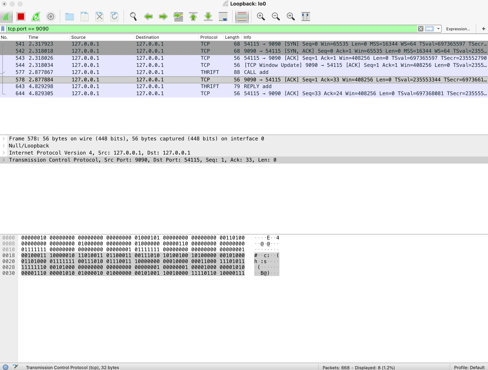
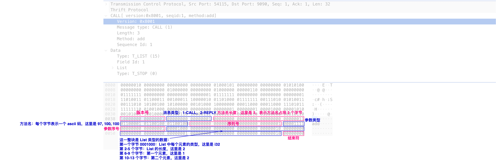
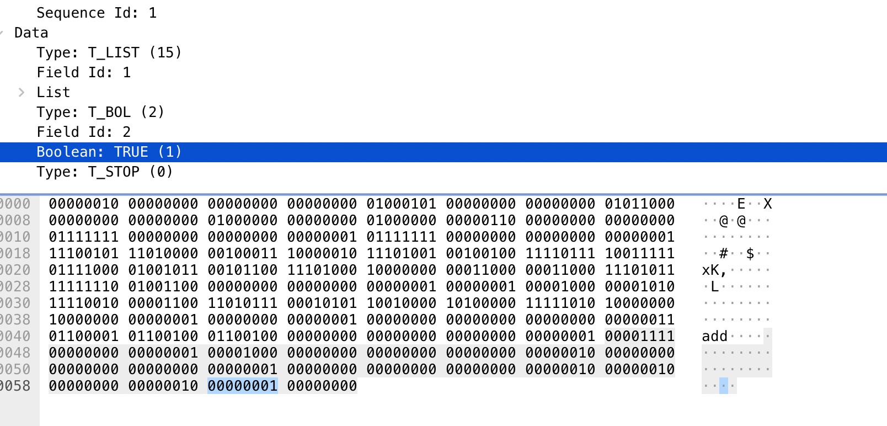

# 前言

在构建微服务时，为了追求极致的效率，服务间一般会使用 RPC（Remote Procedure Call）来进行通信。本文通过 Node.js 来实践一下。

# Node.js 朴素 RPC

首先我们来构建一下 `server`：

```js
// server.js
const net = require('net')
const {msgBuffer} = require('../utils')

const server = net.createServer((clientSocket) => {
  clientSocket.on('data', (data) => {
    msgBuffer.push(data)
    while (!msgBuffer.isFinished()) {
      const message = JSON.parse(msgBuffer.handleData())
      clientSocket.write(
        JSON.stringify(fnMap[message.cmd].apply(null, message.params)) + '\n'
      )
    }
  })
})

server.listen(9999, () => console.log('Listening on 9999'))

const fnMap = {
  add: (...args) => {
    let s = 0
    for (let i = 0; i < args.length; i++) {
      s += args[i]
    }
    return s
  },
  multiply: (...args) => {
    let p = 1
    for (let i = 0; i < args.length; i++) {
      p *= args[i]
    }
    return p
  },
}

// MessageBuffer
class MessageBuffer {
  constructor(delimiter) {
    this.delimiter = delimiter
    this.buffer = ''
  }

  isFinished() {
    if (
      this.buffer.length === 0 ||
      this.buffer.indexOf(this.delimiter) === -1
    ) {
      return true
    }
    return false
  }

  push(data) {
    this.buffer += data
  }

  getMessage() {
    const delimiterIndex = this.buffer.indexOf(this.delimiter)
    if (delimiterIndex !== -1) {
      const message = this.buffer.slice(0, delimiterIndex)
      this.buffer = this.buffer.replace(message + this.delimiter, '')
      return message
    }
    return null
  }

  handleData() {
    const message = this.getMessage()
    return message
  }
}

exports.msgBuffer = new MessageBuffer('\n')
```

我们新建了一个 TCP 的服务，并监听来自客户端的数据，注意这里我们通过一个 `MessageBuffer` 类来对数据进行解析（至于为什么这么做可参考考文末补充内容：关于 TCP “粘包”问题说明），将 TCP 数据流解析成我们的消息体。然后调用服务端预先配置好的方法，最后将返回值返回给客户端。

客户端相对比较简单，将函数调用相关数据按照事先规定好的格式发送给服务端即可：

```js
const net = require('net')
const {msgBuffer} = require('../utils')

const client = net.connect({port: 9999}, () => {
  client.write(JSON.stringify({cmd: 'add', params: [1, 2, 3]}) + '\n')
  client.write(JSON.stringify({cmd: 'multiply', params: [1, 2, 3]}) + '\n')
})

client.on('data', (data) => {
  msgBuffer.push(data)
  while (!msgBuffer.isFinished()) {
    const message = JSON.parse(msgBuffer.handleData())
    console.log(message)
  }
})
```

这样，一个非常简单的 RPC 雏形就出来了，不过目前这种方式还不是 RPC。所谓的 RPC，就是客户端必须像调用本地方法一样来调用远端的方法，而不是还需要自己组装消息体，并监听事件获取返回值。理想中的方式应该像这样：

```js
const result = await client.add(1, 2, 3)
```

我们来改造一下。首先，我们定义一份配置文件，用来描述我们的 `services`：

```js
// services/index.js
class Calculator {
  add(arr) {
    let s = 0
    for (let i = 0; i < arr.length; i++) {
      s += arr[i]
    }
    return s
  }

  multiply(arr) {
    let p = 1
    for (let i = 0; i < arr.length; i++) {
      p *= arr[i]
    }
    return p
  }
}

module.exports = {
  calculator: {
    cls: Calculator,
    methods: {
      add: {
        params: [{type: 'number[]', optional: false}],
        return: {
          type: 'number',
        },
      },
      multiply: {
        params: [{type: 'number[]', optional: false}],
        return: {
          type: 'number',
        },
      },
    },
  },
}
```

`services` 描述文件中包含了类以及它拥有的方法，方法参数（类型，是否可选），返回值类型等信息。为了简单一点，我们先不校验参数和返回值的类型。

然后就是我们的 `server`：

```js
const net = require('net')
const {msgBuffer} = require('../utils')
const services = require('../services')

class Server {
  constructor(services) {
    this.tcpServer = net.createServer((clientSocket) => {
      const serviceMap = this.createServiceMap(services)

      clientSocket.on('data', (data) => {
        msgBuffer.push(data)
        while (!msgBuffer.isFinished()) {
          const {seqId, service, method, params} = JSON.parse(
            msgBuffer.handleData()
          )

          clientSocket.write(
            JSON.stringify({
              seqId,
              result: serviceMap[service][method].apply(null, params),
            }) + '\n'
          )
        }
      })
    })
  }

  createServiceMap(services) {
    const serviceMap = {}

    Object.keys(services).forEach((serviceKey) => {
      serviceMap[serviceKey] = new services[serviceKey].cls()
    })

    return serviceMap
  }

  listen(...args) {
    this.tcpServer.listen(...args)
  }
}

new Server(services).listen(9999)
```

`server` 中会监听 `client` 的连接，一旦有 `client` 进来，就根据 `services` 配置文件为其实例化所有 `services`。之后开始接受 `client` 的数据，并根据 `client` 的消息调用相应的 `service` 中的方法，并返回结果。

注意到消息体中有个 `seqId`，用来标识包的序号，必须将其返回给 `client`，这样 `client` 才能知道返回的结果是跟哪个请求对应的。

最后就是我们的 `client`：

```js
const net = require('net')
const EventEmitter = require('events')
const {msgBuffer} = require('../utils')
const services = require('../services')

class Client {
  constructor({port, services}) {
    this.rspResolve = {}
    this.seqId = 0
    this.port = port
    this.parseServices(services)
  }

  init() {
    return new Promise((resolve, reject) => {
      this.client = net.connect({port: this.port}, () => {
        resolve()
      })

      this.client.on('data', (data) => {
        msgBuffer.push(data)
        while (!msgBuffer.isFinished()) {
          const {seqId, result} = JSON.parse(msgBuffer.handleData())
          this.rspResolve[seqId](result)
        }
      })
    })
  }

  parseServices(services) {
    for (const serviceKey in services) {
      const service = services[serviceKey]
      this[serviceKey] = {}
      for (const method in service.methods) {
        this[serviceKey][method] = (...params) => {
          this.client.write(
            JSON.stringify({
              seqId: this.seqId,
              service: serviceKey,
              method,
              params,
            }) + '\n'
          )

          return new Promise((resolve, reject) => {
            this.rspResolve[this.seqId++] = resolve
          })
        }
      }
    }
  }
}

const client = new Client({port: 9999, services})
client.init().then(async () => {
  console.log(await client.calculator.add([1, 2, 3, 4, 5]))
  console.log(await client.calculator.multiply([1, 2, 3, 4, 5]))
})
```

初始化一个 `client` 时，会解析 `services`，并在当前 `client` 实例上添加 `services` 的方法。方法中会将函数调用封装成消息发送给服务端并返回 `Promise` 对象，同时将 `Promise` 对象的 `resolve` 方法缓存在 `resResolve` 这个 `Map` 中，此时 `Promise` 对象还处于 `pending` 状态。

当 `server` 返回相应的 `seqId` 的结果时，`resResolve` 中对应的 `resolve` 方法会调用，从而将 `Promise` 对象状态设为 `fulfilled`，此时 `client` 则可以获取到结果。

这样我们就实现了一个非常朴素的 RPC 框架。接下来我们简单看看业界常用的 RPC 框架是怎么做的吧，这里以 Thrift 为例。

# Thrift RPC Demo

我们先准备一个 `calculator.thrift` 文件，用来描述 `service`：

```js
service Calculator {
  i32 add(1:list<i32> arr),
  i32 multiply(1:list<i32> arr)
}
```

由于 `thrift` 文件是语言无关的，所以我们需要通过它生成对应 `Calculator.js` 文件：

```js
thrift -r --gen js:node calculator.thrift
```

这个文件包含 `server` 端和 `client` 相关的代码，在 `client` 端负责将函数调用转为消息发送给 `server`，在 `server` 端负责读取消息，调用方法，返回结果给 `client`。

然后 `server` 和 `client` 分别按照如下方式进行使用即可：

```js
// server.js
var thrift = require('thrift')
var Calculator = require('./gen-nodejs/Calculator')

var server = thrift.createServer(Calculator, {
  add(arr, result) {
    let s = 0
    for (let i = 0; i < arr.length; i++) {
      s += arr[i]
    }
    result(null, s)
  },

  multiply(arr, result) {
    let p = 1
    for (let i = 0; i < arr.length; i++) {
      p *= arr[i]
    }
    result(p)
  },
})

server.listen(9090)

// client.js
var thrift = require('thrift')
var Calculator = require('./gen-nodejs/Calculator')

var transport = thrift.TBufferedTransport
var protocol = thrift.TBinaryProtocol

var connection = thrift.createConnection('localhost', 9090, {
  transport: transport,
  protocol: protocol,
})

var client = thrift.createClient(Calculator, connection)

client.add([1, 2], function (err, response) {
  console.log(response)
})
```

下面，我们通过 `Wireshark` 来看看 `thrift` 通信的过程。

打开 `Wireshark`，选择 `Capturing from Loopback: lo0`，然后在 filter 中输入 `tcp.port == 9090`。分别运行上面的 `server` 和 `client`，则可抓包到如下内容：



我们先来看看第五行，可以看到 `Wireshark` 自动识别了 `thrift` 协议，并解析出这是一个 `CALL` 类型的消息，调用的方法为 `add`。接下来我们再仔细看看 `thrift` 协议：



`thrift` 协议格式如上图所示，这里是一个参数的场景，如果有多个参数的话则可以在 `Data -> List` 后面继续添加，比如我们给 `add` 方法增加第二个参数，表示是否打印日志：

```js
i32 add(1:list<i32> arr, 2:bool printLog)
```

抓包得到的内容如下：



返回的消息格式也类似，这里就不赘述了。

关于 RPC 的内容就先介绍到这，后面计划基于 Nest.js 再实战一下。

# 补充内容

## 关于 TCP “粘包”问题说明

首先声明一下，所谓的 TCP “粘包问题”其实并不是一个问题。

先看一个简单的例子：

```js
// server.js
const net = require('net')

const server = net.createServer((clientSocket) => {
  console.log('Client connected')
  clientSocket.on('data', (data) => {
    console.log('-------------------')
    console.log(data.toString())
  })
})

server.listen(9999, () => console.log('Listening on 9999'))

// client.js
const net = require('net')

const client = net.connect({port: 9999}, () => {
  client.write(JSON.stringify({cmd: 'add', params: [1, 2]}))
  client.write(JSON.stringify({cmd: 'multiply', params: [1, 2, 3]}))
})
```

启动 `server` 后再运行 `client`，则 `server` 有**可能**会打印如下日志：

```js
-------------------
{"cmd":"add","params":[1,2]}{"cmd":"multiply","params":[1,2,3]}
```

如上所示，客户端调用了两次 `write`，但是服务端却只打印了一次。也就是说，两次发送的数据在服务端被一次性取出来了。即，使用方层面的两个包“粘在”了一起。原因在于 TCP 是面向字节流的，并没有包的概念，所以开发者需要对 `data` 事件获取到的数据进行解析。

# 参考

1. https://blog.bitsrc.io/writing-an-rpc-library-in-node-js-673632413f5f
2. https://thrift.apache.org/tutorial/nodejs.html
