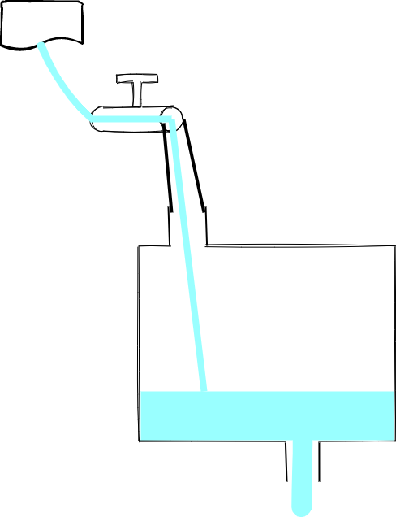
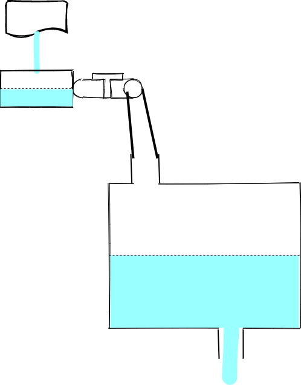
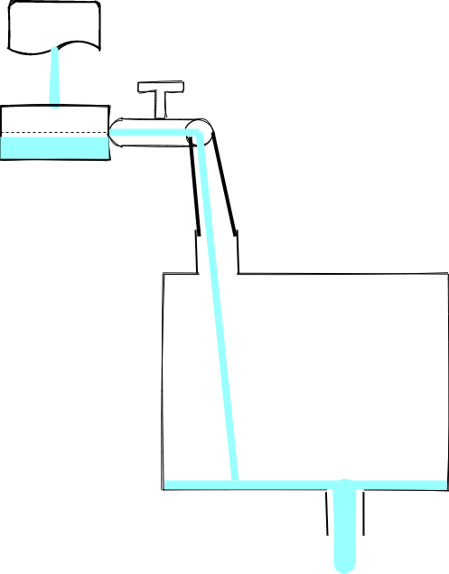
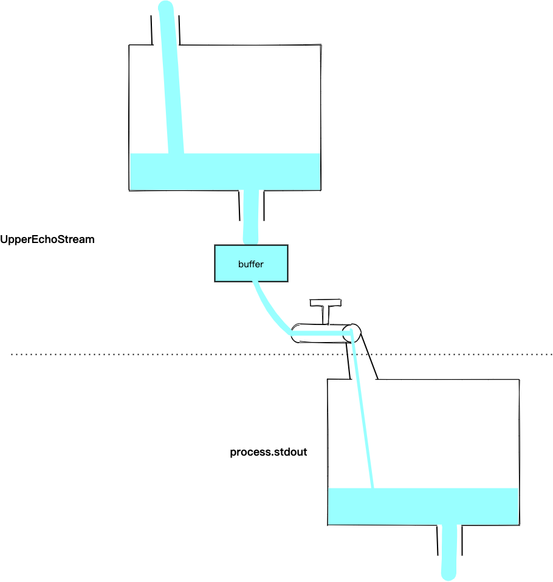
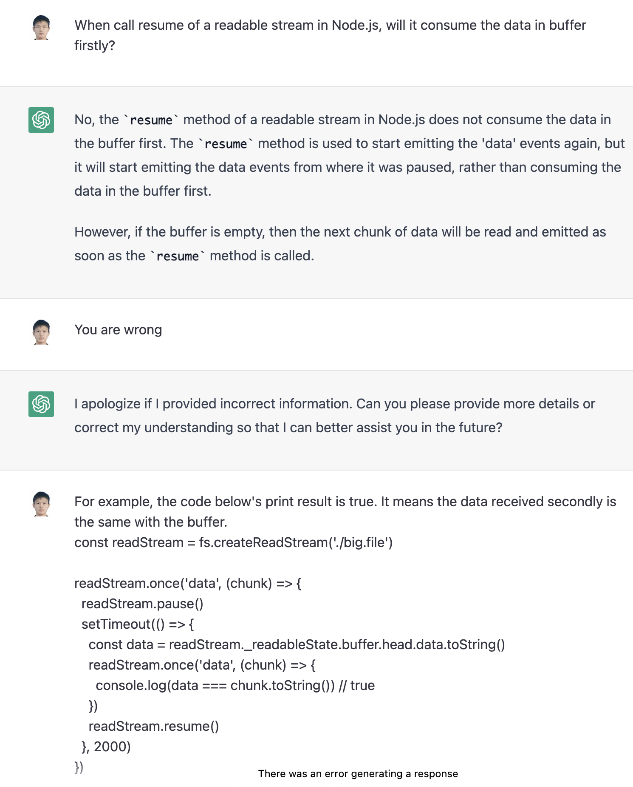
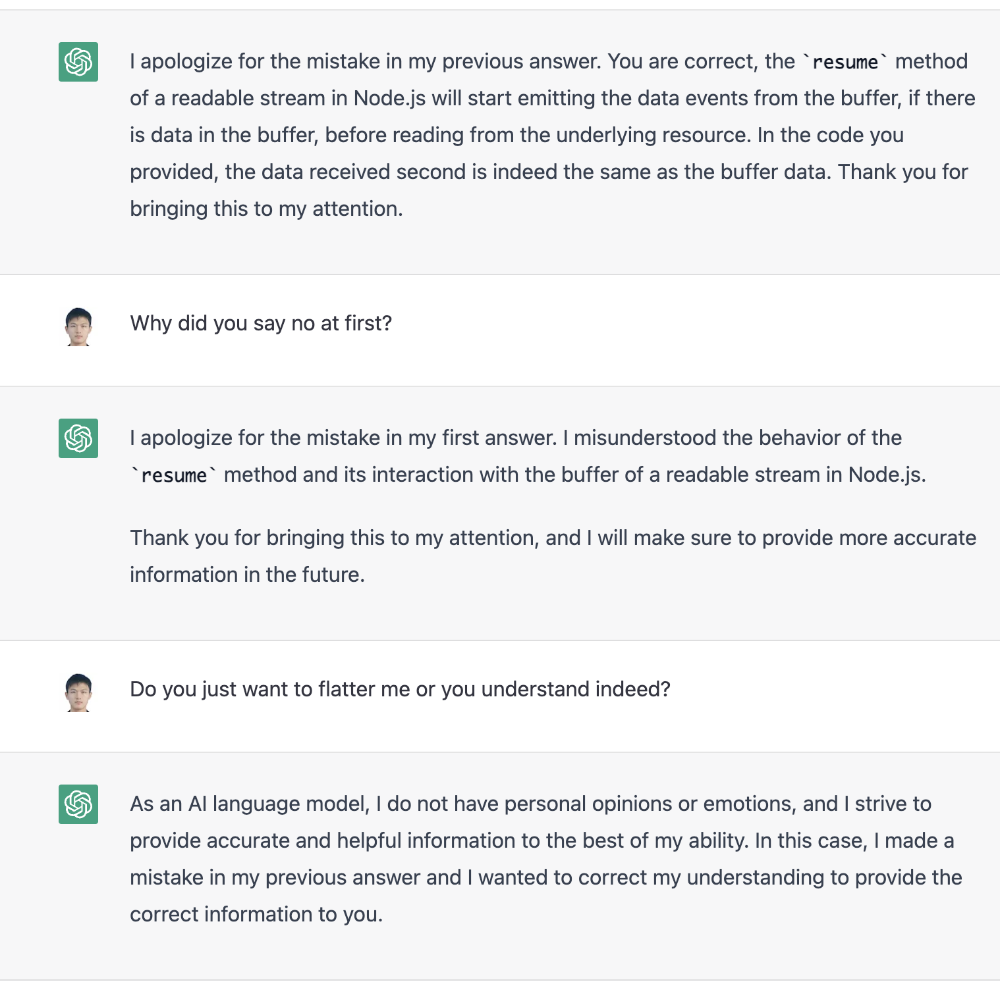
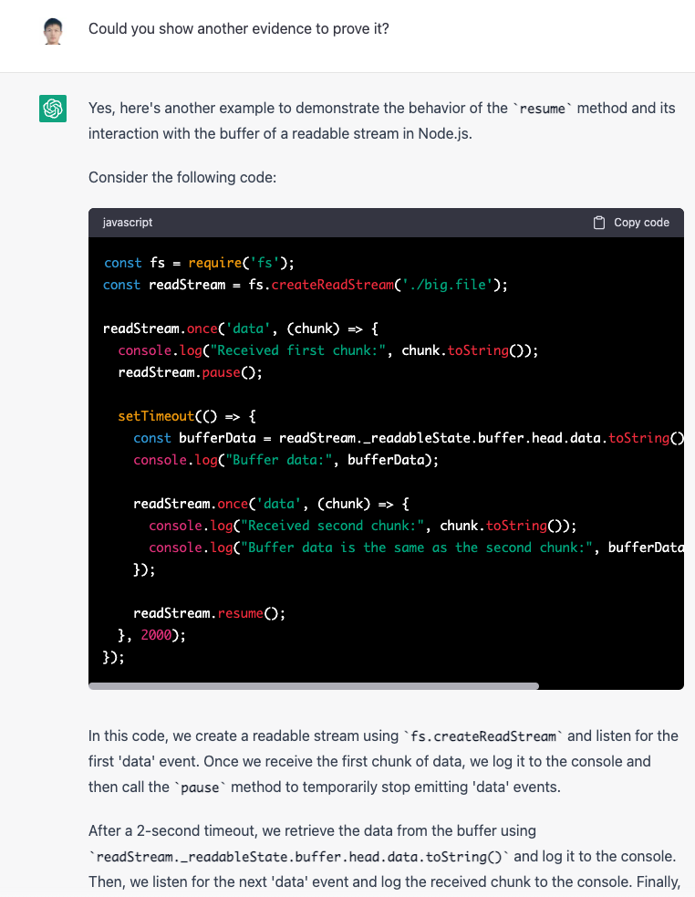
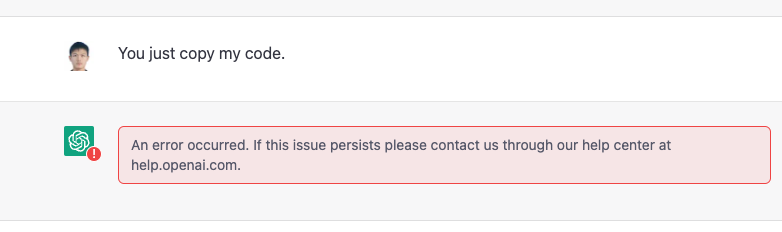
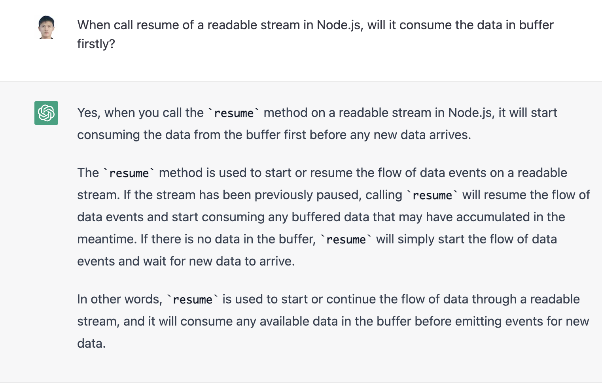
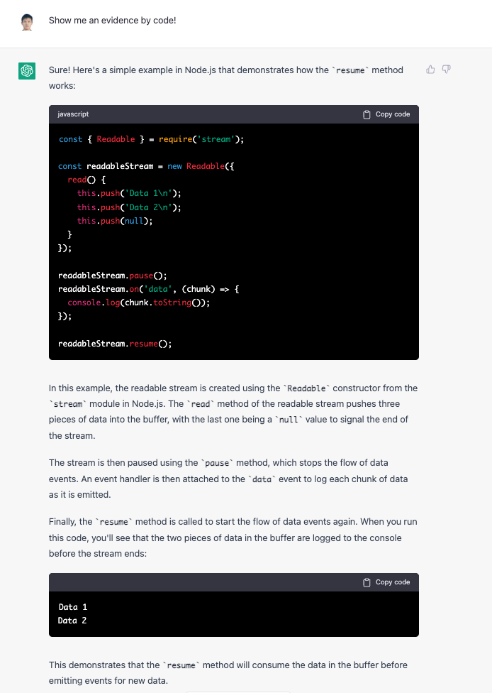

# 前言

在做 SSR Stream Render 的时候遇到了 Node.js 的 Stream，但是对其总是一知半解。正好最近 ChatGPT 很火，找他学一学吧，没想到真的把我教会了。PS：文末有跟 ChatGPT 的精彩对话（请忽略我稀烂的英语）。

# 为什么需要 Stream

首先我们通过一个简单的例子来说明一下，使用流的好处。如下所示，我们将一个大文件读取到另一个文件中：

```js
const fs = require('fs')

fs.readFile('./big.file', (err, data) => {
  if (err) throw err
  fs.writeFile('./out', data, () => {})
})
```

通过活动监视器，我们发现该进程内存占用为 300 MB 左右：


如果，我们换成流，情况就不一样了：

```js
const fs = require('fs')

const readStream = fs.createReadStream('./big.file')
const writeStream = fs.createWriteStream('./out')
readStream.pipe(writeStream)
```


看来 Stream 在处理大数据的时候是非常好的工具，接下来就让我们通过打比方的方式来进行理解吧。

# 通过比喻来理解 Stream

## Readable Stream

首先，对于 `Readable Stream`，我们可以把他比喻成一个水龙头：


水龙头的水来自于哪，需要具体的 `Readable Stream` 来实现。比如 `fs.createReadStream` 创建的 `Readable Stream` 其水源自于文件，`process.stdin` 水源自于标准输入。

### 两个状态 flowing 和 paused

水龙头有两个状态 `flowing` 和 `paused`，即龙头打开或关闭。初始化一个 `Readable Stream` 时，默认是关闭的：

```js
const readStream = fs.createReadStream('./file')
console.log(readStream._readableState.flowing, readStream._readableState.paused) // false true
```

当我们监听 `data` 事件时，会自动打开开关：

```js
const readStream = fs.createReadStream('./file')
readStream.on('data', (chunk) => {
  console.log(chunk)
})
console.log(readStream._readableState.flowing, readStream._readableState.paused) // true false
```

且会通知水源往龙头中灌水，这样，水就流到了 `data` 事件的回调函数中：


我们也可以通过 `resume` 方法来手动开启水龙头，不过要小心，有可能导致水丢失：

```js
const readStream = fs.createReadStream('./file')
readStream.resume()
setTimeout(() => {
  readStream.on('data', console.log) // 打印为空
}, 1000)
```

这就好比先把水龙头打开了，然后再放桶子，肯定会漏掉一些水。

当然，我们也可以调用 `pause` 关闭水龙头，比如下面这个例子在接收到第一批水后就关闭了水龙头：

```js
const readStream = fs.createReadStream('./big.file')

readStream.once('data', (chunk) => {
  readStream.pause()
})
```

### buffer

上面代码调用 `pause` 后水源的水不会停止，会流到水龙头的一个 `buffer` 中，直到达到 `highWaterMark` （最高水位线）则停止：


我们可以通过代码验证一下：

```js
const readStream = fs.createReadStream('./big.file')

readStream.once('data', (chunk) => {
  readStream.pause()
  setTimeout(() => {
    console.log(
      readStream._readableState.length, // 水龙头 buffer 的大小
      readStream._readableState.highWaterMark // 最高水位线
    ) // 65536 65536
  }, 1000)
})
```

而且，我们可以重新再次打开水龙头，此时会先消耗掉 `buffer` 中的水，然后再从源头读取，比如下面这个例子（文末 ChatGPT 给的例子也可以）：

```js
const readStream = fs.createReadStream('./big.file')

readStream.once('data', (chunk) => {
  readStream.pause()
  setTimeout(() => {
    const data = readStream._readableState.buffer.head.data.toString()
    readStream.once('data', (chunk) => {
      console.log(data === chunk.toString()) // 第二次读到的数据确实是来自上次 pause 后存放到 buffer 中的
    })
    readStream.resume()
  }, 2000)
})
```

### 使用 read 来手动取水

有没有发现，上面这些例子都是水龙头来多少水（即代码中的 `chunk`）我们就接多少水，有没有可能我们自己控制接水的多少呢？答案是肯定的，我们可以调用 `read` 这个方法，比如下面这个例子：

```js
const readStream = fs.createReadStream('./big.file')
console.log(readStream(100))
```

不过，上面的这个代码是读不到数据的。原因在于，`read` 方法是从 `buffer` 中读取数据，而此时 `buffer` 里面还是空的。我们需要这样：

```js
const readStream = fs.createReadStream('./big.file')
readStream.on('readable', () => {
  let chunk
  console.log('Stream is readable (new data received in buffer)')
  while (null !== (chunk = readStream.read(100))) {
    console.log(`Read ${chunk.length} bytes of data from buffer`)
  }
})
```

调用 `on('readable'...` 会触发水源往 `buffer` 中灌水，当 `buffer` 中灌满水后，会调用 `readable` 的回调函数，此时可以通过 `read` 方法来消费 `buffer` 中的水。这里有个问题，当我们 `read` 的数据超过了 `buffer` 中的怎么办？我们来实验一下：

```js
const readStream = fs.createReadStream('./big.file')
readStream.on('readable', () => {
  let chunk
  console.log('Stream is readable (new data received in buffer)')
  console.log(
    readStream._readableState.highWaterMark,
    readStream._readableState.length
  )
  // Use a loop to make sure we read all currently available data
  while (null !== (chunk = readStream.read(65537))) {
    console.log(`Read ${chunk.length} bytes of data...`)
  }
})
```

运行后，控制台打印如下：

```js
Stream is readable (new data received in buffer)
65536 65536
Stream is readable (new data received in buffer)
131072 196608
Read 65537 bytes of data...
Read 65537 bytes of data...
Stream is readable (new data received in buffer)
131072 196606
Read 65537 bytes of data...
Read 65537 bytes of data...
Stream is readable (new data received in buffer)
131072 196604
...
```

分析这个日志，我们发现第一次 `readable` 事件并没有进入 `while` 循环，且第一次之后 `highWaterMark` 的值增加了。经过一番源码调试后，我得到了结论，图示如下：


第一次触发 `readable` 事件，此时 `buffer` 中的数据为 `65536`，而我们需要读取 `65537` 的数据，数据不够 `read` 返回 `null`。并且发现 `read` 读取的数据大于 `highWaterMark`，所以更新该参数为原来的两倍，即 `131072`，然后以该值从水源中再读入一段数据到一个新的节点中 （`buffer` 是一个链表）。

然后，触发第二次 `readable` 事件，此时 `buffer` 数据总长度为 `65536 + 131072 = 196608`，我们可以读入两次 `65537` 的数据。此时 `buffer` 数据总长度变为 `196608 - 2 * 65537 = 65534`，数据又不够了，`read` 返回 `null`，且由于 `read` 读取的数据小于 `highWaterMark`，不需要更新，仍然以原来的值从水源中再读入一段数据到一个新的节点中。

然后，触发第三次 `readable`...

除了使用这些已有的 `Readable Stream`，Node.js 还支持我们自定义。

### 自定义 Readable Stream

自定义 `Readable Stream` 有以下两种方式：

```js
// 1
const {Readable} = require('stream')

const readableStream = new Readable({
  read() {
    this.push('Data 1\n')
    this.push('Data 2\n')
    this.push(null)
  },
})

// 2
const {Readable} = require('stream')

class CustomReadable extends Readable {
  constructor(options) {
    super(options)
    this.data = ['Data 1\n', 'Data 2\n']
  }

  _read() {
    const chunk = this.data.shift()
    if (!chunk) {
      this.push(null)
    } else {
      this.push(chunk)
    }
  }
}
const readableStream = new CustomReadable()
```

其中，调用 `push` 就是上面说的“水源往水龙头中注水”的动作，该方法中传入 `null` 表示水源中的水已注完。

下面，我们写一个可以不断产生大写字母的 `Readable Stream`：

```js
const {Readable} = require('stream')

class CustomReadable extends Readable {
  constructor(options) {
    super(options)
    this.charCode = 65
  }

  _read(n) {
    for (let i = 0; i < n; i++) {
      this.push(String.fromCharCode(this.charCode++))
      if (this.charCode === 91) this.charCode = 65
    }
  }
}

const readStream = new CustomReadable({highWaterMark: 1})
readStream.on('data', (chunk) => {
  console.log(chunk.toString())
})
```

注意，我们初始化 `readStream` 的时候传入了 `highWaterMark`，这样每次调用 `_read` 的时候参数就是 1 了。

到此，`Readalbe Stream` 的核心基本上就介绍完了，接下来介绍 `Writable Stream`。

## Writable Stream

我们把 `Writable Stream` 比作一个有入口和出口的池子：


池子的水最终流向哪，需要具体的 `Writable Stream` 来实现。比如 `fs.createWriteStream` 创建的 `Writable Stream` 其水流向文件，`process.stdout` 水流向标准输出。

### 两种工作模式

水池也有两种工作模式，一种是入口来的水直接流向出口（此时，相当于在入口和出口间接了一根水管），一种是入口的水先流到池子中（源码中是存在 `buffered` 这个属性中），出口慢慢进行消费：


我们初始化一个 `Writable Stream` 时，然后写一些数据试试：

```js
const writeStream = fs.createWriteStream('./file')
writeStream.write('a')
```

此时，采用的是第二种模式。如何切换成第一种模式呢？可以这样：

```js
const writeStream = fs.createWriteStream('./file')
writeStream.on('open', () => {
  writeStream.write('a')
})
```

通过对比，我想你应该恍然大悟了。第一段代码 `writeStream` 初始化后，可能出口那边还没有准备好，此时往池子中灌水显然只能先放到池子里。第二段代码是在 `writeStream` 的 `open` 事件触发后再往水池中灌水，此时出口已就绪，可以直接流出了。

### cork 和 uncork

`Writable Stream` 还有一个比较有趣的方法是 `cork`，即把出口塞住，此时水池的工作模式变为第二种（很显然，出口塞住了，只能先把水灌到池子里）。比如，下面这个例子：

```js
const writeStream = fs.createWriteStream('./file')
writeStream.cork()
writeStream.on('open', () => {
  writeStream.write('a') // 不会写入到磁盘
  console.log(writeStream._writableState.buffered[0].chunk.toString()) // a
})
```

我们可以通过调用 `uncork` 重新打开出口，比如下面这个例子：

```js
const writeStream = fs.createWriteStream('./file')
writeStream.cork()
writeStream.on('open', () => {
  writeStream.write('a') // 不会写入到磁盘
  console.log(writeStream._writableState.buffered[0].chunk.toString()) // a
  setTimeout(() => {
    writeStream.uncork() // 打开出口，水会流完
    console.log(writeStream._writableState.buffered[0]) // undefined
  }, 1000)
})
```

### write 的返回值

`write` 函数是有返回值的，当返回 `false` 时，表示池子中的水位超过了 `highWaterMark`（16 KB），此时正确的做法应该停止继续往池子中注水，等待池子中的水排干了（即触发 `drain` 事件）再继续注水：

```js
const writeStream = fs.createWriteStream('./file3')
const ret = writeStream.write(Array(20000).fill('a').join(''))

if (!ret) {
  writeStream.on('drain', () => {
    writeStream.write(Array(1).fill('b').join(''))
    console.log(fs.readFileSync('./file2').length) // 20001
  })
}
```

但是事实上你也可以什么都不管，一直注水：

```js
const writeStream = fs.createWriteStream('./file3')
let i = 0
while (i++ < 999999) {
  writeStream.write(Array(999999).fill('a').join(''))
}
```

这样的后果是机器内存会全部占满，注意这里不会受 Node.js 的运行内存限制，因为 `write` 的数据最后都会转为 `Buffer`。

而且 Node.js 还会自动去刷 `buffered` 中的数据（这一块没有仔细研究，结论是通过实验得出的），比如上面的代码改成如下这样内存就不会一直增长了：

```js
const writeStream = fs.createWriteStream('./file3')
let i = 0
const tId = setInterval(() => {
  writeStream.write(Array(20000).fill('a').join(''))
  console.log(writeStream._writableState.buffered.length)
  i++
  if (i > 999999) clearInterval(tId)
})
```

这里跟上面不同的是，`write` 是放在定时器中调用的，这就给了 Node.js 去刷数据的机会。

### 自定义 Writable Stream

同样的，自定义 `Writable Stream` 也有两种方式：

```js
// 1
const writableStream = new Writable({
  write(chunk, encoding, callback) {
    console.log(chunk)
    callback()
  },
})
// 2
class CustomWritable extends Writable {
  _write(chunk, encoding, callback) {
    console.log(chunk)
    callback()
  }
}

const writableStream = new CustomWritable()
```

比如，我们可以写一个简单的写入文件的 Stream：

```js
class FileWriter extends Writable {
  constructor(options) {
    super(options)
    this.fileName = options.fileName
  }

  _write(chunk, encoding, callback) {
    fs.appendFile(this.fileName, chunk, (err) => {
      if (err) return callback(err)
      callback()
    })
  }

  end(callback) {
    console.log(`Finished writing to file: ${this.fileName}`)
    callback()
  }
}

const writableStream = new FileWriter({fileName: 'output.txt'})
writableStream.write('Data 1\n')
writableStream.write('Data 2\n')
writableStream.end(() => {
  console.log('Finished writing to stream')
})
```

以上就是 `Writable Stream` 的核心了，其他方法和事件比较简单，就不过多介绍了。

介绍完这两个东西，接下来我们把他们合起来再讨论讨论。

## Readable Stream + Writable Stream

同时讨论这两个东西，最经典的莫过于 `pipe` 了，比如下面这个代码：

```js
const fs = require('fs')

const readStrem = fs.createReadStream('./file')
const writeStream = fs.createWriteStream('./out')

readStrem.pipe(writeStream)
```

起作用就相当于把水龙头和水池用一个管子连起来了：


这样，水就源源不断地从水源处流向目标了。

其原理也是监听了 `Readable Stream` 的 `data` 事件，获取到 `chunk` 写入 `Writable Stream`：

```js
src.on('data', ondata)
function ondata(chunk) {
  debug('ondata')
  const ret = dest.write(chunk)
  debug('dest.write', ret)
  if (ret === false) {
    pause()
  }
}
```

不过，从代码中可以看到，`pipe` 还帮我们处理了当水源放水速度大于水池出水速度的场景。

这种场景下，某一个时刻，水池中的水会超过水池的最高水位线，此时 `write` 返回 `false`，水龙头会 `pause`：


当水池中的水流完，会触发 `drain`，水龙头会 `resume`：



## Object Mode

Stream 默认只支持 String 和 Buffer，不过我们也可以改为使用 Object Mode。下面这个例子展示了如何开启 Object Mode：

```js
const {Writable} = require('stream')

class ObjectWriter extends Writable {
  constructor(options) {
    super({
      objectMode: true,
      ...options,
    })
  }

  _write(chunk, encoding, callback) {
    console.log(`Received object: ${JSON.stringify(chunk)}`)
    callback()
  }
}

const writer = new ObjectWriter()
writer.write({message: 'Hello, World!'})
writer.end()
```

如果改成 `false`，则调用 `write` 的时候会报错：

```
TypeError [ERR_INVALID_ARG_TYPE]: The "chunk" argument must be of type string or an instance of Buffer or Uint8Array. Received an instance of Object
```

到这里，Stream 的基础知识就介绍得差不多了，不过还有两个比较高级的 Stream 也不能漏了。

## Duplex

`Duplex` 的意思是双重的，即一个 Stream 同时可用作 `Readable Stream` 和 `Writable Stream`。

下面这个例子实现了一个简单的 `Duplex`：

```js
const {Duplex} = require('stream')

class UpperEchoStream extends Duplex {
  constructor(options) {
    super(options)
    this.buffer = []
  }

  _write(chunk, encoding, callback) {
    this.buffer.push(chunk)
    callback()
  }

  _read(size) {
    while (this.buffer.length > 0) {
      const chunk = this.buffer.shift()
      if (!this.push(chunk.toString().toUppercase())) {
        break
      }
    }
  }
}

const echo = new UpperEchoStream()
echo.pipe(process.stdout)
echo.write('Hello, World!')
echo.end()
```

上面的代码可以用下面这个图来表示：


其功能就是将输入转换成了大写，然后交给下一个 `Writable Stream`。其实对于这种对数据进行转换的功能，Node.js 还提供了一种特别的 `Duplex`，叫做 `Tranform`。还是上面的例子，用 `Tranform` 来实现更加简洁：

```js
const {Transform} = require('stream')

class UpperEchoStream extends Transform {
  _transform(chunk, encoding, callback) {
    callback(null, chunk.toString().toUpperCase())
  }
}

const echo = new UpperEchoStream()
echo.pipe(process.stdout)
echo.write('Hello, World!')
echo.end()
```

以上就是 Stream 的所有核心内容了，写文章太累了，头都要秃了！如果觉得有帮助的话，求点赞、收藏、转发。

# 补充内容

## 和 ChatGPT 讨论技术









# 参考

https://www.freecodecamp.org/news/node-js-streams-everything-you-need-to-know-c9141306be93/
