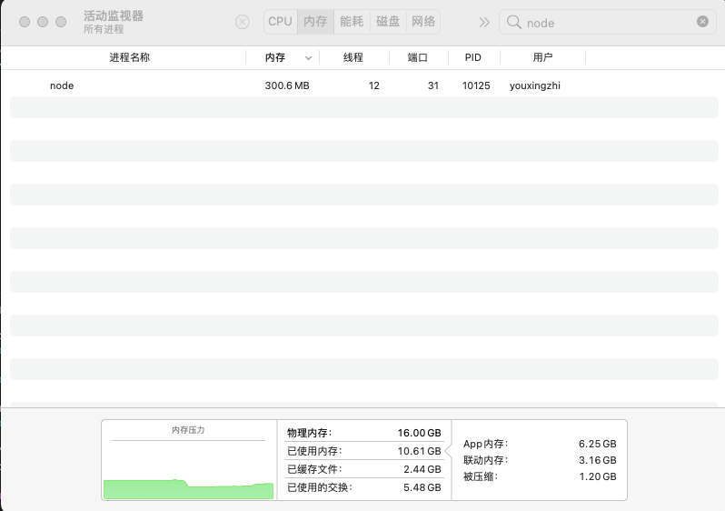
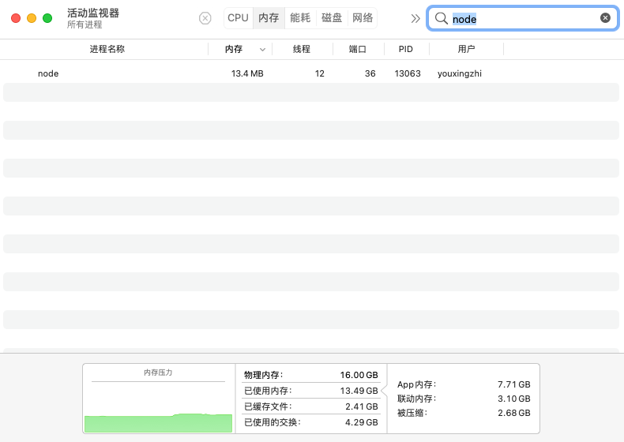
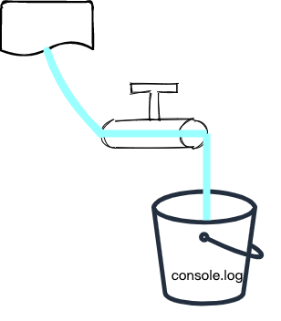
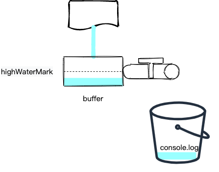
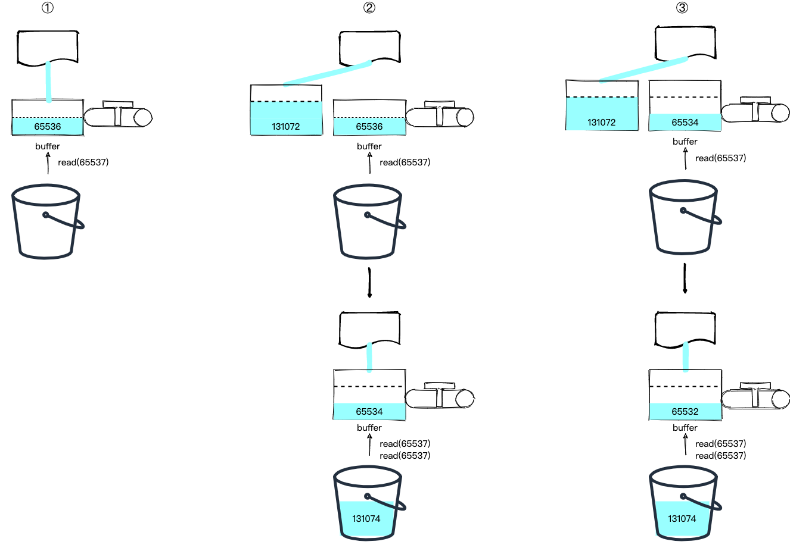
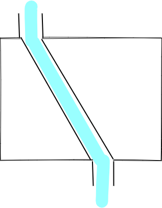
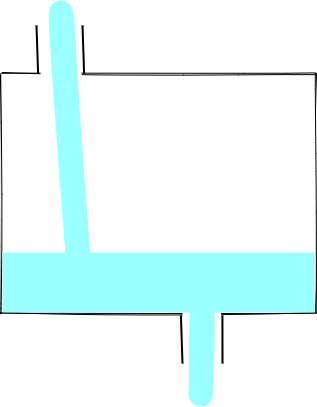

# 前言

在做 SSR Stream Render 的时候遇到了 Node.js 的 stream，但是对其总是一知半解，这次就趁着詹姆斯打破历史总得分记录之际来研究下，作为献给老詹的礼物。

# 为什么需要 Stream

首先我们通过一个简单的例子来说明一下，使用流的好处。如下所示，我们启动一个简单的 HTTP 服务，该服务接受到请求后会读取一个超大的文件（约 300 MB），并将内容返回：

```js
const fs = require('fs')
const server = require('http').createServer()

server.on('request', (req, res) => {
  fs.readFile('./big.file', (err, data) => {
    if (err) throw err

    res.end(data)
  })
})

server.listen(8000)
```

通过活动监视器，我们发现该进程内存占用为 300 MB 左右：


如果，我们换成流，情况就不一样了：

```js
const fs = require('fs')
const server = require('http').createServer()

server.on('request', (req, res) => {
  const readStream = fs.createReadStream('./big.file')
  readStream.pipe(res)
})

server.listen(8000)
```



可以看到，内存占用一直处于一个相对较小的状态。看来这个 `pipe` 很强大呀，稍微看一下源码，发现 `pipe` 是通过 `data` 事件实现的：

```js
...
src.on('data', ondata)
function ondata(chunk) {
  ...
  const ret = dest.write(chunk)
  ...
}
...
```

那我们不用 `pipe`，自己通过 `data` 事件来实现应该也可以，话不多说，试试就知道了：

```js
const fs = require('fs')
const server = require('http').createServer()

server.on('request', (req, res) => {
  const readStream = fs.createReadStream('./big.file')

  readStream.on('data', (chunk) => {
    res.write(chunk)
  })

  readStream.on('end', () => {
    res.end()
  })
})

server.listen(8000)
```

然而，事实证明，不行！什么原因呢？这里先卖个关子，我们最后再来解决这个问题。

下面进入我们的正题：Node.js Stream。对于 Stream，当我们通过比喻的方式来理解的时候，一切都如此的简单了。

# 通过比喻来理解 Stream

## Readable Stream

首先，对于 `Readable Stream`，我们可以把他比喻成一个水龙头：


水龙头的水来自于哪，需要具体的 `Readable Stream` 来实现。比如 `fs.createReadStream` 创建的 `Readable Stream` 其水源自于文件，`process.stdin` 水源自于标准输入。

水龙头有两个状态 `flowing` 和 `paused`，即龙头打开或关闭。初始化一个 `Readable Stream` 时，默认是关闭的：

```js
const readStream = fs.createReadStream('./file')
console.log(readStream._readableState.flowing, readStream._readableState.paused) // false true
```

当我们监听 `data` 事件时，会自动打开开关：

```js
const readStream = fs.createReadStream('./file')
readStream.on('data', (chunk) => {
  console.log(chunk)
})
console.log(readStream._readableState.flowing, readStream._readableState.paused) // true false
```

且会通知水源往龙头中灌水，这样，水就流到了 `data` 事件的回调函数中：



我们也可以通过 `resume` 方法来手动开启水龙头，不过要小心，有可能导致水丢失：

```js
const readStream = fs.createReadStream('./file')
readStream.resume()
setTimeout(() => {
  readStream.on('data', console.log) // 打印为空
}, 1000)
```

这就好比先把水龙头打开了，然后再放桶子。

当然，我们也可以调用 `pause` 关闭水龙头，比如下面这个例子在接收到第一批水后就关闭了水龙头：

```js
const readStream = fs.createReadStream('./big.file')

let paused = false
readStream.on('data', (chunk) => {
  if (!paused) {
    readStream.pause()
  }
})
```

不过此时水源的水不会停止，会放到水龙头的一个 `buffer` 中，直到达到 `highWaterMark` （最高水位线）则停止：



我们可以通过代码验证一下：

```js
const readStream = fs.createReadStream('./big.file')

let paused = false
readStream.on('data', (chunk) => {
  if (!paused) {
    readStream.pause()
    setTimeout(() => {
      console.log(
        readStream._readableState.length, // 水龙头 buffer 的大小
        readStream._readableState.highWaterMark // 最高水位线
      ) // 65536 65536
    }, 1000)
  }
})
```

有没有发现，上面这些例子都是水龙头来多少水（即代码中的 `chunk`）我们就接多少水，有没有可能我们自己控制接水的多少呢？答案是肯定的，我们可以调用 `read` 这个方法：

```js
const readStream = fs.createReadStream('./big.file')
console.log(readStream(100))
```

不过，上面的这个代码是读不到数据的。原因在于，`read` 方法是从 `buffer` 中读取数据，而此时 `buffer` 里面还是空的呢。我们需要这样：

```js
const readStream = fs.createReadStream('./big.file')
readStream.on('readable', () => {
  let chunk
  console.log('Stream is readable (new data received in buffer)')
  while (null !== (chunk = readStream.read(100))) {
    console.log(`Read ${chunk.length} bytes of data from buffer`)
  }
})
```

调用 `on('readable'` 会触发水源往 `buffer` 中灌水，当 `buffer` 中灌满水后，会调用 `readable` 的回调函数，此时可以通过 `read` 方法来消费 `buffer` 中的水。这里有个问题，当我们 `read` 的数据超过了 `buffer` 中的怎么办？我们来实验一把：

```js
const readStream = fs.createReadStream('./big.file')
readStream.on('readable', () => {
  let chunk
  console.log('Stream is readable (new data received in buffer)')
  console.log(
    readStream._readableState.highWaterMark,
    readStream._readableState.length
  )
  // Use a loop to make sure we read all currently available data
  while (null !== (chunk = readStream.read(65537))) {
    console.log(`Read ${chunk.length} bytes of data...`)
  }
})
```

运行后，控制台打印如下：

```js
Stream is readable (new data received in buffer)
65536 65536
Stream is readable (new data received in buffer)
131072 196608
Read 65537 bytes of data...
Read 65537 bytes of data...
Stream is readable (new data received in buffer)
131072 196606
Read 65537 bytes of data...
Read 65537 bytes of data...
Stream is readable (new data received in buffer)
131072 196604
...
```

分析这个日志，我们发现第一并没有进入 `while` 循环，且第一次之后 `highWaterMark` 的值增加了。经过一番源码调试后，我得到了结论，图示如下：



第一次触发 `readable` 事件，此时 `buffer` 中的数据为 `65536`，而我们需要读取 `65537` 的数据，数据不够 `read` 返回 `null`。并且发现 `read` 读取的数据大于 `highWaterMark`，所以更新其为原来的两倍，即 `131072`，然后以该值从水源中再读入一段数据到一个新的 `buffer` 节点中 （`buffer` 是一个链表）。

然后，触发第二次 `readable` 事件，此时 `buffer` 数据总长度为 `65536 + 131072 = 196608`，我们可以读入两次 `65537` 的数据。此时 `buffer` 数据总长度变为 `196608 - 2 * 65537 = 65534`，数据又不够了，`read` 返回 `null`，且由于 `read` 读取的数据小于 `highWaterMark`，不需要更新，仍然以原来的值从水源中再读入一段数据到一个新的 `buffer` 节点中。

然后，触发第三次 `readable`...

到此，`Readalbe Stream` 的核心基本上就介绍完了，接下来介绍 `Writable Stream`。

## Writable Stream

我们把 `Writable Stream` 比作一个有入口和出口的池子：

池子的水最终流向哪，需要具体的 `Writable Stream` 来实现。比如 `fs.createWriteStream` 创建的 `Writable Stream` 其水流向文件，`process.stdout` 水流向标准输出。

水池也有两种工作模式，一种是入口来的水直接流向出口（此时，相当于在入口和出口间接了一根水管），一种是入口的水先流到池子中（源码中是存在 `buffered` 这个属性中），出口慢慢进行消费：




源码中这个方法叫做 `writeOrBuffer`（lib/internal/streams/writable.js）。

我们初始化一个 `Writable Stream` 时，然后写一些数据试试：

```js
const writeStream = fs.createWriteStream('./file')
writeStream.write('a')
```

此时，采用的是第二种模式。如何切换成第一种模式呢？可以这样：

```js
const writeStream = fs.createWriteStream('./file')
writeStream.on('open', () => {
  writeStream.write('a')
})
```

通过对比，我想你应该恍然大悟了。第一段代码 `writeStream` 初始化后，可能出口那边还没有准备好，此时往池子中灌水显然只能先放到池子里。第二段代码是在 `writeStream` 的 `open` 事件触发后再往水池中灌水，此时可以直接流向出口了。

`Writable Stream` 还有一个比较有趣的方法是 `cork`，即把出口塞住，此时水池的工作模式变为第二种（很显然，出口塞住了，只能先把水灌到池子里）。比如，下面这个例子：

```js
const writeStream = fs.createWriteStream('./file')
writeStream.cork()
writeStream.on('open', () => {
  writeStream.write('a') // 不会写入到磁盘
  console.log(writeStream._writableState.buffered[0].chunk.toString()) // a
})
```

我们可以通过调用 `uncork` 重新打开出口，比如下面这个例子：

```js
const writeStream = fs.createWriteStream('./file')
writeStream.cork()
writeStream.on('open', () => {
  writeStream.write('a') // 不会写入到磁盘
  console.log(writeStream._writableState.buffered[0].chunk.toString()) // a
  setTimeout(() => {
    writeStream.uncork() // 打开出口
    console.log(writeStream._writableState.buffered[0]) // undefined
  }, 1000)
})
```

# 参考

https://www.freecodecamp.org/news/node-js-streams-everything-you-need-to-know-c9141306be93/

```

```
