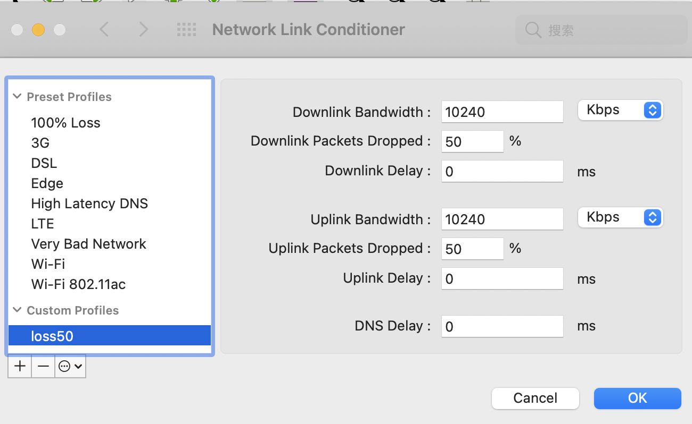
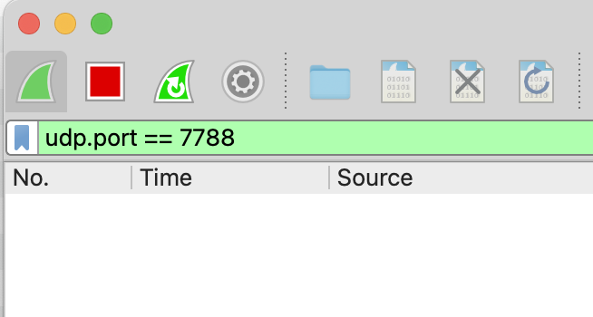
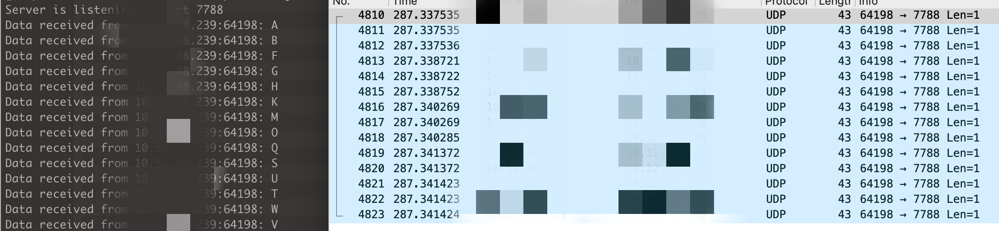
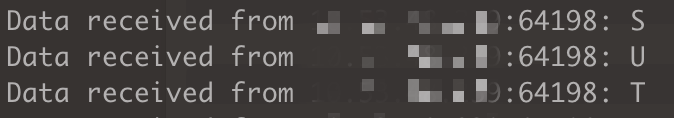

# 前言

UDP 协议是我们平时较少接触到的知识，不同于 TCP，它是“不可靠”的，今天我们就来实战一下看下它到底怎么个不可靠法？

# 不可靠的 UDP

实验前，我们先介绍一下需要用到的工具（Mac 环境，其他环境请自行搜索相关工具）：

- Network Link Conditioner：模拟丢包场景，可以去[苹果开发者网站](https://developer.apple.com/download/all/?q=Additional%20Tools)上下载
- Wireshark：抓包分析工具
- 云主机：因为实现发现 Network Link Conditioner 对本地回环地址不起作用，如果有更好的方法求大佬指出

然后我们准备两段代码，一段作为 UDP Server，一段作为 UDP Client，Client 会向 Server 发送 26 个英文大写字母，Server 会将他们存到文件：

```js
// udp-server.js
const udp = require('dgram')
const server = udp.createSocket('udp4')
const fs = require('fs')

server.on('listening', function () {
  var address = server.address()
  var port = address.port
  console.log('Server is listening at port ' + port)
})

server.on('message', function (msg, info) {
  console.log(
    `Data received from ${info.address}:${info.port}: ${msg.toString()}`
  )
  fs.appendFileSync('./out', msg.toString())
})

server.on('error', function (error) {
  console.log('Error: ' + error)
  server.close()
})

server.bind(7788)

// udp-client.js
const udp = require('dgram')
const client = udp.createSocket('udp4')

for (let i = 0; i < 26; i++) {
  const char = String.fromCharCode(0x41 + i)
  client.send(Buffer.from(char), 7788, '********', function (error) {
    if (error) {
      console.log(error)
    }
  })
}
```

接着我们按照下面步骤开始实验：

1. 通过 Network Link Conditioner 把丢包率设置为 50%：



2. 设置好 Wireshark 的抓包参数：



3. 在云主机上启动 Server，在本地启动 Client。

接着，我们来看一下实验结果：

1. 首先，我们可以看到服务端接收到的字母少了很多，只有 14 个：



2. 服务端接收到的字母顺序是乱序的，比如 U 跑到了 T 的前面：



为了进行对比，我们可以换成 TCP 试试，代码如下，结果就不贴了：

```js
// tcp-server.js
const net = require('net')
const server = net.createServer()

const fs = require('fs')
server.on('connection', function (conn) {
  conn.on('data', (msg) => {
    console.log(
      `Data received from ${conn.address().address}:${
        conn.address().port
      }: ${msg.toString()}`
    )
    fs.appendFileSync('./out', msg.toString())
  })
})

server.listen(8899, () => {
  console.log('server listening to %j', server.address().port)
})

// tcp-client.js
var net = require('net')

var client = new net.Socket()
client.connect(8899, '********', function () {
  for (let i = 0; i < 26; i++) {
    const char = String.fromCharCode(0x41 + i)
    client.write(char)
  }
})
```

接下我们试试基于 UDP 来实现一个可靠的传输协议，主要解决上面的丢包和乱序问题。

# 基于 UDP 的可靠传输协议
